# **Příručka lokálního administrátora**

# **Informační systém stavebního řízení**

**Zpracovatel: InQool, a.s. Svatopetrská 35/7, 617 00 Brno IČ: 29222389, DIČ: CZ29222389**

# Obsah

| 1 Verze dokumentu                                                                                    | 3  |
|------------------------------------------------------------------------------------------------------|----|
| 2 Použité zkratky                                                                                    |    |
| 3 Účel dokumentu                                                                                     | 5  |
| 4 Přihlášení                                                                                         | 6  |
| 4.1 Přihlášení pomocí JIPKASS                                                                        | 6  |
| 5 Administrace – lokální administrátor                                                               | 7  |
| 5.1 Návod pro lokálního administrátora SÚ/DO při prvním přístupu do systému                          | 7  |
| 5.1.1 Vyplnění bankovního spojení úřadu                                                              | 7  |
| 5.1.2 Nastavení rolí zaměstnancům stavebního úřadu                                                   | g  |
| 5.1.3 Nastavení rolí zaměstnancům dotčeného orgánu                                                   | 12 |
| 5.1.4 Vyplnění osoby pro příjem dokumentů                                                            | 17 |
| 5.2 Návod pro lokálního administrátora kompozitního úřadu (kompozitu) při prvním přístupu do systému | 21 |
| 5.2.1 Přiřazení nově přihlášeného uživatele na příslušný SÚ/DO                                       | 21 |
| 5.2.2 Zobrazení úřadů                                                                                | 25 |
| 5.2.3 ÚŘAD                                                                                           | 25 |
| 5.2.4 Zobrazit přehled úřadů                                                                         | 25 |
| 5.2.5 Akce detailu úřadu                                                                             | 26 |
| 5.3 ISSŘ ROLE                                                                                        | 27 |
| 5.3.1 Administrátor                                                                                  | 27 |
| 5.3.2 Lokální administrátor SÚ/DO                                                                    | 27 |
| 5.3.3 Lokální administrátor kompozitu                                                                | 28 |
| 5.3.4 Vedoucí zaměstnanec SÚ/DO                                                                      | 29 |
| 5.3.5 Referent SÚ/DO                                                                                 | 30 |
| 5.3.6 Zaměstnanec sekretariátu SÚ/DO                                                                 | 31 |
| 5.3.7 Oprávnění potvrzení platby SÚ/DO                                                               | 31 |
| 5.3.8 Podpisové oprávnění SÚ/DO                                                                      |    |

# **1**Verze dokumentu

| Číslo verze | Datum     | Změny                                                                               |
|----------------|-----------|-------------------------------------------------------------------------------------|
| 1.0            | 26.6.2024 | První verze                                                                      |
| 1.1            | 9.7.2024  | Aktualizování verze o nové screenshoty a popisky                        |
| 1.2            | 2.8.2024  | Přidání návodu pro lokálního administrátora kompozitního úřadu                |
| 1.3            | 20.9.2024 | Doplnění lokálního administrátora kompozitu, nové role 3.4.7 a 3.4.8 |
| 1.4            | 5.9.2025  | Doplnění oprávnění rolí 3.4                                                |
| 1.5            | 12.5.2026 |                                                                                     |

# **2**Použité zkratky

**Zkratky, které se v dokumentu vyskytují, jsou popsány v následující tabulce.**

| Zkratka | Popis                                                                       |
|---------|-----------------------------------------------------------------------------|
| JIPKAAS | Jednotný identitní prostor Katalog autentizačních a autorizačních služeb |
| ISSŘ    | Informační systém stavebního řízení                                   |
| ROB     | Registr obyvatel                                                         |
| ROS     | Registr osob                                                             |
| SÚ      | Stavební úřad                                                            |
| DO      | Dotčený orgán                                                               |
| JSON    | JavaScript Object Notation                                               |

# **3** Účel dokumentu

Tato dokumentace byla vypracována s cílem poskytnout zaměstnancům stavebních úřadů a dotčených orgánů, kteří budou tento systém používat, komplexní a snadno přístupný průvodce jeho používáním. Jeho hlavním účelem je usnadnit vaši každodenní práci, zvýšit vaši efektivitu a pomoci vám plně využívat všechny funkce a nástroje, které systém nabízí.

Informační systém stavebního řízení je klíčovým nástrojem pro efektivní správu stavebních projektů. Tento systém nejenže zjednodušuje mnohé procesy, ale také zajišťuje, že všechny operace jsou prováděny v souladu s platnými zákony a regulacemi.

Tato dokumentace je určena pro lokální administrátory stavebních úřadů a dotčených orgánů, kteří se potřebují rychle zorientovat v novém systému a hledají způsoby, jak zefektivnit svou práci pomocí jeho nových nástrojů. Dokumentace je strukturována tak, aby poskytovala jasné a stručné informace, od základní navigace po pokročilé funkce systému.

# **4** Přihlášení

# 4.1 Přihlášení pomocí JIPKASS

Uživatel přejde na přihlašovací stránku a klikne na tlačítko *JIPKASS*.

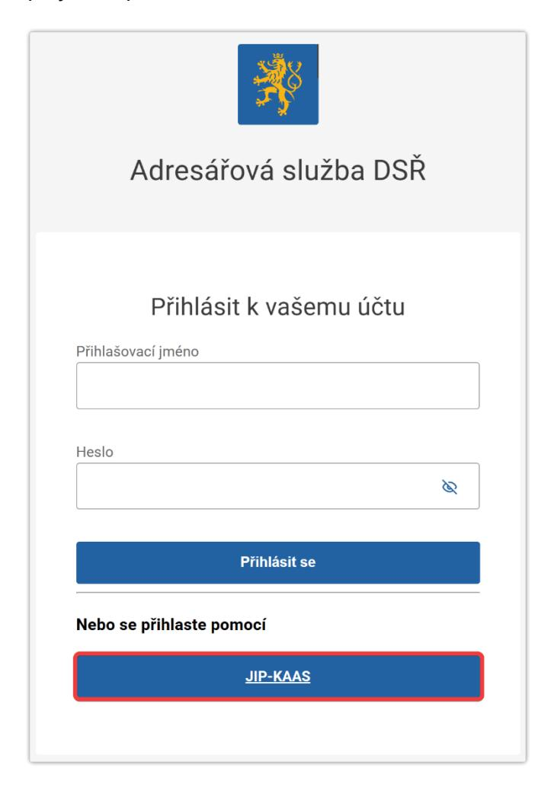

# **5** Administrace – lokální administrátor

Pro přechod do administrace uživatel klikne na tlačítko *"Administrace"* v levém dolním rohu.

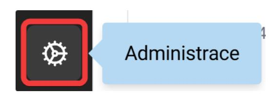

- 5.1 Návod pro lokálního administrátora SÚ/DO při prvním přístupu do systému
  - 5.1.1 Vyplnění bankovního spojení úřadu

V menu vlevo dole kliknout na tlačítko "Administrace": Zvolit položku – "*Úřady*" – v menu vidíme vlastní organizaci, kliknutím na záznam v seznamu se otevře vpravo okno s detailními informacemi, klikneme na tlačítko "Upravit" a vyplníme bankovní spojení.

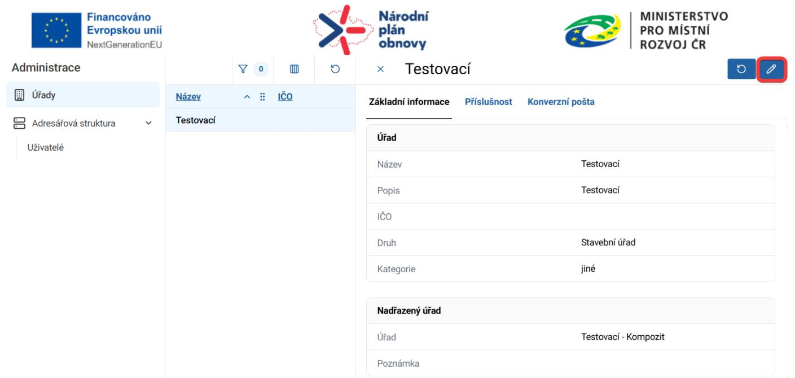

Po vyplnění bankovního spojení informace uložíme stiskem tlačítka "Uložit" vpravo nahoře.

Poznámka: Bankovní spojení je důležité pro tvorbu platebních příkazů. Bankovní účet uveďte v plné formě včetně kódu banky.

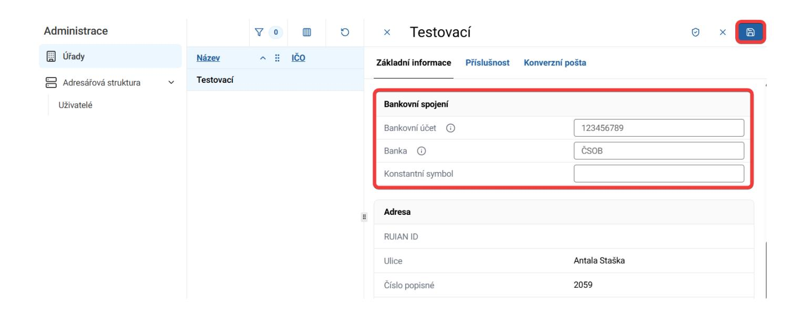

## 5.1.2 Nastavení rolí zaměstnancům stavebního úřadu

- (1) V menu administrace projdeme pod záložku "Adresářová struktura" a podmenu
- "Uživatelé".
- (2) V seznamu klikneme na vybraného uživatele, otevře se nám vpravo okno s detailními informacemi a klikneme na černé tlačítko "Upravit" na řádku s atributem "Role". Přidělení role uživateli je možné.

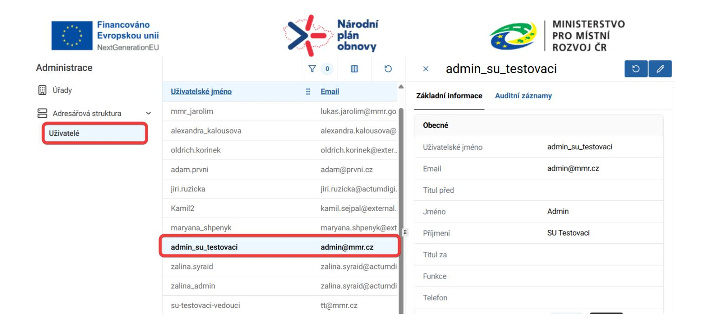

(3)Ve vyskakovacím okně vybíráme z nabídky role. Zaměstnanci přidáme roli "Referenta",

"Vedoucího zaměstnance" nebo "Zaměstnance sekretariátu", k těmto je možno přidat roli

"Oprávnění potvrzení platby" nebo "Podpisové oprávnění" (blíž k rolím viz kapitola 3.4). Roli "JIP-KAAS role" ponecháváme uživateli zaškrtnutou.

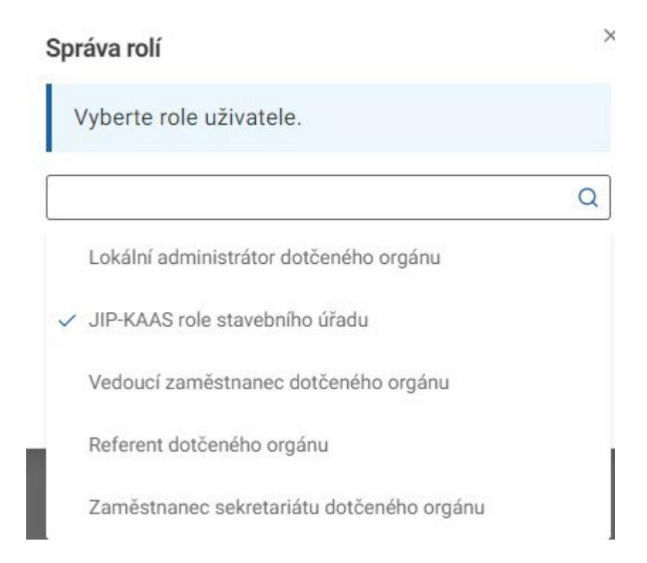

(4) Roli přidělíme kliknutím na "Potvrdit" ve vyskakovacím okně.

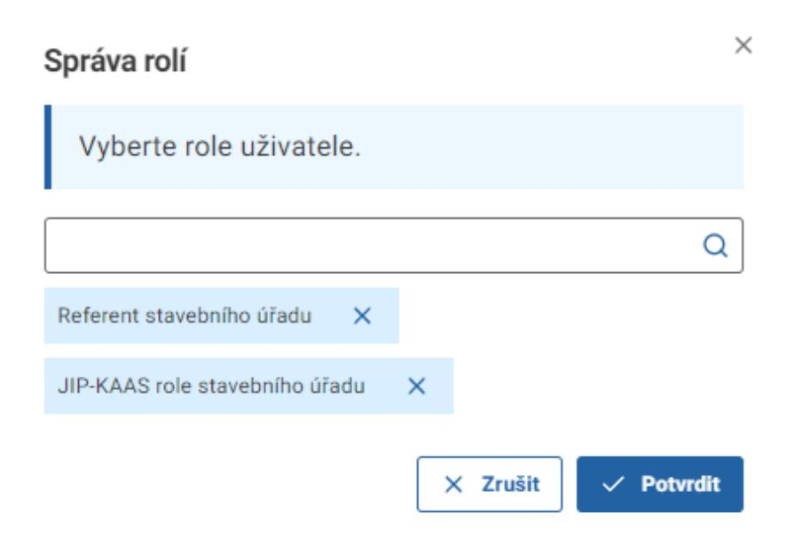

(5) Role je přidělena, na detailu uživatele vidíme novou roli.

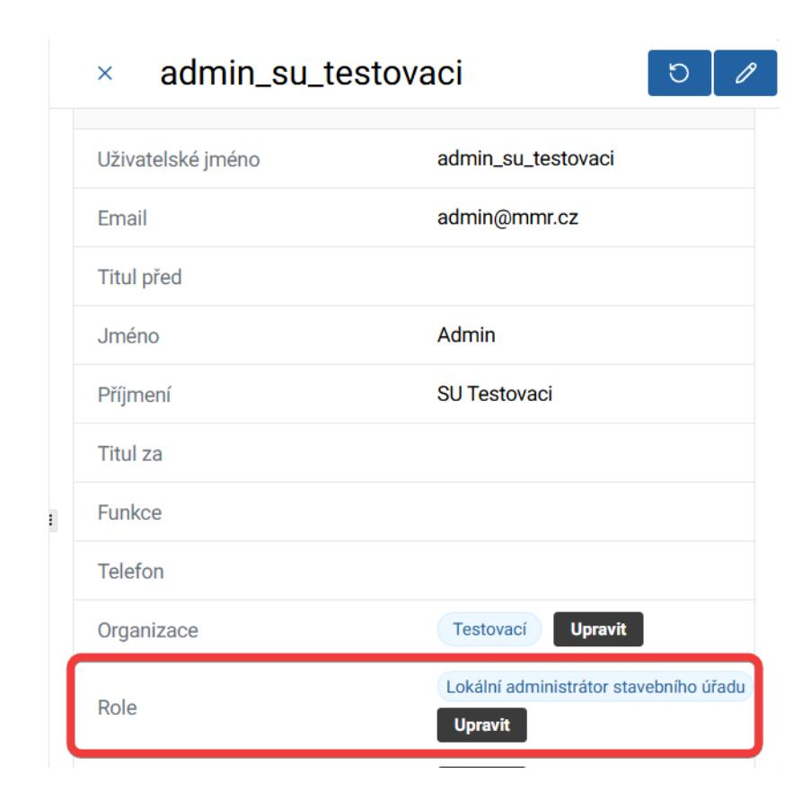

Kroky 1) - 5) je potřebné vykonat pro všechny zaměstnance úřadu jednotlivě. Každý uživatel musí mít kromě JIP-KAAS role přidělenou i konkrétní roli jako např. referent. Uživatel s nepřidělenou rolí nebude moci v systému vykonávat svoji práci.

## 5.1.3 Nastavení rolí zaměstnancům dotčeného orgánu

- (1) V menu administrace projdeme pod záložku "Adresářová struktura" a podmenu
- "Uživatelé".
- (2) V seznamu klikneme na vybraného uživatele, otevře se nám vpravo okno s detailními informacemi a klikneme na černé tlačítko "Upravit" na řádku s atributem "Role".

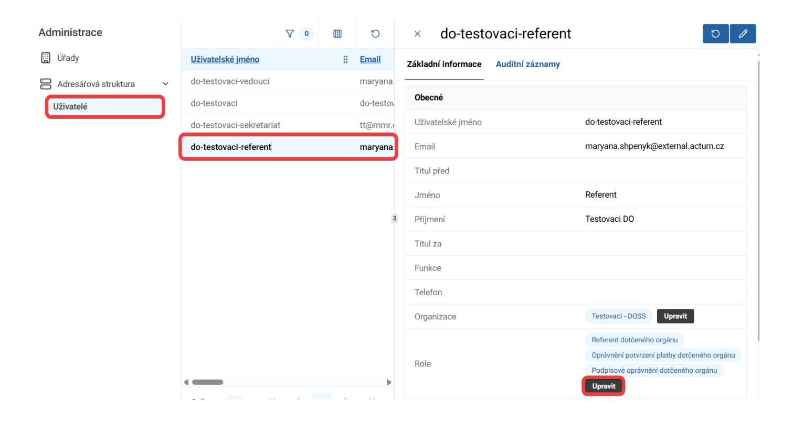

(3) Ve vyskakovacím okně vybíráme z nabídky role. Zaměstnanci přidáme roli "Referenta",

"Vedoucího zaměstnance" nebo "Zaměstnance sekretariátu". Roli "JIP-KAAS role" ponecháváme uživateli zaškrtnutou.

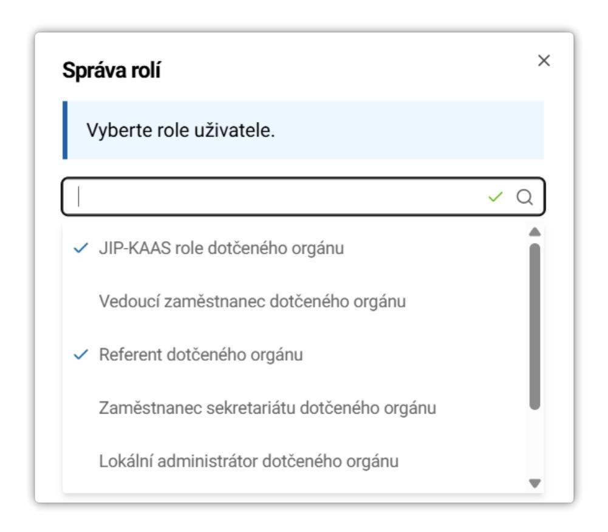

(4) Roli přidělíme kliknutím na "Potvrdit" ve vyskakovacím okně.

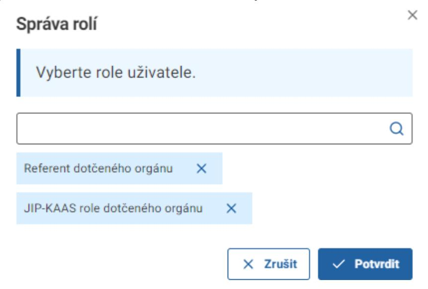

(5) Role je přidělena, na detailu uživatele vidíme novou roli.

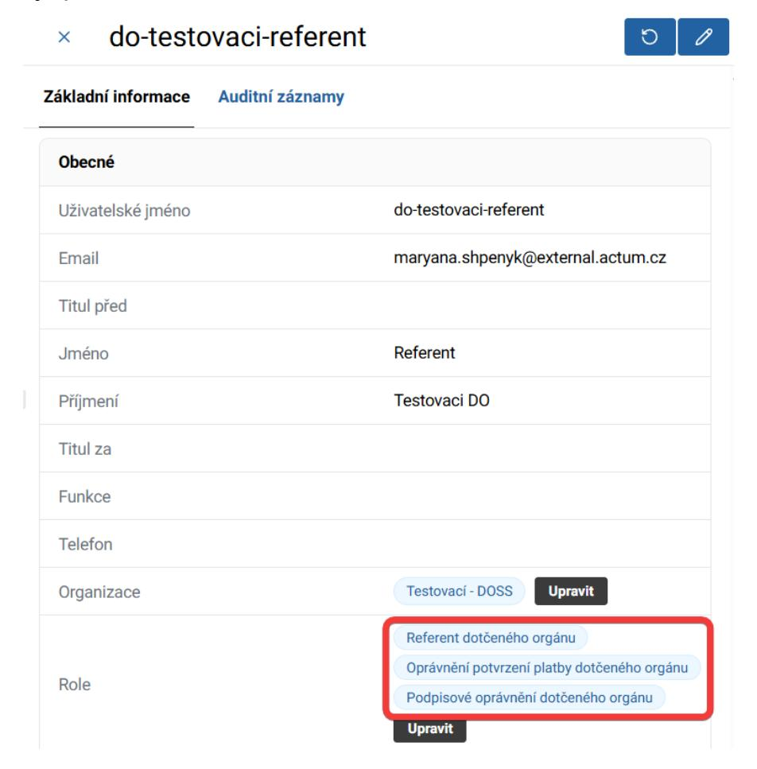

Kroky 1) - 5) je potřeba vykonat pro všechny zaměstnance dotčeného orgánu jednotlivě. Každý uživatel musí mít kromě JIP-KAAS role přidělenou i konkrétní roli jako např. referent.

Uživatel s nepřidělenou rolí nebude moci v systému vykonávat svoji práci.

- 5.1.4 Vyplnění osoby pro příjem dokumentů
- (1) Projít do "Administrace" položka "Úřady", vybrat vlastní organizaci a rozkliknout detail jako v kroku 3.1.1 bod A a B
- (2) Na detailu vpravo nahoře kliknout na tlačítko "Upravit"

(3) V editačním režimu nastavit doposud nevyplněné pole "Příjem dokumentů" na jednoho z uživatelů úřadu. Systém nabídne na výběr uživatele s potřebnou rolí:

| < Ministerstvo kultury | ⊘ ×             |   |
|------------------------|-----------------|---|
| Nadřazený úřad         |                 |   |
| Úřad                   |                 | Q |
| Poznámka               |                 |   |
| Příjem dokumentů       |                 |   |
| Uživatel               |                 | a |
| Kontakt                | Admin test      |   |
| Datová schránka        | Jan Novák       |   |
| Elektronická podatelna | Jiří Nováček    |   |
|                        | Květa Pivoňková |   |
| Bankové spojení        | Naďa Jiránková  |   |

(4) Po výběru uživatele vpravo nahoře kliknout na tlačítko "Uložit"

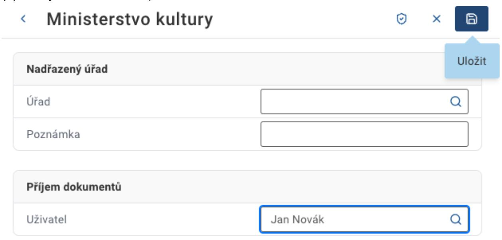

(5) Ověřit po uložení, že je nastaven správný uživatel pro příjem dokumentů

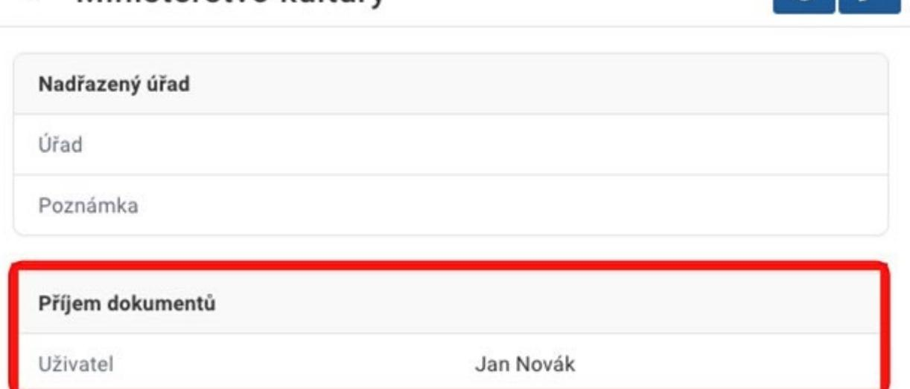

Bez nastavení výchozího uživatele pro příjem dokumentů nebudou dokumenty ze spisové služby postoupeny na správný úřad v ISSŘ.

# 5.2 Návod pro lokálního administrátora kompozitního úřadu (kompozitu) při prvním přístupu do systému

Kompozitní úřad je nadřazenou organizací SU, DO nebo jiných kompozitních úřadů. Kompozitní úřad přiřazuje nově přihlášené uživatele k příslušnému úřadu, který pod něj spadá. Úkolem lokální administrátora kompozitního úřadu je tedy změnit organizaci a roli nově přihlášeného uživatele do systému.

Lokální administrátor kompozitu může dále v případě potřeby editovat údaje podřízených úřadů. Roli lokálního administrátora kompozitu může přidělit globální admin MMR, nebo může být získána od již existujícího lokálního administrátora kompozitu.

# 5.2.1 Přiřazení nově přihlášeného uživatele na příslušný SÚ/DO

Lokální administrátor kompozitního úřadu přejde do administrace kliknutím na tlačítko ozubeného kolečka v levém dolním rohu.

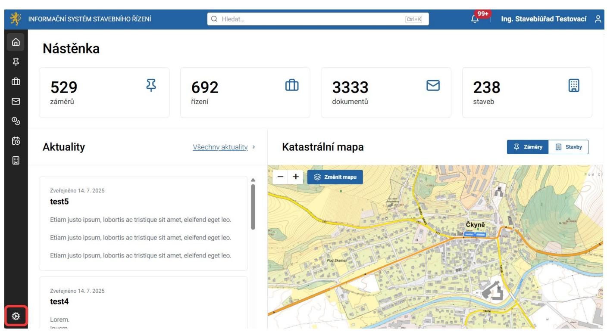

Následně přejde pomocí menu na přehled uživatelů na položku "*Adresářová struktura"* a následně vybere "*Uživatelé"*. V přehledu jsou zobrazeni uživatelé kompozitního úřadu a jemu podřízených uživatelů.

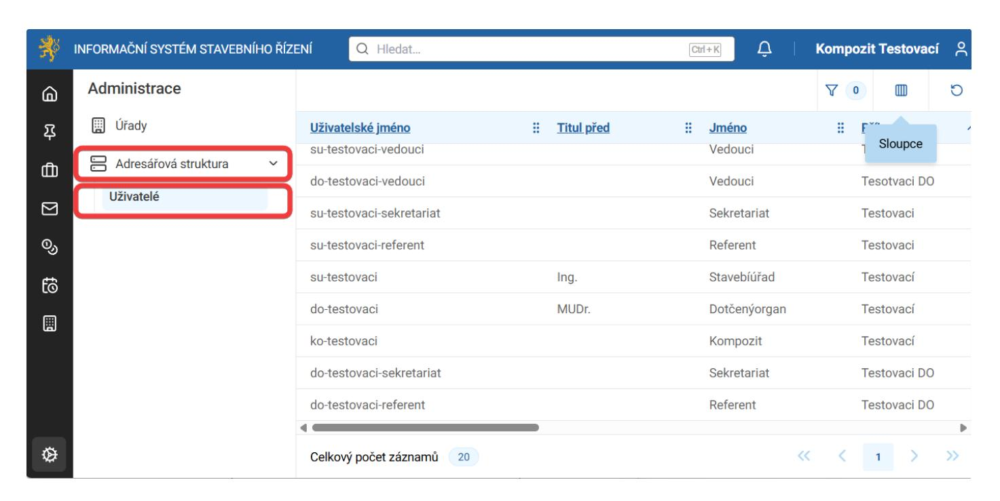

Poté přejde na detail vybraného uživatele z přehledu a klikne na tlačítko "*Upravit"* u atributu "Organizace".

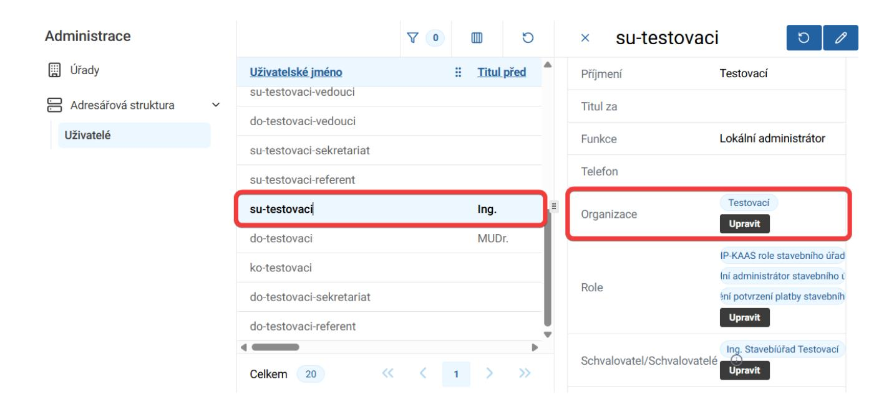

Následně ve vyskakovacím okně vybere podřízenou organizaci, do které chce uživatele

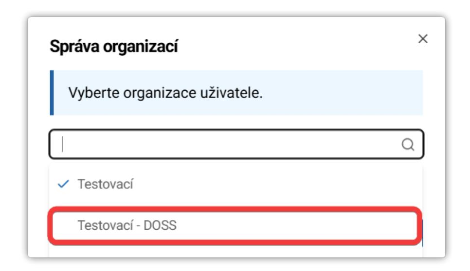

#### přesunout.

Poté uživatele odebere z organizace kompozitního úřadu a změny potvrdí kliknutím na příslušné

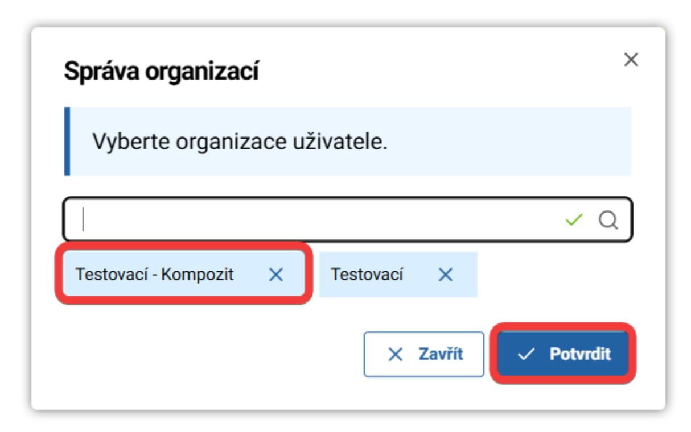

tlačítko "Potvrdit".

Následně klikne na tlačítko "Upravit" u atributu "Role".

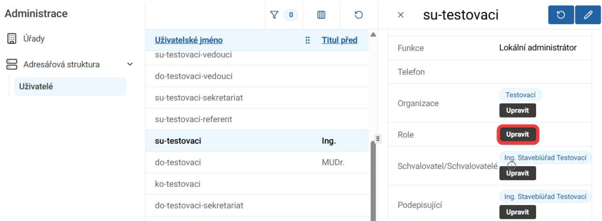

Poté nastaví uživateli roli JIP-KAAS stavebního úřadu nebo dotčeného orgánu podle typu podřízené organizace. Pokud má být uživatel lokálním administrátorem dané podřízené organizace nastaví uživateli také druhou roli Lokálního administrátora stavebního úřadu nebo dotčeného orgánu. O následnou správu dané podřízené organizace se stará lokální administrátor příslušné organizace.

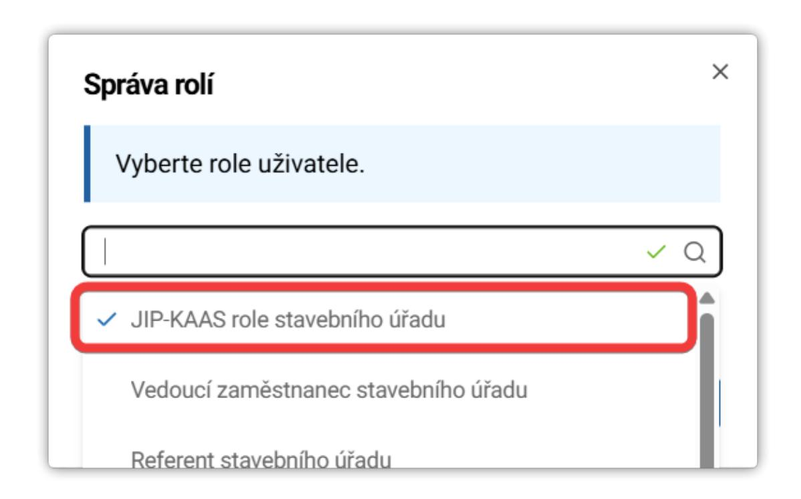

## 5.2.2 Zobrazení úřadů

Administrátor přejde kliknutím na ikonu ozubeného kolečka do administrace a následně v menu klikne na položku "Úřady". Následně lokální administrátor kompozitního úřadu vidí svůj úřad a všechny podřízené úřady.

Správným nastavením je, když je IČ vyplněno na úrovni kompozitního úřadu a dále je IČ nevyplněno pro podřízené úřady SÚ a DOSS.

Lokální administrátor kompozitu totiž vidí uživatelé podřízených organizací, které nemají vyplněné IČ.

Podřízenou organizací rozumíme SÚ nebo DOSS, které mají v nastavení vyplněný jako nadřazenou organizaci právě kompozit. IČ podřízených úřadů se propisuje z IČ nastaveného u kompozitu.

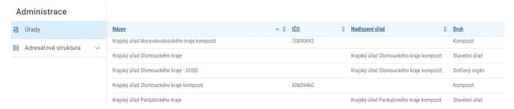

5.2.3 ÚŘAD

# 5.2.4 Zobrazit přehled úřadů

Uživatel v postranním menu klikne na "*Úřady".* Lokální administrátor vidí v přehledu svůj úřad. Lokální administrátor kompozitu vidí v přehledu podřízené úřady.

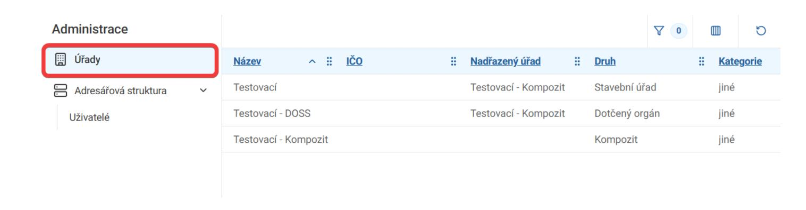

## 5.2.5 Akce detailu úřadu

## 5.2.5.1 Načíst detail úřadu znovu

Uživatel přejde na detail úřadu a klikne na tlačítko "*Načíst znovu".*

## 5.2.5.2 Upravit úřad

Uživatel přejde na detail úřadu a klikne na tlačítko "*Upravit"*. Detail je otevřen ve formě formuláře s předvyplněnými aktuálními údaji úřadu. Uživatel údaje upraví a změny uloží kliknutím na příslušné tlačítko.

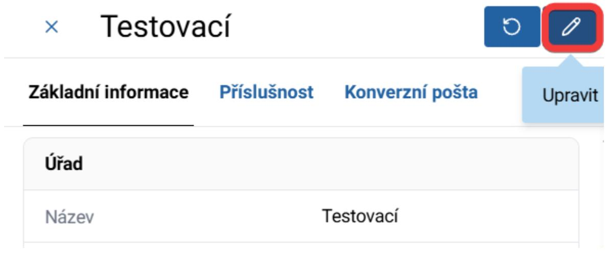

**26 | Strana**

# 5.3 ISSŘ ROLE

ISSŘ role slouží pro nastavení přístupových práv k jednotlivým částem ISSŘ. Uživatelské role existující v systému

## 5.3.1 Administrátor (globální administrátor)

● Všechny funkce systému včetně administračních bez omezení na domovský úřad

# 5.3.2 Lokální administrátor SÚ/DO

- ● ztotožňování osob/parcel/stavebních objektů
- čtení listů vlastnictví
- čtení BPP balíčků
- pečetění BPP balíčků (ověření dokumentace) pouze pro lokálního administrátora SÚ

#### Správa domovského úřadu:

- čtení
- zápis adresy, kontaktů, bankovního spojení
- určení uživatele pro příjem dokumentů

#### Správa uživatelů domovského úřadu:

- čtení
- zápis
- přiřazování rolí

## Evidence dokumentů:

- správa dokumentů domovského úřadu
- změna zpracovatele dokumentu
- podepisování dokumentů
- schvalování dokumentů
- příjem dokumentů
- nastavení data nabytí právní moci dokumentu
- storno dokumentu

#### Evidence platebních příkazů:

● čtení platebních příkazů domovského úřadu

#### Evidence řízení:

- správa řízení domovského úřadu
- změna zpracovatele řízení
- ukončení řízení
- otevření řízení

## Evidence záměrů:

- čtení
- zápis
- zneplatnění záměru
- přidělení IČS navrhovanému objektu
- přepis navrhovaného objektu do evidence stavebních objektů
- tvorba BPP balíčku

## Evidence stavebních objektů:

- čtení
- zápis
- přidělení IČS stavebnímu objektu
- změna stavu stavebního objektu

## 5.3.3 Lokální administrátor kompozitu

### Správa domovského úřadu:

- čtení
- zápis adresy, kontaktů, bankovního spojení
- určení uživatele pro příjem dokumentů

#### Správa uživatelů domovského úřadu:

- čtení
- zápis
- přiřazování rolí

#### **Poznámka:**

Lokální administrátor kompozitu má úlohu rozřazovat uživatelé do podřízených úřadů.

# 5.3.4 Vedoucí zaměstnanec SÚ/DO

- ● ztotožňování osob/parcel/staveb
- čtení listů vlastnictví
- čtení BPP balíčků
- pečetění BPP balíčků (ověření dokumentace) pouze pro vedoucího zaměstnance SÚ

## Evidence dokumentů:

- správa dokumentů domovského úřadu
- změna zpracovatele dokumentu
- podepisování dokumentů
- schvalování dokumentů
- příjem dokumentů

#### Evidence platebních příkazů:

● čtení platebních příkazů domovského úřadu

#### Evidence řízení:

- správa řízení domovského úřadu
- změna zpracovatele řízení
- ukončení řízení
- správa přístupu

#### Evidence záměrů:

- čtení
- zápis
- přidělení IČS navrhovanému objektu
- přepis navrhovaného objektu do evidence stavebních objektů

#### Evidence stavebních objektů:

- čtení
- zápis

- přidělení IČS stavebnímu objektu
- ● změna stavu stavebního objektu

# 5.3.5 Referent SÚ/DO

- ztotožňování osob/parcel/staveb
- čtení listů vlastnictví
- čtení BPP balíčků
- pečetění BPP balíčků (ověření dokumentace) pouze pro referenta SÚ

## Evidence dokumentů:

● správa dokumentů domovského úřadu

#### Evidence platebních příkazů:

● čtení platebních příkazů domovského úřadu

## Evidence řízení:

- správa řízení domovského úřadu
- ukončení řízení

#### Evidence záměrů:

- čtení
- zápis
- přidělení IČS navrhovanému objektu
- přepis navrhovaného objektu do evidence stavebních objektů

#### Evidence stavebních objektů:

- čtení
- zápis
- přidělení IČS stavebnímu objektu
- změna stavu stavebního objektu

# 5.3.6 Zaměstnanec sekretariátu SÚ/DO

● čtení BPP balíčků

#### Evidence dokumentů:

- čtení
- zápis

#### Evidence platebních příkazů:

- čtení platebních příkazů domovského úřadu
- označení platebního příkazu za zaplacený

## Evidence řízení:

● čtení

#### Evidence záměrů:

● čtení

#### Evidence stavebních objektů:

● čtení

# 5.3.7 Oprávnění potvrzení platby SÚ/DO

## Evidence platebních příkazů:

- čtení platebních příkazů domovského úřadu
- označení platebního příkazu za zaplacený

#### **Poznámka:**

Tato role je typicky kombinována podle potřeb úřadu s rolí vedoucího nebo referenta, kteří oprávnění potvrzení platby ve výchozím nastavení nemají.

# 5.3.8 Podpisové oprávnění SÚ/DO

## Evidence dokumentů:

- podepisování dokumentů
- schvalování dokumentů
- vrácení dokumentů

#### **Poznámka:**

Role se používá v kombinaci s rolí referenta. Referent s touto rolí může schválit a podepsat dokumenty, které on sám vytvořil. Pozor, tato role neopravňuje jejího držitele schvalovat a podepisovat dokumenty jiných referentů, toto oprávnění zůstává pouze vedoucímu. Důvodem je, že referent vidí pouze své dokumenty, zatímco vedoucí vidí všechny dokumenty úřadu.