## **2. Zpracování žádosti**

Pro zaevidování řízení do ISSŘ je nejprve nutné vytvořit a zpracovat žádost. Postupujte podle toho, jestli je daná žádost již evidovaná v ISSŘ.

# a. Žádost není evidovaná v ISSŘ – tvorba doručeného dokumentu

Pokud není žádost evidovaná v ISSŘ, je nutné ji vytvořit. Přejděte do sekce Dokumenty skrze ikonu obálky v levém vertikálním menu a poté klikněte na tlačítko Nový dokument.

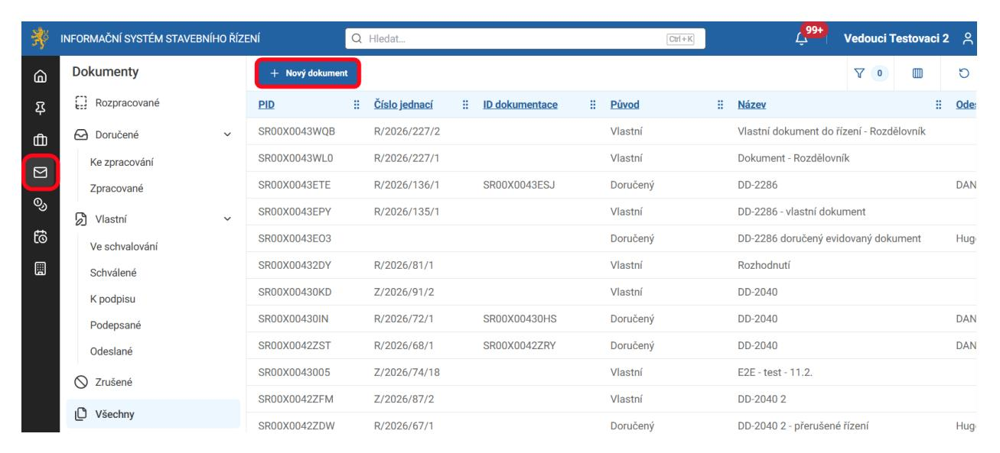

Vyplňte základní údaje o dokumentu.

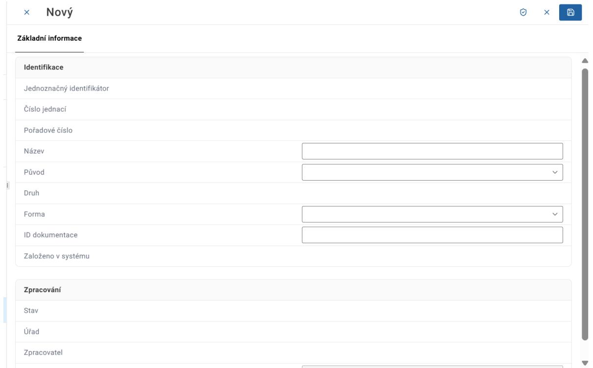

Při zvolení původu dokumentu jako doručeného se v dolní části obrazovky objeví sekce Odesílatel. Tuto sekci rozklikněte.

Nový 0

## Základní informace Identifikace Jednoznačný identifikátor Číslo jednací Pořadové číslo Název Doručený dokument Doručený Původ Ostatní Druh Forma ~ ID dokumentace Založeno v systému Poznámka 🛈 Zpracování Stav Úřad Zpracovatel dd.mm.rrrr -:-Datum evidence ve spisové službě Doručení Datum odeslání dd.mm.rrrr Datum doručení dd.mm.rrrr Způsob doručení ~ Odesílatel

Vyplňte základní údaje o osobě odesílatele a poté klikněte na tlačítko Potvrdit.

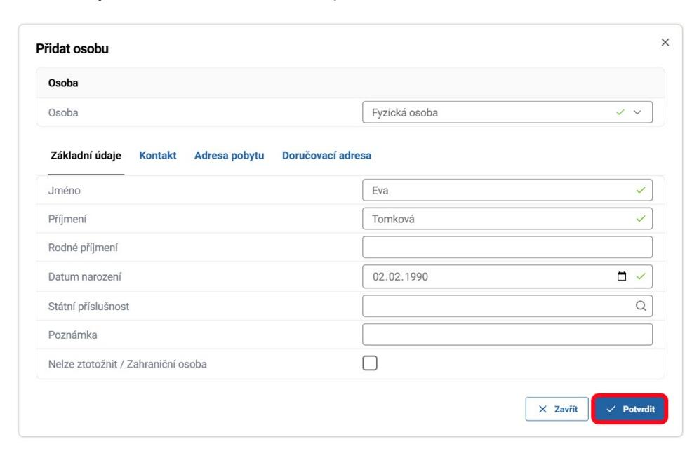

Po vyplnění základních údajů o dokumentu a jeho odesílateli dokument uložte pomocí tlačítka Uložit v pravém horním rohu formuláře.

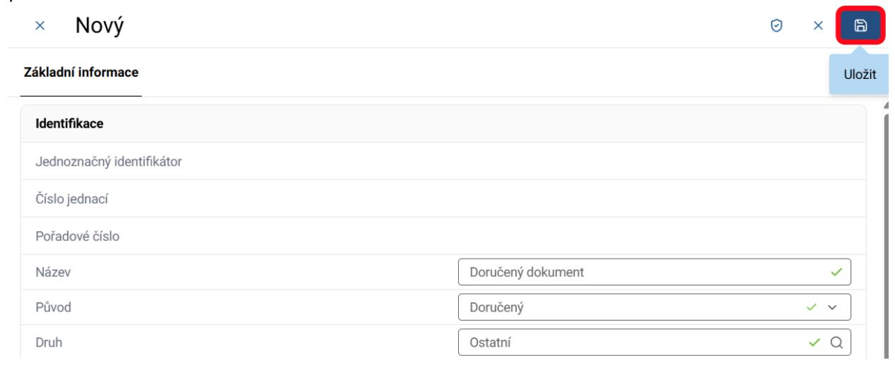

Upozorňujeme uživatele, že technická dokumentace není obsahem žádosti, ale je navázána přímo na daný záměr. Dokument vkládaný v dalších odstavcích je pouze obsah žádosti. Dokumentaci naleznete v záměru.

Po vytvoření dokumentu přejděte do záložky Hlavní dokument a přidejte hlavní dokument žádosti.

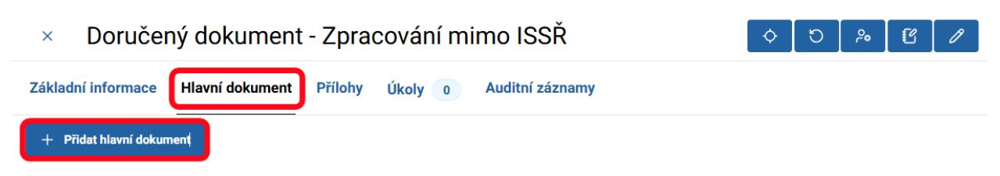

Následně přejděte do záložky Přílohy a přidejte přílohy žádosti.

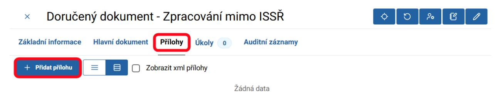

Podrobné instrukce pro vytvoření žádosti naleznete v Obecné příručce.

Po přidání hlavního dokumentu a příloh žádosti pokračujte dle kroků v další kapitole.

# b. Žádost je evidovaná v ISSŘ – zpracování žádosti a vytvoření řízení

Pro zaevidování nového řízení zpracovávavného mimo ISSŘ klikněte na akční tlačítko "Zaevidovat řízení vedené mimo ISSŘ" na dokumentu.

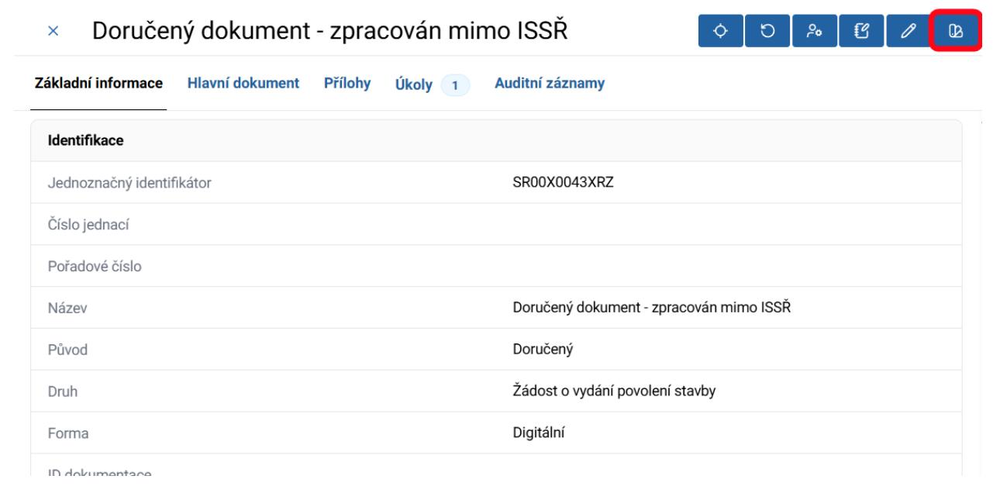

K dispozici je formulář pro zadání informací pro vytvoření nového řízení vedeného mimo ISSŘ

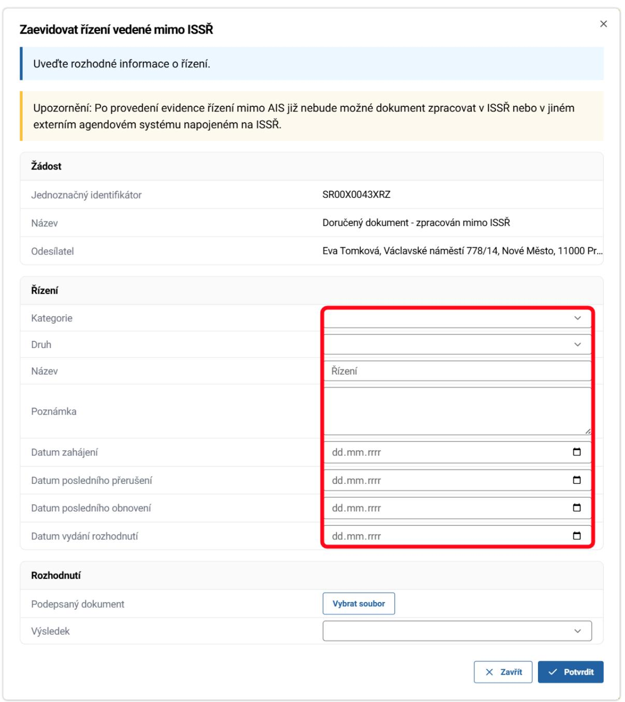

UPOZORNĚNÍ: Upozorňujeme, že tato akce je po potvrzení formuláře nevratná. Datum zahájení bylo předvyplněno dle data evidence ve spisové službě. Upozorňujeme uživatele, že toto datum již nelze později editovat. Vyplňte název a kategorii řízení.

Formulář se automaticky přizpůsobuje vyplněným údajům. Řízení navažte na konkrétní záměr a verzi záměru.

Pro výběr záměru se nabídne samostatné okno pro vyhledání a výběr záměru

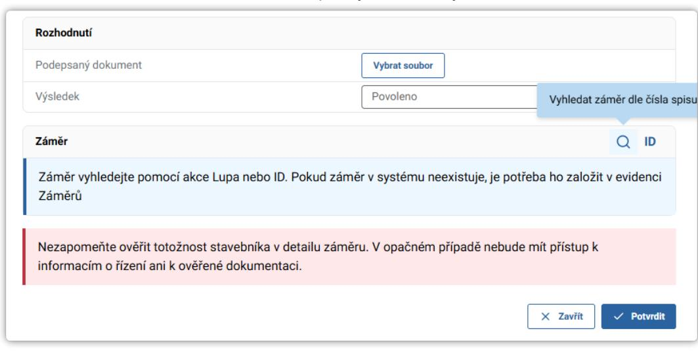

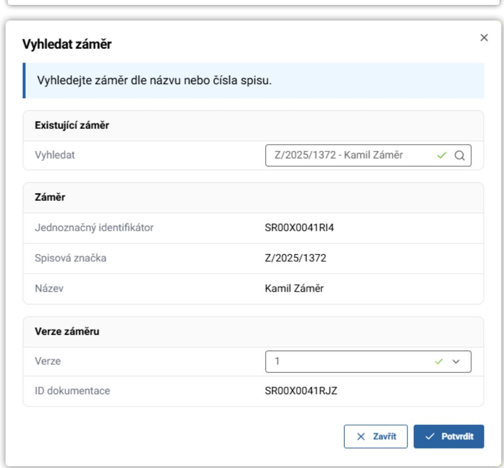

Nakonec klikněte na tlačítko Potvrdit.

Podrobný popis kroků vedoucích k založení řízení naleznete v Obecné příručce.

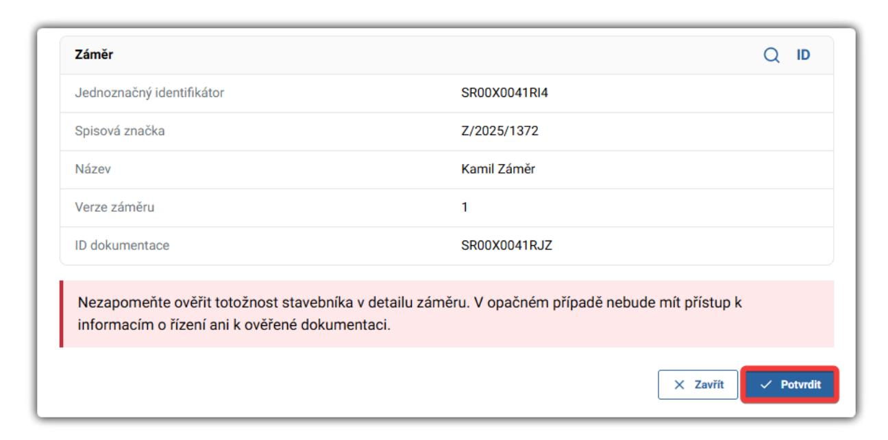

Základní údaje o dokumentu včetně checkboxu značícího zpracování mimo ISSŘ uvidíte na záložce Základní informace.

Těmito kroky dojde k založení řízení. V detailu dokumentu se objeví záložka řízení. Z této záložky můžete přejít přímo na detail řízení.

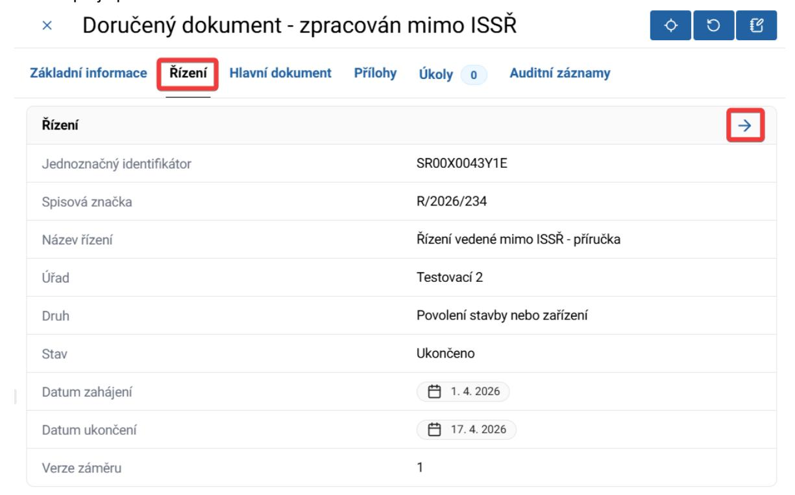
