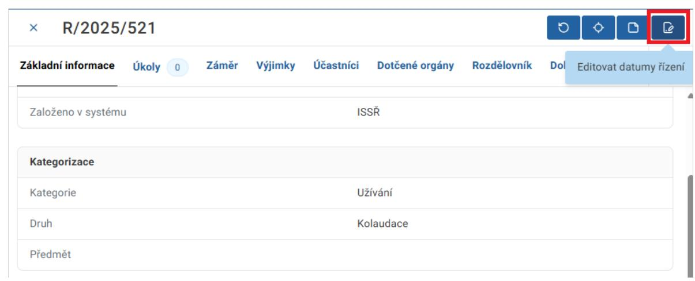
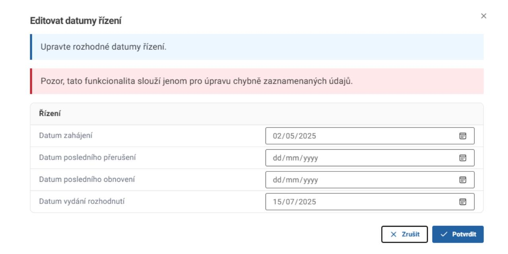
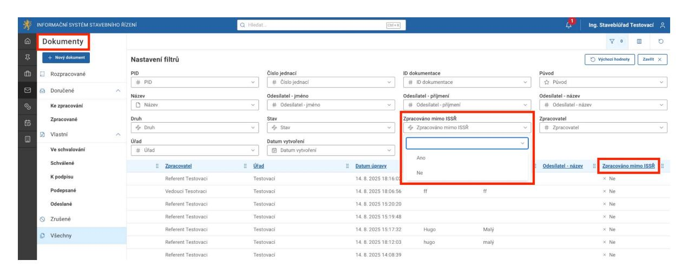
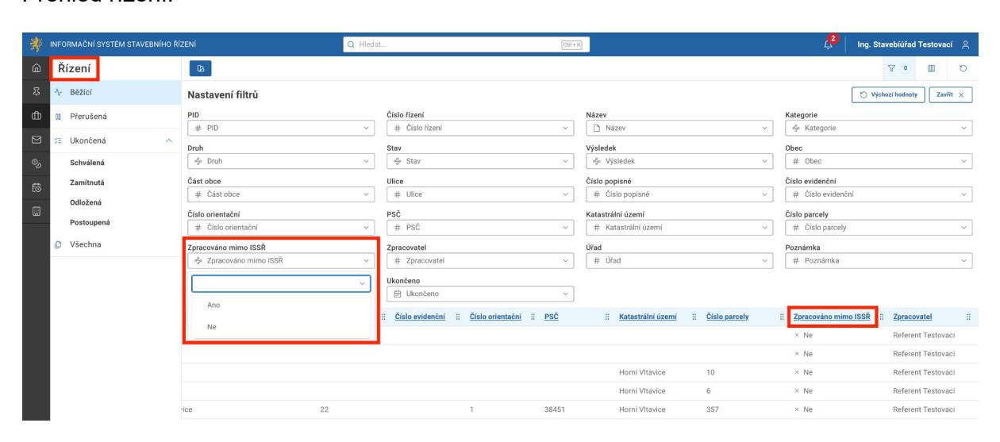

## **3. Zobrazení parametrů řízení vedeného mimo ISSŘ**

## 3.1. Zobrazení externího čísla jednacího v detailu dokumentu

Do ISSŘ bylo doplněno nové pole "Externí číslo jednací", které zobrazuje číslo jednací z lokální spisové služby externích systémů napojených na ISSŘ. Pole slouží k jednoznačné identifikaci dokumentů, které byly zpracovány v externích systémech.

Pole se zobrazuje v detailu dokumentu (např. žádosti) pouze v případě, že je hodnota externího čísla jednacího předána do ISSŘ externím systémem. Systém VERA tuto hodnotu předává. Pokud externí systém hodnotu neposkytne, pole se v uživatelském rozhraní nezobrazuje.

| Základní informace Řízení                                                 | Hlavní dokument | Přílohy Úkoly 0 Auditní záznamy |  |  |
|---------------------------------------------------------------------------|-----------------|---------------------------------|--|--|
| Záznam je spravován externím systémem. Další operace v ISSŘ neprovádějte. |                 |                                 |  |  |
| Identifikace                                                              |                 |                                 |  |  |
| Jednoznačný identifikátor                                                 |                 | SR00X005KQ1C                    |  |  |
| Číslo jednací                                                             |                 | R/2026/129/1                    |  |  |
| Pořadové číslo                                                            |                 | 1                               |  |  |
| Název                                                                     |                 | Žádost stavba API               |  |  |
| Původ                                                                     |                 | Doručený                        |  |  |
| Druh                                                                      |                 | Žádost o vydání povolení stavby |  |  |
| Forma                                                                     |                 | Digitální                       |  |  |
| ID dokumentace                                                            |                 | SR00X005KQ0H                    |  |  |
| Založeno v systému                                                        |                 | Portál stavebníka               |  |  |
| Externí číslo jednací                                                     |                 | MMJII/300/2026/SÚ-zkrVE         |  |  |

Zobrazení se týká jak nových, tak i starších dokumentů, u nichž bylo externí číslo jednací v minulosti do ISSŘ doručeno. Funkcionalita má pouze informační charakter a nemá vliv na chování dokumentu ani na jeho stav.

## 3.2. Editace datumů řízení

Zpětná editovatelnost klíčových datumů při evidenci řízení vedených mimo ISSŘ

Funkcionalita umožní změnu důležitých datumů řízení v případě, že byly tyto datumy omylem zaznamenány nesprávně.

Tato funkcionalita je dostupná pouze pro ukončená řízení (tj. pro řízení ve stavu **"Ukončeno"**, s výsledkem **"Schváleno", "Zamítnuto", "Odloženo"** nebo **"Postoupeno"**).

Akční tlačítko pro změnu datumů "Editovat datumy řízení" naleznete v konkrétním řízení mezi ostatními akčními tlačítky.

Kliknutím na toto tlačítko dojde k otevření obrazovky pro změnu klíčových datumů řízení.

Pro změnu datumů je potřeba vyplnit otevřenou obrazovku a pro uložení použít tlačítko "Potvrdit".

Vyplnění datumu zahájení a datumu vydání rozhodnutí je povinné, tyto datumy nemohou být uloženy prázdné. Datum posledního přerušení a datum posledního obnovení mohou být buďto vyplněné oba, anebo ponechány oba nevyplněné, nelze vyplnit pouze jeden z nich.

Při změně datumů řízení dojde k vytvoření Auditního záznamu o provedené změně. Při změně rovněž dojde k vymazání času zahájení/přerušení/obnovení/vydání rozhodnutí zaznamenává se pouze datum změny, nikoli její čas.

Možnost editace datumů dle role v systému:

| Role     | Vlastní řízení | Ostatní řízení |
|----------|----------------|----------------|
| Referent | ANO            | NE             |
| Vedoucí  | ANO            | ANO            |

| Lokální administrátor  | ANO | ANO |
|------------------------|-----|-----|
| Pracovník sekretariátu | NE  | NE  |

V tuto chvíli systém vyžaduje vyplnění data rozhodnutí bez ohledu na druh řízení. Toto chování bude upraveno v rámci dalšího rozvoje systému.

# 3.3. Filtr pro řízení zpracovaná mimo ISSŘ

V systému je k dispozici filtr "Zpracováno mimo ISSŘ"

- v evidenci dokumentů a
- v evidenci řízení

pro zobrazení Dokumentů a Řízení, která jsou zpracována mimo systém ISSŘ (libovolný AIS).

V evidenci dokumentů a v evidenci řízení byl přidán nový sloupec Zpracováno mimo ISSŘ s možností filtrování hodnot ANO/NE.

Tento atribut uživateli slouží k usnadnění orientace. Uživatel vidí, zda byl dokument či řízení zpracováno v systému ISSŘ, nebo v externím systému, aniž by musel otevírat jeho detail.

## Přehled dokumentu:

## Přehled řízení:

