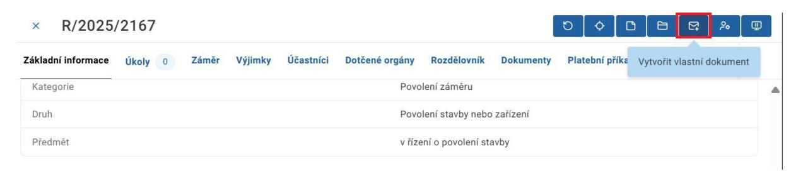
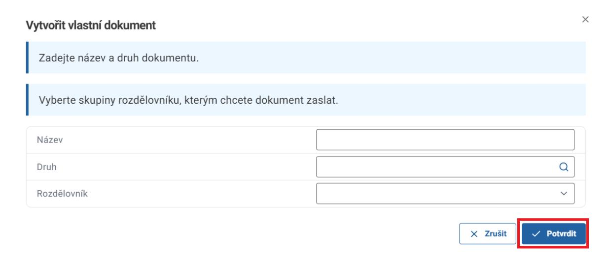
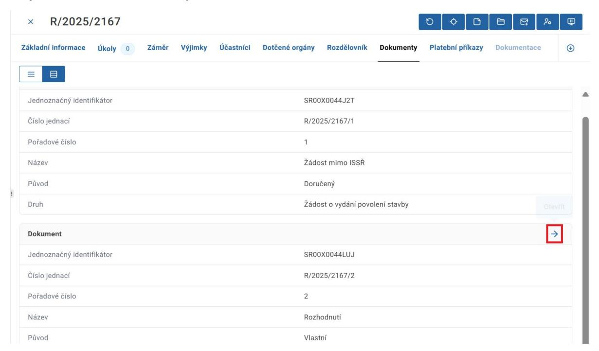
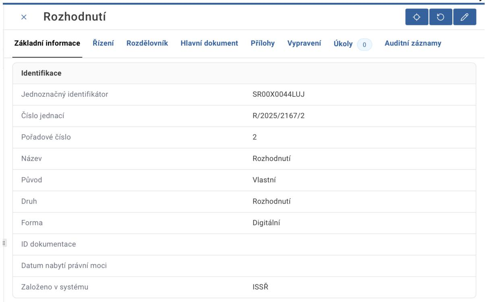
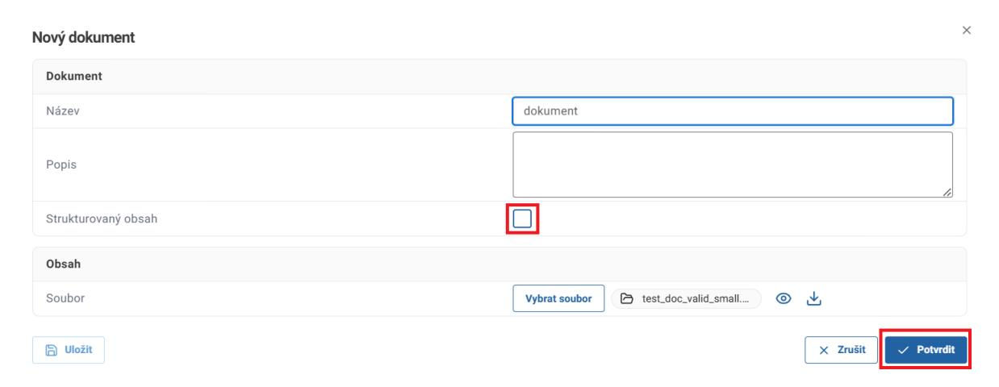
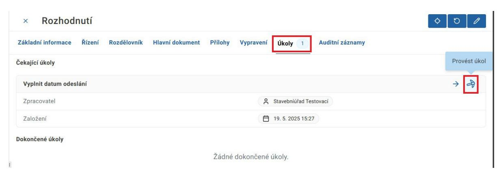
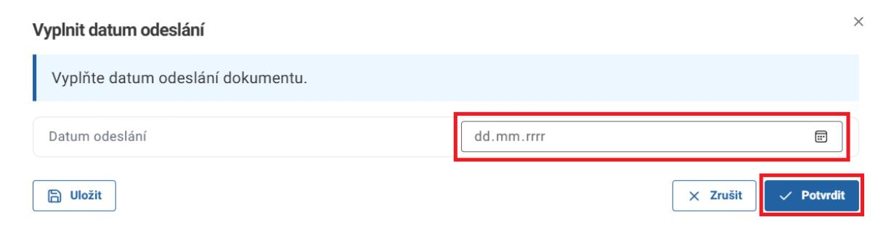
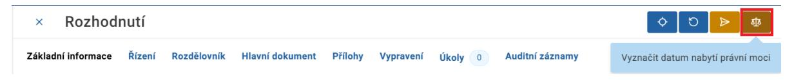
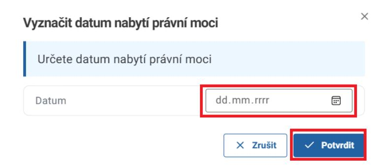
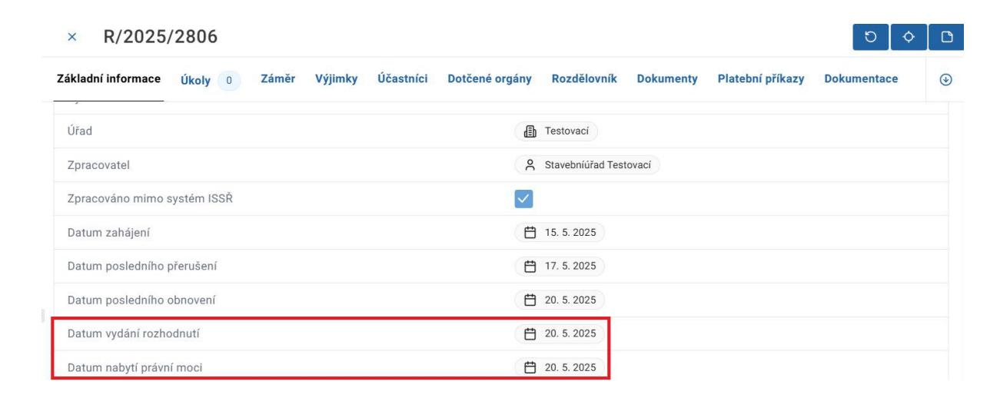

### **5. Tvorba rozhodnutí/usnesení/vyjádření**

Pro tvorbu finálního dokumentu v řízení klikněte na akční tlačítko Vytvořit vlastní dokument.

Vyplňte pole Název a Druh. Pole Rozdělovník prosíme nevyplňujte. Poté klikněte na tlačítko Potvrdit.

Druhy dokumentů, které jsou finální v řízení jsou Rozhodnutí, Usnesení a Vyjádření. U těchto dokumentů je možné vyznačit datum nabytí právní moci, které se poté přepíše do řízení. Další druhy dokumentů nejsou určené pro evidenci řízení mimo ISSŘ.

Přejděte na záložku Dokumenty a klikněte na tlačítko Otevřít u daného dokumentu.

Uživatel má stejně jako v řízení k dispozici záložky. Pro účely evidence dokumentů v řízeních vedených mimo ISSŘ využívejte pouze záložky Základní informace, Řízení, Hlavní dokument, Přílohy, Úkoly a Auditní záznamy.

Stejně jako při vytváření nového doručeného dokumentu přejděte na záložku Hlavní dokument a přidejte hlavní dokument finálního dokumentu. Odklikněte checkbox Strukturovaný obsah a vložte požadovaný dokument. Kroky pro zpracování finálního vlastního dokumentu u řízení mimo ISSŘ se liší od postupu u řízení vedených v ISSŘ – dokument obsahuje pouze jeden úkol: Vyplnit datum odeslání. Z tohoto důvodu je nutné do systému vložit již podepsaný dokument. Vypravení dokumentu v tomto případě rovněž probíhá mimo ISSŘ.

Dle potřeby následně přidejte případné přílohy dokumentu.

Následně v záložce Úkoly zpracujte úkol Vyplnit datum odeslání.

V dialogovém okně vyplňte datum odeslání dokumentu a klikněte na tlačítko Potvrdit. Upozorňujeme uživatele, že toto datum již nelze později editovat.

Poté klikněte na tlačítko Vyznačit datum nabytí právní moci. Upozorňujeme uživatele, že toto datum již nelze později editovat. Druhé žluté akční tlačítko Odeslat dokument jednotlivě prosíme nepoužívejte.

Vyplňte datum a klikněte na tlačítko Potvrdit.

Údaje odeslání dokumentu a vyznačení nabytí právní moci se propíší do řízení jako Datum vydání rozhodnutí a Datum nabytí právní moci.

