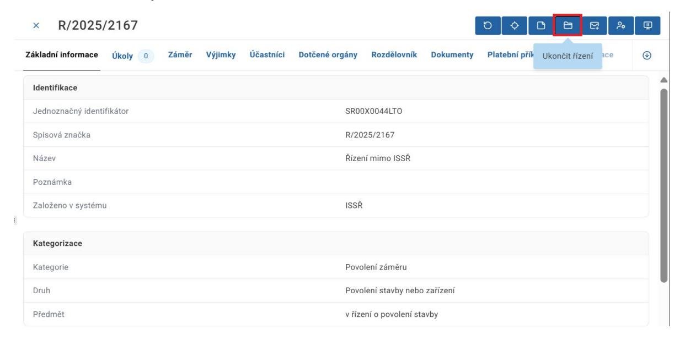
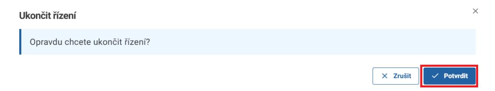
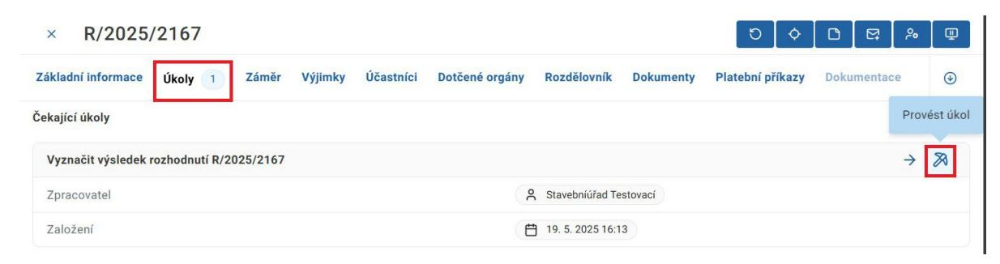
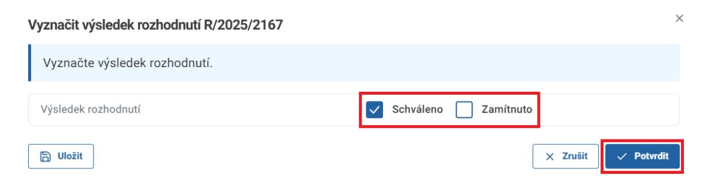
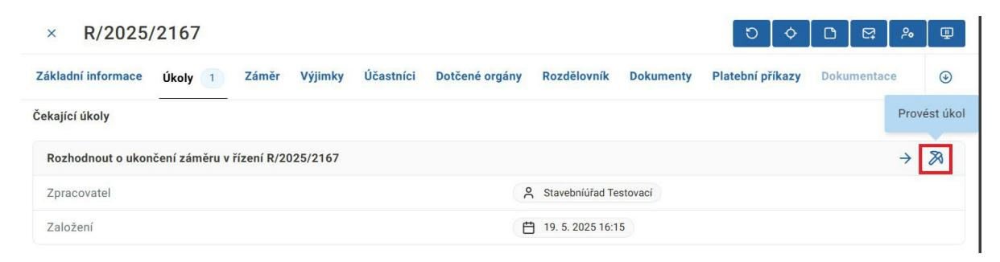
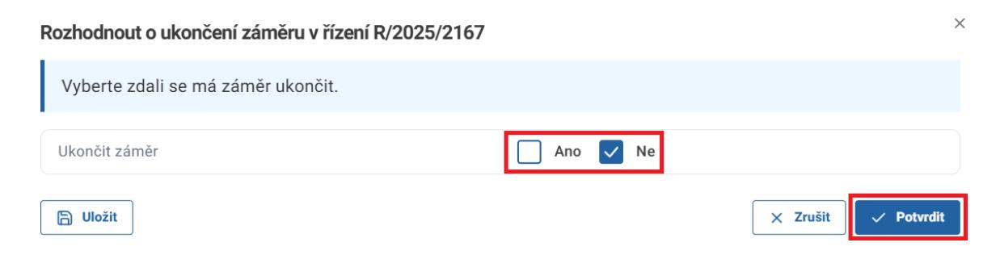
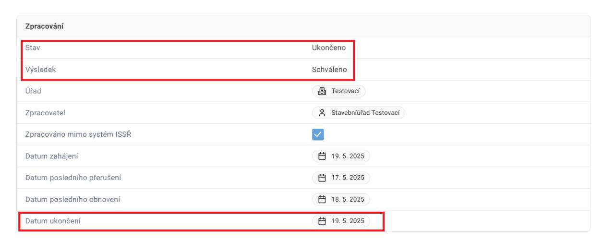
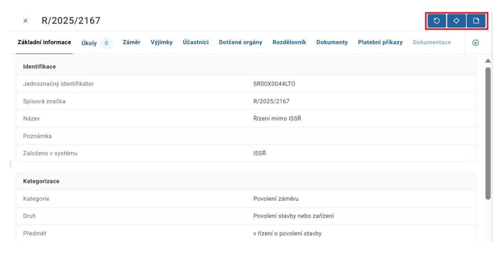

### **6. Ukončení řízení**

Ukončení řízení zahájíte kliknutím na akční tlačítko Ukončit řízení v detailu řízení.

Následně potvrďte akci v dialogovém okně.

Poté přejděte na záložku úkoly a klikněte na tlačítko Provést úkol.

Vyznačte výsledek řízení a klikněte na tlačítko Potvrdit.

ISSŘ v tuto chvíli umožňuje vyznačit výsledky řízení Schváleno a Zamítnuto. Další typy výsledků řízení budou přidány postupně. Pokud Vám současný výběr nevyhovuje, počkejte prosíme s ukončením řízení.

Stejným způsobem zpracujte úkol Rozhodnout o ukončení záměru v řízení. V závislosti na vybraném druhu řízení se tento úkol nemusí objevit.

Toto dialogové okno slouží k ukončení záměru. Pokud nechcete spolu s řízením ukončit i záměr, zvolte možnost Ne a klikněte na tlačítko Potvrdit.

Řízení je nyní ukončeno a datum ukončení bylo vyznačeno.

Ukončením řízení přijde uživatel o možnost provádět v řízení většinu akcí. Před ukončením řízení si prosíme ověřte, že jste provedli všechny požadované akce.

