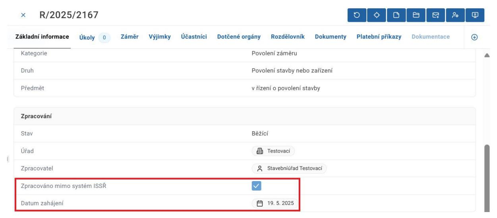
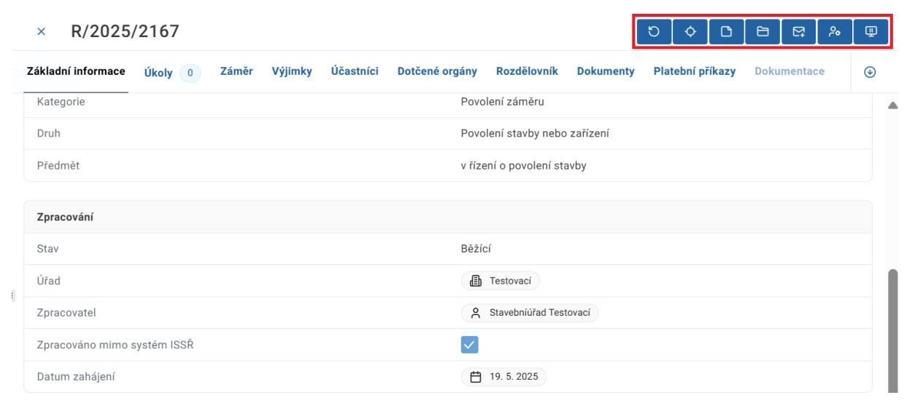
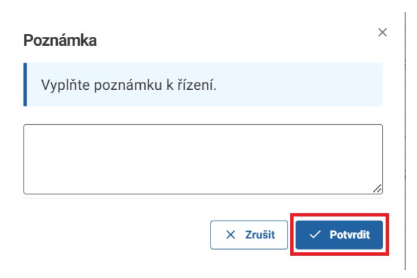
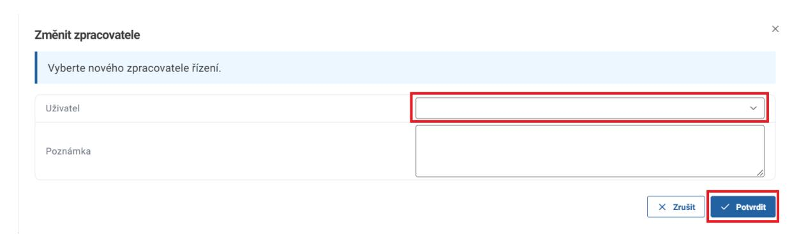
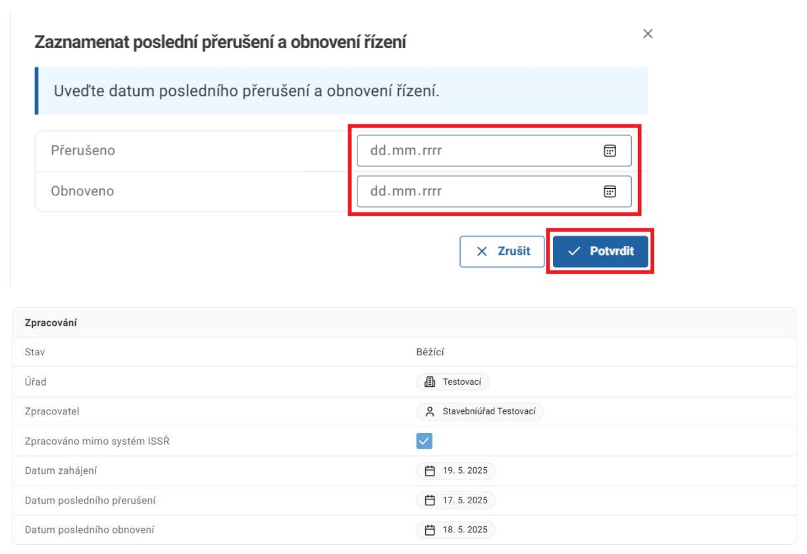

**Tým DSŘ Ministerstvo pro místní rozvoj Staroměstské náměstí 6 110 00 Praha 1**

**Datum** 27. května 2025

## **1. Evidence dokumentů/řízení vedených mimo Informační systém stavebního řízení**

ISSŘ nově umožňuje evidenci a manuální specifikaci klíčových dat u dokumentů a řízení vedených v jiných informačních systémech (mimo ISSŘ, VITA a VERA). Tyto funkce slouží k evidenci všech řízení v jednom systému a pro statistické účely. Upozorňujeme, že je nutné evidovat všechna řízení včetně těch, která probíhala nebo byla uzavřena před nasazením funkce pro evidenci řízení mimo ISSŘ.

Tato příručka je určena uživatelům, kteří zpracovávají řízení mimo ISSŘ, VITA a VERA, a slouží k představení evidenčních funkcí a souvisejících procesů v ISSŘ. Pro podrobné vysvětlení funkcí a postupů v ISSŘ si Vás dovolíme odkázat na [Obecnou příručku](https://mmr.gov.cz/cs/ministerstvo/stavebni-pravo/digitalizace-stavebniho-rizeni-v-cr/informacni-systemy/informacni-system-stavebnich-rizeni).

## 1.1. Evidované údaje

Eviduje se iniciační dokument řízení (žádost či jiný dokument, na jehož základě se řízení založilo), samotné řízení, dokumentace (BPP), pokud existuje a finální dokument (dokument, kterým se řízení uzavírá, například rozhodnutí).

Legislativním bypassem ve smyslu ustanovení § 334b odst. 4 zákona č.283/2021 Sb., stavební zákon ve znění pozdějších předpisů, bylo umožněno stavebním úřadům a dotčeným orgánům použít pro vedení své agendy vedle informačních systémů stavební správy i jiné informační systémy. Zároveň toto ustanovení ale ukládá povinnost stavebním úřadům zajistit, aby na žádost ministerstva pro místní rozvoj mohla být data z jiného informačního systému, která vznikla při výkonu jejich působnosti v přechodném období, předána ministerstvu pro místní rozvoj za účelem jejich přenosu do informačních systémů stavební správy.

U dokumentů je evidováno:

- Datum odeslání
- Datum nabytí právní moci

U řízení je evidováno:

- Datum zahájení
- Datum posledního přerušení
- Datum posledního obnovení
- Datum vydání rozhodnutí
- Datum nabytí právní moci
- Datum ukončení (v ISSŘ)

**Datum odeslán**í a **Datum nabytí právní moci** vyznačí uživatel při tvorbě/evidenci dokumentu Rozhodnutí/Usnesení/Vyjádření. Do řízení se tyto údaje automaticky přepíší jako **Datum vydání rozhodnutí** a **Datum nabytí právní moci**.

**Datum zahájení** vyplní uživatel v dokumentu žádosti a tento údaj se poté automaticky doplní v nově založeném řízení.

**Datum posledního přerušení a obnovení** manuálně vyplňuje uživatel v řízení.

Datum odeslání dokumentu rozhodnutí = datum vydání rozhodnutí

**Datum ukončení** se v detailu řízení vyplní automaticky poté, co uživatel ukončí řízení.

## 1.2. Záměr a dokumentace

Většina řízení v ISSŘ musí být navázána na záměr. Pokud záměr nevznikl automaticky podáním žádosti přes Portál stavebníka, nebo pokud již nebyl vytvořen dříve, je potřeba ho založit ručně. Záměr musí existovat ještě předtím, než začnete zpracovávat dokument žádosti a zakládat řízení. Pokud podání obsahuje dokumentaci a ta ještě nebyla do ISSŘ vložena, je potřeba to rovněž provést. Postup, jak záměr vyhledat, případně vytvořit a vložit do něj dokumentaci (BPP), najdete v Obecné příručce.

## **2. Zpracování žádosti**

Pro zaevidování řízení do ISSŘ je nejprve nutné vytvořit a zpracovat žádost. Postupujte podle toho, jestli je daná žádost již evidovaná v ISSŘ.

# a. Žádost není evidovaná v ISSŘ – tvorba doručeného dokumentu

Pokud není žádost evidovaná v ISSŘ, je nutné ji vytvořit. Přejděte do sekce Dokumenty skrze ikonu obálky v levém vertikálním menu a poté klikněte na tlačítko Nový dokument.

Vyplňte základní údaje o dokumentu.

Při zvolení původu dokumentu jako doručeného se v dolní části obrazovky objeví sekce Odesílatel. Tuto sekci rozklikněte.

Nový 0

## Základní informace Identifikace Jednoznačný identifikátor Číslo jednací Pořadové číslo Název Doručený dokument Doručený Původ Ostatní Druh Forma ~ ID dokumentace Založeno v systému Poznámka 🛈 Zpracování Stav Úřad Zpracovatel dd.mm.rrrr -:-Datum evidence ve spisové službě Doručení Datum odeslání dd.mm.rrrr Datum doručení dd.mm.rrrr Způsob doručení ~ Odesílatel

Vyplňte základní údaje o osobě odesílatele a poté klikněte na tlačítko Potvrdit.

Po vyplnění základních údajů o dokumentu a jeho odesílateli dokument uložte pomocí tlačítka Uložit v pravém horním rohu formuláře.

Upozorňujeme uživatele, že technická dokumentace není obsahem žádosti, ale je navázána přímo na daný záměr. Dokument vkládaný v dalších odstavcích je pouze obsah žádosti. Dokumentaci naleznete v záměru.

Po vytvoření dokumentu přejděte do záložky Hlavní dokument a přidejte hlavní dokument žádosti.

Následně přejděte do záložky Přílohy a přidejte přílohy žádosti.

Podrobné instrukce pro vytvoření žádosti naleznete v Obecné příručce.

Po přidání hlavního dokumentu a příloh žádosti pokračujte dle kroků v další kapitole.

# b. Žádost je evidovaná v ISSŘ – zpracování žádosti a vytvoření řízení

Pro zaevidování nového řízení zpracovávavného mimo ISSŘ klikněte na akční tlačítko "Zaevidovat řízení vedené mimo ISSŘ" na dokumentu.

K dispozici je formulář pro zadání informací pro vytvoření nového řízení vedeného mimo ISSŘ

UPOZORNĚNÍ: Upozorňujeme, že tato akce je po potvrzení formuláře nevratná. Datum zahájení bylo předvyplněno dle data evidence ve spisové službě. Upozorňujeme uživatele, že toto datum již nelze později editovat. Vyplňte název a kategorii řízení.

Formulář se automaticky přizpůsobuje vyplněným údajům. Řízení navažte na konkrétní záměr a verzi záměru.

Pro výběr záměru se nabídne samostatné okno pro vyhledání a výběr záměru

Nakonec klikněte na tlačítko Potvrdit.

Podrobný popis kroků vedoucích k založení řízení naleznete v Obecné příručce.

Základní údaje o dokumentu včetně checkboxu značícího zpracování mimo ISSŘ uvidíte na záložce Základní informace.

Těmito kroky dojde k založení řízení. V detailu dokumentu se objeví záložka řízení. Z této záložky můžete přejít přímo na detail řízení.

## **3. Zobrazení parametrů řízení vedeného mimo ISSŘ**

## 3.1. Zobrazení externího čísla jednacího v detailu dokumentu

Do ISSŘ bylo doplněno nové pole "Externí číslo jednací", které zobrazuje číslo jednací z lokální spisové služby externích systémů napojených na ISSŘ. Pole slouží k jednoznačné identifikaci dokumentů, které byly zpracovány v externích systémech.

Pole se zobrazuje v detailu dokumentu (např. žádosti) pouze v případě, že je hodnota externího čísla jednacího předána do ISSŘ externím systémem. Systém VERA tuto hodnotu předává. Pokud externí systém hodnotu neposkytne, pole se v uživatelském rozhraní nezobrazuje.

| Základní informace Řízení                                                 | Hlavní dokument | Přílohy Úkoly 0 Auditní záznamy |  |  |
|---------------------------------------------------------------------------|-----------------|---------------------------------|--|--|
| Záznam je spravován externím systémem. Další operace v ISSŘ neprovádějte. |                 |                                 |  |  |
| Identifikace                                                              |                 |                                 |  |  |
| Jednoznačný identifikátor                                                 |                 | SR00X005KQ1C                    |  |  |
| Číslo jednací                                                             |                 | R/2026/129/1                    |  |  |
| Pořadové číslo                                                            |                 | 1                               |  |  |
| Název                                                                     |                 | Žádost stavba API               |  |  |
| Původ                                                                     |                 | Doručený                        |  |  |
| Druh                                                                      |                 | Žádost o vydání povolení stavby |  |  |
| Forma                                                                     |                 | Digitální                       |  |  |
| ID dokumentace                                                            |                 | SR00X005KQ0H                    |  |  |
| Založeno v systému                                                        |                 | Portál stavebníka               |  |  |
| Externí číslo jednací                                                     |                 | MMJII/300/2026/SÚ-zkrVE         |  |  |

Zobrazení se týká jak nových, tak i starších dokumentů, u nichž bylo externí číslo jednací v minulosti do ISSŘ doručeno. Funkcionalita má pouze informační charakter a nemá vliv na chování dokumentu ani na jeho stav.

## 3.2. Editace datumů řízení

Zpětná editovatelnost klíčových datumů při evidenci řízení vedených mimo ISSŘ

Funkcionalita umožní změnu důležitých datumů řízení v případě, že byly tyto datumy omylem zaznamenány nesprávně.

Tato funkcionalita je dostupná pouze pro ukončená řízení (tj. pro řízení ve stavu **"Ukončeno"**, s výsledkem **"Schváleno", "Zamítnuto", "Odloženo"** nebo **"Postoupeno"**).

Akční tlačítko pro změnu datumů "Editovat datumy řízení" naleznete v konkrétním řízení mezi ostatními akčními tlačítky.

Kliknutím na toto tlačítko dojde k otevření obrazovky pro změnu klíčových datumů řízení.

Pro změnu datumů je potřeba vyplnit otevřenou obrazovku a pro uložení použít tlačítko "Potvrdit".

Vyplnění datumu zahájení a datumu vydání rozhodnutí je povinné, tyto datumy nemohou být uloženy prázdné. Datum posledního přerušení a datum posledního obnovení mohou být buďto vyplněné oba, anebo ponechány oba nevyplněné, nelze vyplnit pouze jeden z nich.

Při změně datumů řízení dojde k vytvoření Auditního záznamu o provedené změně. Při změně rovněž dojde k vymazání času zahájení/přerušení/obnovení/vydání rozhodnutí zaznamenává se pouze datum změny, nikoli její čas.

Možnost editace datumů dle role v systému:

| Role     | Vlastní řízení | Ostatní řízení |
|----------|----------------|----------------|
| Referent | ANO            | NE             |
| Vedoucí  | ANO            | ANO            |

| Lokální administrátor  | ANO | ANO |
|------------------------|-----|-----|
| Pracovník sekretariátu | NE  | NE  |

V tuto chvíli systém vyžaduje vyplnění data rozhodnutí bez ohledu na druh řízení. Toto chování bude upraveno v rámci dalšího rozvoje systému.

# 3.3. Filtr pro řízení zpracovaná mimo ISSŘ

V systému je k dispozici filtr "Zpracováno mimo ISSŘ"

- v evidenci dokumentů a
- v evidenci řízení

pro zobrazení Dokumentů a Řízení, která jsou zpracována mimo systém ISSŘ (libovolný AIS).

V evidenci dokumentů a v evidenci řízení byl přidán nový sloupec Zpracováno mimo ISSŘ s možností filtrování hodnot ANO/NE.

Tento atribut uživateli slouží k usnadnění orientace. Uživatel vidí, zda byl dokument či řízení zpracováno v systému ISSŘ, nebo v externím systému, aniž by musel otevírat jeho detail.

## Přehled dokumentu:

## Přehled řízení:

## **4. Řízení vedené mimo ISSŘ**

Pokud bylo při zpracování žádosti zaškrtnuto pole o zpracování mimo ISSŘ, tento údaj se propsal do nově založeného řízení. Zde má však pouze informační charakter. Datum zahájení vyplněné při zpracování žádosti se také propíše do řízení.

V detailu řízení má uživatel k dispozici tzv. akční tlačítka, která slouží k provedení důležitých úkonů v řízení. Na rozdíl od řízení vedených v ISSŘ je u řízení mimo ISSŘ počet dostupných akčních tlačítek omezen.

Názvy a funkce jednotlivých akčních tlačítek jsou:

**Načíst znovu** – znovu načte řízení. Slouží k aktualizaci náhledu po provedení asynchronních akcí, které mohou trvat delší dobu a jejichž zobrazení se automaticky neaktualizuje.

**Najít v tabulce** – vyhledá daný záznam v přehledu řízení.

**Upravit poznámku** – upraví nepovinnou poznámku. Vyplňte text poznámky a poté dialogové okno potvrďte.

**Ukončit řízení** – zahájí proces ukončení řízení. Podrobněji popsáno v dalších kapitolách.

**Vytvořit vlastní dokument** – slouží ke tvorbě vlastních dokumentů přímo v řízení. Podrobněji popsáno v dalších kapitolách.

**Změnit zpracovatele** – umožňuje změnit uživatele zodpovědného za zpracování řízení. Vyberte konkrétního uživatele a případně napište poznámku. Poté dialogové okno potvrďte.

**Zaznamenat poslední přerušení a obnovení řízení** – slouží k zaznamenání data posledního přerušení a obnovení řízení. Vyberte datum posledního přerušení a obnovení a poté dialogové okno potvrďte. Tyto údaje se následně propíší do údajů v záložce Základní informace. Pokud evidujete řízení souběžně s jeho reálným průběhem, vložte jako datum obnovení předpokládaný termín vyplývající ze standardních lhůt. Oba údaje lze editovat až do ukončení řízení.

Pro další zpracování řízení je nutné vytvořit finální dokument řízení a následně ukončit řízení. Tyto procesy jsou popsány v dalších kapitolách této příručky.

Uživatel má také k dispozici záložky v řízení. Pro účely řízení vedeného mimo ISSŘ používejte pouze záložky Základní informace, Úkoly, Záměr, Dokumenty, Dokumentace a Auditní záznamy.

### **5. Tvorba rozhodnutí/usnesení/vyjádření**

Pro tvorbu finálního dokumentu v řízení klikněte na akční tlačítko Vytvořit vlastní dokument.

Vyplňte pole Název a Druh. Pole Rozdělovník prosíme nevyplňujte. Poté klikněte na tlačítko Potvrdit.

Druhy dokumentů, které jsou finální v řízení jsou Rozhodnutí, Usnesení a Vyjádření. U těchto dokumentů je možné vyznačit datum nabytí právní moci, které se poté přepíše do řízení. Další druhy dokumentů nejsou určené pro evidenci řízení mimo ISSŘ.

Přejděte na záložku Dokumenty a klikněte na tlačítko Otevřít u daného dokumentu.

Uživatel má stejně jako v řízení k dispozici záložky. Pro účely evidence dokumentů v řízeních vedených mimo ISSŘ využívejte pouze záložky Základní informace, Řízení, Hlavní dokument, Přílohy, Úkoly a Auditní záznamy.

Stejně jako při vytváření nového doručeného dokumentu přejděte na záložku Hlavní dokument a přidejte hlavní dokument finálního dokumentu. Odklikněte checkbox Strukturovaný obsah a vložte požadovaný dokument. Kroky pro zpracování finálního vlastního dokumentu u řízení mimo ISSŘ se liší od postupu u řízení vedených v ISSŘ – dokument obsahuje pouze jeden úkol: Vyplnit datum odeslání. Z tohoto důvodu je nutné do systému vložit již podepsaný dokument. Vypravení dokumentu v tomto případě rovněž probíhá mimo ISSŘ.

Dle potřeby následně přidejte případné přílohy dokumentu.

Následně v záložce Úkoly zpracujte úkol Vyplnit datum odeslání.

V dialogovém okně vyplňte datum odeslání dokumentu a klikněte na tlačítko Potvrdit. Upozorňujeme uživatele, že toto datum již nelze později editovat.

Poté klikněte na tlačítko Vyznačit datum nabytí právní moci. Upozorňujeme uživatele, že toto datum již nelze později editovat. Druhé žluté akční tlačítko Odeslat dokument jednotlivě prosíme nepoužívejte.

Vyplňte datum a klikněte na tlačítko Potvrdit.

Údaje odeslání dokumentu a vyznačení nabytí právní moci se propíší do řízení jako Datum vydání rozhodnutí a Datum nabytí právní moci.

### **6. Ukončení řízení**

Ukončení řízení zahájíte kliknutím na akční tlačítko Ukončit řízení v detailu řízení.

Následně potvrďte akci v dialogovém okně.

Poté přejděte na záložku úkoly a klikněte na tlačítko Provést úkol.

Vyznačte výsledek řízení a klikněte na tlačítko Potvrdit.

ISSŘ v tuto chvíli umožňuje vyznačit výsledky řízení Schváleno a Zamítnuto. Další typy výsledků řízení budou přidány postupně. Pokud Vám současný výběr nevyhovuje, počkejte prosíme s ukončením řízení.

Stejným způsobem zpracujte úkol Rozhodnout o ukončení záměru v řízení. V závislosti na vybraném druhu řízení se tento úkol nemusí objevit.

Toto dialogové okno slouží k ukončení záměru. Pokud nechcete spolu s řízením ukončit i záměr, zvolte možnost Ne a klikněte na tlačítko Potvrdit.

Řízení je nyní ukončeno a datum ukončení bylo vyznačeno.

Ukončením řízení přijde uživatel o možnost provádět v řízení většinu akcí. Před ukončením řízení si prosíme ověřte, že jste provedli všechny požadované akce.

