## 11 Přidání odesílatele (podatele)/účastníků řízení a jejich ověření (ztotožnění)

## 11.1 Odesílatel (podatel) žádosti

V případě příjmu žádosti přes Portál stavebníka, jsou údaje o osobě k nalezení v záměru. Klikněte na přehled záměr ve vertikálním menu. Poté vyberte položku z přehledu a klikněte na ni. Zobrazí se detail záměru, kde následně klikněte na záložku Osoby.

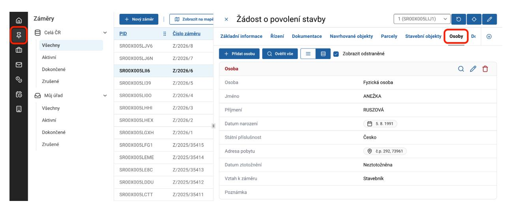

V případě příjmu žádosti datovou schránkou nebo v listinné podobě je třeba postupovat viz. kapitola 9.2.3 Postup pro vytvoření dokumentu doručeného

## 11.2 Účastníci řízení

Nejprve je třeba zobrazit přehled řízení kliknutím na tlačítko Řízení ve vertikálním menu. Pro zobrazení detailu vybraného řízení klikněte na položku z přehledu.

Pro přidání Účastníků řízení klikněte na tlačítko Přidat osobu.

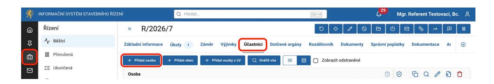

V novém okně vyberte vztah k řízení a zda se jedná o fyzickou osobu, právnickou osobu, anebo fyzickou osobu podnikající.

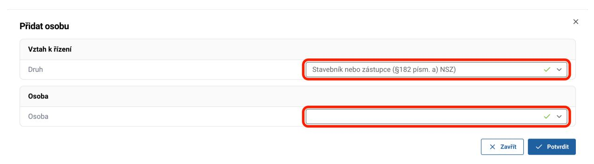

Následně se otevře formulář, do kterého o osobě vyplníte základní údaje. U fyzických osob je nutné zadat jméno, příjmení a datum narození osoby. U fyzických osob podnikajících je nutné zadat jméno, příjmení a IČO a u právnických osob název společnosti a IČO. Po zadání všech relevantních údajů klikněte na tlačítko Potvrdit.

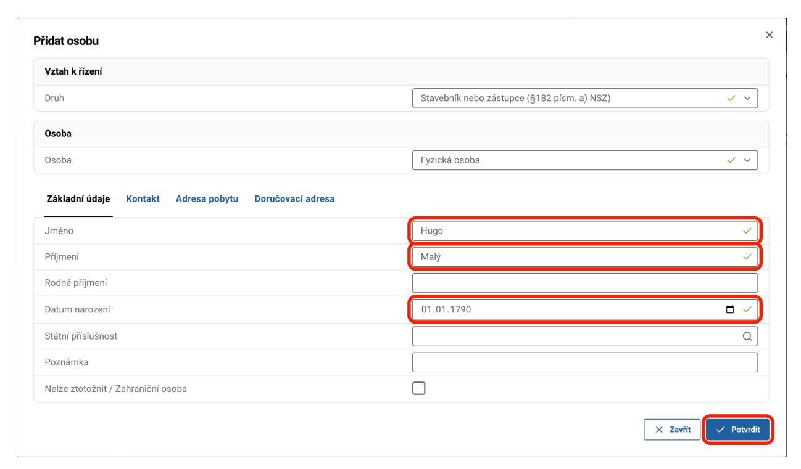

## 11.3 Ověření (ztotožnění) odesílatele/účastníků řízení

Pro ověření vůči základním registrům použijte tlačítko Ověřit osobu.

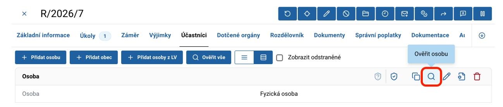

Ověření potvrďte kliknutím na tlačítko Potvrdit.

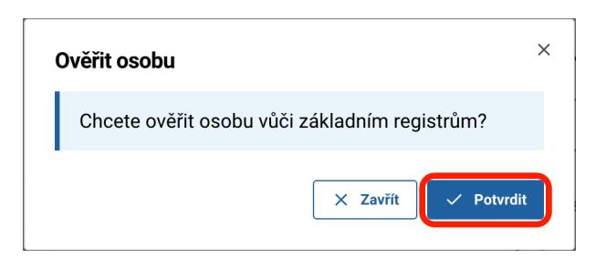

Ztotožněná data zobrazíte kliknutím na tlačítko Zobrazit ztotožněná data.

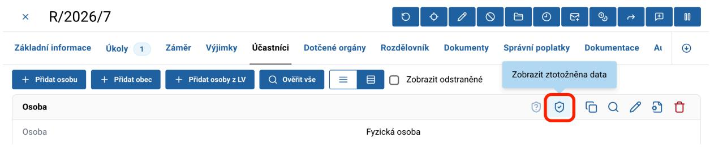

V případě, že chcete převzít data dané osoby ze základních registrů (ověřená data), vyberte

ikonu Zkopírovat ověřená data do řízení. Poté se Vám zobrazí okno, kde zaškrtnete checkbox, že chcete zkopírovat ověřená data do řízení a potvrdíte.

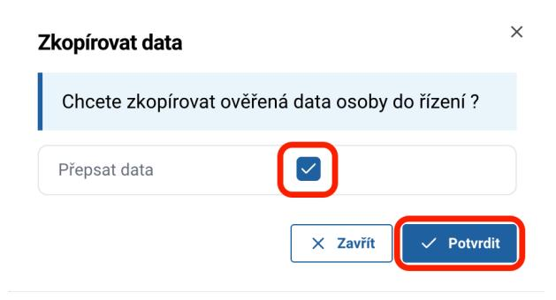

Tímto krokem dojde k přepisu údajů osoby ze záměru údaji ze základních registrů. Tento krok doporučujeme k eliminaci chybně zadaných údajů (ať již žadatelem při vyplňování žádosti či úředníkem), a to zejména adres, které pak mají vliv na selhání vypravení dokumentů. Bližší informace najdete v příručce Vypravování dokumentů.

## 11.3.1 Nastavení způsobu komunikace

Pro nastavení nebo změnu způsobu komunikace s účastníky slouží tlačítko Změnit způsob komunikace

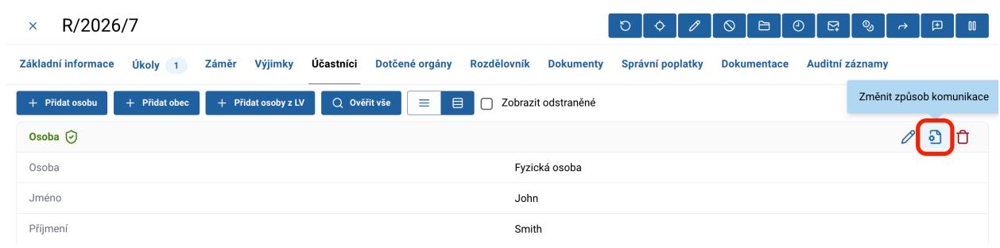

Určit způsob komunikace lze následujícími dvěma způsoby:

- Ručním výběrem
- Automaticky

Pro ruční výběr v dialogovém okně vyberte preferovaný způsob komunikace. V případě výběru jedné z možností doručení poštou následně také vyberte typ poštovní služby.

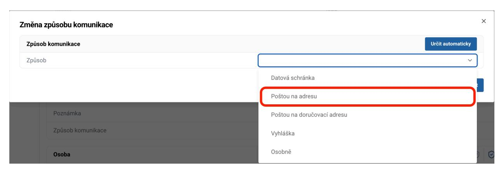

Následně vše potvrďte kliknutím na tlačítko Potvrdit.

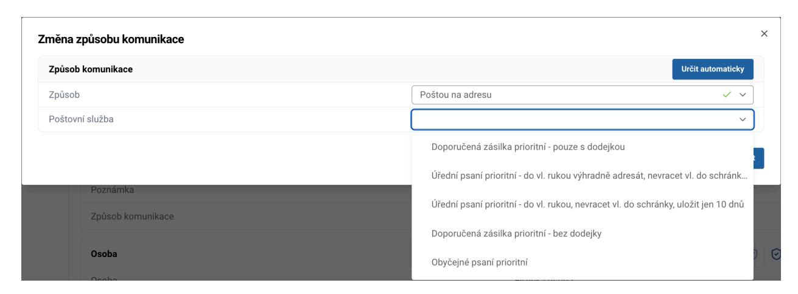

#### *Poznámka:*

Dbejte zvýšené pozornosti při vypravování na zahraniční adresu. Vybírejte pouze z poštovních služeb Doporučená zásilka v EU a Doporučená zásilka svět, ostatní služby jsou určeny pouze pro tuzemské doručování a při jejich výběru dojde k odmítnutí vypravení dokumentu.

Pro automatické určení způsobu komunikace v dialogovém okně klikněte na tlačítko Určit automaticky.

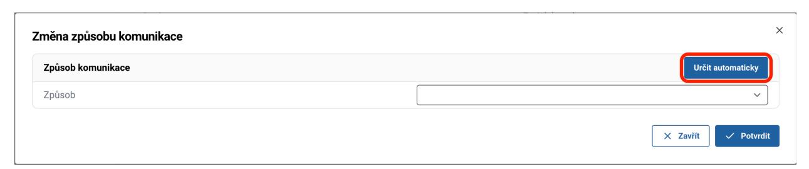

Systém následně vybere nejvhodnější způsob komunikace.

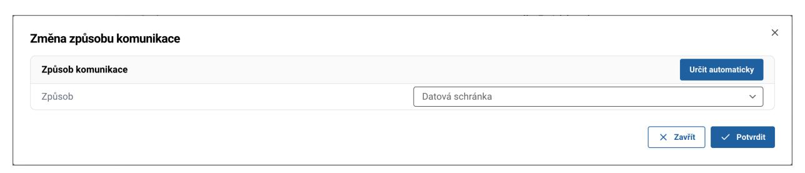

Výběr opět potvrďte tlačítkem Potvrdit.

Více informací a detailů naleznete v samostatné příručce [Vypravování dokumentů](https://mmr.gov.cz/getmedia/7362cfde-dde5-45a0-a9e7-86ea48d229fa/Metodika-vypravovani-dokumentu.pdf.aspx?ext=.pdf).

## 11.3.2 Rozdílná data doplněná ručně vs. z registrů u osob

V systému je implementovaná funkce upozornění na rozdíly mezi daty načtenými z registrů a daty doplněnými uživatelem nebo doručených z Portálu stavebníka. U položek, které se liší od dat z registrů, se zobrazuje ikona vykřičníku. Rozdíl se nevyhodnocuje podle velikosti písmen ani přítomnosti diakritiky.

Kontrola se provádí pro následující údaje:

- druh osoby (FO/FOP/PO),
- jméno, příjmení, rodné příjmení, název, IČ, datum narození, státní příslušnost,
- adresa (obec, část obce, ulice, číslo popisné/evidenční/orientační, PSČ),
- datová schránka.

Funkcionalita je dostupná na těchto místech v ISSŘ:

- záložka Osoby v detailu záměru,
- záložka Účastníci a Dotčené orgány v detailu řízení (včetně oprávněných osob PO),
- záložka Základní informace blok Odesílatel v detailu doručeného dokumentu.

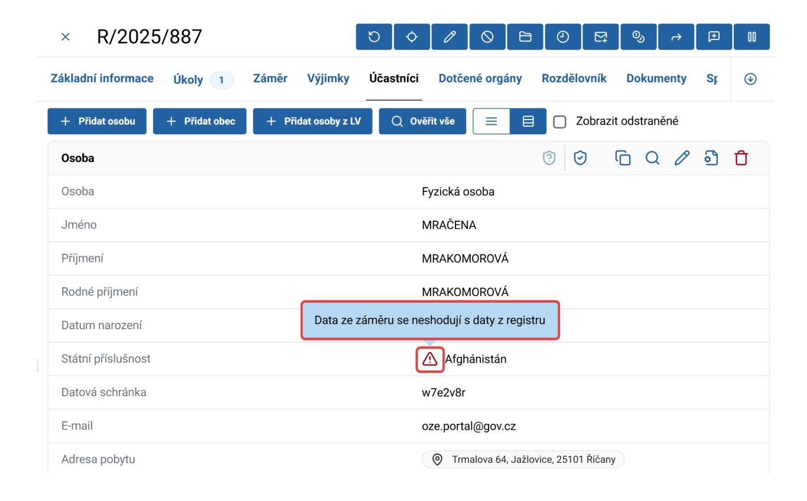

Po ověření osob se primárně zobrazují **data ze záměru**, která jsou doplněna o upozornění. Data nejsou automaticky přepsána na data z registru – uživatel je může převzít kliknutím na tlačítko **"Zkopírovat ověřená data"**.

#### *Upozornění:*

V případě dotčených orgánů se data ověřují vůči nadřazenému orgánu, proto může být po ověření ikona vykřičníku v položce název nebo adresa. Bližší informace lze najít v [Metodice](https://mmr.gov.cz/getmedia/7362cfde-dde5-45a0-a9e7-86ea48d229fa/Metodika-vypravovani-dokumentu.pdf.aspx?ext=.pdf)  [vypravování](https://mmr.gov.cz/getmedia/7362cfde-dde5-45a0-a9e7-86ea48d229fa/Metodika-vypravovani-dokumentu.pdf.aspx?ext=.pdf).

#### *Upozornění*:

Při vytvoření osoby v záměru na základě podání žádosti v Portálu stavebníka vyplní u fyzických osob položku název. Tuto položku lze ale v ISSŘ vyplnit pouze u fyzických podnikajících a právnických osob. Jelikož fyzické osoby nemají tuto položku v registrech, systém upozorní uživatele na tento nesoulad v detailu záměru, záložce Osoby, v tabulkovém režimu. V současné době není možné tuto položku u fyzických osob v ISSŘ editovat.

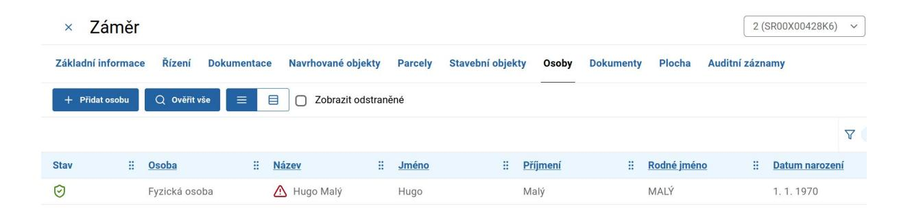

## 11.4 Ověření zesnulé osoby

Po ověření osob u řízení, v případě, že bude mezi účastníky zesnulá osoba, se u této osoby automaticky zobrazí pole Datum úmrtí s vyplněným datem. Uživatel je navíc na tuto skutečnost upozorněn pomocí ikony s vykřičníkem a vysvětlující hláškou. Systém na tuto skutečnost prověřuje pouze k okamžiku ověřování.

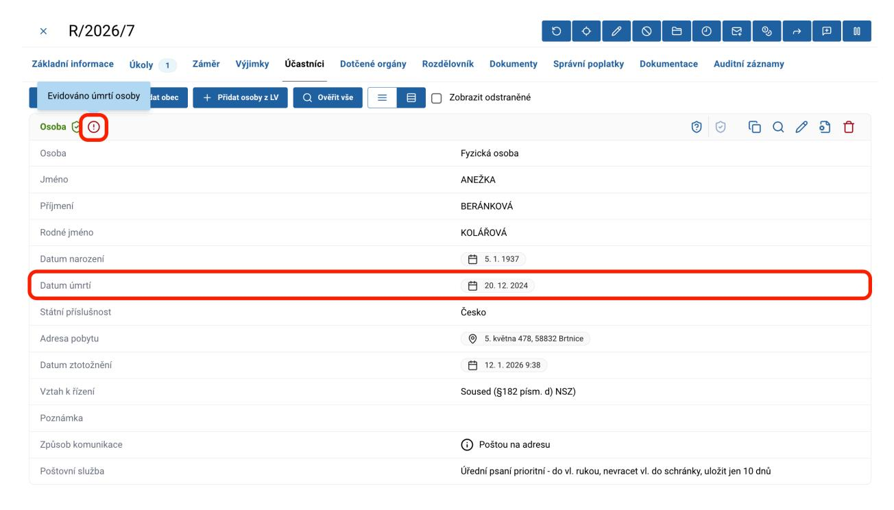

Pokud je při ověření FO zjištěno, že je u osoby evidováno úmrtí, je tato skutečnost viditelná již v defaultním zobrazení osoby, nikoli pouze ve ztotožněných datech. Informace je taktéž zobrazena při rozkliknutí oprávněné osoby PO. Upozornění na evidenci úmrtí je zobrazeno pomocí stejné ikony a textace, jaká je již používána ve ztotožněných datech.

Po kliknutí na oprávněnou osobu se zobrazí dialog s náhledem oprávněné osoby včetně informace o evidenci úmrtí.

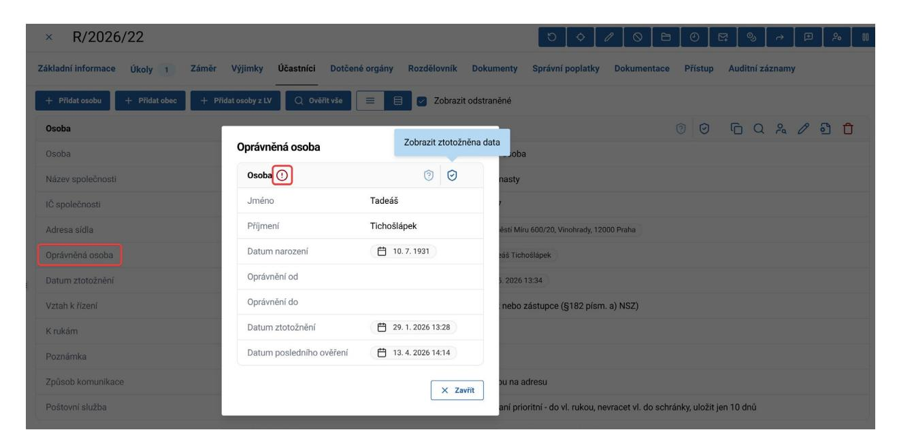

## 11.5 Odebrání účastníka z řízení

Pokud chcete osobu z řízení odebrat, klikněte na Odebrat osobu.

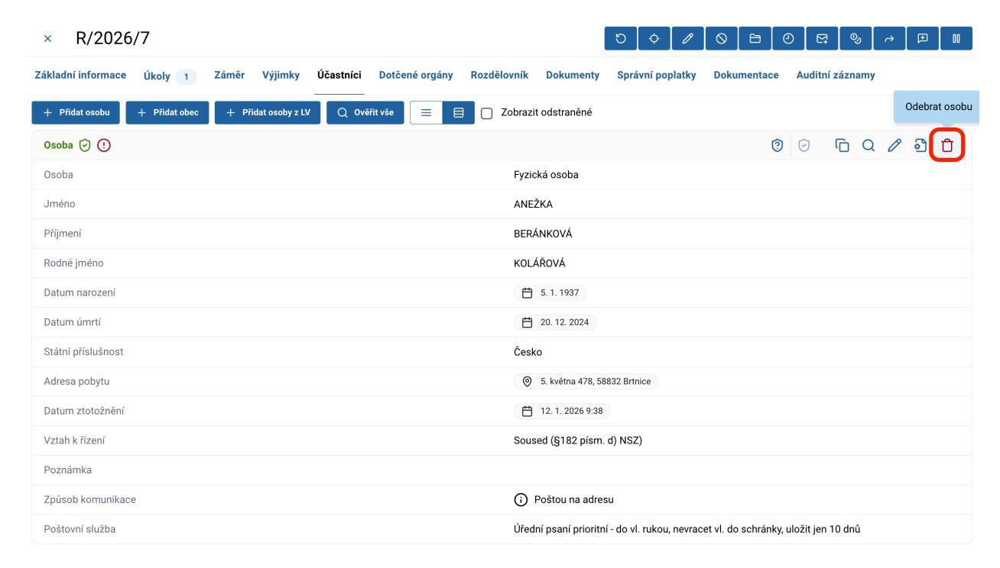

V dialogovém okně poté klikněte na tlačítko Potvrdit.

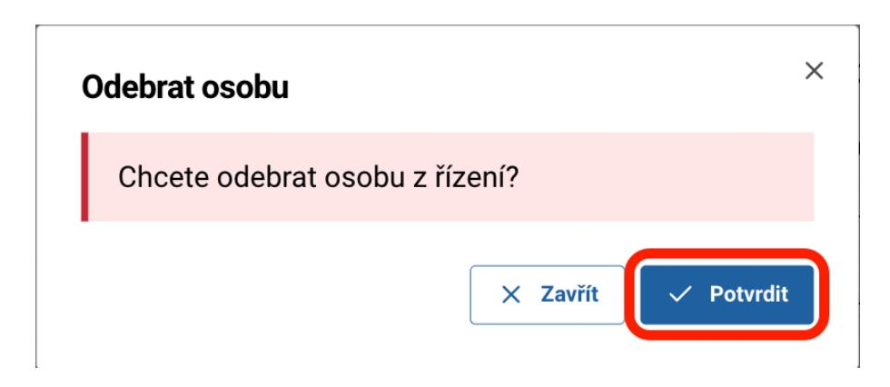

## 11.6 Zobrazení a obnovení odstraněných účastníků řízení

Účastníky řízení můžete v případě potřeby odebrat kliknutím na tlačítko Odebrat osobu a následným potvrzením.

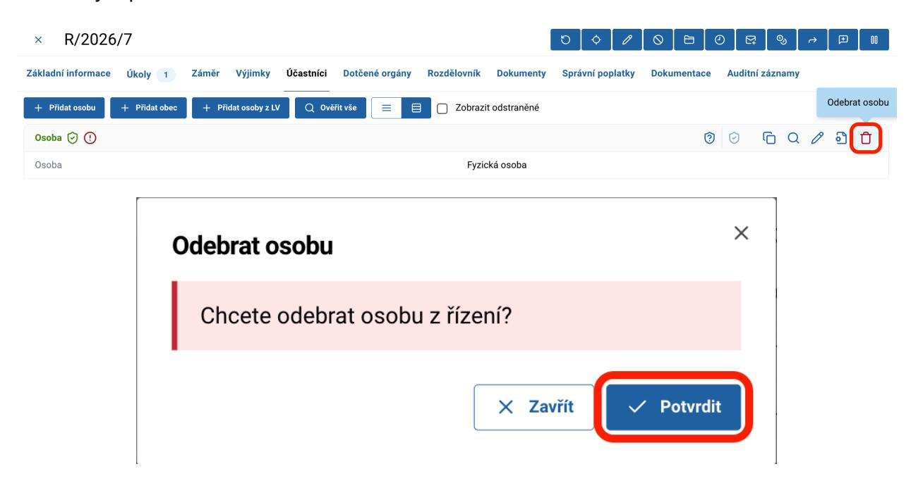

Odebrané účastníky řízení si můžete zobrazit zaškrtnutím možnosti "Zobrazit odstraněné". Odebrané osoby budou podbarveny červeně.

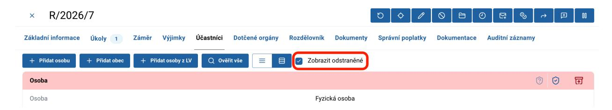

Odebrané účastníky řízení můžete obnovit kliknutím na tlačítko Obnovit osobu a následným potvrzením.

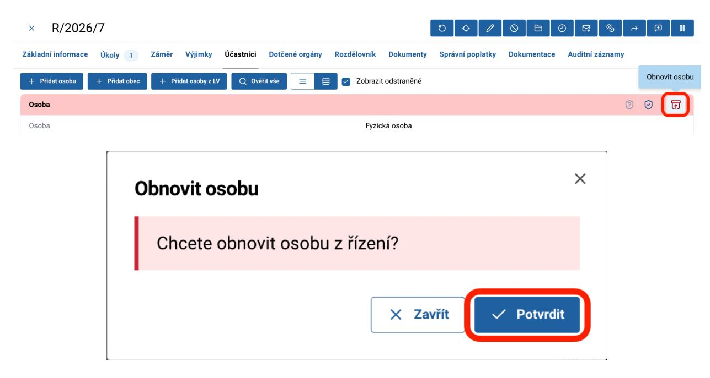

## 11.7 Ověření osob se shodným jménem a datem narození

V případě, kdy je v řízení více osob se shodným jménem a datem narození je nejprve potřeba ověřit adresu. Klikněte na Adresu pobytu.

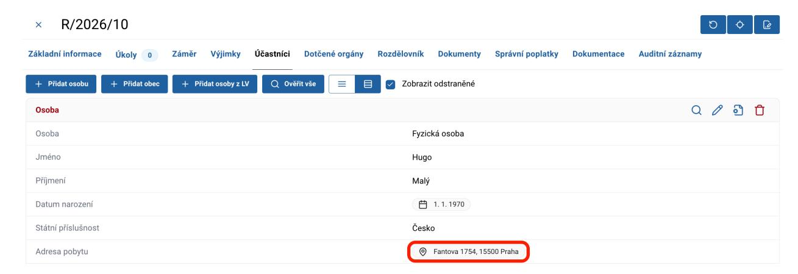

Otevře se nové okno a v něm klikněte na tlačítko Ověřit adresu.

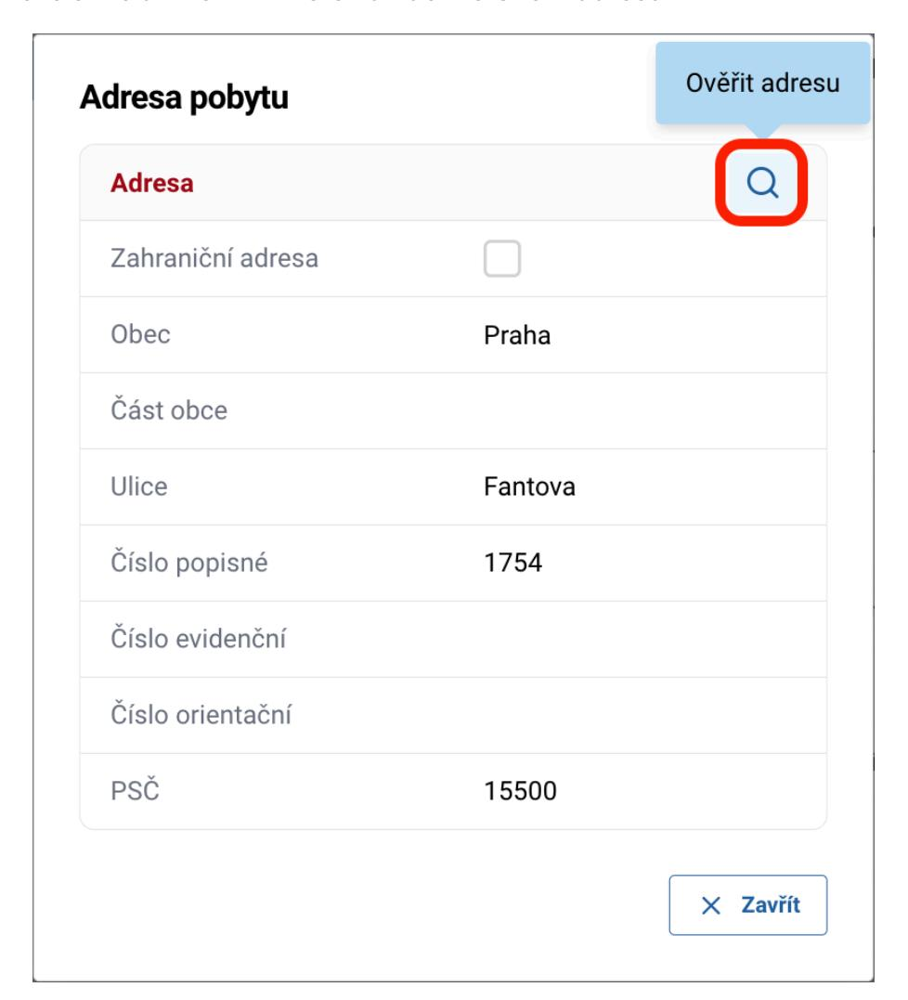

Pro ověření adresy pobytu klikněte na tlačítko Potvrdit.

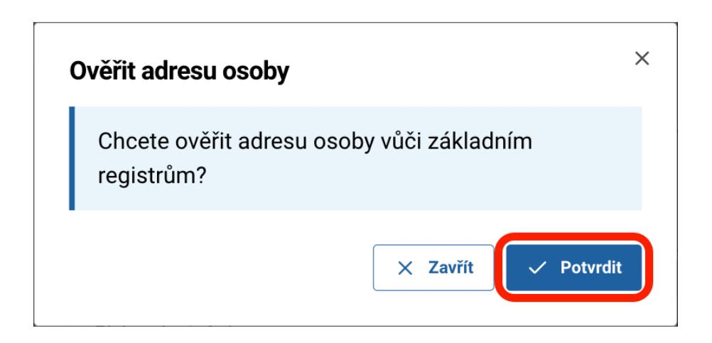

Po ověření adresy můžete okno zavřít.

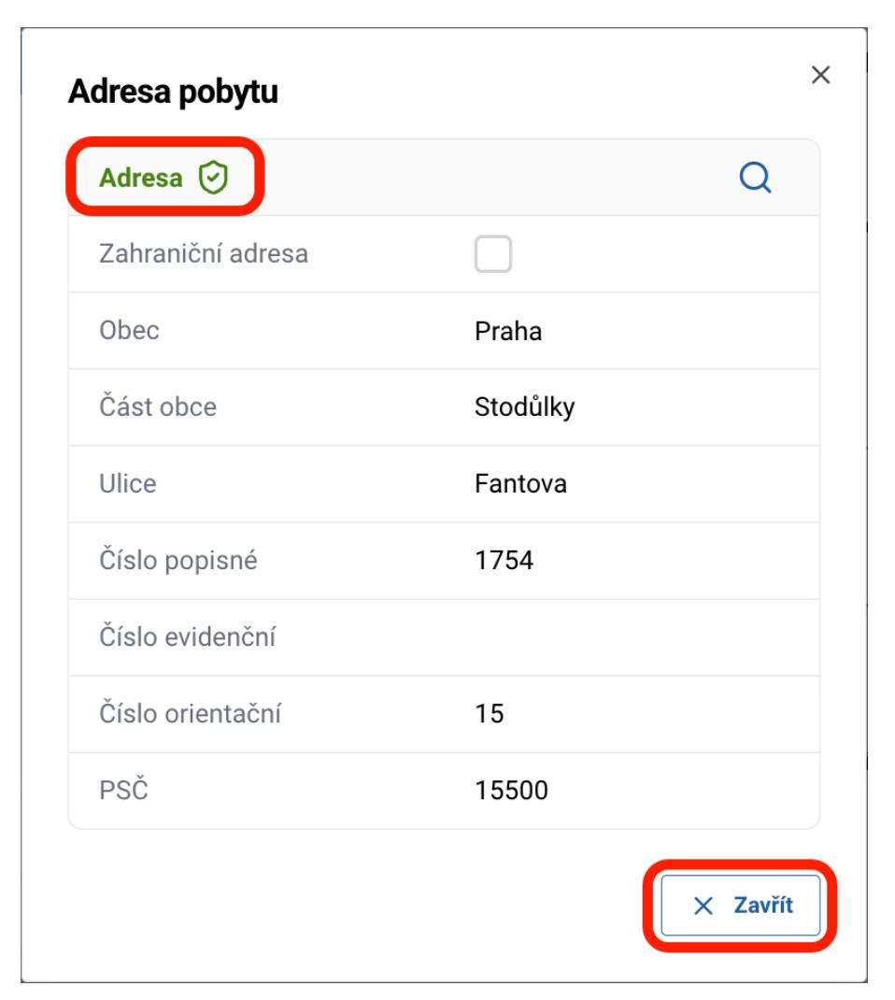

Poté pokračujte v ověření osoby standardním způsobem kliknutím na tlačítko Ověřit osobu.

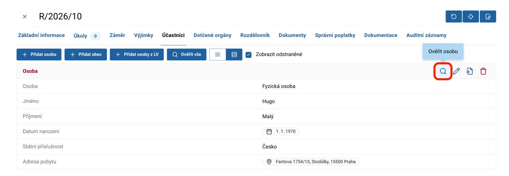

V novém okně potvrďte ověření osoby kliknutím na tlačítko Potvrdit.

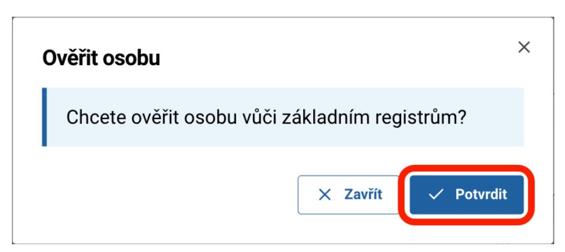

## 11.8 Podpora pro udělení výjimky ověření (ztotožnění) osob (zejména pro zahraniční osoby)

Může nastat situace, kdy je v rámci řízení třeba komunikovat s osobami, které nelze ověřit vůči základním registrům. V takovém případě je třeba využít následující postup.

U příslušného řízení přejděte na záložku Účastníci a klikněte na tlačítko Přidat osobu.

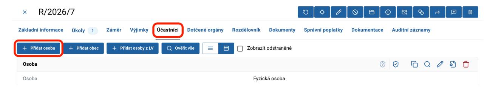

V zobrazeném formuláři vyplňte vztah osoby k řízení a vyberte, zda se jedná o fyzickou, právnickou či fyzickou osobu podnikající. V tomto případě vyberte fyzickou osobu.

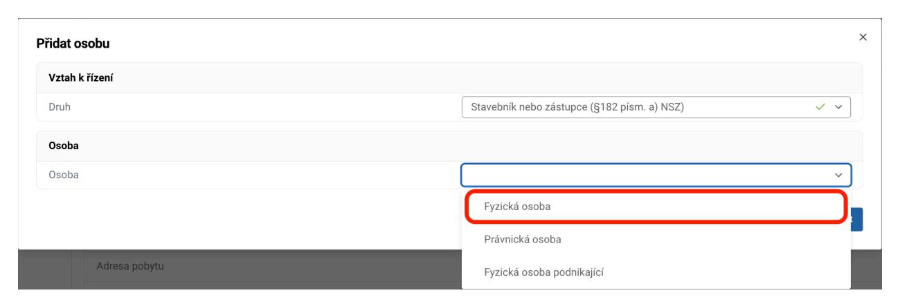

Vyplňte její jméno a datum narození. Zcela dole zaškrtněte políčko "Nelze ztotožnit / Zahraniční osoba".

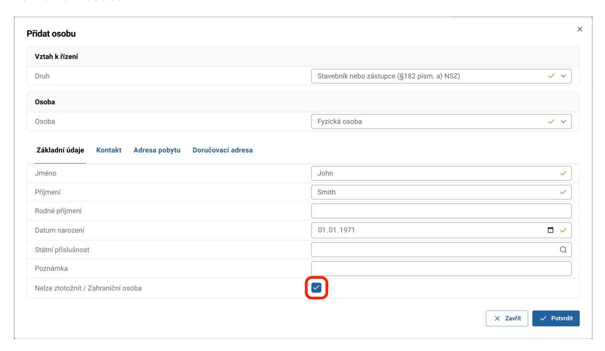

V záložce Kontakt vyplňte adresu datové schránky a potvrďte kliknutím na tlačítko Potvrdit.

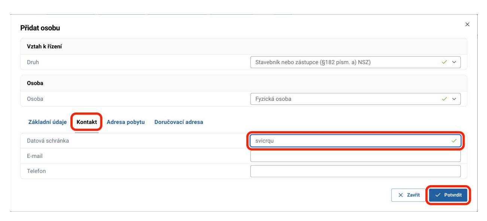

V záložce Účastníci je vložena nová osoba, u které není zobrazeno tlačítko Ověřit osobu a v kolonce Datum ztotožnění je uvedeno "Nelze ztotožnit". Tento stav je však správný.

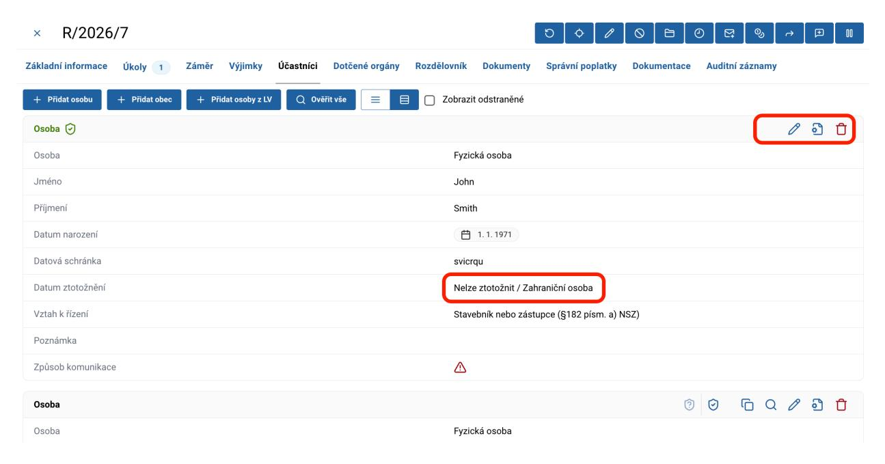

Pokud potřebujete odeslat písemnost prostřednictvím poskytovatele poštovních služeb, vyberte některou z možností způsobů komunikace pomocí tlačítka Změnit způsob komunikace - více informací naleznete v kapitole [11.3.1 Nastavení způsobu komunikace](https://mmrcz.sharepoint.com/:w:/r/sites/Koordinacepodpory/Sdilene%20dokumenty/General/ISS%C5%98%20p%C5%99%C3%ADru%C4%8Dka/ISSR_Obecna_Prirucka_v1.4_WIP-3.docx?d=wc7dbbf3f558d43ecb5c4a7d796d4224f&csf=1&web=1&e=rqrIfd&nav=eyJoIjoiMjA2MzgwMDcyNiJ9)

Pro vyplnění doručovací adresy klikněte na tlačítko Upravit osobu.

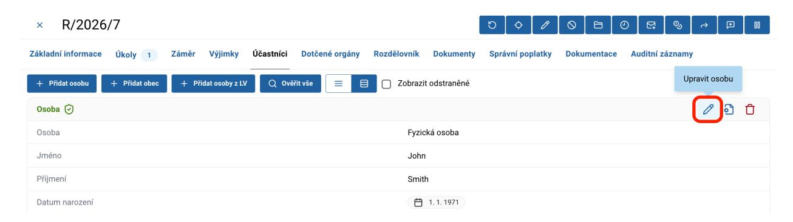

V záložce Adresa pobytu zaškrtněte políčko "Zahraniční adresa" a vyplňte adresu do příslušného formuláře. Poté klikněte na tlačítko Potvrdit.

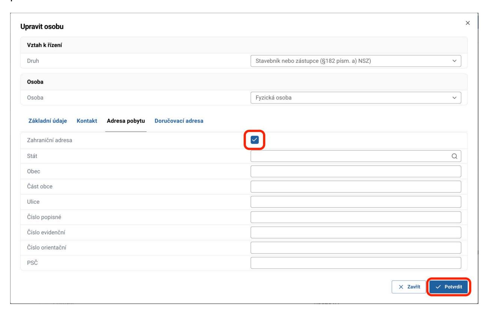

## 11.9 Ověření oprávněné osoby právnické osoby

Pro ověření oprávněné osoby právnické osoby, která je přidána jako účastník řízení, je nutné kliknout na tlačítko Ověřit oprávněnou osoby v kartě daného účastníka řízení.

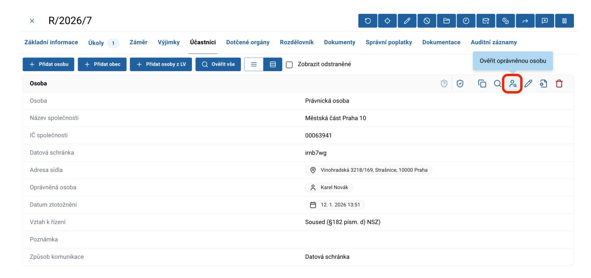

Následně je nutné potvrdit dialogové okno.

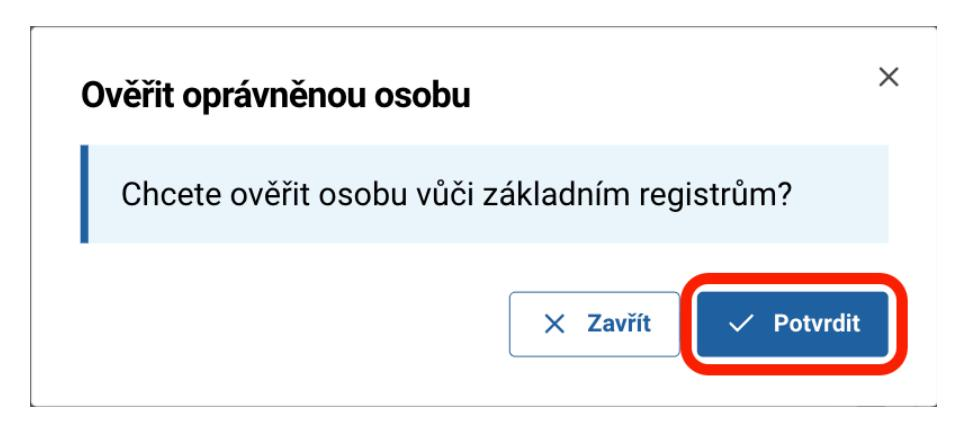

## 11.10 Hromadné ověření osob v řízení

Přidané účastníky řízení je možné ověřit hromadně pomocí tlačítka Ověřit vše.

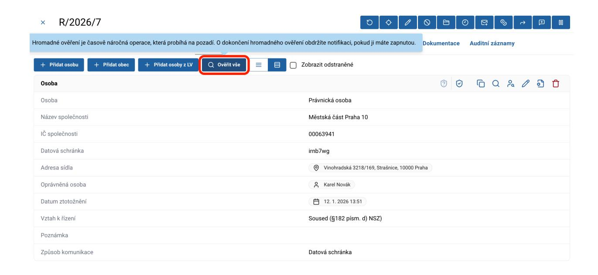

Po kliknutí na toto tlačítko se objeví dialogové okno a jeho potvrzením spustíte hromadné ověření.

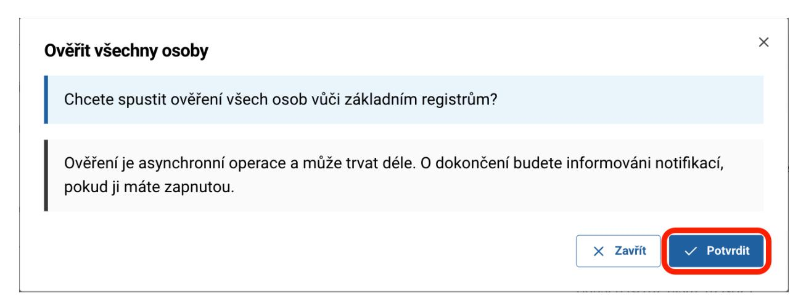

Podle počtu účastníků může hromadné potvrzení trvat delší dobu. O skončení procesu je uživatel informován notifikací, pokud ji má nastavenou.

Hromadným ověřením účastníků dojde zároveň ke zkopírování jejich dat z registrů do dat ze záměru. **Hromadné potvrzení účastníků neověří oprávněné osoby právnických osob, které jsou přidané jako účastníci řízení. Toto je nutné provést manuálně.**
