## **Obecná příručka**

# **Informační systém stavebního řízení**

#### Obsah

| 1 |    | Úvo  | od    |                                            | 9  |
|---|----|------|-------|--------------------------------------------|----|
| 2 |    | Přih | ıláše | ení do ISSŘ a nastavení uživatelského účtu | 10 |
|   | 2. | .1   | Přih  | ılášení                                    | 10 |
|   | 2. | .2   | Nas   | stavení účtu                               | 11 |
|   |    | 2.2  | .1    | Postup nastavení notifikací                | 12 |
|   |    | 2.2  | .2    | Uživatelské nastavení                      | 14 |
| 3 |    | Zák  | ladr  | ní orientace v ISSŘ                        | 16 |
|   | 3. | .1   | Pop   | ois horní lišty                            | 17 |
|   |    | 3.1  | .1    | Vyhledávání                                | 17 |
|   |    | 3.1  | .2    | Notifikace (oznámení)                      | 18 |
|   |    | 3.1  | .3    | Uživatel                                   | 19 |
|   | 3. | .2   | Pop   | ois levé lišty = hlavní menu               | 19 |
|   |    | 3.2  | .1    | Nástěnka                                   | 20 |
|   |    | 3.2  | .2    | Záměry                                     | 20 |
|   |    | 3.2  | .3    | Řízení                                     | 21 |
|   |    | 3.2  | .4    | Dokumenty                                  | 22 |
|   |    | 3.2  | .5    | Správní poplatky                           | 23 |
|   |    | 3.2  | .6    | Úkoly                                      | 23 |
|   |    | 3.2  | .7    | Stavební objekty (stávající stavby)        | 24 |
|   | 3. | .3   | Filtr | rování                                     | 25 |
| 4 |    | Nás  | stěn  | ka                                         | 32 |
| 5 |    | Zán  | něry  |                                            | 36 |
|   | 5. |      |       | ožky detailu záměru                        |    |
|   |    | 5.1  | .1    | Základní informace                         | 38 |
|   |    | 5.1  | .2    | Řízení                                     | 38 |
|   |    | 5.1  | .3    | Dokumentace                                | 39 |
|   |    | 5.1. | .4    | Navrhované objekty (záměru)                | 65 |

|   | ,   | 5.1.5  | Parcely                                             | 71  |
|---|-----|--------|-----------------------------------------------------|-----|
|   |     | 5.1.6  | Stavební objekty (stávající stavby)                 | 78  |
|   |     | 5.1.7  | Osoby                                               | 84  |
|   |     | 5.1.8  | Dokumenty                                           | 90  |
|   |     | 5.1.9  | Plocha                                              | 91  |
|   |     | 5.1.10 | Auditní záznam                                      | 92  |
|   | 5.2 | 2 Vyh  | ıledání záměru dle ID dokumentace                   | 93  |
|   | 5.3 | 3 Zpř  | ístupnění dokumentace                               | 96  |
| 6 |     | Řízení |                                                     | 98  |
|   | 6.1 | 1 Zálo | ožky detailu řízení                                 | 99  |
|   | (   | 6.1.1  | Základní informace                                  | 99  |
|   |     | 6.1.2  | Úkoly                                               | 101 |
|   |     | 6.1.3  | Záměr                                               | 106 |
|   |     | 6.1.4  | Výjimky                                             | 108 |
|   |     | 6.1.5  | Účastníci                                           | 110 |
|   |     | 6.1.6  | Dotčené orgány                                      | 122 |
|   |     | 6.1.7  | Rozdělovník                                         | 124 |
|   |     | 6.1.8  | Dokumenty                                           | 128 |
|   | (   | 6.1.9  | Správní poplatky                                    | 132 |
|   | (   | 6.1.10 | Dokumentace                                         | 133 |
|   | (   | 6.1.11 | Přístup (Zpřístupnění náhledu do ukončeného řízení) | 134 |
|   | (   | 6.1.12 | Auditní záznamy                                     | 138 |
| 7 |     | Dokum  | enty                                                | 140 |
|   | 7.1 | 1 Zálo | ožky detailu dokumentu                              | 141 |
|   |     | 7.1.1  | Základní informace                                  | 142 |
|   |     | 7.1.2  | Řízení                                              | 143 |
|   |     | 7.1.3  | Rozdělovník                                         | 143 |
|   |     | 7.1.4  | Hlavní dokument                                     | 144 |

|    | 7.1.5 | Přílohy                                                                       | 146 |
|----|-------|-------------------------------------------------------------------------------|-----|
|    | 7.1.6 | Vypravení                                                                  | 147 |
|    | 7.1.7 | Úkoly                                                                      | 157 |
|    | 7.1.8 | Auditní záznamy                                                               | 158 |
|    | 7.2   | Zrušení/storno dokumentu                                                   | 158 |
| 8  |       | Správní poplatky                                                           | 161 |
|    | 8.1   | Záložky detailu správních poplatků                                            | 161 |
|    | 8.1.1 | Základní informace                                                         | 162 |
|    | 8.1.2 | Řízení                                                                        | 163 |
|    | 8.1.3 | Dokumenty                                                                     | 164 |
|    | 8.2   | Vytvoření správního poplatku                                               | 164 |
|    | 8.3   | Změna stavu správního poplatku                                                | 169 |
|    | 8.3.1 | Automatické změny stavuChyba! Záložka není definována.                        |     |
|    | 8.3.2 | Manuální změny stavuChyba! Záložka není definována.                           |     |
|    | 8.4   | Zrušení správního poplatku                                                    | 173 |
|    | 8.5   | Úprava vyplněných údajů správního poplatku                                    | 174 |
| 9  |       | Příjem žádosti a její evidence                                             | 177 |
|    | 9.1   | Příjem žádosti přes Portál stavebníka a její zpracování                       | 178 |
|    | 9.2   | Příjem žádosti prostřednictvím datové schránky či v listinné podobě     | 185 |
|    | 9.2.1 | Záměr již existuje                                                         | 185 |
|    | 9.2.2 | Záměr neexistuje – založení záměru                                      | 186 |
|    | 9.2.3 | Postup pro vytvoření dokumentu doručeného                                     | 187 |
| 10 |       | Posouzení příslušnosti/postoupení spisu                                       | 195 |
|    | 10.1  | Posouzení příslušnosti/postoupení spisu ihned po přijetí žádosti           | 195 |
|    | 10.2  | Postoupení spisu manuálně v průběhu procesu                             | 206 |
| 11 |       | Přidání odesílatele (podatele)/účastníků řízení a jejich ověření (ztotožnění) | 212 |
|    | 11.1  | Odesílatel (podatel) žádosti                                               | 212 |
|    |       |                                                                               |     |

| 11.3           | Ověření (ztotožnění) odesílatele/účastníků řízení  213                         |  |  |
|----------------|--------------------------------------------------------------------------------------|--|--|
| 11.4           | Ověření zesnulé osoby 219                                                         |  |  |
| 11.5           | Odebrání účastníka z řízení 220                                                   |  |  |
| 11.6           | Zobrazení a obnovení odstraněných účastníků řízení  221                        |  |  |
| 11.7           | Ověření osob se shodným jménem a datem narození  222                           |  |  |
| 11.8 osoby) | Podpora pro udělení výjimky ověření (ztotožnění) osob (zejména pro zahraniční 225 |  |  |
| 11.9           | Ověření oprávněné osoby právnické osoby  228                                   |  |  |
| 11.10          | Hromadné ověření osob v řízení  229                                            |  |  |
| 12             | Vytvoření rozdělovníku/ů  231                                                  |  |  |
| 12.1           | Vytvoření rozdělovníku v detailu nově vytvořeného vlastního dokumentu  231     |  |  |
| 12.2           | Vytvoření rozdělovníku v detailu dokumentu k běžícímu řízení 235                  |  |  |
| 13             | Ověření (ztotožnění) navrhovaných objektů, parcel a staveb v záměru 240           |  |  |
| 14             | Vyjádření a závazná stanoviska dotčených orgánů  243                           |  |  |
| 15             | Tvorba vlastního dokumentu  250                                                |  |  |
| 15.1           | Vytvoření dokumentu  250                                                       |  |  |
| 15.1.1         | Druhy vlastních dokumentů 250                                                     |  |  |
| 15.1.2         | Vytvoření dokumentu v řízení 250                                                  |  |  |
| 15.1.3         | Vytvoření dokumentu mimo řízení 254                                               |  |  |
| 15.2           | Přidání obsahu hlavního dokumentu 258                                             |  |  |
| 15.2.1         | Přidání a editace strukturovaného obsahu pomocí šablon 259                        |  |  |
| 15.2.2         | Přidání vlastního hlavního dokumentu 270                                          |  |  |
| 15.3           | Přílohy vlastního dokumentu 271                                                   |  |  |
| 15.4           | Zpracování vlastního dokumentu  271                                            |  |  |
| 15.5           | Podepsání dokumentu pomocí iQSigner (V aplikaci) 279                              |  |  |
| 15.5.1         | Vložit podpis 279                                                                 |  |  |
| 15.5.2         | Podepsat  283                                                                  |  |  |
| 15.5.3         | Náhled podpisu  284                                                            |  |  |
| 16             | Přerušení řízení  288                                                          |  |  |

| 16.1 | Automatické přerušení řízení                          | 288 |
|------|----------------------------------------------------------|-----|
| 16.2 | Manuální přerušení řízení                                | 291 |
| 17   | Vyznačení nabytí právní moci                          | 294 |
| 17.1 | Manuální proces vyznačení nabytí právní moci u Dokumentů | 294 |
| 17.2 | Automatický proces vyznačení nabytí právní moci u Řízení | 296 |

## Verze dokumentu

| Číslo verze | Datum      | Změny                                                                               |
|-------------|------------|-------------------------------------------------------------------------------------|
| 1.0         | 26.6.2024  | První vydání                                                                        |
| 1.1         | 02.08.2024 | Aktualizovaná verze s rozšířením                                                 |
| 1.2         | 21.08.2024 | Editace:                                                                            |
|             |            | 4. Záměr – Hromadné ověření osob, parcel, navrhovaných staveb, stavebník objektů |
|             |            | 5. Řízení – Přidání osob z LV, hromadné ověření účastníků                        |
|             |            | 6. Dokumenty – Vypravení – Kontrola vypraveného obsahu, Zobrazení doručenky      |
|             |            | Nové kapitoly:                                                                      |
|             |            | 16. Postup pro přerušení řízení                                                     |
|             |            | 17. Postup pro vyznačení nabytí právní moci                                         |
|             |            | 18. Postup pro opětovné vypravení dokumentu                                         |
|             |            | 19. Postup pro doplnění dat ze záměru, řízení a dokumentu                           |
| 1.3         | 9.9.2025   | Kompletní revize dokumentu                                                          |
| 1.4         | 26.4.2025  | Doplnění funkcionalit z Release Notes (od 86 do 94.4HF)                       |

## Použité zkratky

| Zkratka       | Název                                                                      |
|---------------|----------------------------------------------------------------------------|
| ISSŘ          | Informační systém stavebního řízení                                        |
| PS            | Portál stavebníka                                                          |
| SÚ            | Stavební úřad                                                              |
| DO            | Dotčené orgány                                                             |
| BPP           | Balíček projektové dokumentace (formát pro přenos dokumentace)             |
| PID           | Persistentní identifikátor (dokument, řízení, záměr)                       |
| ZS            | Závazné stanovisko                                                         |
| JES           | Jednotné environmentální stanovisko                                        |
| ZFO           | Formát elektronické doručenky datové schránky                              |
| HKP           | Hromadná konverzní pošta                                                   |
| IČS           | Identifikační číslo stavby                                                 |
| JIP/KAAS      | Jednotný identitní prostor / Katalog autentizačních a autorizačních služeb |
| NIA           | Národní identitní autorita                                                 |
| FO / PO / FOP | Fyzická osoba / Právnická osoba / Fyzická osoba podnikající                |

## 1 Úvod

Vítejte v příručce Informačního systému stavebního řízení (ISSŘ) pro stavební úřady a dotčené orgány. Cílem této příručky je poskytnout Vám ucelený a přehledný pohled na funkcionality systému, které jsou klíčové pro Vaši každodenní práci. ISSŘ je moderní platforma, která má za cíl zefektivnit a zjednodušit procesy.

I když je tato příručka se svými více než 200 stranami obsáhlá, je koncipována tak, aby vám pomohla se v systému rychle zorientovat. Každý modul je detailně popsán a doplněn o názorné zobrazení jednotlivých funkcionalit tak, aby byly procesy popsány logicky a pochopitelně.

Systém ISSŘ je živý systém, který stále prochází vývojem a vylepšením. Aktuální změny a vývoj jsou zapracovávány do této příručky v jednotlivých verzích. Pro nejaktuálnější informace a novinky doporučujeme pravidelně sledovat oficiální webové stránky Ministerstva pro místní rozvoj ČR, kde naleznete další informace, příručky a metodiky.

V případě jakýchkoli problémů či nejasností můžete využít dostupnou podporu. Kontaktní údaje na podporu systémů naleznete na webových stránkách Ministerstva pro místní rozvoj ČR.

## 2 Přihlášení do ISSŘ a nastavení uživatelského účtu

## 2.1 Přihlášení

Pro vstup do systému klikněte na odkaz[: https://ais.stavebnisprava.gov.cz/](https://ais.stavebnisprava.gov.cz/). Účet Vám musí zřídit Váš úřad (lokální administrátor). Ten Vám také nastaví roli, v rámci které budete mít oprávnění v systému pracovat. Přístupová role opravňuje úředníky vykonávat agendu stavebního řízení v rámci jejich pracovního zařazení (popis funkcionalit přístupných pro jednotlivé role najdete v příručce lokálního administrátora). Jakmile budete mít zřízený účet, vyberete možnost přihlásit se přes JIP/KAAS.

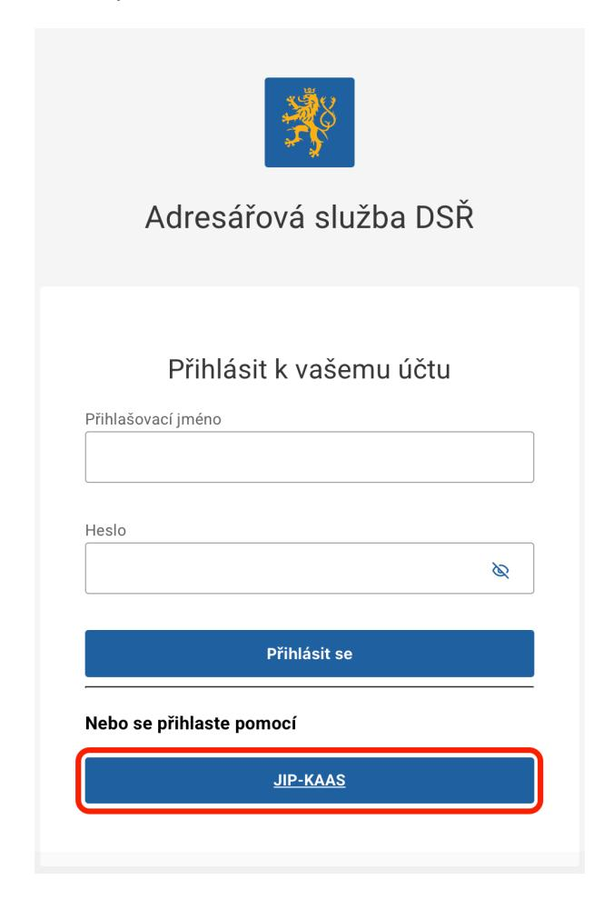

Po úspěšném přihlášení se dostanete na úvodní stránku ISSŘ.

## 2.2 Nastavení účtu

V uživatelském účtu je možné nastavit různé kombinace upozornění (notifikací) přímo v aplikaci ISSŘ a prostřednictvím emailu podle potřeb každého uživatele. Notifikace lze zapnout/vypnout individuálně v nastavení uživatelského účtu. E-mailové notifikace jsou v primárním nastavení vypnuty. Pakliže chcete dostávat e-mailové notifikace, je potřeba je aktivovat.

Upozornění: Pro fungování emailových notifikací je potřebné mít správně nastavenou emailovou adresu daného uživatele. Pro postup nastavení notifikací přejděte na 2.2.1 Postup nastavení notifikací.

Celkový seznam notifikací:

#### **Emailové notifikace:**

- selhání vypravení dokumentu
- příchozích dokumentů přijatých z Portálu stavebníka/centrální podatelny pro SÚ i DO
- notifikace při interním předání či postoupení SÚ i DO Upozornění: Notifikace nepřijde v případě postoupení u řízení, které bylo založeno před datem 16.5.2025.
- notifikace při změně zpracovatele žádosti
- notifikace při změně zpracovatele řízení

#### **Notifikace v aplikaci (ikona zvonečku):**

- selhání vypravení dokumentu
- notifikace při interním předání či postoupení SÚ i DO
- hromadné ověření dokončeno (pro hromadné ověření osob, parcel, stavebních objektů a navrhovaných stavebních objektů v záměru, anebo účastníků v řízení)
- nový BPP balíček byl vytvořen (týká se pouze vytvoření nového BPP balíčku úředníkem v ISSŘ. Nejedná se o vložení BPP balíčku stavebníkem/zástupcem prostřednictvím Portálu stavebníka)
- upozornění na nový úkol

- ověření dokumentace dokončeno
- udělení a odebrání přístupu k řízení
- postoupení spisu řízení
- změna zpracovatele dokumentu
- změna zpracovatele spisu řízení

## 2.2.1 Postup nastavení notifikací

V pravém horním rohu klikněte na uživatelské jméno a poté vyberete možnost "Uživatelský účet". Zobrazí se vám informace o daném uživateli.

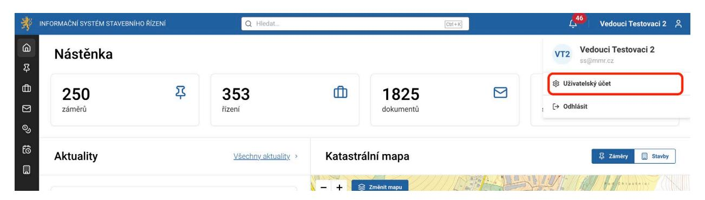

V části "Nastavení notifikací" kliknete na tlačítko "Změnit nastavení".

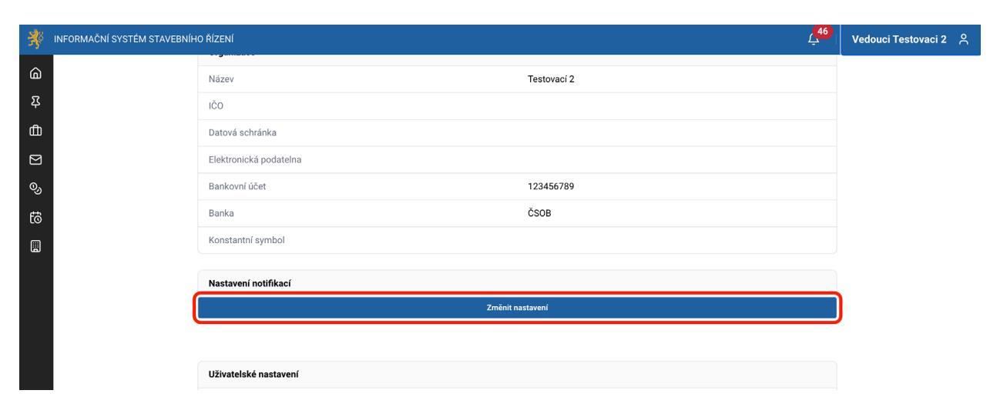

V otevřeném okně je možné měnit nastavení pro jednotlivé typy notifikací. Nastavení notifikací uložíte stisknutím tlačítka Potvrdit.

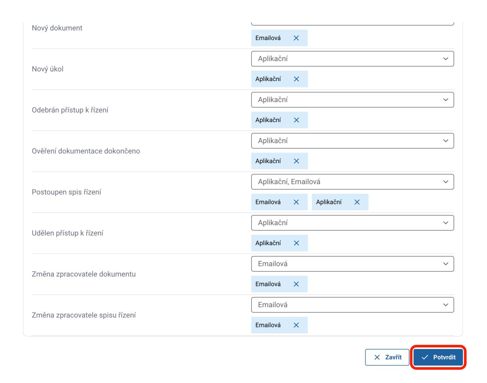

Systém momentálně nabízí nastavení notifikací pro následující situace:

- Doručení vypravení selhalo v případě kdy z jakéhokoliv důvodu dojde u dokumentu k selhání jeho doručení adresátovi. Notifikaci lze nastavit jak emailovou, tak aplikační.
- Hromadné ověření dokončeno v případě, kdy je zadáváno hromadné ověření osob, stavebních objektů a dalších může tato operace, obzvláště při ověření více subjektů, trvat déle. Proto byla vytvořena možnost se o dokončení ověření notifikovat. Notifikaci lze nastavit pouze aplikační.
- Nový BPP balíček byl vytvořen v případě, že vytváříte v záměru nový BPP balíček, jedná se o časově náročnou operaci. Proto byla vytvořena možnost se o dokončení vložení BPP balíčku nechat notifikovat. Notifikaci lze nastavit pouze aplikační.

- Nový dokument upozorní, že byl vytvořen nebo doručen nový dokument do řízení. Notifikace je pouze aplikační.
- Nový úkol upozorní, že vznikl nový úkol ke zpracování. Notifikace je pouze aplikační.
- Odebrán přístup k řízení v případě, že jste měli přidělen nebo jste si vyžádali přístup k řízení, notifikace slouží k informaci, že k řízení již nemáte přístup. Notifikace je pouze aplikační.
- Ověření dokumentace dokončeno ověřování dokumentace je časově náročný proces, proto o jeho dokončení můžete být informováni notifikací. Notifikace je pouze aplikační.
- Postoupen spis řízení v případě, že úřadu byl postoupen spis z úřadu jiného, lze nastavit notifikaci, která na toto upozorní. Notifikaci lze nastavit aplikační i emailovou.
- Udělen přístup k řízení v případě, že vyžádáte přístup k řízení, notifikace upozorní, že přístup byl udělen. Notifikaci lze nastavit pouze aplikační.
- Změna zpracovatele dokumentu upozorní na změnu zpracovatele u již vytvořeného dokumentu. Notifikace je pouze emailová.
- Změna zpracovatele spisu řízení v případě, že chcete být informováni o změnách zpracovatele na přiřazených řízeních. Notifikaci lze nastavit pouze emailovou.

#### *Poznámka:*

Pro správné fungování notifikačních e-mailů v ISSŘ je nezbytné, aby měl uživatel vyplněnou platnou e-mailovou adresu v systému JIP/KAAS.

Pokud se uživatel přihlašuje do ISSŘ prostřednictvím JIP/KAAS a e-mail není v tomto systému uveden, při přihlášení do ISSŘ dojde k odstranění e-mailové adresy i z jeho profilu v ISSŘ, a to i v případě, že tam byla dříve ručně zadána.

### 2.2.2 Uživatelské nastavení

Evidence v systému má uložené nastavení pro jednotlivé uživatele. Například, pokud uživatel změní rozložení sloupců, přidá filtr, nebo změní řazení, pak si systém tato nastavení pro konkrétního uživatele zapamatuje. Nastavení bude uloženo v tabulce uživatelského nastavení

Uživatelské nastavení zůstává obvykle zachováno i v případech, kdy s vývojem přibude sloupec, nebo se změní typ a podobně. Po některých větších změnách systému však může dojít ke ztrátě některého uživatelského nastavení a je potřeba, aby si uživatel nastavil své rozhraní znovu.

Nastavení lze resetovat jednotlivě nebo hromadně pomocí tlačítek Obnovit a Obnovit výchozí nastavení.

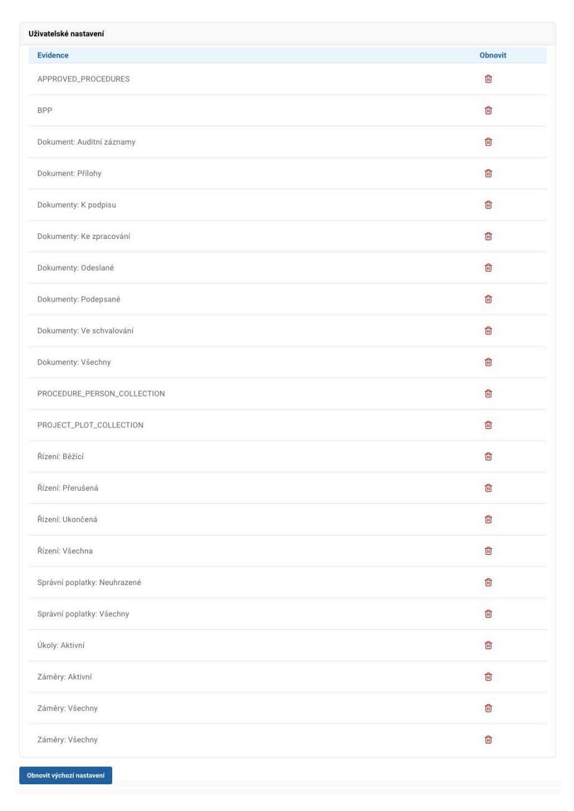

## 3 Základní orientace v ISSŘ

Po přihlášení do webové aplikace se zobrazí úvodní stránka neboli Nástěnka.

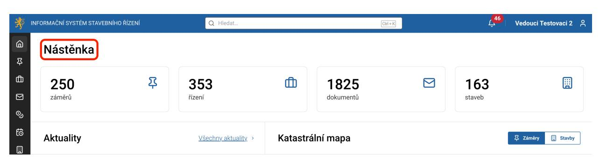

Na Nástěnce naleznete základní statistické údaje o záměrech, řízeních, dokumentech a stavbách v systému. Pod těmito údaji je rovněž Katastrální mapa, která zobrazuje záměry realizované v ISSŘ.

Na úvodní stránce (Nástěnka) jsou čísla vztažena ke konkrétnímu úřadu uživatele, což zajišťuje větší přehlednost a relevantnost zobrazených údajů.

- Záměry počet záznamů v evidenci *Záměry → Můj úřad*
- Řízení počet záznamů v evidenci *Řízení*.
- Dokumenty počet záznamů v evidenci *Dokumenty*,
- Stavby počet záznamů v evidenci Stavby

Poslední částí Nástěnky jsou Aktuality, prostřednictvím kterých jsou sdělovány důležité informace týkající se systému.

Nástěnka obsahuje 10 nejnovějších aktualit. Jakmile jich je více než 10, zobrazí se pod nimi tlačítko "Zobrazit všechny", které kliknutím přesměruje úředníka na Všechny aktuality.

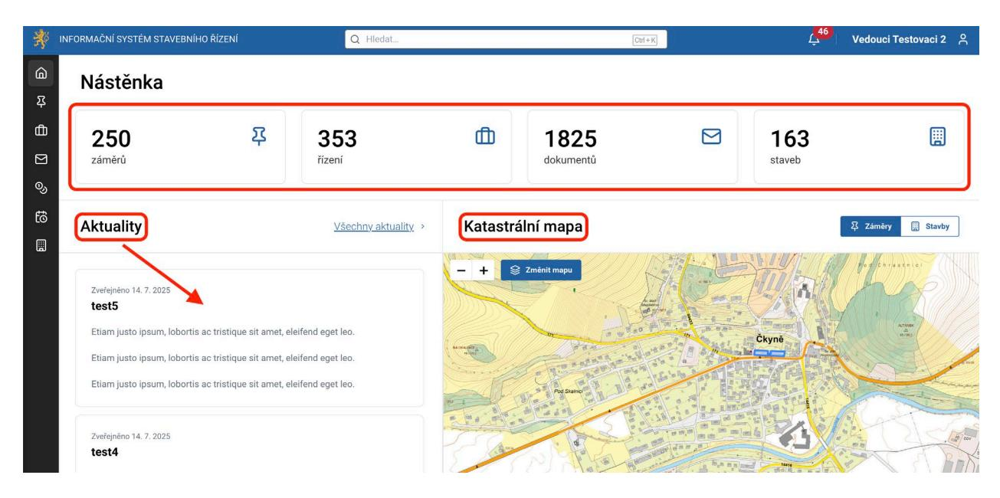

## 3.1 Popis horní lišty

V horní liště naleznete pole Hledat, ve kterém můžete vyhledávat (viz dále). Pod tlačítkem s ikonou zvonečku naleznete notifikace, tedy oznámení o událostech, které vyžadují akce z Vaší strany (například zpracování doručeného dokumentu) či informace o výsledcích Vašich předešlých akcí (například ověření dokumentace v záměru či řízení). Úplně vpravo pak naleznete informace o přihlášené osobě.

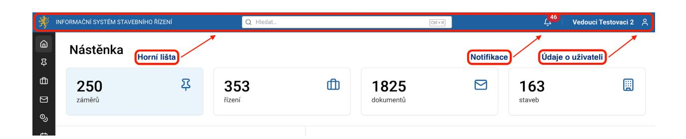

## 3.1.1 Vyhledávání

Do řádku pro vyhledávání v horní části obrazovky zadejte alespoň první znak hledaného výrazu. Následně vyberte oblast, ve které chcete hledání provést.

Pokud hledáte přímo z Nástěnky, vybíráte z oblastí Záměr, Řízení, Dokument, Platby, Stavební objekty.

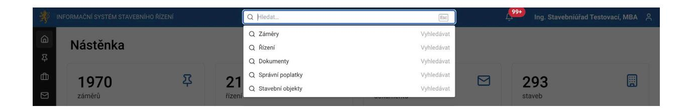

V případě, že tuto funkci využijete z jiného náhledu, automaticky vyhledáváte v dané sekci systému. Např. po kliknutí na Dokument jste přesměrováni do dokumentů, kde můžete v případě potřeby dále vybírat z jednotlivých stavů dokumentů.

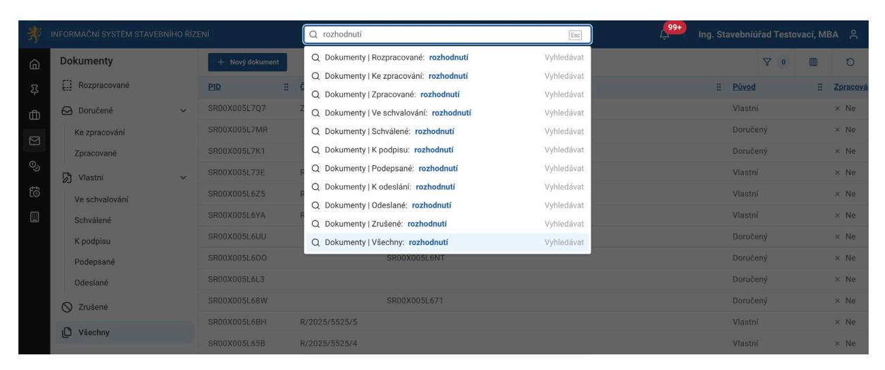

Při vyhledávání si nemusíte dávat pozor na zadávání velkých či malých písmen. Vyhledávač hledaný název vyhledá bez ohledu na malá či velká písmena.

## 3.1.2 Notifikace (oznámení)

Každý nový úkol se vám zobrazí pod tlačítkem s ikonou zvonečku v záložce Notifikace (čili oznámení).

Notifikace upozorňují přihlášeného uživatele na události v ISSŘ, které vyžadují jeho akci (například upozornění na nově doručený dokument), anebo jsou výsledkem jeho předešlých akcí v systému (například notifikace o výsledku hromadného ověření účastníků řízení). Při kliknutí na konkrétní notifikaci budete přesměrováni – například, jak vidíte na obrázku níže, k úkolu "Odeslat ke schválení dokument".

Nastavení notifikací je popsáno v kapitole 2.2.1 Postup nastavení notifikací.

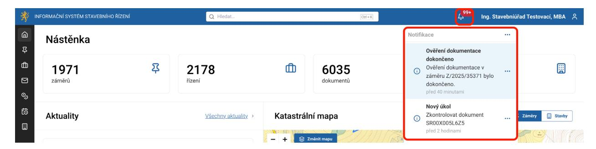

### 3.1.3 Uživatel

Přes kliknutí na jméno v pravém horním rohu se můžete odhlásit ze systému či otevřít nastavení uživatelského profilu.

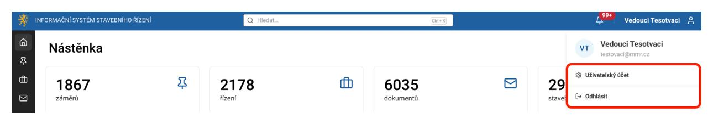

Na obrazovce uživatelský účet naleznete základní informace o svém účtu a organizaci. Můžete také změnit nastavení notifikací a zobrazení dat na jednotlivých obrazovkách.

Sekce Nastavení notifikací umožňuje uživateli zapnout/vypnout notifikace pro specifické události v ISSŘ a určit jejich podobu. Způsob a náležitosti nastavení notifikací je podrobně popsán v kapitole 2.2.1 Postup nastavení notifikací.

Sekce Uživatelské nastavení umožňuje uživateli obnovit původní nastavení zobrazení a pozic sloupců při vyhledávání. Postup a dopady jednotlivých úkonů jsou podrobně popsány v kapitole 2.2.2 Uživatelské nastavení.

## 3.2 Popis levé lišty = hlavní menu

Na levém okraji obrazovky se nachází tmavě šedé svislé menu, kde naleznete několik záložek.

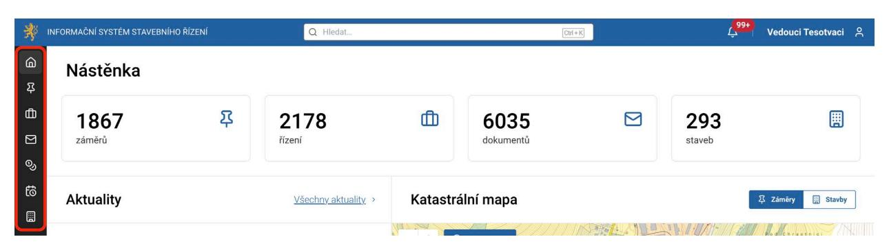

Jakmile na záložky najedete myší, zobrazí se nápověda, co jednotlivá záložka obsahuje. Mezi záložkami můžete jednoduše přepínat. Postupně lze odshora zobrazit záložky Nástěnka, Záměry, Řízení, Dokumenty, Správní poplatky, Úkoly, Stavební objekty.

### 3.2.1 Nástěnka

Při kliknutí na tlačítko Nástěnka systém načte úvodní stránku.

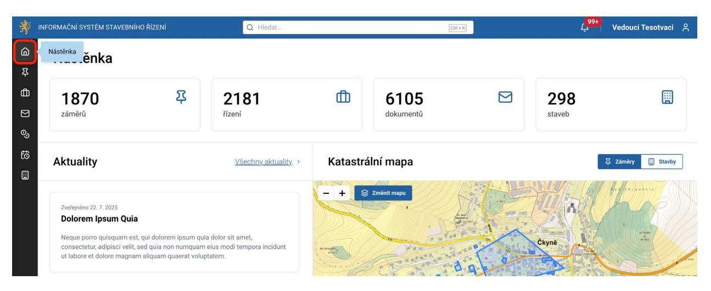

## 3.2.2 Záměry

Při kliknutí na tlačítko Záměry

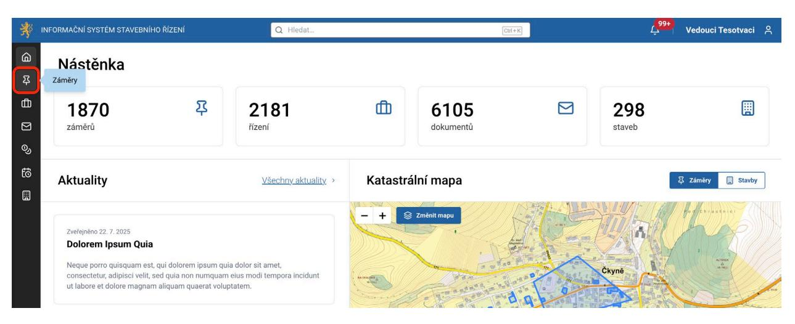

systém načte seznam záměrů pro Celou ČR i Můj úřad a jejich jednotlivé stavy.

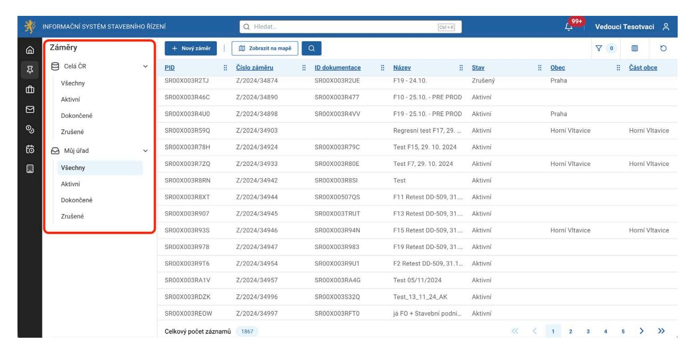

## 3.2.3 Řízení

#### Při kliknutí na tlačítko Řízení

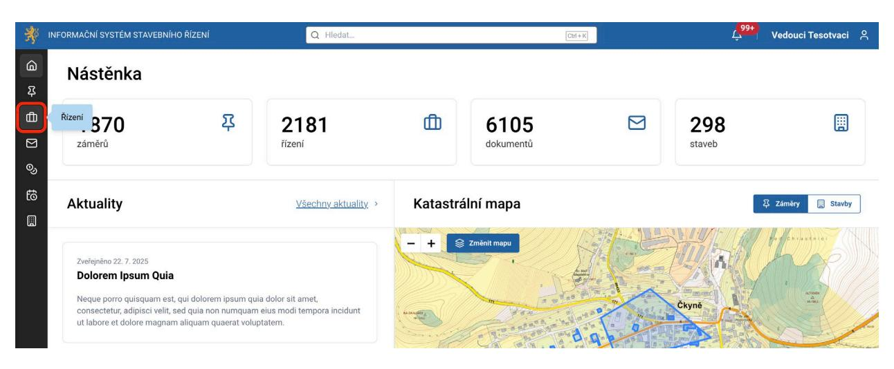

systém načte seznam Řízení (Běžící, Přerušená, Ukončená, Všechny).

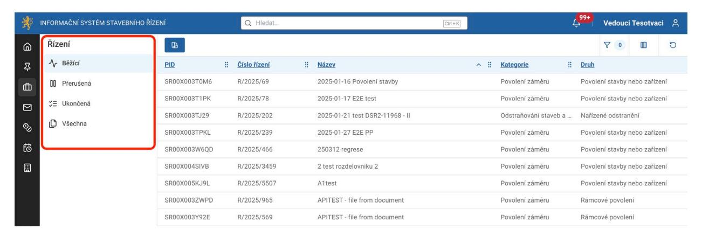

### 3.2.4 Dokumenty

Při kliknutí na tlačítko Dokumenty

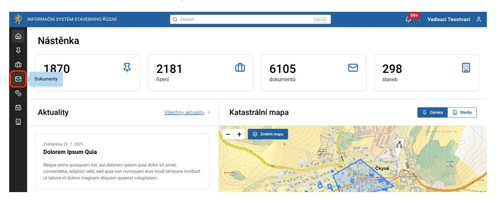

systém načte seznam Dokumenty (Rozpracované, Doručené, Vlastní, Zrušené, Všechny).

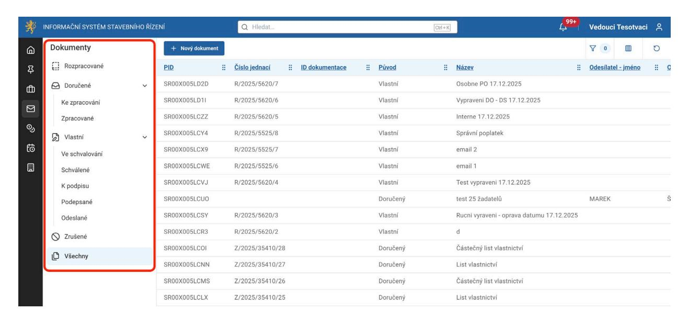

### 3.2.5 Správní poplatky

Při kliknutí na tlačítko Správní poplatky

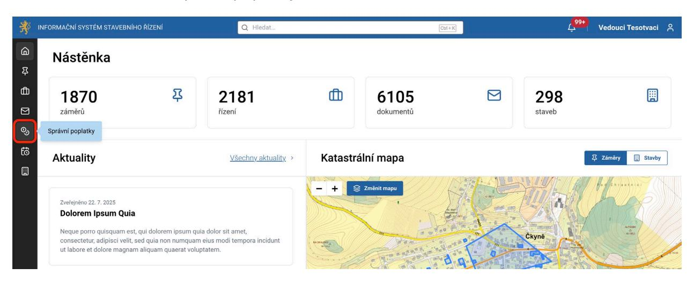

systém načte seznam Správní poplatky (Neuhrazené, Uhrazené, Zrušené, Neuhrazené – řízení zastaveno, Ostatní, Zrušené, Všechny).

## 3.2.6 Úkoly

Při kliknutí na tlačítko Úkoly

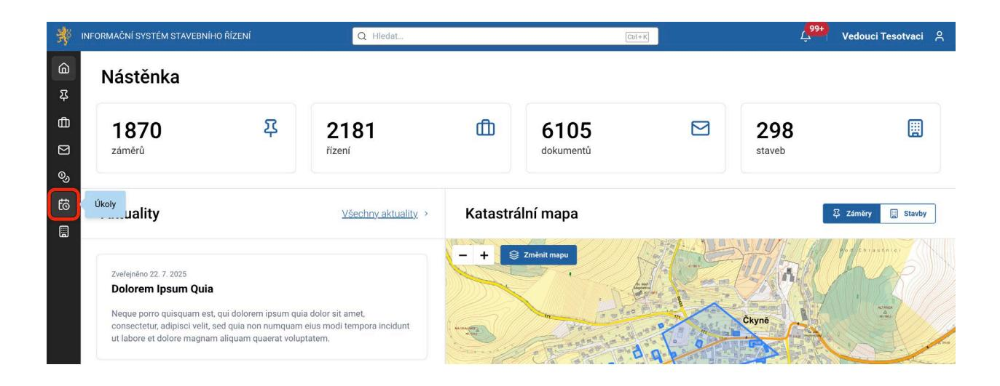

## systém načte seznam Úkoly.

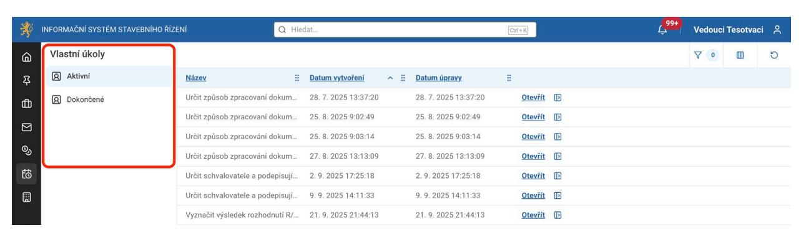

## 3.2.7 Stavební objekty (stávající stavby)

Při kliknutí na tlačítko Stavební objekty (stávající stavby)

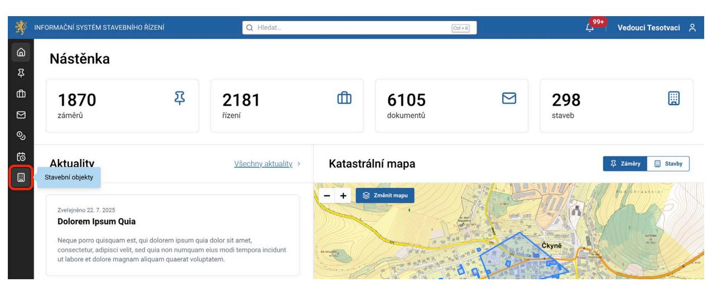

systém načte seznam Stavební objekty (Rozpracované, Aktivní, Ukončené, Všechny) a jejich stavy.

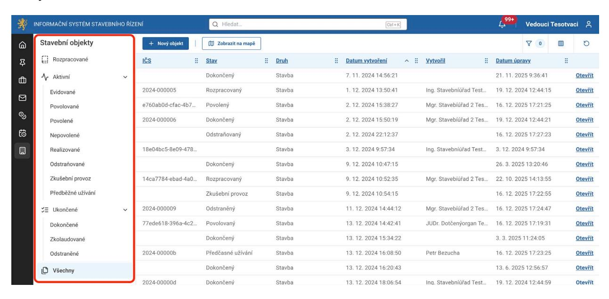

## 3.3 Filtrování

Tlačítko Filtry slouží k pokročilému vyhledávání na obrazovkách Záměry, Řízení, Dokumenty atd. Nachází se nalevo od tlačítka Sloupce (viz snímek níže). Pro nastavení filtrů pokročilého vyhledávání je potřeba použít tlačítko "+", anebo Enter po zapsání vyhledávané hodnoty do filtrovacího pole. Po uplatnění filtrů můžete opět zadat vyhledávaný výraz do pole pro vyhledávání v horní části obrazovky. Systém nyní vyhledává pouze mezi záznamy, které projdou Vámi nastaveným filtrováním.

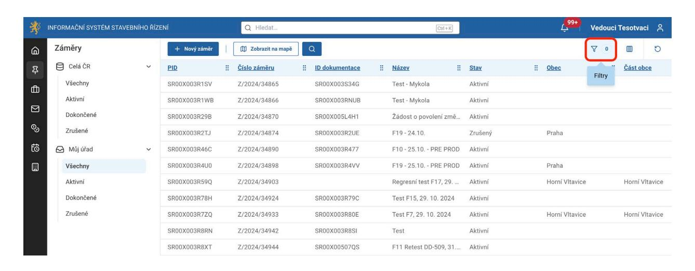

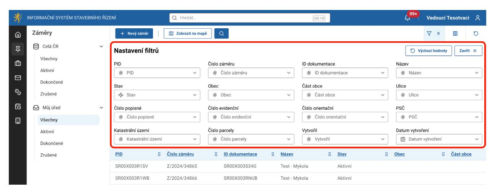

V rámci filtrů můžete vyhledávat záznamy pomocí více parametrů současně.

Správní poplatky lze filtrovat kromě základních parametrů i dle jména a příjmení plátce, a dle kompletní částky.

Vyhledávání probíhá na jakýkoliv textový řetězec a hledá se shoda od prvního vloženého znaku. Při hledání shody není uplatněno princip "case sensitive", tedy nerozlišují se velká a malá písmena.

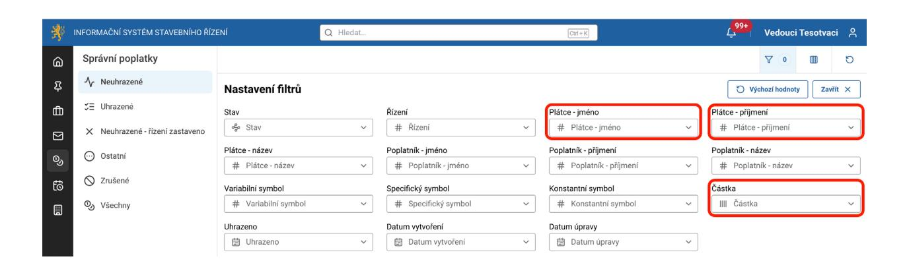

Doručené dokumenty lze filtrovat kromě základních parametrů také dle jména a příjmení odesílatele. U vlastních dokumentů zůstává tento údaj prázdný.

Vyhledávání probíhá na jakýkoliv textový řetězec a hledá se shoda od prvního vloženého znaku. Při hledání shody není uplatněno princip "case sensitive", tedy nerozlišují se velká a malá písmena.

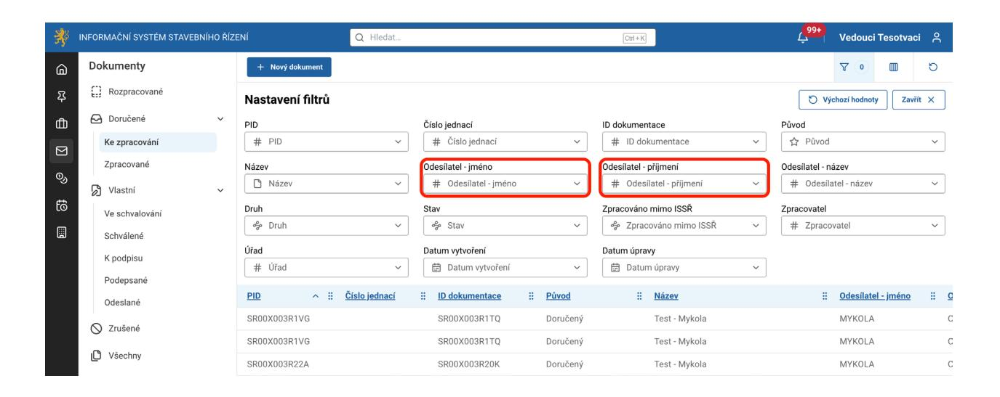

Pokud máte zadán jeden nebo více filtrů a přejete si je všechny vymazat, můžete tak učinit pomocí tlačítka Výchozí hodnoty.

## 3.4 Kartový a Tabulkový pohled na data

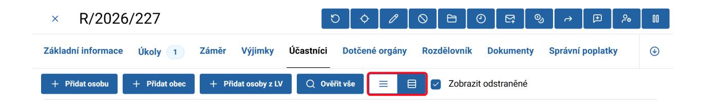

## 3.4.1 Režim zobrazení datových záznamů v ISSŘ – Tabulka a Karty

Systém ISSŘ umožňuje zobrazit datové záznamy ve dvou alternativních režimech. Přepínání mezi nimi je dostupné pomocí dvojice ikon v pravé části nástrojové lišty příslušné sekce (např. záložka **Účastníci**). Aktuálně aktivní režim je vizuálně zvýrazněn.

### 3.4.2 Režim Tabulky

**Přepínací ikona:** ≡ (tři vodorovné linky / seznam)

V režimu Tabulky jsou záznamy zobrazeny jako **kompaktní přehledová tabulka** – každý záznam tvoří jeden řádek a jednotlivé atributy jsou uspořádány do pojmenovaných sloupců.

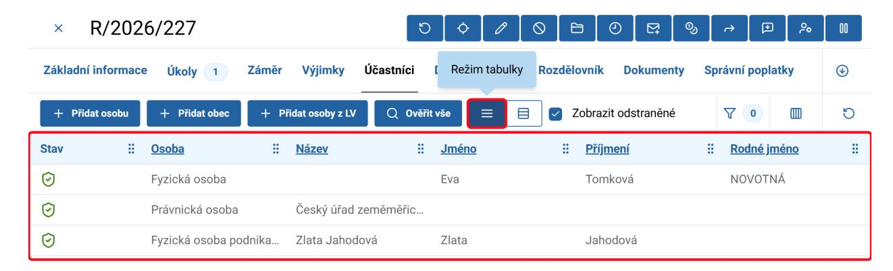

#### **Vlastnosti a ovládací prvky tabulkového režimu:**

- Nástrojová lišta tabulky obsahuje ikonu **filtru** s počítadlem aktivních filtrů, ikonu **nastavení sloupců** (správa viditelných sloupců) a ikonu **obnovení** (reset nastavení).
- V zápatí tabulky je zobrazen **celkový počet záznamů** a **stránkovací ovládání** (šipky pro přechod na první / předchozí / následující / poslední stránku s číslem aktuální strany).
- Tabulka podporuje **horizontální posouvání** (scrollbar v zápatí) pro zobrazení sloupců, které se nevejdou do viditelné oblasti.
- V posledním sloupci tabulkového režimu je k dispozici sada akčních ikon, které se liší dle kontextu entity. Tento sloupec je vždy poslední.

**Typické využití:** Rychlý přehled všech záznamů dané sekce, orientace v počtu a stavu položek, porovnání klíčových hodnot napříč záznamy.

### 3.4.3 Režim Karet

**Přepínací ikona:** ▦ (mřížka / čtverce)

V režimu Karet je každý záznam zobrazen jako **samostatná rozvinutá karta** (panel), která v přehledné dvousloupcové struktuře zobrazuje všechna dostupná datová pole daného záznamu.

Tělo karty tvoří dvojice **název pole – hodnota** (vlevo popisek atributu, vpravo jeho hodnota). Vyvolává tak dojem formulářového stylu zobrazení jednoho záznamu seskupeného do jedné karty.

Všechny záznamy dané sekce jsou zobrazeny **za sebou ve svislém sloupci**, přičemž uživatel může mezi nimi procházet rolováním stránky.

**Typické využití:** Detailní prohlížení a kontrola úplnosti jednotlivých záznamů, editace konkrétního záznamu, okamžitá identifikace chybějících hodnot díky ikonám varování.

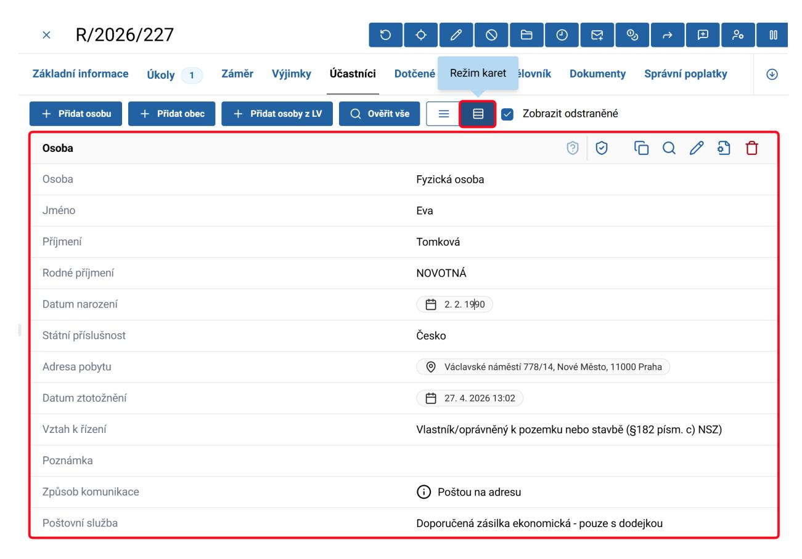

## 3.4.4 Přepínání mezi režimy

Přepínače jsou umístěny v nástrojové liště sekce, vždy vpravo. Přepnutí režimu je okamžité a neovlivňuje data ani nastavení filtrů. Dostupnost přepínače "režimů" je závislá relevanci k dané entitě a není zobrazeno ve všech případech.

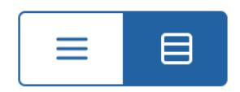

| Vlastnost             | Režim Tabulky                                         | Režim Karet                                       |
|-----------------------|-------------------------------------------------------|---------------------------------------------------|
| Zobrazení             | Kompaktní řádky se sloupci                            | Rozvinuté karty za sebou                          |
| Množství informací | Vybrané klíčové atributy                              | Veškeré atributy záznamu                          |
| Přehlednost           | Přehled více záznamů najednou                         | Detail každého záznamu zvlášť                     |
| Kontrola úplnosti  | Pouze sloupec Stav (ikona)                            | Vizuální varování ( 1 ) u každého rozdílného pole |
| Akce se záznamy    | Dostupné přes kontextové operace v posledním sloupci. | lkony přímo v záhlaví každé karty                 |
| Stránkování           | Zobrazeno v zápatí s počtem záznamů                   | ı Rolování v rámci stránky                        |

## 3.4.5 Řazení záznamů v tabulkách

Záznamy v tabulkách lze řadit sestupně nebo vzestupně kliknutím na příslušný sloupec, podle kterého chce uživatel řadit. Řadit lze vždy podle jednoho sloupce.

Pokud uživatel zvolí řazení záznamů dle nějakého sloupce, nevyplněné hodnoty jsou řazeny až na konec seznamu, bez ohledu na to, zda je řazení vzestupné nebo sestupné. Úprava zpřehlední zobrazení relevantních dat a zjednoduší orientaci při vyhledávání v rozsáhlých seznamech.

Bylo upraveno řazení záznamů podle celé hodnoty (nikoli jen podle první číslice)

- dokumenty (dle čísla jednacího)
- řízení (dle čísla řízení)
- záměry (dle čísla záměru)

## 3.4.6 Řazení záznamů v kartovém pohledu

Pro řazení Dokumentů v režimu karet na v detailu řízení jsou dokumenty automaticky seřazeny vzestupně podle čísla jednacího, což zlepšuje přehlednost při práci.

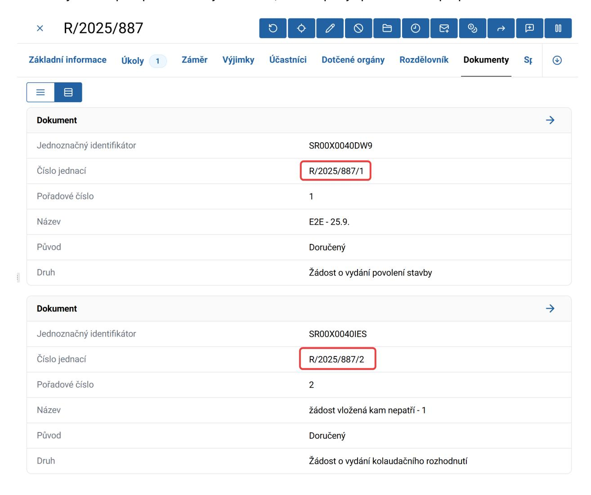

## 4 Nástěnka

Nástěnka je úvodní obrazovkou systému ISSŘ.

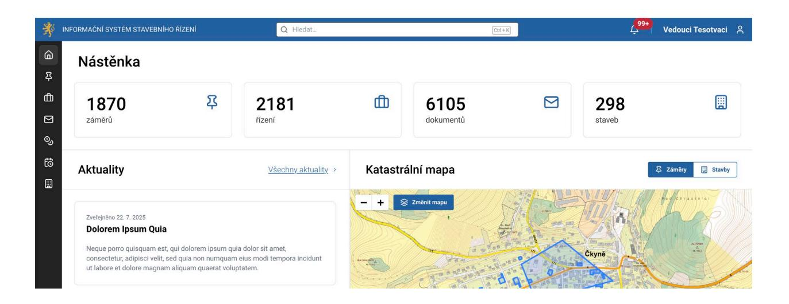

V levém svislém menu umožňuje proklik na Záměry, Řízení, Dokumenty, Správní poplatky, Úkoly a Stavební objekty.

V horním menu je k dispozici globální vyhledávání, notifikace a nastavení vlastního profilu. Tyto položky jsou podrobně diskutovány v samostatných kapitolách.

Nástěnka zobrazuje přehled statistik o počtu záměrů, řízení, dokumentů a staveb. Uvedená čísla jsou vždy vztažena ke konkrétnímu úřadu, pod který uživatel spadá.

V sekci Aktuality je přehled novinek, změn, nových funkcionalit, odstávek atd. Aktuality jsou spravovány globálním administrátorem MMR. Tuto sekci je vhodné pravidelně sledovat.

Součástí nástěnky je funkcionalita Katastrální mapy, která je automaticky přiblížena na adresu úřadu přihlášeného uživatele.

Na mapě je možné přepínat mezi zobrazením záměrů a staveb.

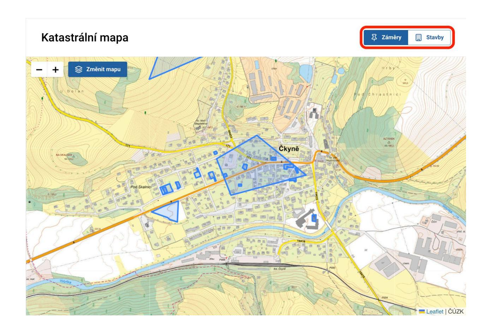

Na mapě lze měnit pohled mezi základním a leteckým po kliknutí na Změnit mapu.

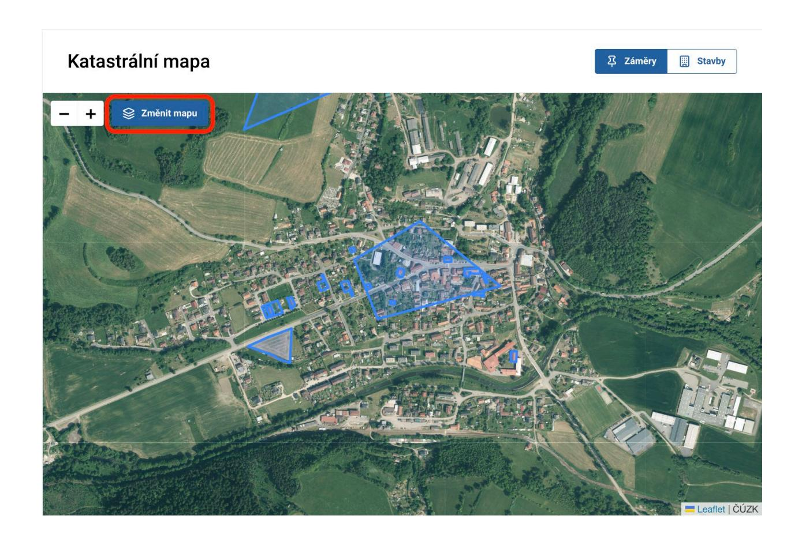

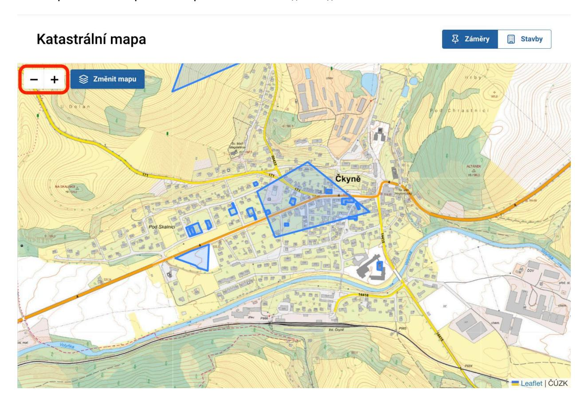

Mapa zobrazuje všechny záměry/stavby v ČR. Po kliknutí na záměr/stavbu na mapě jsou zobrazeny základní informace. Kliknutí na tlačítko detail umožňuje získat detailnější informace.

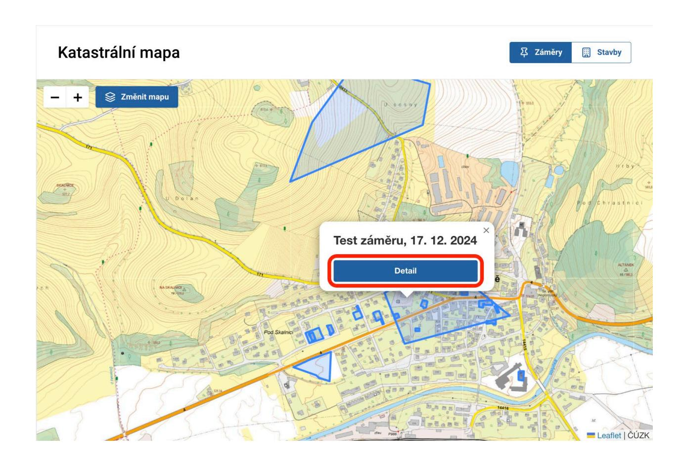

## 5 Záměry

Záměr stavby ve stavebním řízení je soubor plánů a dokumentace předkládaný stavebníkem stavebnímu úřadu za účelem získání stavebního povolení. Tento soubor detailně popisuje zamýšlený stavební projekt a jeho technické a právní aspekty.

Pro zobrazení přehledu záměrů klikněte na položku Záměry ve vertikálním menu.

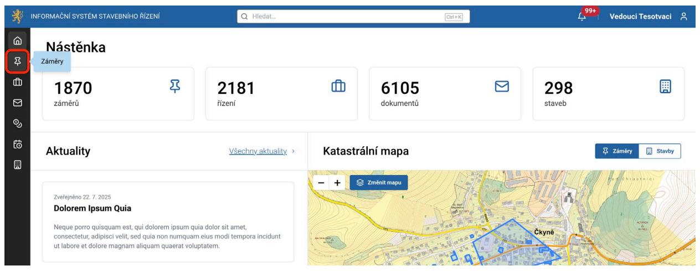

Následně se zobrazí seznam záměrů.

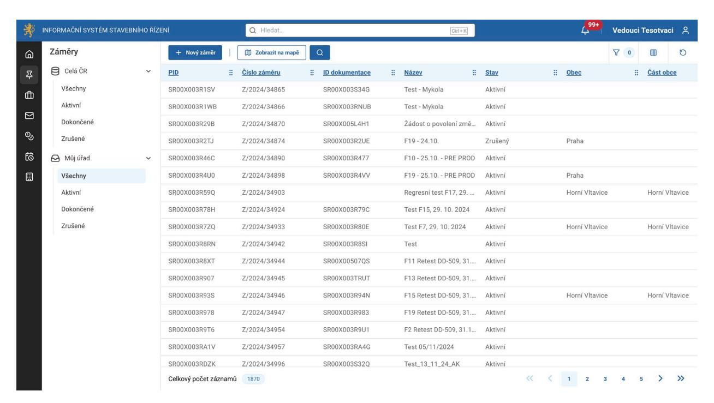

## 5.1 Záložky detailu záměru

Pro zobrazení detailu vybraného záměru klikněte na položku z přehledu.

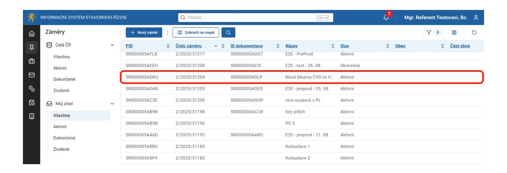

### 5.1.1 Základní informace

Záložka Základní informace obsahuje informace o záměru, jako je například stav záměru či ID dokumentace, které určují, ze kterého dokumentu se bude načítat dokumentace záměru.

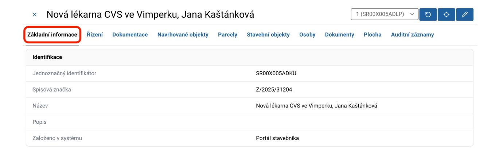

## 5.1.2 Řízení

V rámci řízení u záměru stavby se posuzuje soulad projektu s územním plánem, stavebními předpisy a normami, vliv na životní prostředí a zajištění všech potřebných povolení a souhlasů dotčených orgánů.

Pro přechod na záložku Řízení klikněte na příslušný název záložky. Na záložce Řízení vidíte řízení, která se vztahují k danému záměru.

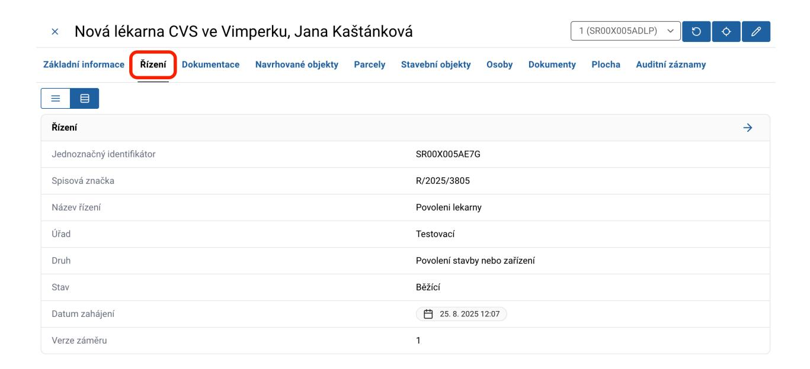

### 5.1.3 Dokumentace

Projektová dokumentace obsahuje detailní plány stavby, architektonické výkresy, technické zprávy, specifikace materiálů, statické výpočty, řešení technických zařízení a další informace potřebné pro realizaci a schválení stavebního projektu.

Pro přechod na záložku Dokumentace klikněte na příslušný název záložky. Na této záložce vidíte dokumentaci příslušného záměru. Pokud je dokumentace dostupná, zobrazí se tlačítko Načíst BPP. Pro načtení dokumentace klikněte na tlačítko Načíst BPP.

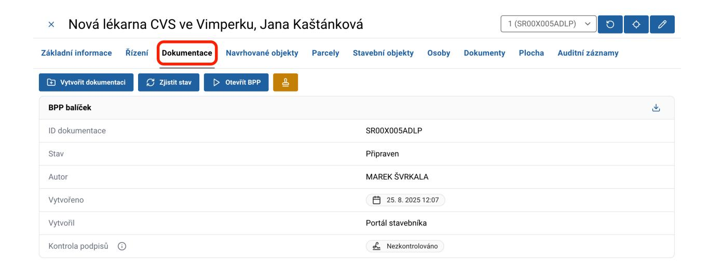

Po načtení dokumentace se objeví tlačítko Otevřít BPP. Pro zobrazení jednotlivých dokumentů, které dokumentace obsahuje, klikněte na toto tlačítko.

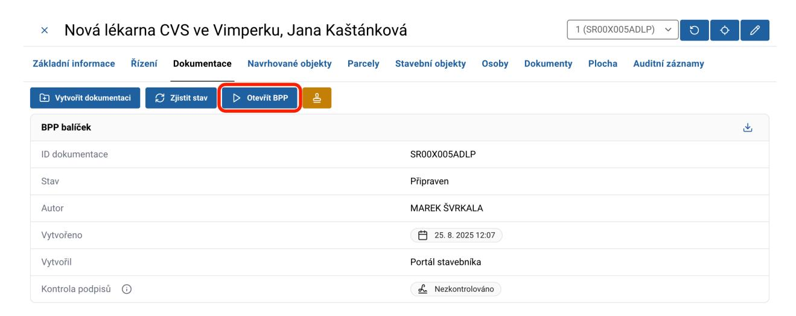

Zobrazí se nové okno. Použijte šipky k rozbalení obsahu projektové dokumentace s jednotlivými soubory či ikonu "+" a "-" pro rozbalení či sbalení všech dokumentů.

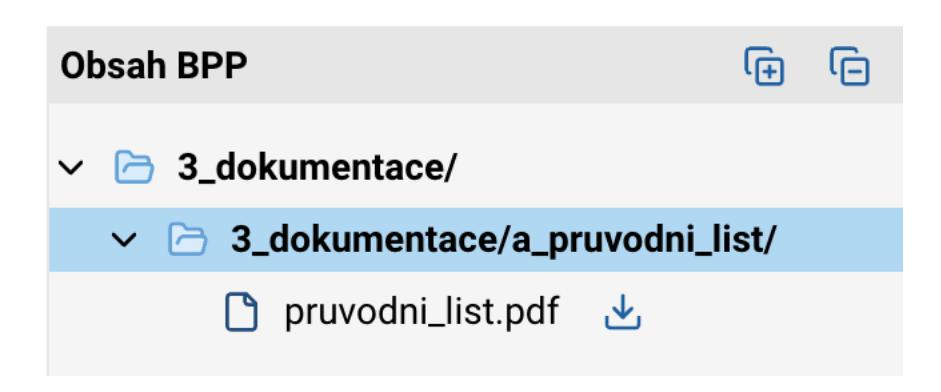

Na snímku níže je zobrazen obsah projektové dokumentace s jednotlivými soubory.

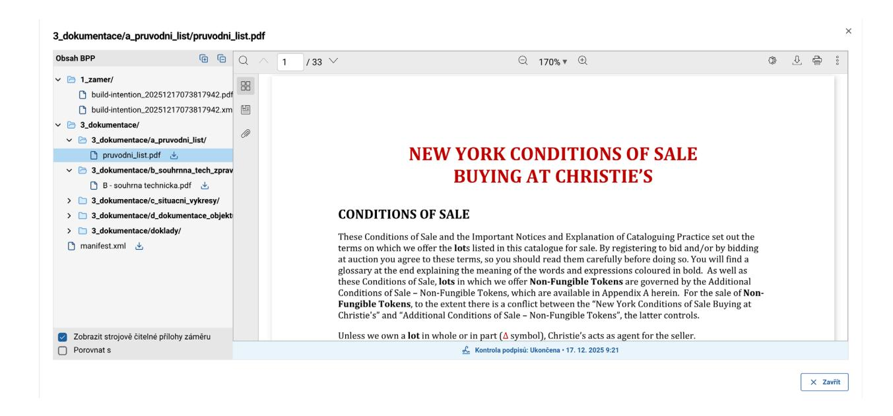

Dokumentaci je možné stáhnout do svého PC pomocí tlačítka Stáhnout BPP balíček.

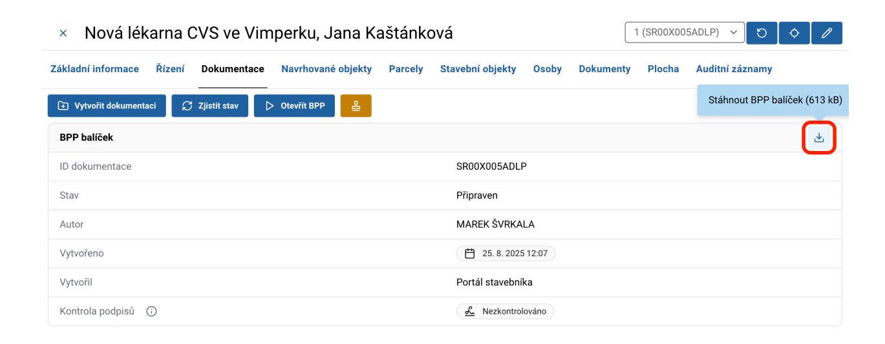

V dalším kroku je možné zvolit formát BPP nebo ZIP.

V případě zvolení formátu ZIP a stažení přejděte ve svém PC do složky stažené soubory.

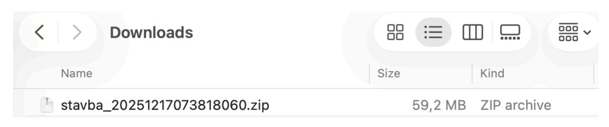

Po rozkliknutí staženého souboru se zobrazí jednotlivé složky.


V případě zvolení formátu BPP je po dokončení stahování důležité změnit příponu souboru z ".bpp" na ".zip". Tento krok je nutný k tomu, abyste mohli balíček rozbalit a pracovat s jeho obsahem na Vašem zařízení.

Po stažení přejděte ve svém PC do složky stažené soubory.


Klikněte pravým tlačítkem na stažený soubor. Zvolte možnost "Přejmenovat" ("Rename").


Změňte koncovku souboru z ".bpp" na ".zip" a potvrďte stiskem klávesy Enter. Poté budete dotázáni, zda chcete změnu přípony skutečně provést. Klikněte na "Ano".


Následně vidíte soubor zip.

Po rozkliknutí se zobrazí jednotlivé složky.

#### *5.1.3.1 Porovnání verzí dokumentace*

Systém ISSŘ umožňuje zobrazení změn mezi jednotlivými verzemi projektové́ dokumentace.

Vyberte verzi záměru a otevřete BPP balíček.


Následně rozbalte všechny složky, zaškrtněte zaškrtávací políčko s názvem Porovnat s a zvolte verzi, kterou chcete porovnat s verzí vybranou v předchozím kroku.


Zobrazte všechny soubory, které jsou barevně označeny podle rozdílů mezi verzemi:

- Modře soubor byl mezi verzemi změněn
- Červeně soubor byl v aktuální verzi smazán (v porovnávané existuje), soubory označené červeně nelze otevřít, protože nejsou součástí aktuálního balíčku
- Zeleně soubor byl v aktuální verzi přidán (v porovnávané neexistuje)
- Černě soubor je beze změny


#### *5.1.3.2 Ověření dokumentace*

Tato funkcionalita slouží k ověření schválené dokumentace po vydání pravomocného rozhodnutí.

Ověření dokumentace je omezeno na role Referent, Vedoucí pracovník nebo Lokální administrátor stavebního úřadu či dotčeného orgánu.

Ověřením dokumentace se vytvoří její nová verze a obsah BPP balíčku je podepsán – ve všech PDF souborech je doplněn elektronický podpis a časové razítko pro zachování integrity dokumentů.

Ověření se vyvolá stisknutím tlačítka se symbolem razítka. Ověřování dokumentace je možné až po předchozím načtení dokumentace (BPP). Pokud dokumentace není načtena, tlačítko "Ověřit dokumentaci" je neaktivní. Po načtení dokumentace pomocí akce "Načíst BPP" se tlačítko zpřístupní a je možné ověřování spustit.

Tlačítko je přístupné v záložce dokumentace, a to jak přímo z řízení, tak i ze záměru (zde umožní ověřit i dokumentaci, nebude-li řízení vedeno přímo v ISSŘ).

Před vlastním ověřením je třeba zkontrolovat, že byla vybrána správná verze dokumentace k ověření!


*Upozornění:* **tento proces je nevratný.**

Před spuštěním akce je uživatel ISSŘ informován o dopadech a spuštění akce potvrdí tlačítkem.


Délka trvání ověření, a tedy vytvoření nové verze dokumentace, je závislá od vytížení ISSŘ a velikosti dokumentace. Doba trvání u menších dokumentací je v jednotkách minut, u větších dokumentací to mohou být desítky minut. O dokončení ověření budete informováni notifikací, pokud ji máte aktivovanou.


Po dokončení operace je vytvořena nová verze dokumentace, která je označená příznakem ověření.


Informace o zahájení, ukončení procesu ověření dokumentace a vytvoření nové verze záměru je logována a viditelná v Auditních záznamech v detailu záměru.


V případě, že ověření bylo spuštěno z řízení, je tato nová ověřená verze automaticky k řízení přiřazena.


Jakoukoliv dokumentaci (i neověřenou) je možné stáhnout pomocí ikony se symbolem pro stahování, která se na záložce dokumentace objeví po stisknutí tlačítka Načíst BPP, poté co se popis tohoto tlačítka změní na Otevřít BPP. Ikona se zobrazí v pravé středové části obrazovky.


Dokumentaci je možné stáhnout ve formátech BPP nebo ZIP výběrem v následujícím dialogu.


Všechny dokumenty, které jsou součásti ověřené dokumentace, jsou opatřeny elektronickým podpisem a časovým razítkem. Elektronický podpis není vizualizovaný, lze ho ověřit například otevřením souboru v aplikaci Adobe Acrobat Reader, kde se informace o podpisu objeví v liště Panel podpisu.


Kliknutím na Podrobnosti certifikátu se otevře prohlížeč certifikátu, kde naleznete podrobností o certifikátu a jeho vydání.


Všechny dokumenty, které jsou součásti ověřené dokumentace, jsou opatřeny elektronickým podpisem a časovým razítkem. Elektronický podpis není vizualizovaný, lze ho ověřit pomocí funkce Verifikátor elektronických podpisů.

Verifikátor elektronických podpisů (v ISSŘ) je podpůrný nástroj, který slouží k technické kontrole elektronicky podepsaných souborů projektové dokumentace. Jeho cílem je usnadnit práci úředníků při ověřování, zda dokumentace splňuje požadavky na elektronické podepisování podle platné legislativy.

Použití verifikátoru není povinné. Výsledky kontroly slouží jako podpůrná informace. Rozhodnutí o dalším postupu je vždy na posouzení pracovníka stavebního úřadu.

Funkci Verifikátoru naleznete v Záměru na záložce Dokumentace v řádku Kontrola podpisů.


Informační ikona na řádku Kontrola podpisů obsahuje základní popis chování Verifikátoru podpisů.


V řádku Kontrola popisů je informace o stavu kontroly podpisů. Tento může mít jeden ze dvou stavů: Nezkontrolováno – u dokumentací, u kterých ještě kontrola neproběhla, Běžící -

u dokumentací kde již byla kontrola podpisů spuštěna, ale nebyla dokončena a Ukončena + datum ukončení – u dokumentací s již provedenou kontrolou podpisů.


Pole s informací je klikatelné a vede do dialogového okna Verifikátoru elektronických podpisů.

V případě, že v dokumentaci ještě neproběhla kontrola podpisů, bude dialogové okno zatím prázdné.


Pro spuštění kontroly podpisů v dokumentaci klikněte na tlačítko Zkontrolovat podpisy.


Stav dialogového okna se změní, v přehledu kontrol přibude nový řádek Probíhající kontrola a v přehledu je nyní vidět seznam dokumentů, na kterých kontrola probíhá. Vzhledem k tomu, že některé dokumentace obsahují větší množství souborů může kontrola podpisů trvat delší čas.


Po dokončení kontroly podpisů jsou jednotlivé dokumenty označeny podle vyhodnocení jednotlivých podpisů na Platné, Technicky nevyhovující a Neplatné. Jednotlivé typy vyhodnocení podpisu můžete filtrovat pomocí záložek.


Záložky Vyžádané a Běžící obsahují dokumenty, u nichž byly podpisy vyžádány nebo u kterých kontrola teprve probíhá.

U každého z ověřených podpisů je možné záznam rozkliknout a prohlédnout si detail.


Report kontroly podpisů je také možné stáhnout jako PDF soubor pomocí tlačítka Stáhnout report.


Stažený PDF soubor následně obsahuje přehled zkontrolovaných podpisů a jejich výsledek, včetně případného popisu chyby.

| Report kontroly | v nodnisů | dokumentace    | SR00X005K3FV |
|-----------------|-----------|----------------|--------------|
| Report Kontrol  | v boubisu | uokuillelitate | SKUUKUUSKSEV |

| Soubor                                                                                | Profil                              | Výsledek | Chyby                                                                                                    |
|---------------------------------------------------------------------------------------|-------------------------------------|----------|----------------------------------------------------------------------------------------------------------|
| 3_dokumentace/d_dokumentace_objektu/1-Stavebni-zakon_7.pdf                            | Elektronické autorizační razítko | Neplatný | Podpis nebo pečeť nebyly nalezeny, Podpis nebyl vytvořen elektronickým autorizačním razítkem (EAR) |
| 3_dokumentace/c_situacni_vykresy/c5_deleni_sceleni_pozem ku/1-Stavebni-zakon_6.pdf | Elektronické autorizační razítko | Neplatný | Podpis nebo pečeť nebyly nalezeny, Podpis nebyl vytvořen elektronickým autorizačním razítkem (EAR) |
| 3_dokumentace/c_situacni_vykresy/c4_specialni_sit_vykres/1-Stavebni-zakon_5.pdf       | Elektronické autorizační razítko | Neplatný | Podpis nebo pečeť nebyly nalezeny, Podpis nebyl vytvořen elektronickým autorizačním razítkem (EAR) |
| 3_dokumentace/c_situacni_vykresy/c3_koordinacni_vykres/1-Stavebni-zakon_4.pdf         | Elektronické autorizační razítko | Neplatný | Podpis nebo pečeť nebyly nalezeny, Podpis nebyl vytvořen elektronickým autorizačním razítkem (EAR) |
| 3_dokumentace/c_situacni_vykresy/c2_katastralni_vykres/1- Stavebni-zakon_3.pdf     | Elektronické autorizační razítko | Neplatný | Podpis nebo pečeť nebyly nalezeny, Podpis nebyl vytvořen elektronickým autorizačním razítkem (EAR) |
| 3_dokumentace/c_situacni_vykresy/c1_vykres_sirsich_vztahu/ 1-Stavebni-zakon_2.pdf  | Elektronické autorizační razítko | Neplatný | Podpis nebo pečeť nebyly nalezeny, Podpis nebyl vytvořen elektronickým autorizačním razítkem (EAR) |
| 3_dokumentace/b_souhrnna_tech_zprava/1-Stavebni-zakon_1.pdf                           | Elektronické autorizační razítko | Neplatný | Podpis nebo pečeť nebyly nalezeny, Podpis nebyl vytvořen elektronickým autorizačním razítkem (EAR) |
| 3_dokumentace/a_pruvodni_list/1-Stavebni-zakon.pdf                                    | Elektronické autorizační razítko | Neplatný | Podpis nebo pečeť nebyly nalezeny, Podpis nebyl vytvořen elektronickým autorizačním razítkem (EAR) |

#### *Poznámka:*

Detailnější popis a podrobnější informace včetně odpovídajících zákonů naleznete v samostatné příručce [Verifikátor elektronických podpisů](https://mmr.gov.cz/getmedia/e2f34c0e-5720-437a-88d7-db3c85aae94c/Metodika-k-Verifikatoru-podpisu-BPP_1.pdf.aspx?ext=.pdf).

#### *5.1.3.3 Vytvoření dokumentace úředníkem*

Funkcionalita slouží pro vložení dokumentace zpracované kvalifikovanou osobou, kterou stavebník předá stavebnímu úřadu nebo dotčenému orgánu v listinné (papírové) podobě. Nástroj pro vytvoření dokumentace je vyvolán v ISSŘ, avšak sestavení dokumentace probíhá v nástroji, který poskytuje Portál stavebníka. Vytvoření dokumentace může provést role referent, vedoucí pracovník nebo lokální administrátor stavebního úřadu i dotčeného orgánu. Po otevření detailu záměru v sekci Dokumentace je tlačítko Vytvořit dokumentaci.


Po stisknutí tlačítka se zobrazí upozornění.


Po potvrzení budete přesměrováni do prostředí Portálu stavebníka, kde postupujte dle instrukcí v Portálu stavebníka.


Nahrajte potřebné soubory a klikněte na tlačítko Vložit dokumentaci.


Po úspěšném dokončení aktivit v Portálu stavebníka se objeví upozornění o vložení dokumentace.


Na pozadí proběhne vytvoření BPP balíčku.

Po úspěšném dokončení se objeví notifikace v ISSŘ. Vytvoření může trvat několik minut.


Po dokončení vytvoření dokumentace systém přidělí záměru ID dokumentace. Na záložce Dokumentace se objeví odpovídající informace.


BPP baliček je možné načíst. Po načtení se objeví podrobná informace o vytvoření. Dokumentaci je možné otevřít a stáhnout pomocí tlačítek Načíst BPP, Otevřít BPP a Stáhnout BPP balíček.


Operace vložení dokumentace do záměru je logována. Je viditelná v Auditních záznamech v detailu záměru.


### 5.1.4 Navrhované objekty (záměru)

Navrhované objekty jsou budovy, stavby nebo jiné konstrukce, které jsou plánovány k výstavbě a jsou součástí projektové dokumentace předkládané ke schválení ve stavebním řízení.

Pro přechod na záložku Navrhované objekty klikněte na příslušný název záložky.


#### *5.1.4.1 Přidat navrhovaný objekt*

Pro přidání navrhovaného objektu klikněte na tlačítko Přidat navrhovaný objekt.


Následně se otevře formulář pro vyplnění informací o navrhovaném objektu.


Atributy formuláře můžete vyplnit ručně, anebo pomocí výběru parcely na mapě. Pro výběr parcely z mapy klikněte na tlačítko Vybrat parcelu na mapě.


Poté klikněte na parcelu, kterou chcete k záměru přidat, a akci potvrďte kliknutím na tlačítko Vybrat.


Po vybrání navrhovaného objektu z mapy vyplňte Druh a doplňující informace o objektu a uložte kliknutím na tlačítko Potvrdit.


K záměru byl přidán nový navrhovaný objekt.


#### *5.1.4.2 Ověřit vše.*

Všechny navrhované objekty lze ověřit najednou kliknutím na tlačítko Ověřit vše.


V novém okně klikněte na tlačítko Potvrdit.


Hromadné ověření může trvat déle. O dokončení budete informováni notifikací, pokud ji máte aktivní.

#### *5.1.4.3 Zobrazení a obnovení odstraněných objektů*

Navrhované objekty můžete v případě potřeby odebrat tlačítkem Odebrat stavební objekt.


V novém dialogovém okně klikněte na tlačítko Potvrdit.


Odebrané objekty si můžete zobrazit zaškrtnutím možnosti Zobrazit odstraněné. Odebrané objekty budou podbarveny červeně.


Odebrané navrhované objekty můžete obnovit stisknutím tlačítka Obnovit navrhovaný objekt.


V novém dialogovém okně klikněte na tlačítko Potvrdit.


## 5.1.5 Parcely

Parcely jsou konkrétní pozemky vymezené katastrálními hranicemi, na kterých je plánována výstavba nebo jsou jinak využívány v rámci stavebního projektu.

Pro přechod na záložku Parcely klikněte na příslušný název záložky.


#### *5.1.5.1 Přidání parcely*

Pro přidání nové parcely klikněte na tlačítko Přidat parcelu.


V nově otevřeném formuláři můžete vyplnit atributy parcely, nebo parcelu vybrat z mapy. Pro vybrání parcely z mapy klikněte na tlačítko Vybrat parcelu na mapě.


Poté klikněte na parcelu, kterou chcete k záměru přidat, a akci potvrďte kliknutím na tlačítko vybrat.


Po vybrání parcely z mapy vyplňte doplňující informace a parcelu uložte kliknutím na tlačítko Potvrdit.


Nyní je parcela přidána k záměru.


#### *5.1.5.2 Ověřit vše*

Všechny parcely lze je ověřit hromadně kliknutím na tlačítko Ověřit vše.

Hromadné ověření může trvat déle. O dokončení budete informováni notifikací, pokud ji máte aktivní.


V novém okně klikněte na tlačítko Potvrdit.


Následně dojde k ověření parcel.


Osoby z listu vlastnictví je možné zobrazit tlačítkem Zobrazit.


#### *5.1.5.3 Zobrazení a obnovení odstraněných parcel*

Parcely můžete v případě potřeby odebrat tlačítkem Odebrat parcelu.


V novém dialogovém okně klikněte na tlačítko Potvrdit.


Odebrané parcely si můžete zobrazit zaškrtnutím možnosti "Zobrazit odstraněné". Odebrané parcely budou podbarveny červeně.


Odebrané parcely můžete obnovit stisknutím tlačítka Obnovit parcelu.


V novém dialogovém okně klikněte na tlačítko Potvrdit.


## 5.1.6 Stavební objekty (stávající stavby)

Stavební objekty (stávající stavby) jsou již postavené budovy nebo jiné konstrukce na pozemku, které existují před zahájením nového stavebního projektu a mohou být buď ponechány, upraveny, nebo odstraněny v rámci nového záměru stavby.

Pro přechod na záložku Stavební objekty klikněte na příslušný název záložky.


#### *5.1.6.1 Přidat stavební objekt*

Pro přidání nového stavebního objektu klikněte na tlačítko Přidat stavební objekt.


V nově otevřeném formuláři vyplňte atributy stavebního objektu.


Po výběru položky Druh stavebního objektu se mohou zobrazit další pole k vyplnění. Po zvolení druhu "Stavba" je možno parcelu stavby zadat buď manuálně, nebo vyhledáním na mapě po kliknutí na tlačítko Vybrat parcelu na mapě


Klikněte na parcelu, kde se nachází přidávaná stavba, a akci potvrďte kliknutím na tlačítko Vybrat.


Po vybrání parcely z mapy vyplňte doplňující informace o stavbě a stavební objekt uložte kliknutím na tlačítko Potvrdit.


*5.1.6.2 Ověřit vše*

Všechny stavební objekty lze je ověřit hromadně kliknutím na tlačítko Ověřit vše. Hromadné ověření může trvat delší dobu. O jeho dokončení budete informováni notifikací, pokud ji máte aktivní.


#### *5.1.6.3 Zobrazení a obnovení odstraněných stavebních objektů*

Stavební objekty můžete v případě potřeby odebrat tlačítkem Odebrat stavební objekt.


V novém dialogovém okně klikněte na tlačítko Potvrdit.


Odebrané stavební objekty si můžete zobrazit zaškrtnutím možnosti "Zobrazit odstraněné". Odebrané stavební objekty budou podbarveny červeně.


Odebrané stavební objekty můžete obnovit stisknutím tlačítka Obnovit stavební objekt.


V novém dialogovém okně klikněte na tlačítko Potvrdit.


## 5.1.7 Osoby

Osoby stavebního záměru jsou všechny fyzické a právnické osoby, které se podílejí na plánování, schvalování a realizaci stavebního projektu.

Pro přechod na záložku Osoby klikněte na příslušný název záložky.


#### *5.1.7.1 Přidat osobu*

Pro přidání nové osoby klikněte na tlačítko Přidat osobu.


V nově otevřeném formuláři vyberte vztah osoby k záměru a druh osoby.


Poté vyplňte jednotlivé údaje o osobě a uložte kliknutím na tlačítko Potvrdit.


Nyní je nová osoba přidána k záměru.


V komunikačním dialogu pro přidání nebo úpravu osoby má uživatel také možnost vyplnit pole "Poznámka". Umožňuje uživatelům zapsat libovolný text – např. popis role účastníka nebo jinou doplňující informaci.

Pole Poznámka je dostupné pro všechny typy osob a na všech místech, kde lze osobu přidat nebo upravit:

- záložka Osoby v detailu záměru,
- záložka Účastníci (včetně dotčených orgánů a obcí) v detailu řízení,
- záložka Základní informace blok Odesílatel v detailu doručeného dokumentu

#### *5.1.7.2 Ověřit vše*

Všechny osoby lze ověřit hromadně kliknutím na tlačítko Ověřit vše. Hromadné ověření může trvat déle. O dokončení budete informováni notifikací, pokud ji máte aktivní.


Po kliknutí na toto tlačítko se objeví dialogové okno a jeho potvrzením spustíte hromadné ověření.


Podle počtu účastníků může hromadné ověření trvat delší dobu. O dokončení budete informováni notifikací, pokud ji máte aktivní.

#### *5.1.7.3 Ověření zesnulé osoby*

Po ověření osob u záměru se v případě zesnulé osoby automaticky zobrazí pole Datum úmrtí s vyplněným datem. Uživatel bude navíc upozorněn pomocí ikony s vykřičníkem, že osoba již není naživu.


*Upozornění:* **Systém kontroluje případné úmrtí osoby pouze v okamžiku ověření. Tento údaj není automaticky kontrolován.**

#### *5.1.7.4 Zobrazení a obnovení odstraněných osob*

Osoby můžete v případě potřeby odebrat tlačítkem Odebrat osobu.


V novém dialogovém okně klikněte na tlačítko Potvrdit.


Odebrané osoby si můžete zobrazit zaškrtnutím možnosti "Zobrazit odstraněné". Odebrané osoby budou podbarveny červeně.


Odebrané osoby můžete obnovit stisknutím tlačítka Obnovit osobu.


V novém dialogovém okně klikněte na tlačítko Potvrdit.


### 5.1.8 Dokumenty

Dokumenty ve stavebním řízení jsou veškeré písemné materiály a podklady, jako jsou žádosti, stavební povolení, smlouvy, vyjádření a souhlasy dotčených orgánů, technické zprávy a další oficiální listiny, které jsou potřebné pro schválení a realizaci stavebního záměru.

Pro přechod na záložku Dokumenty klikněte na příslušný název záložky.


Na záložce Dokumenty vidíte dokumenty, které se vztahují k danému záměru. Pro přechod do detailu dokumentu klikněte na tlačítko s ikonou šipky u vybraného dokumentu.


### 5.1.9 Plocha

Plocha je generována z navrhovaných objektů, stávajících stavebních objektů a parcel. Pro přechod na záložku Plochy klikněte na příslušný název záložky.


Pro vygenerování ploch klikněte na tlačítko Určit plochu záměru ze vstupních dat. Vygenerovány budou plochy z ověřených stavebních objektů, navrhovaných objektů a parcel.


V novém dialogovém okně klikněte na tlačítko Potvrdit.


Nyní můžete vidět vygenerované objekty.


## 5.1.10 Auditní záznam

Záložka auditní záznam obsahuje informace o akcích, které byly se záměrem provedeny.

Pro přechod na záložku Auditní záznam klikněte na příslušný název záložky.


Auditní záznamy pro změnu osob v řízení obsahují rozšířené informace o změnách, které na dané osobě v řízení byly provedeny. V auditním záznamu se po změně osoby zaznamená a zobrazí původní hodnota a zároveň nová hodnota u daného atributu.


## 5.2 Vyhledání záměru dle ID dokumentace

Funkcionalita slouží k vyhledání záměru pomocí ID dokumentace, které uživatel ISSŘ obdrží od stavebníka jako součást žádosti, která byla podaná prostřednictvím DS nebo v listinné podobě. Funkcionalita také umožní uživateli ISSŘ získat přístup k dokumentaci bez nutnosti založení řízení v ISSŘ. Funkce je dostupná v evidenci záměrů pod tlačítkem Vyhledat záměr (ikona lupy).


Po kliknutí na tlačítko Vyhledat záměr se zobrazí dialog s možností vložení ID dokumentace.


*Upozornění:* Nevkládejte PID záměru.

Systém dohledá záměr a otevře jeho detail.


V případě zadání nesprávného ID dokumentace není záměr dohledán. Systém na tuto skutečnost upozorní chybovou hláškou umístěnou v pravém dolním rohu obrazovky.


## 5.3 Zpřístupnění dokumentace

Tato funkcionalita umožňuje získat přístup k dokumentaci a metadatům záměru. V evidenci Záměrů vyhledejte daný záměr a otevřete jeho detail. Pro získání přístupu klikněte na tlačítko Požádat o přístup k záměru v pravém horním rohu.


V nově otevřeném okně stiskněte tlačítko Potvrdit.


Dialog obsahuje varování před nezákonným prohlížením dokumentace.

Potvrzením dialogu získáváte trvalý přístup k dokumentaci a metadatům záměru. Informace je logována a viditelná v Auditních záznamech v detailu záměru.


Záměr je nadále přístupný v ISSŘ v evidenci záměrů v části Můj úřad.


## 6 Řízení

Řízení jsou formální procesy, které zahrnují postupy a rozhodování v souladu s právními předpisy. Například ve stavebním řízení jde o postupy spojené se schvalováním stavebního záměru, získáním potřebných povolení a souhlasů a dozorem nad realizací stavebního projektu.

Pro přechod na přehled řízení klikněte na položku Řízení ve vertikálním menu.


## 6.1 Záložky detailu řízení

Pro zobrazení detailu vybraného řízení klikněte na položku z přehledu.


## 6.1.1 Základní informace

Záložka Základní informace obsahuje informace o řízení, například kategorie, druh, předmět, které blíže specifikují řízení.


Součástí základních informací je také kategorie **Název řízení** a **Poznámka**. Tyto dvě kategorie je možné editovat pomocí tlačítka Upravit řízení.


Po kliknutí na tlačítko se otevře dialogové okno, kde můžete změnit název řízení, případně dopsat potřebnou poznámku. Změny potvrďte kliknutím na tlačítko Potvrdit.


Následně jsou provedené změny propsány do Základních informací.


#### *Upozornění:*

Úprava je možná pouze pro řízení, která nejsou ukončená.

Vedoucí a lokální administrátoři mohou také upravit název a poznámku u řízení jiných zpracovatelů.

## 6.1.2 Úkoly

Záložka Úkoly zobrazuje seznam aktuálních a dokončených úkolů v daném řízením, včetně informací o zpracovatelích, termínech a stavu úkolů. Některá řízení úkoly neobsahují.

Pro přechod na záložku Úkoly klikněte na příslušný název záložky.


Lhůty jsou stanovené časové termíny, do kterých musí být určité úkony nebo činnosti provedeny. Například v rámci stavebního řízení jde o termíny pro podání žádostí, doplnění dokumentace nebo dokončení konkrétních úkolů. Pokud může uživatel zpracovat úkol, může také upravit lhůtu. Pro změnu lhůty klikněte na tlačítko Upravit lhůtu.


V otevřeném formuláři upravte atributy lhůty a změny uložte kliknutím na tlačítko Potvrdit.


Lhůtu můžete také smazat kliknutím na tlačítko. Pro smazání lhůty klikněte na tlačítko a následně se zobrazí okno pro potvrzení smazání lhůty.


Lhůty jsou spjaty s úkoly. Systém automaticky nastavuje počet dnů lhůty. Vhodnou lhůtu si ale editací nastaví úředník podle zákona, své specifické situace a svých preferencí.

Příklad počtu dnů lhůt a jejich navázání na úkol v řízení typu Povolení stavby nebo zařízení:

- Úkol Zkontrolovat žádost v řízení Lhůta pro kontrolu žádosti (automatická délka je 7 dní)
- Úkol Ukončit příjem námitek v řízení Lhůta pro příjem námitek (automatická délka je 7 dní)
- Úkol Vydat rozhodnutí v řízení Lhůta pro vydání rozhodnutí (automatická délka je 7 dní)
- Úkol Ukončit příjem odvolání Lhůta pro odvolání (automatická lhůta je 15 dní)

Lhůty v ISSŘ jsou pouze informativní. Jejich splnění hlídá uživatel. Systém při nesplnění neblokuje úkoly, nezdůrazňuje jejich naléhavost a nevykonává automatické akce.

Úkoly jsou činnosti, které musí být provedeny v rámci řízení. Pro přechod do detailu úkolu klikněte na ikonu šipky.


Pro splnění úkolu klikněte na tlačítko Provést úkol.


Například při splnění úkolu Ukončit doplnění v řízení musíte vybrat dokument, kterým bylo splněno doplnění informací. Po vybrání dokumentu potvrďte dialogové okno kliknutím na tlačítko Potvrdit.


V sekci dokončené úkoly jsou zobrazeny již dokončené úkoly v rámci daného řízení.


## 6.1.3 Záměr

Na záložce Záměr je vidět záměr, ke kterému řízení patří.

Pro přechod na záložku Záměr klikněte na příslušný název záložky. Pokud chcete přejít na detail záměru, klikněte na tlačítko s ikonou šipky.


Dále je zde možnost pro změnu verze dokumentace v řízení, například vloží-li na základě výzvy k doplnění stavebník do záměru novou doplněnou verzi dokumentace.


Klikněte na tlačítko Změnit verzi záměru. Otevře se dialogové okno s možností vybrat specifickou verzi záměru. K jednotlivým verzím systém zobrazuje dostupná metadata.


Vyberte správnou aktuální verzi dokumentace a klikněte na tlačítko Potvrdit. Systém naváže řízení na vybranou dokumentaci.


Po přechodu z pohledu řízení na pohled záměru – verze dokumentace zůstane stejná, jaká byla zvolena u řízení. Současně platí, že v záměru jsou dostupné všechny verze dokumentace.


## 6.1.4 Výjimky

Výjimka u řízení je speciální povolení, které umožňuje odchýlit se od standardních předpisů nebo požadavků stanovených zákonem nebo regulacemi. Je udělena na základě individuálního posouzení konkrétního případu příslušným úřadem.

Pro přechod na záložku Výjimky klikněte na příslušný název záložky.


Pro přidání výjimky klikněte na tlačítko Přidat výjimku.


V nově otevřeném formuláři vyplňte atributy Výjimky a uložte ji kliknutím na tlačítko Potvrdit.


Nyní je u řízení nová výjimka.


## 6.1.5 Účastníci

Účastnící řízení jsou všechny fyzické a právnické osoby, které se podílejí na plánování, schvalování a realizaci stavebního projektu.

Pro přechod na záložku Účastníci klikněte na příslušný název záložky.


#### *6.1.5.1 Přidání osoby*

Pro přidání osoby klikněte na tlačítko Přidat osobu.


Zvolte vztah k řízení (stavebník nebo zástupce, vlastník/oprávněný k pozemku nebo stavbě, soused, jiný), osobu (FO, FOP, PO) a potvrďte.


*Pozn.: Způsob komunikace (datová schránka, pošta na adresu, poštou na doručovací adresu, vyhláška) je systémem zvolen automaticky při ověřování účastníků v řízení. Práce s volbou způsobu komunikace k osobě je popsána dále v příručce.*

V dalším kroku v případě FO vyplňte minimálně jméno, příjmení a datum narození.


Dále kromě základních údajů u FO můžete vyplnit kontaktní údaje, adresu pobytu a doručovací adresu. Poté vše potvrďte.


Fyzická osoba je přidána k řízení.


V případě PO vyplňte minimálně název společnosti a IČO.


Dále kromě základních údajů u PO můžete vyplnit kontaktní údaje, adresu sídla, doručovací adresu, oprávněnou osobu. Poté vše potvrďte.


V případě FOP vyplňte minimálně jméno, příjmení a IČO.


Dále kromě základních údajů u FOP můžete vyplnit kontaktní údaje, adresu pobytu a doručovací adresu. Poté vše potvrďte.


Po ověření účastníků řízení se automaticky doplní Způsob komunikace a Poštovní služba podle zadaných údajů. Pravidla automatického nastavení jsou znázorněna na obrázku:

- U tuzemských PO, FOP a FO s datovou schránkou se nastaví komunikace datovou schránkou.
- Pokud účastník nemá datovou schránku, ale je vyplněna doručovací adresa, nastaví se komunikace poštou na doručovací adresu.
- Pokud účastník nemá ani datovou schránku, ani doručovací adresu, nastaví se komunikace poštou na adresu.


Funkce automatického určení způsobu komunikace je dostupná i manuálně v kliknutím na tlačítko "Změnit způsob komunikace".


Pro automatické nastavení způsobu komunikace v dialogovém okně klikněte na tlačítko "Určit automaticky" a následně potvrďte kliknutím na tlačítko Potvrdit.


Způsob komunikace je následně upraven dle automatického procesu určení.


#### *6.1.5.2 Přidání obecního úřadu*

Pro přidání obecního úřadu klikněte na tlačítko Přidat obec.


V dalším kroku vyplňte název obecního úřadu a klikněte na tlačítko Potvrdit. Obecní úřady jsou zobrazeny včetně adresy, aby bylo možné odlišit obce se stejným názvem.


*Pozn: Při výběru Obce je v seznamu dostupná informace o čísle popisném v kombinaci s PSČ pro rozlišení případů, kde je více shodných záznamů s názvem obce.*


Přidaný obecní úřad se zobrazí jako další účastník řízení.


#### *6.1.5.3 Přidat osoby z LV*

Pro přidání osob z listů vlastnictví parcel a stavebních objektů ze záměru klikněte na tlačítko Přidat osoby z LV.


Osoby se načtou pouze z ověřených parcel a stavebních objektů. Automaticky budou přidáni pouze vlastníci. Zkontrolujte samotné listy vlastnictví kvůli existenci břemen a exekucí. Po provedení kontrol klikněte na tlačítko Potvrdit.


Osoby z LV se zobrazí jako další účastníci řízení.


#### **Pozn.: Ověření osob a odebrání osob**

Pro informace o možnostech ověření účastníků řízení a možnosti jejich odebrání viz. kapitoly 11.2 Účastníci řízení až kapitola 11.7 Ověření osob se shodným jménem.

## 6.1.6 Dotčené orgány

Dotčené orgány jsou státní nebo veřejné instituce a úřady, které mají pravomoc posuzovat a vyjadřovat se k určitým aspektům stavebního řízení, jako jsou například požární bezpečnost, ochrana životního prostředí, hygiena, památková péče a další specifické oblasti regulace.

Pro přechod na záložku Dotčené orgány klikněte na příslušný název záložky.


Pro přidání dotčeného orgánu klikněte na tlačítko Přidat dotčený orgán.


Následně vyberte z rozbalovacího menu příslušný Dotčený orgán.


Poté klikněte na tlačítko Potvrdit. Nyní je k řízení přidán nový dotčený orgán.


*Upozornění*: V rámci procesu řízení (konkrétně například k vypravení dokumentu danému dotčenému orgánu) je nutné ověřit stejným způsobem jako běžné účastníky řízení.


### 6.1.7 Rozdělovník

Rozdělovník slouží k distribuci informací, dokumentů nebo oznámení mezi různé účastníky řízení, dotčené orgány a další relevantní subjekty, aby bylo zajištěno, že všechny zainteresované strany jsou informovány a mohou se k dané věci vyjádřit nebo ji posoudit. Jednotlivé rozdělovníky seskupují zainteresované osoby a umožňují s nimi jednotně komunikovat.

Pro přechod na záložku Rozdělovník klikněte na příslušný název záložky.


Pro přidání skupiny klikněte na tlačítko Přidat skupinu.


V nově otevřeném formuláři vyplňte název skupiny a přidejte jednotlivé osoby z řízení. Pro potvrzení přidání klikněte na tlačítko Potvrdit.


Nyní je k rozdělovníku přidána nová skupina.


Stejným postupem lze založit další skupiny rozdělovníku.


Každou skupinu rozdělovníku můžete změnit kliknutím na tlačítko Upravit skupinu v kartě dané skupiny účastníků


Libovolnou skupinu rozdělovníku lze smazat pomocí tlačítka Odstranit skupinu


### 6.1.8 Dokumenty

Záložka Dokumenty obsahuje přehled dokumentů, vztahujících se k danému řízení. Pro přechod na záložku Dokumenty klikněte na příslušný název záložky.


Pro přechod do detailu dokumentu klikněte na tlačítko s ikonou šipky.


Zobrazí se detail vybraného dokumentu.


#### *6.1.8.1 Dodatečné vložení Dokumentu do Ukončeného spisu*

V případě "Ukončených" řízení je možné i po jejich uzavření vložit dodatečný dokument pomocí funkcionality "Vložit dodatečný dokument". Tomuto kroku však předchází nutný zásah osoby s rolí "lokální administrátor", který má k dispozici tlačítko "Vložit dodatečný dokument" na ukončeném řízení, která dané řízení otevře pro možnost vložení dokumentu:


Tato funkcionalita neumožňuje obnovení/pokračování řízení. V řízení nelze jakkoliv pokračovat a po provedení požadované akce vložení dokument je nutné řízení opět uzavřít.

#### *6.1.8.2 Automatické nastavení zpracovatele*

Při vložení dokumentu do spisu řízení se automaticky novým zpracovatelem dokumentu stává zpracovatel spisu řízení. Tím je zamezeno situacím, kdy původní zpracovatel řízení neměl k detailu dokumentu přístup.


#### *Příklad použití:*

Pokud vedoucí vloží doplnění žádosti do řízení, u kterého není zpracovatelem, detail dokumentu bude okamžitě dostupný pro zpracovatele řízení.

#### *Upozornění:*

Poté, co vložíte dokument do spisu řízení, se v pravé části obrazovky zobrazí toto upozornění, který má pouze informativní charakter.


### 6.1.9 Správní poplatky

Správní poplatky u řízení jsou instrukce vydané k provedení finančních transakcí, například úhrady poplatků či jiných plateb spojených s administrativními nebo právními procesy v rámci daného řízení.

Pro přechod k detailu správních poplatků, klikněte na záložku Správní poplatky.


Pro přechod do detailu správního poplatku klikněte na tlačítko Otevřít.


### 6.1.10 Dokumentace

Projektová dokumentace obsahuje detailní plány stavby, architektonické výkresy, technické zprávy, specifikace materiálů, statické výpočty, řešení technických zařízení a další informace potřebné pro realizaci a schválení stavebního projektu.

Pro přechod na detail dokumentace klikněte na příslušný název záložky.


Na této záložce vidíte verzi dokumentace záměru, ke kterou si vyberete v záložce Záměr. Pro načtení dokumentace klikněte na tlačítko Načíst BPP.


Pro zobrazení jednotlivých dokumentů, které dokumentace obsahuje, klikněte na tlačítko Otevřít BPP.


## 6.1.11 Přístup (Zpřístupnění náhledu do ukončeného řízení)

Záložka Přístup slouží k udělování a odebírání přístupu do spisu uživatelům v rámci úřadu, kteří nejsou zpracovateli řízení. Funkcionalita je dostupná pouze u ukončených řízení. Záložka je viditelná jen pro uživatele s oprávněním udělovat a odebírat přístup k řízení.

Po udělení přístupu má uživatel možnost zobrazit dokumenty, úkoly i auditní záznamy v řízení.

Záložka Přístup je viditelná pouze pro uživatele s oprávněním Správa přístupu, a to role lokální administrátor či vedoucí.

Udělení či odebrání přístupu k řízení je možné pouze u ukončených řízení.

Pro udělení přístupu klikněte na tlačítko Udělit přístup.


V novém okně vyberte osobu, které chcete přidělit přístup k ukončenému řízení a klikněte na tlačítko Potvrdit.


Uživatel je přidán do seznamu uživatelů s přístupem k řízení.


Na skutečnost přidání přístupu je uživatel upozorněn aplikační notifikaci, pokud ji má aktivní. Z notifikace se je možné prokliknout na detail daného řízení.


Pro odebrání přístupu zvolte možnost Odebrat přístup.


V novém dialogovém okně klikněte na tlačítko Potvrdit.


Uživatel bude odebrán ze seznamu uživatelů s přístupem k řízení.


Na skutečnost odebrání přístupu je uživatel upozorněn aplikační notifikací, pokud ji má aktivní.


Informace o přidání i odebrání přístupu je evidována v auditních záznamem.


## 6.1.12 Auditní záznamy

Záložka auditní záznam obsahuje informace o akcích, které byly s řízením provedeny.

Pro přechod na záložku Auditní záznam klikněte na příslušný název záložky.

Nyní jsou zobrazeny auditní záznamy.


Auditní záznamy pro změnu osob v řízení obsahují rozšířené informace o změnách, které na dané osobě v řízení byly provedeny. V auditním záznamu se po změně osoby zaznamená a zobrazí původní hodnota a zároveň nová hodnota u daného atributu.


## 7 Dokumenty

V této sekci se nachází veškeré dokumenty, tedy žádosti, rozhodnutí, usnesení atd. Pro přechod na přehled Dokumenty klikněte na položku Dokumenty ve vertikálním menu.


V menu na levé straně je zobrazeno roztřídění dokumentů na Rozpracované, Doručené, Vlastní, Zrušené a Všechny.


## 7.1 Záložky detailu dokumentu

Pro zobrazení detailu vybraného dokumentu klikněte na položku z přehledu.


### 7.1.1 Základní informace

Záložka Základní informace obsahuje identifikační údaje a informace o zpracování. Mimo jiné je zde uveden jednoznačný identifikátor (PID dokumentu), podle kterého je možné tento dokument vyhledat.


## 7.1.2 Řízení

Pro přechod na záložku Řízení klikněte na příslušný název záložky. Na této záložce je zobrazeno řízení, ke kterému se daný dokument vztahuje. Na detail řízení lze přejít kliknutím na tlačítko Zobrazit detail.


## 7.1.3 Rozdělovník

Rozdělovník obsahuje skupiny osob, kterým má být dokument vypraven. Pro přechod na záložku Rozdělovník klikněte na příslušný název záložky.


Podrobný postup přidání skupiny rozdělovníku naleznete v kapitole 12 Vytvoření rozdělovníku/ů.

### 7.1.4 Hlavní dokument

Hlavní dokument obsahuje samotný dokument a soubor, který je vypravován. Hlavní dokument připojíte k dokumentu stisknutím tlačítka Přidat hlavní dokument.


V nově otevřeném formuláři vyplňte název dokumentu a další potřebné údaje. Dokument můžete vytvořit pomocí šablony (je zaškrtnut checkbox Strukturovaný obsah). K tvorbě dokumentu pomocí šablony viz kapitola 15.2.1. Dále můžete dokument připojit (dokument byl vytvořen např. mimo systém a šablony). Pro připojení souboru s dokumentem zrušte zaškrtnutí políčka "Strukturovaný obsah" a poté vyberte soubor kliknutím na tlačítko Vybrat soubor.


Pro potvrzení přidání klikněte na tlačítko Potvrdit.


#### Hlavní dokument byl přidán.


#### Hlavní dokument lze následně upravovat stisknutím tlačítka Upravit.


Pro zobrazení dokumentu klikněte na tlačítko Otevřít.


Pro stažení dokumentu klikněte na tlačítko Stáhnout.


## 7.1.5 Přílohy

V záložce Přílohy jsou zobrazeny přílohy dokumentu. Ty je možné připojit k dokumentu stisknutím tlačítka Přidat přílohu.


Pro přidání přílohy vyplňte název, popis a vyberte z počítače soubor, který chcete připojit. Následně stiskněte tlačítko Potvrdit.


Pro editaci nebo odstranění přílohy klikněte na tlačítko Upravit přílohu.


## 7.1.6 Vypravení

V záložce Vypravení se nachází záznamy o vypravených vlastních dokumentech, které byly odeslány osobám z rozdělovníku.


#### *7.1.6.1 Ruční synchronizace stavu vypravení*

Tlačítko Ruční synchronizace stavu vypravení slouží k ručnímu vyvolání aktualizace stavu vypravení. Tlačítko je aktivní pro všechny způsoby doručení, avšak u způsobů vypravení Osobně a Vyhláškou nedochází k aktualizaci stavu.


#### *7.1.6.2 Kontrola vypraveného obsahu*

U vypravení lze zobrazit odeslaný dokument kliknutím na tlačítko Zobrazit v řádku Odeslaný dokument.


V nově otevřeném okně zobrazte odeslaný dokument kliknutím na tlačítko Otevřít.


#### *7.1.6.3 Sledování zásilky*

Při vypravení dokumentu hromadnou konverzní poštou se v sekci Vypravení zobrazí u konkrétního účastníka pole Podací číslo, kde je uvedeno podací číslo zásilky spolu s odkazem, který umožňuje sledování zásilky na webových stránkách České pošty.


#### *7.1.6.4 Zobrazení doručenky*

Řádek s doručenkou je v systému aktuálně zobrazen v momentě, kdy je doručenka předána do spisové služby.

U vypravení lze zobrazit doručenku kliknutím na tlačítko Zobrazit.


V případě, že kliknete na tlačítko Otevřít.


Systém Vás upozorní na nemožnost zobrazení náhledu. Není to chyba systému.

| Detail souboru                                                                                               | >        |
|--------------------------------------------------------------------------------------------------------------|----------|
|                                                                                                              |          |
|                                                                                                              |          |
|                                                                                                              |          |
| $\odot$                                                                                                      |          |
| Formát dokumentu je podporovaný, ale náhled nelze zobrazit. Pro prohlížení dokumentu si jej prosím stáhněte. |          |
| application/octet-stream                                                                                     |          |
| 🖳 Stáhnout dokument                                                                                          |          |
|                                                                                                              |          |
|                                                                                                              |          |
|                                                                                                              |          |
|                                                                                                              |          |
|                                                                                                              | × Zavřít |

ZFO je formát datové schránky a ISSŘ neumožňuje jeho náhled. Pro zobrazení dokumentu je nutné ho stáhnout a otevřít v počítači pomocí programu s touto funkcionalitou. Obsah klasické doručenky je možné nahlédnout přímo v ISSŘ.

Ve vyskakovacím okně stáhněte doručenku kliknutím na tlačítko Stáhnout.


Doručenky lze také nalézt v přílohách vypravených dokumentů.


#### *7.1.6.5 Vypravení Osobně a nahrání doručenky*

Dokument vytvořený v ISSŘ lze doručit i osobně, tedy fyzicky předat účastníkovi řízení. Pokud si přejete dokument vypravit tímto způsobem, zvolte u daného účastníka řízení způsob komunikace Osobně. Způsob komunikace lze nastavit pomocí tlačítka Změnit způsob komunikace u jednotlivých účastníků řízení.


Po vypravení dokumentu je u tohoto účastníka v sekci Vypravení dostupné tlačítko pro nahrání doručenky.


Po stisknutí tlačítka se zobrazí dialog pro zadání data doručení a nahrání souboru doručenky.


#### *7.1.6.6 Vypravení mezi úřady*

Základní metoda pro vypravení mezi úřady je datová schránka. Podle potřeby je možné zvolit alternativní způsoby, například interně.

Pro interní vypravení musí být úřad zaveden v ISSŘ a musí mít přiřazenou osobu pro příjem dokumentů. Pokud tyto podmínky nejsou splněny, uživateli nebude interní vypravení nabídnuto. Interní vypravení neobsahuje doručenku.

#### *7.1.6.7 Opětovné vypravení dokumentu*

Opětovné vypravení dokumentu je možné použít v případě, kdy vypravení z nějakého důvodu selhalo nebo potřebujete vypravit dokument novému účastníkovi. Toto akční tlačítko je dostupné pro dokumenty ve stavu Odeslané.

Přejděte na pohled Dokumenty. Na záložce Odeslané vyberte potřebný dokument. V detailu dokumentu v pravém horním rohu klikněte na tlačítko Odeslat dokument jednotlivě.


Na dialogu Odeslat dokument jednotlivě vyberte účastníka, kterému chcete dokument odeslat, a klikněte na tlačítko Potvrdit.


Po potvrzení se objeví upozornění, že dokument byl předán do výpravny. Na záložce Vypravení se objeví záznam o vypravení dokumentu s informací o stavu a způsobu doručení dokumentu.


#### *Poznámka:*

Detailnější popis a informace naleznete v samostatné příručce Vypravování dokumentů.

## 7.1.7 Úkoly

V záložce Úkoly je zobrazen seznam aktuálních a dokončených úkolů souvisejících s daným dokumentem včetně informací o zpracovatelích, lhůtách a stavu úkolů.

Pro přechod na záložku Úkoly klikněte na příslušný název záložky.


### 7.1.8 Auditní záznamy

Záložka auditní záznamy obsahuje informace o akcích, které byly s dokumentem provedeny. Pro přechod na záložku Auditní záznamy klikněte na příslušný název záložky.


Následně je zobrazen detail Auditního záznamu.


## 7.2 Zrušení/storno dokumentu

Dokumenty vlastní i doručené je možné zrušit/stornovat lokálním administrátorem.

Dokumenty původu vlastní je možné editovat do momentu splnění úkolu "Odeslat ke schválení". Po dokončení tohoto úkolu je obsah dokumentu needitovatelným. Pokud však dokument obsahuje nesprávný obsah a chyba je již nenapravitelná, je vhodné použít funkcionalitu zrušení/storno dokumentu. Následně pokračovat od začátku a dokument znovu vytvořit.

Dokumenty původu doručené je možné zrušit pouze před splněním úkolu "Určit způsob zpracování dokumentu", a to v případě, kdy byl dokument původu doručený vytvořen manuálně na základě příjmu dokumentu datovou schránkou či v listinné podobě. Dokumenty doručené přes portál stavebníka není možné rušit.

Upozorňujeme, že všechna data jsou navázána na spisovou službu, která přiděluje spisové značky a kde jsou data uložena. Z tohoto důvodu není možné data ze systému smazat, pouze zrušit.

## 7.3 Změna schvalovatele a podepisujícího

Vedoucí a lokální administrátor mohou změnit původně nastaveného schvalovatele a podepisujícího u vybraného dokumentu. Změnu je možné provést pomocí tlačítka "Změna schvalovatele/podepisujícího".


Při otevření dialogového okna jsou schvalovatelé a podepisující předvyplněni současnými osobami. Pro úspěšné potvrzení okna je nutné mít obě kategorie vyplněné. Tato změna je zaznamenána v auditním logu dokumentu.


Po provedení změn je dokument vrácen do stavu před schválením a je na něm aktivní úkol "Ukončit tvorbu dokumentu"

Po změně schvalovatele a/nebo podepisujícího je nutné znovu přegenerovat hlavní dokument.

#### *Poznámka:*

*Tlačítko je viditelné pouze uživatelům s rolemi Vedoucí a lokální administrátor a lze jej použít od určení schvalovatele/podepisujícího až do chvíle, kdy je dokument zpracován (založen do spisu nebo vypraven). Změnu schvalovatele/podepisujícího nepoužívejte v případě, kdy je dokument již vložen do spisu. Pokud se tak stane, bude pro změnu stavu nutné požádat o servisní zásah.*

## 8 Správní poplatky

Správní poplatky u řízení jsou instrukce vydané k provedení finančních transakcí, například úhrady poplatků či jiných plateb spojených s administrativními nebo právními procesy v rámci daného řízení.

Pro zobrazení přehledu správních poplatků klikněte na položku Správní poplakty ve vertikálním menu.


Systém načte seznam všech Správních poplatků (Neuhrazené, Uhrazené, Zrušené, Neuhrazené – řízení zastaveno, Všechny).


## 8.1 Záložky detailu správních poplatků

Ve složce Neuhrazené vidíte seznam všech neuhrazených správních poplatků. Po kliknutí na vybraný správní poplatek se na pravé straně obrazovky zobrazí detail tohoto poplatku.


Detail správního poplatku obsahuje 3 záložky: Základní informace, Řízení a Dokument.


### 8.1.1 Základní informace

V záložce Základní informace jsou uvedeny základní údaje správního poplatku.

V detailu správního poplatku jsou vždy vyplněna povinná pole Variabilní symbol, Plátci, Poplatníci, Lhůta a dále Částka a Druh poplatku.


## 8.1.2 Řízení

V záložce Řízení jsou zobrazeny základní údaje řízení, ke kterému se správní poplatek vztahuje. Po kliknutí na tlačítko s modrou šipkou se dostanete přímo do detailu příslušného řízení.


### 8.1.3 Dokument

V záložce Dokument jsou vidět základní údaje dokumentu správního poplatku, který se následně odesílá. Po kliknutí na tlačítko s šipkou se dostanete do detailu tohoto dokumentu.


## 8.2 Vytvoření správního poplatku

Správní poplatek se vytváří přímo v řízení.

Na přehledu Řízení vyberte řízení pro otevření detailu.


V pravé horní liště klikněte na tlačítko Stanovit správní poplatek.


Na otevřené kartě Stanovit správní poplatek vyplňte potřebné údaje:

- Variabilní symbol
- Plátce (zástupce nebo zástupci, kteří platbu technicky provádí)
- Poplatníky (osoby, které podaly žádost nebo v jejichž zájmu byl úkon proveden)
- Lhůtu

Ve správním poplatku je možnost rozlišit osobu

- **poplatníka** (osoba, která podala žádost nebo v jejímž zájmu byl úkon proveden) a
- **plátce** (zástupce, který platbu technicky provádí).

Vyplnění pole poplatníka není povinné. U obou polí může být uvedeno více osob. Vyplnění údajů poplatníka je zcela na úředníkovi a systém jej dle údajů vyplněných pro plátce automaticky nedoplňuje.

Dle potřeby je možné vyplnit i nepovinné údaje, jako je specifický a konstantní symbol.


Dále vyberte druh poplatku a částku. Je možné vybrat i vícero poplatků. Klikněte na tlačítko Potvrdit.


Správní poplatek je úspěšně vytvořen a zobrazen na záložce Správní poplatky. Nově vytvořený správní poplatek je ve stavu Neuhrazený.


Při vytvoření správního poplatku je automaticky vytvořen také **dokument** správního poplatku. V rozdělovníku dokumentu správního poplatku se automaticky vytváří skupina s názvem Plátci.


Do části Adresát se v šabloně správního poplatku automaticky vyplňují zadaní plátci.


Pokud chce úřad vyrozumět i poplatníka, je možné v rozdělovníku dokumentu vytvořit další skupinu (např. Poplatníci). Adresátem dokumentu pak budou všechny skupiny uvedené v rozdělovníku.


Pokud byly zadány i nepovinné údaje specifický a konstantní symbol, pak se tyto údaje automaticky propíší i do šablony správního poplatku.

## 8.3 Změna stavu správního poplatku

Funkcionalita Změnit stav správního poplatku umožňuje nastavit stav správního poplatku.

Tabulka níže obsahuje záložky, stavy a detailní popis poplatků:

| Název záložky | Stav správního poplatku | Popis                                                                     |
|---------------|-------------------------|---------------------------------------------------------------------------|
| Neuhrazené    | Neuhrazený              | Poplatek, který je třeba uhradit.                                         |
| Uhrazené      | Uhrazený                | Poplatek byl řádně uhrazen.                                               |
| Zrušené       | Zrušený                 | Poplatek byl technicky zrušen před odesláním – dokument nebyl |

|                                |                                | odeslán ani založen do spisu bez odeslání                                                                               |
|--------------------------------|--------------------------------|----------------------------------------------------------------------------------------------------------------------------|
| Neuhrazené-řízení zastaveno | Neuhrazený-řízení zastaveno | Poplatek nebyl zaplacen ve stanovené lhůtě a řízení bylo zastaveno.                             |
| Ostatní                        | Ostatní                        | Poplatek byl chybně vystaven, již vypraven a nelze jej zrušit. Musí být nahrazen nově vystaveným poplatkem. |

Akční tlačítko Změnit stav správního poplatku je umístěno v detailu správního poplatku v sekci Správní poplatky.


Možnost změny stavu je také dostupná v přehledu řízení na záložce správní poplatky.


Po kliknutí na tlačítko "Změnit stav správního poplatku"' se otevře okno, ve kterém si můžete vybrat nový stav poplatku.


Při nastavení stavu na Uhrazený a je potřeba vyplnit pole "Uhrazeno dne". Poté klikněte na tlačítko Potvrdit.


Správní poplatek je ve stavu Uhrazený.


Uhrazené správní poplatky lze najít na pohledu Správní poplatky, záložka Uhrazené.


Stav správního poplatku lze opakovaně měnit bez omezení mezi všemi dostupnými možnostmi.

Tlačítko se zobrazuje pouze, pokud uživatel má roli Zaměstnanec sekretariátu nebo dodatečnou roli Oprávnění potvrzení platby, a zároveň jsou dokončeny všechny úkoly na příslušném dokumentu správního poplatku.

Úředník může označit správní poplatek jako uhrazený i v případě, že dokument správního poplatku nebyl vypraven. Správní poplatek může zůstat ve stavu Podepsaný a být pouze založen do spisu bez odeslání. Tato možnost je určena pro situace, kdy dojde k dohodě se žadatelem o úhradě přímo na úřadě (např. platba na pokladně).

## 8.4 Zrušení správního poplatku

Lokální administrátor má oprávnění pro zrušení správního poplatku, které je možno využít například v případě chybně vytvořeného poplatku. Po potvrzení zrušení se změní stav poplatku na "Zrušený". Zrušení je možné před zpracováním úkolu Určit způsob vyřízení dokumentu správního poplatku. Tlačítko pro zrušení je dostupné pouze v případě, že je poplatek ve stavu Neuhrazený.

Zrušit správní poplatek lze v přehledu správních poplatků kliknutím na tlačítko Zrušit správní poplatek.


Stejná možnost je i v detailu řízení na záložce Správní poplatky.


*Upozornění:* **Při zrušení správního poplatku se automaticky zruší i odpovídající dokument správního poplatku v sekci Dokumenty. Tento mechanismus nefunguje opačně – pokud je zrušen pouze dokument, správní poplatek zůstává aktivní a je potřeba ho zrušit manuálně.**

## 8.5 Úprava vyplněných údajů správního poplatku

Všechny vyplnitelné údaje správního poplatku je možné editovat, například v případě chybného zadání. Editace je povolena pouze do okamžiku, kdy je dokument správního poplatku ve stavu "Ke schválení". Po tomto kroku už není možné správní poplatek upravit.

Upravit správní poplatek lze z přehledu správních poplatků kliknutím na tlačítko Upravit správní poplatek


Stejná možnost je i v detailu řízení na záložce Správní poplatky


Po provedení úprav ve správním poplatku, je potřeba změny propsat i do šablony hlavního dokumentu.

To provedete tak, že v záložce Hlavní dokument příslušného poplatku, kliknete na ikonu Upravit dokument


A následně v novém okně – bez provádění jakýchkoliv úprav – stisknete tlačítko Potvrdit.


Tím dojde k přegenerování šablony s aktuálními údaji ze správního poplatku.

## 8.6 Filtrování a řazení

Filtrování a řazení ve Správních poplatcích -lze filtrovat a řadit podle prvního plátce a prvního poplatníka – podle jména a příjmení (u FO/FOP) nebo názvu (u PO).

Zároveň jsou nabízeny nové sloupce "Všichni plátci" a "Všichni poplatníci", které zobrazují výčet všech osob uvedených u dokumentu, bez možnosti filtrování.

## 9 Příjem žádosti a její evidence

Žádost (formulář) je možné podat přes Portál stavebníka, zaslat datovou schránkou či podat osobně na příslušném stavebním úřadu či dotčeném orgánu.

#### **Žádosti nevyžadující dokumentaci:**

- F1 Žádost o předběžnou informaci SÚ
- F1 Žádost o předběžnou informaci DO
- F5 žádost o změnu povolení
- F7 Žádost o povolení dělení nebo scelení pozemků
- F10 Návrh na stanovení ochranného pásma
- F13 Žádost o povolení zkušebního provozu
- F14 Žádost o povolení změny v užívání stavby
- F18 Dokumentace průvodní list

### **Žádosti vyžadující dokumentaci:**

- F2 Žádost o vyjádření nebo závazné stanovisko dotčeného orgánu
- F4 Žádost o povolení stavby nebo zařízení
- F6 Žádost o povolení změny využití území
- F8 Žádost o vydání rámcového povolení
- F9 Žádost o změnu záměru před dokončením
- F11 Žádost o vydání kolaudačního rozhodnutí (Pouze pokud je vybrána možnost "Stavba byla provedena s nepodstatnými odchylkami od ověřené projektové dokumentace**")**
- F12 Žádost o povolení předčasného užívání stavby (Pouze pokud je vybrána možnost "Stavba byla provedena s nepodstatnými odchylkami od ověřené projektové dokumentace**")**
- F15 Žádost o povolení odstranění stavby, zařízení a terénních úprav
- F16 Žádost o dodatečné povolení stavby, zařízení a terénních úprav

## 9.1 Příjem žádosti přes Portál stavebníka a její zpracování

V případě, že žadatel podá žádost prostřednictvím Portálu stavebníka, Váš úřad (platí pro stavební úřady i dotčené orgány) obdrží příslušné dokumenty podle toho, zda je žádost doprovázena povinnou dokumentací.

Na žádost směřovanou na Váš úřad Vás upozorní notifikace, pakliže ji máte nastavenou.

Systém automaticky založí záměr se stejným názvem jako doručený dokument. Pokud je součástí žádosti dokumentace, je obsažena u záměru.

Doručenou žádost naleznete v evidenci Dokumenty, Doručené, Ke zpracování.


Záměr se nachází ve skupině Celá ČR (v kategoriích Všechny, případně Aktivní).


Po rozkliknutí detailu záměru v záložkách Dokumentace a Dokumenty se zobrazí hláška "Údaje nejsou dostupné". Tato hláška je správná a zobrazena záměrně jako součást opatření pro ochranu a zabezpečení citlivých dat.


Pro zpracování žádosti rozklikněte záznam daného dokumentu v sekci Dokumenty. Poté se zobrazí detail žádosti.


V záložce Základní informace naleznete kromě informací o doručené žádosti také informaci o odesílateli. Osoba odesílatele je již díky procesu odeslání z Portálu stavebníka automaticky ověřena.


V záložce Auditní záznamy naleznete informace o ztotožnění.


Samotná žádost se nachází na záložce Hlavní dokument.


V záložce Přílohy se nacházejí žadatelem/zástupcem přiložené dokumenty. Zde je třeba zvýšené pozornosti. Při zobrazení v režimu tabulky se zobrazuje maximálně 10 příloh na stránku, je tedy možné, že má záložka více stran, a to podle počtu příloh.


Při zobrazení v režimu karet jsou zobrazeny všechny přílohy, bez stránkování.

Pokud se jedná o žádost vyžadující dokumentaci, žádost obsahuje žadatelem přiložené dokumenty a technické prvky. Technické prvky lze identifikovat podle názvů začínajících na "build-application" a "build-intention". Tyto dokumenty lze zobrazit či skrýt pomocí checkboxu Zobrazit xml přílohy.


Pro zpracování doručené žádosti je nutné dokončit úkol Určit způsob zpracování dokumentu.


Po určení způsobu zpracování dokumentu žádosti se záměr přemístí do skupiny Můj úřad (v kategoriích Všechny, případně Aktivní).


Po zpracování dokumentu žádosti (založením nového řízení) se v detailu objeví záložka Řízení, kde jsou zobrazeny základní údaje o navázaném řízení. Skrze tlačítko s modrou šipkou je možné přejít na detail daného řízení.


Do záložky Účastníci byla automaticky vložena ověřená osoba odesílatele ze zpracované žádosti.


#### *Upozornění:*

Pokud není odesílatel žádosti účastník řízení, je nutné tuto osobu z řízení odstranit. I po odstranění bude mít osoba viditelné řízení na Portálu stavebníka, jakožto odesílatel.

Při vytvoření doručeného dokumentu v ISSŘ je nutné odesílatele ověřit před založením řízení, jinak řízení neuvidí – pokud je ověřený v žádosti, ověření se automaticky přenese do řízení.

V detailu příslušného řízení v záložce Dokumenty se objeví záznam o dané žádostí.


Pokud byla součástí žádosti dokumentace, v záložce Dokumentace se objeví možnost pro otevření BPP balíčku. Jedná se o stejný BPP balíček jako v záložce Dokumentace u záměru, tzn. v případě žádosti nevyžadující dokumentaci je tato záložka prázdná.


Po rozkliknutí detailu záměru v záložkách Dokumentace je možnost pro načtení BPP balíčku.


Po načtení BPP balíčku klikněte na tlačítko Otevřít BPP.


V náhledu dokumentace je možné nahlížet a stahovat jednotlivé dokumenty. Pomocí checkboxu vlevo dole je také možné zobrazit či skrýt strojově čitelné přílohy záměru.


#### **Kde najdu doručenou žádost?**

- Přehled Dokumentů -> detail dokumentu -> Hlavní dokument
- Přehled Řízení -> detail řízení -> Dokumenty

#### **Kde najdu přiloženou dokumentaci?**

- Přehled Řízení -> detail řízení -> Dokumentace
- Přehled Záměrů -> detail záměru -> Dokumentace

#### **Kde najdu přílohy k dokumentu?**

• Přehled Dokumentů -> detail dokumentu -> Přílohy (technické soubory začínajících na "build-application" a "build-intention" ignorujte)

## 9.2 Příjem žádosti prostřednictvím datové schránky či v listinné podobě

Nejprve zkontrolujete existenci záměru v systému (podle jména a příjmení žadatele, adresy, názvu atd.).

## 9.2.1 Záměr již existuje

V případě, že jste záměr v systému vyhledali, opište si jeho identifikaci a následně pokračujte dle 9.2.3 Postup pro vytvoření dokumentu doručeného.

## 9.2.2 Záměr neexistuje – založení záměru

Pokud jste záměr v systému nenašli, je třeba ho založit.

Nový záměr založíte tlačítkem Nový záměr.


Zde vyplníte název záměru (tak aby byl pochopitelný a později jste ho snadno našli). Můžete také vyplnit popis pro lepší porozumění. Vše podle podané dokumentace.


Pro uložení záměru klikněte na tlačítko Uložit.


### 9.2.3 Postup pro vytvoření dokumentu doručeného

Přejděte do sekce dokumenty kliknutím na tlačítko Dokumenty na hlavním menu.


Zobrazí se sekce Dokumenty, kde kliknete na tlačítko Nový dokument.


V zobrazeném formuláři vyplníte název, pod kterým chcete, aby byl dokument uložen.


V kolonce Původ můžete vybírat z nabídky buď Vlastní, jedná-li se o dokument, který vytváříte na základě úředního postupu, nebo Doručený, jde-li o založení dokumentu, který byl na Váš úřad doručen. V tomto případě tedy vyberete možnost Doručený.


V kolonce Druh vyberete, o jaký konkrétní dokument se jedná. Na výběr jsou různé druhy žádostí, námitka, odvolání atd. Vyberte například Žádost o vydání povolení stavby.


Zvolte formu dokumentu Digitální nebo Analogový.


Kliknutím na tlačítko Přidat v části Odesílatel se otevře formulář pro zadání údajů o odesílateli dokumentu.


V kolonce Osoba vyberete z nabídky Fyzická osoba, Právnická osoba, Fyzická osoba podnikající.


Základní údaje fyzické osoby, které je nutné vyplnit, jsou jméno, příjmení a datum narození. U právnické osoby to jsou název společnosti a IČ. U fyzické podnikající osoby jsou to jméno, příjmení a IČ. Ostatní údaje lze doplnit později.


Pro uložení a přidání osoby odesílatele k dokumentu klikněte na tlačítko Potvrdit.


Celý dokument uložíte kliknutím na tlačítko Uložit v pravém horním rohu.


Pokud se dokument správně uložil, zobrazí se oznámení Data byla úspěšně uložena.


Pro vložení doručeného dokumentu žádosti přejděte na záložku Hlavní dokument a klikněte na tlačítko Přidat hlavní dokument.


V otevřeném okně nahrajte soubor s dokumentem žádosti a klikněte na tlačítko Potvrdit.


Pokud máte k dispozici přílohy k žádosti, nahrajte je do záložky Přílohy.


V záložce Úkoly zpracujte úkol Určit způsob zpracování dokumentu.


Uživatel má na výběr ze tří možností:

- Vložit dokument do řízení,
- Založit řízení,
- Jenom zaevidovat beru na vědomí.

V naprosté většině případů je druhá a třetí možnost dostačující.


Pokud uživatel potřebuje vložit dokument do záměru, pak je tato možnost dostupná po stisku klávesové zkratky Ctrl + I, a to pro případy, kdy je potřeba vložit dokument do záměru ručně (např. připravené BPP z jiného prostředí nebo systému).


## 10 Posouzení příslušnosti/postoupení spisu

## 10.1 Posouzení příslušnosti/postoupení spisu ihned po přijetí žádosti

#### **Pracovní postup nepříslušného úřadu, který postupuje spis:**

- 1. Úřad obdrží žádost, která mu nepřísluší.
- 2. Uživatel, který je nastavený jako příjemce dokumentů, obdrží aplikační či emailovou notifikaci (dle nastavení notifikací daného uživatele).
- 3. Žádost zpracuje založením nového řízení.
- 4. V řízení vytvoří vlastní dokument "Usnesení o postoupení". Druh = Usnesení o postoupení pro nepříslušnost a jako hlavní dokument vloží samotné usnesení o postoupení.


#### *Upozornění:*

Vždy vložte do dokumentu Usnesení o postoupení hlavní dokument. Bez vložení hlavního dokumentu nebude moci úřad, kterému je postupováno, založit řízení (vložit dokument do řízení). V případě, kdy zpracovatel nepřidal hlavní dokument k dokumentu Usnesení pro nepříslušnost, dokument nebude v nabídce pro vybrání. Zpracovatel je upozorněn hláškou.


Výběr dokumentu pro postoupení spisu je omezen pomocí validace, kde rozsah nabízených dokumentů pro pole "Dokument" na formuláři "Postoupit spis" a formuláři "Určit příslušnost žádosti v řízení" bude obsahovat dokumenty, které mají následující druhy:

- Usnesení o postoupení pro nepříslušnost
- Procesní usnesení
- Usnesení

Pokud se v nabídce nezobrazí žádný dokument, uživatel musí vytvořit potřebné usnesení.

## *Upozornění:*

Pole zůstane prázdné (uživatel nemá nic na výběr). Po případném kliknutí na tlačítko "Potvrdit" vyskočí chyby ohledně "Povinné pole".


#### *Poznámka 1:*

Pokud byly v daném řízení již vytvořeny jakékoli jiné vlastní dokumenty, budou postoupeny ve formě příloh i tyto dokumenty. Zkontrolujte, zda mají být všechny dokumenty postoupeny, případně nevyhovující dokumenty zrušte.

V případě, že by během vytváření Hlavního dokumentu Usnesení nebo dokumentů na záložce Přílohy nebylo vyplněno pole Název a bylo ponecháno prázdné, systém automaticky doplní název PDF souboru do pole Název u postoupeného doručeného dokumentu.


Doručený dokument Usnesení o postoupení, který obdrží úřad, kterému byl spis postoupen následně bude mít doplněný název z názvu PDF souboru:


#### *Poznámka 2:*

Při postoupení je třeba splnit úkoly na všech dokumentech. Není možné postoupit spis s rozpracovanými dokumenty.


- 5. Postoupení spisu je možné dvěma způsoby v závislosti na procesu v řízení.
  - a. Řízení nemá proces (systém nenabízí úkoly ke zpracování) V přehledu řízení použijete akční tlačítko "Postoupení spisu". V dialogovém okně vložte dokument "Usnesení o postoupení" a zvolte příslušný úřad.


b. Řízení má proces (systém nabízí úkoly ke zpracování)

V novém dialogovém okně při splnění úkolu "Určit příslušnost žádosti v řízení" zvolte u otázky "Je žádost příslušná" možnost "Ne", vložte dokument "Usnesení o postoupení" a zvolte příslušný úřad.


#### *Poznámka:*

Rozsah nabízených dokumentů pro pole Dokument na formuláři Postoupit spis a formuláři Určit příslušnost žádosti v řízení bude obsahovat dokumenty, které mají následující druhy: Usnesení o postoupení pro nepříslušnost, Procesní usnesení a Usnesení. Jiný typ dokumentu formulář nebude brát v potaz a pole zůstane prázdné. V tomto případě je nutné nejdříve vytvořit příslušné usnesení.


V případě, že jedno z polí zůstane prázdné, pak po kliknutí na tlačítko Potvrdit budete upozorněni, že se jedná o povinná pole.


6. Řízení je následně ve stavu "Ukončeno – postoupeno".


#### **Pracovní postup úřadu, kterému byl spis postoupen:**

1. Úřad obdrží dokument Usnesení o postoupení.

- 2. Uživatel, který je nastaven pro příjem dokumentů, obdrží aplikační či e mailovou notifikaci (dle nastavení notifikace daného uživatele). Notifikace obsahuje identifikátor nového dokumentu (PID), odkaz na dokument a číslo původního řízení.
  - a. Aplikační notifikace


b. Emailová notifikace

3. U doručeného dokumentu ke zpracování záložka Hlavní dokument obsahuje dokument Usnesení o postoupení.


#### *Upozornění:*

Pokud hlavní dokument k Usnesení o nepříslušnosti nebyl vložen postupujícím úřadem, systém Vás na to upozorní při zpracování úkolu Určit způsob zpracování dokumentu. V takovém případě prosím kontaktujte daný úřad a domluvte se na zaslání chybějícího dokumentu.


4. Pod záložkou Přílohy jsou žádost (původní iniciační dokument), přílohy žádosti a další dokumenty, které byly obsaženy v původním řízení.


5. U úkolu "Určit způsob zpracování dokumentu" může uživatel zvolit možnost "Založit řízení" nebo "Vložit dokument do řízení" (v případě doplnění žádosti).


6. Záložka Auditní záznamy obsahuje informaci o dokumentu Usnesení o postoupení.


## 10.2 Postoupení spisu manuálně v průběhu procesu

Pokud je potřeba postoupit spis v průběhu procesu řízení je možné toto učinit manuálně kliknutím na tlačítko Postoupit spis v detailu řízení.


V dialogovém okně vyberte dokument Usnesení o postoupení a příslušný úřad. Tento dokument musí být již vytvořen, aby ho bylo možné vybrat. Vybráním dokumentu v tomto dialogovém okně nedojde k jeho vypravení. Stiskněte tlačítko Potvrdit.


Řízení je následně ve stavu Ukončeno s výsledkem Postoupeno. Řízení naleznete na pohledu Ukončená řízení.


Uživatel z úřadu, na který byl spis postoupen, je upozorněn notifikací na nově založené řízení (aplikační či emailovou dle nastavení).


#### Upozornění:

Při postoupení spisu systém uživatele upozorní na existenci nedokončených dokumentů. V okně pro postoupení spisu (při plnění úkolu určení příslušnosti žádosti či při kliknutí na tlačítko "Postoupit spis") se zobrazí seznam všech nedokončených dokumentů. Upozornění má pouze informativní charakter a nebrání uživateli spis postoupit.


Seznam obsahuje PID, číslo jednací a název dokumentu a položky jsou seřazeny dle čísla jednacího. Název dokumentu je odkaz, který otevře novou záložku prohlížeče a přesměruje uživatele přímo na detail nedokončeného dokumentu.

Za nedokončené jsou považovány dokumentu s nebo bez hlavního dokumentu ve stavu "Rozpracovaný", dokumenty ve stavech "Ve schvalování", "K podpisu" a "Podepsaný" (pokud nebyl dokument založen do spisu). Naopak nejsou zobrazeny doručené dokumenty, zrušené dokument a dokumenty ve stavech "Podepsaný" (pokud byl dokument založen do spisu) a "Odeslaný".

#### *Upozornění:*

*Původní okno se seznamem není automaticky aktualizováno. Po zpracování některého z uvedených dokumentů je nutné stránku obnovit pomocí akčního tlačítka "Načíst znovu", anebo ekvivalentního tlačítka či klávesové zkratky prohlížeče.*

## 10.3 Postoupení žádosti ze Stavebního úřadu na Dotčený orgán

V případě chybného přiřazení žádosti ze strany úřadu či z centrální DS lze žádost předat. Tuto možnost lze využít pouze pro dokumenty ve stavu "Ke zpracování".

K provedení úkonu je oprávněn pouze lokální administrátor úřadu. Žádost lze tedy předat pouze mezi stavebním úřadem a dotčeným orgánem (či naopak) v rámci jedné obce/města.

V detailu dokumentu klikněte na akční tlačítko Změnit zpracovatele.


Po rozkliknutí se zobrazí dialogové okno, ve kterém lze vybrat cílový úřad. Po jeho výběru se automaticky nastaví uživatel, který je u vybraného úřadu nastaven jako příjemce dokumentu.


Následně výběr potvrďte tlačítkem Potvrdit.

#### *Upozornění:*

Nelze předávat mezi úřady jiných měst/obcí. V případě, že byla doručena žádost patřící úřadu jiné obce/města, je nutné žádost postoupit prostřednictvím postoupení pro nepříslušnost či se obrátit na podporu uživatelů (v případě, že se jedná o technickou chybu), kdy žádost předá globální administrátor.

## 11 Přidání odesílatele (podatele)/účastníků řízení a jejich ověření (ztotožnění)

## 11.1 Odesílatel (podatel) žádosti

V případě příjmu žádosti přes Portál stavebníka, jsou údaje o osobě k nalezení v záměru. Klikněte na přehled záměr ve vertikálním menu. Poté vyberte položku z přehledu a klikněte na ni. Zobrazí se detail záměru, kde následně klikněte na záložku Osoby.

V případě příjmu žádosti datovou schránkou nebo v listinné podobě je třeba postupovat viz. kapitola 9.2.3 Postup pro vytvoření dokumentu doručeného

## 11.2 Účastníci řízení

Nejprve je třeba zobrazit přehled řízení kliknutím na tlačítko Řízení ve vertikálním menu. Pro zobrazení detailu vybraného řízení klikněte na položku z přehledu.

Pro přidání Účastníků řízení klikněte na tlačítko Přidat osobu.

V novém okně vyberte vztah k řízení a zda se jedná o fyzickou osobu, právnickou osobu, anebo fyzickou osobu podnikající.

Následně se otevře formulář, do kterého o osobě vyplníte základní údaje. U fyzických osob je nutné zadat jméno, příjmení a datum narození osoby. U fyzických osob podnikajících je nutné zadat jméno, příjmení a IČO a u právnických osob název společnosti a IČO. Po zadání všech relevantních údajů klikněte na tlačítko Potvrdit.

## 11.3 Ověření (ztotožnění) odesílatele/účastníků řízení

Pro ověření vůči základním registrům použijte tlačítko Ověřit osobu.

Ověření potvrďte kliknutím na tlačítko Potvrdit.

Ztotožněná data zobrazíte kliknutím na tlačítko Zobrazit ztotožněná data.

V případě, že chcete převzít data dané osoby ze základních registrů (ověřená data), vyberte

ikonu Zkopírovat ověřená data do řízení. Poté se Vám zobrazí okno, kde zaškrtnete checkbox, že chcete zkopírovat ověřená data do řízení a potvrdíte.

Tímto krokem dojde k přepisu údajů osoby ze záměru údaji ze základních registrů. Tento krok doporučujeme k eliminaci chybně zadaných údajů (ať již žadatelem při vyplňování žádosti či úředníkem), a to zejména adres, které pak mají vliv na selhání vypravení dokumentů. Bližší informace najdete v příručce Vypravování dokumentů.

## 11.3.1 Nastavení způsobu komunikace

Pro nastavení nebo změnu způsobu komunikace s účastníky slouží tlačítko Změnit způsob komunikace

Určit způsob komunikace lze následujícími dvěma způsoby:

- Ručním výběrem
- Automaticky

Pro ruční výběr v dialogovém okně vyberte preferovaný způsob komunikace. V případě výběru jedné z možností doručení poštou následně také vyberte typ poštovní služby.

Následně vše potvrďte kliknutím na tlačítko Potvrdit.

#### *Poznámka:*

Dbejte zvýšené pozornosti při vypravování na zahraniční adresu. Vybírejte pouze z poštovních služeb Doporučená zásilka v EU a Doporučená zásilka svět, ostatní služby jsou určeny pouze pro tuzemské doručování a při jejich výběru dojde k odmítnutí vypravení dokumentu.

Pro automatické určení způsobu komunikace v dialogovém okně klikněte na tlačítko Určit automaticky.

Systém následně vybere nejvhodnější způsob komunikace.

Výběr opět potvrďte tlačítkem Potvrdit.

Více informací a detailů naleznete v samostatné příručce [Vypravování dokumentů](https://mmr.gov.cz/getmedia/7362cfde-dde5-45a0-a9e7-86ea48d229fa/Metodika-vypravovani-dokumentu.pdf.aspx?ext=.pdf).

## 11.3.2 Rozdílná data doplněná ručně vs. z registrů u osob

V systému je implementovaná funkce upozornění na rozdíly mezi daty načtenými z registrů a daty doplněnými uživatelem nebo doručených z Portálu stavebníka. U položek, které se liší od dat z registrů, se zobrazuje ikona vykřičníku. Rozdíl se nevyhodnocuje podle velikosti písmen ani přítomnosti diakritiky.

Kontrola se provádí pro následující údaje:

- druh osoby (FO/FOP/PO),
- jméno, příjmení, rodné příjmení, název, IČ, datum narození, státní příslušnost,
- adresa (obec, část obce, ulice, číslo popisné/evidenční/orientační, PSČ),
- datová schránka.

Funkcionalita je dostupná na těchto místech v ISSŘ:

- záložka Osoby v detailu záměru,
- záložka Účastníci a Dotčené orgány v detailu řízení (včetně oprávněných osob PO),
- záložka Základní informace blok Odesílatel v detailu doručeného dokumentu.

Po ověření osob se primárně zobrazují **data ze záměru**, která jsou doplněna o upozornění. Data nejsou automaticky přepsána na data z registru – uživatel je může převzít kliknutím na tlačítko **"Zkopírovat ověřená data"**.

#### *Upozornění:*

V případě dotčených orgánů se data ověřují vůči nadřazenému orgánu, proto může být po ověření ikona vykřičníku v položce název nebo adresa. Bližší informace lze najít v [Metodice](https://mmr.gov.cz/getmedia/7362cfde-dde5-45a0-a9e7-86ea48d229fa/Metodika-vypravovani-dokumentu.pdf.aspx?ext=.pdf)  [vypravování](https://mmr.gov.cz/getmedia/7362cfde-dde5-45a0-a9e7-86ea48d229fa/Metodika-vypravovani-dokumentu.pdf.aspx?ext=.pdf).

#### *Upozornění*:

Při vytvoření osoby v záměru na základě podání žádosti v Portálu stavebníka vyplní u fyzických osob položku název. Tuto položku lze ale v ISSŘ vyplnit pouze u fyzických podnikajících a právnických osob. Jelikož fyzické osoby nemají tuto položku v registrech, systém upozorní uživatele na tento nesoulad v detailu záměru, záložce Osoby, v tabulkovém režimu. V současné době není možné tuto položku u fyzických osob v ISSŘ editovat.

## 11.4 Ověření zesnulé osoby

Po ověření osob u řízení, v případě, že bude mezi účastníky zesnulá osoba, se u této osoby automaticky zobrazí pole Datum úmrtí s vyplněným datem. Uživatel je navíc na tuto skutečnost upozorněn pomocí ikony s vykřičníkem a vysvětlující hláškou. Systém na tuto skutečnost prověřuje pouze k okamžiku ověřování.

Pokud je při ověření FO zjištěno, že je u osoby evidováno úmrtí, je tato skutečnost viditelná již v defaultním zobrazení osoby, nikoli pouze ve ztotožněných datech. Informace je taktéž zobrazena při rozkliknutí oprávněné osoby PO. Upozornění na evidenci úmrtí je zobrazeno pomocí stejné ikony a textace, jaká je již používána ve ztotožněných datech.

Po kliknutí na oprávněnou osobu se zobrazí dialog s náhledem oprávněné osoby včetně informace o evidenci úmrtí.

## 11.5 Odebrání účastníka z řízení

Pokud chcete osobu z řízení odebrat, klikněte na Odebrat osobu.

V dialogovém okně poté klikněte na tlačítko Potvrdit.

## 11.6 Zobrazení a obnovení odstraněných účastníků řízení

Účastníky řízení můžete v případě potřeby odebrat kliknutím na tlačítko Odebrat osobu a následným potvrzením.

Odebrané účastníky řízení si můžete zobrazit zaškrtnutím možnosti "Zobrazit odstraněné". Odebrané osoby budou podbarveny červeně.

Odebrané účastníky řízení můžete obnovit kliknutím na tlačítko Obnovit osobu a následným potvrzením.

## 11.7 Ověření osob se shodným jménem a datem narození

V případě, kdy je v řízení více osob se shodným jménem a datem narození je nejprve potřeba ověřit adresu. Klikněte na Adresu pobytu.

Otevře se nové okno a v něm klikněte na tlačítko Ověřit adresu.

Pro ověření adresy pobytu klikněte na tlačítko Potvrdit.

Po ověření adresy můžete okno zavřít.

Poté pokračujte v ověření osoby standardním způsobem kliknutím na tlačítko Ověřit osobu.

V novém okně potvrďte ověření osoby kliknutím na tlačítko Potvrdit.

## 11.8 Podpora pro udělení výjimky ověření (ztotožnění) osob (zejména pro zahraniční osoby)

Může nastat situace, kdy je v rámci řízení třeba komunikovat s osobami, které nelze ověřit vůči základním registrům. V takovém případě je třeba využít následující postup.

U příslušného řízení přejděte na záložku Účastníci a klikněte na tlačítko Přidat osobu.

V zobrazeném formuláři vyplňte vztah osoby k řízení a vyberte, zda se jedná o fyzickou, právnickou či fyzickou osobu podnikající. V tomto případě vyberte fyzickou osobu.

Vyplňte její jméno a datum narození. Zcela dole zaškrtněte políčko "Nelze ztotožnit / Zahraniční osoba".

V záložce Kontakt vyplňte adresu datové schránky a potvrďte kliknutím na tlačítko Potvrdit.

V záložce Účastníci je vložena nová osoba, u které není zobrazeno tlačítko Ověřit osobu a v kolonce Datum ztotožnění je uvedeno "Nelze ztotožnit". Tento stav je však správný.

Pokud potřebujete odeslat písemnost prostřednictvím poskytovatele poštovních služeb, vyberte některou z možností způsobů komunikace pomocí tlačítka Změnit způsob komunikace - více informací naleznete v kapitole [11.3.1 Nastavení způsobu komunikace](https://mmrcz.sharepoint.com/:w:/r/sites/Koordinacepodpory/Sdilene%20dokumenty/General/ISS%C5%98%20p%C5%99%C3%ADru%C4%8Dka/ISSR_Obecna_Prirucka_v1.4_WIP-3.docx?d=wc7dbbf3f558d43ecb5c4a7d796d4224f&csf=1&web=1&e=rqrIfd&nav=eyJoIjoiMjA2MzgwMDcyNiJ9)

Pro vyplnění doručovací adresy klikněte na tlačítko Upravit osobu.

V záložce Adresa pobytu zaškrtněte políčko "Zahraniční adresa" a vyplňte adresu do příslušného formuláře. Poté klikněte na tlačítko Potvrdit.

## 11.9 Ověření oprávněné osoby právnické osoby

Pro ověření oprávněné osoby právnické osoby, která je přidána jako účastník řízení, je nutné kliknout na tlačítko Ověřit oprávněnou osoby v kartě daného účastníka řízení.

Následně je nutné potvrdit dialogové okno.

## 11.10 Hromadné ověření osob v řízení

Přidané účastníky řízení je možné ověřit hromadně pomocí tlačítka Ověřit vše.

Po kliknutí na toto tlačítko se objeví dialogové okno a jeho potvrzením spustíte hromadné ověření.

Podle počtu účastníků může hromadné potvrzení trvat delší dobu. O skončení procesu je uživatel informován notifikací, pokud ji má nastavenou.

Hromadným ověřením účastníků dojde zároveň ke zkopírování jejich dat z registrů do dat ze záměru. **Hromadné potvrzení účastníků neověří oprávněné osoby právnických osob, které jsou přidané jako účastníci řízení. Toto je nutné provést manuálně.**

## 12 Vytvoření rozdělovníku/ů

Rozdělovník umožňuje vytvořit různé skupiny adresátů pro snazší odesílání dokumentů v řízení. Rozdělovník naleznete jak v detailu řízení, tak v detailu vlastního dokumentu. Přidat skupinu v rozdělovníku je nutné vždy před tím, než příslušný dokument odešlete ke schválení.

## 12.1 Vytvoření rozdělovníku v detailu nově vytvořeného vlastního dokumentu

Vytvořte nový vlastní dokument kliknutím na tlačítko Nový dokument na obrazovce Dokumenty.


Po vytvoření dokumentu přejdete na záložku Rozdělovník v detailu dokumentu. Pokud nemáte ještě vytvořené řízení bude zobrazeno upozornění, že v dané fázi není možné přidat skupinu.

Před dalším zpracováním nového Dokumentu, musíte mít založen v dokumentu také soubor hlavního dokumentu na záložce "Hlavní dokument". Klikněte tedy na záložku "Hlavní dokument" a na tlačítko "Přidat hlavní dokument"


Otevře se nové dialogové okno pro zadání názvu dokumentu a výběr příslušného vlastního dokumentu.


Po vložení Hlavního dokumentu je možné s vytvořeným Dokumentem dále pracovat a provádět na něm úkoly.


Vytvořte řízení zpracováním úkolu Určit způsob zpracování dokumentu. V detailu vytvořeného řízení na záložce Účastníci přidejte a ověřte účastníky řízení.


Přejděte na záložku Rozdělovník u dokumentu. Skupinu přidáte kliknutím na tlačítko Přidat skupinu.


Při vytvoření skupiny se automaticky nabídnou jen ty osoby nebo dotčené orgány, které jsou přidány k řízení a ověřeny.


V zobrazeném formuláři vyplňte název skupiny a vložte do ní adresáty. Pro uložení skupiny klikněte na tlačítko Potvrdit.


Skupiny lze poté dále upravovat či smazat pomocí tlačítek Upravit skupinu a Odstranit skupinu.


Skupiny rozdělovníku lze zobrazit i v režimu tabulky kliknutím na tlačítko Režim tabulky.

Pokud skupinu nevytvoříte, při zpracování úkolu Odeslat ke schválení dokument se Vám zobrazí upozornění, že nemate vyplněn rozdělovník. Pokud ho nevyplníte, nebudete mít možnost odeslat dokument potřebným osobám.


Po zpracování úkolu Odeslat ke schválení dokument již není možné přidávat, opravovat či mazat skupiny. Příslušná tlačítka nejsou zobrazena.


## 12.2 Vytvoření rozdělovníku v detailu dokumentu k běžícímu řízení

V detailu řízení po přidání účastníků řízení na záložce Rozdělovník vytvořte skupinu/skupiny osob kliknutím na tlačítko Přidat skupinu.


Skupiny jsou zobrazené na záložce Rozdělovník u příslušného řízení.


Pro vytvoření vlastního dokumentu k řízení stiskněte tlačítko Vytvořit vlastní dokument v detailu běžícího řízení.


V případě, že již máte skupiny v rozdělovníku k řízení vytvořené, automaticky se Vám nabídnou při vytvoření nového vlastního dokumentu.


Vyplňte název a druh dokumentu a vyberte jednu nebo více skupin z nabídky. Poté klikněte na tlačítko Potvrdit.


Přejděte na detail vytvořeného dokumentu. Přidané skupiny jsou zobrazené na záložce Rozdělovník.


Skupiny lze poté přidávat či dále upravovat a mazat až do splnění úkolu Odeslat ke schválení dokument.

V případě, že v rozdělovníku v detailu řízení přidáte či upravíte skupinu až po vytvoření vlastního dokumentu, tyto změny nejsou do dokumentu automaticky přepsány.


Pro doplnění v rozdělovníku u dokumentu přejděte na detail dokumentu a doplňte pomocí tlačítka Přidat skupinu.


V případě vytvoření vlastního dokumentu k řízení bez rozdělovníku se musí následně přidat skupina na záložce Rozdělovník ručně.

Pro přidání skupiny přejděte na záložku Rozdělovník v detailu dokumentu a stiskněte tlačítko Přidat skupinu.


## 13 Ověření (ztotožnění) navrhovaných objektů, parcel a staveb v záměru

V přehledu záměrů rozklikněte záměr, v němž chcete provést ověření. V detailu záměru klikněte na záložku Navrhované objekty, Parcely nebo Stavby. Postup ověření je ve všech případech identický. Následující příklad se vztahuje k ověření parcel.

Pro ověření individuální parcely klikněte na tlačítko Ověřit parcelu s ikonou lupy.


Poté klikněte na tlačítko Potvrdit.


Po ztotožnění se zobrazení parcely v systému změní.

Ztotožněná data či data ze záměru zobrazíte kliknutím na tlačítka Zobrazit ztotožněná data a Zobrazit data ze záměru.


List vlastnictví nebo částečný list vlastnictví můžete zobrazit pomocí tlačítka Otevřít v kartě dané parcely.

List vlastnictví nebo částečný list vlastnictví můžete stáhnout pomocí tlačítka Stáhnout v kartě dané parcely.


## 14 Vyjádření a závazná stanoviska dotčených orgánů

V záložce Úkoly je zobrazen nový úkol "Zkontrolovat a doplnit vyjádření DO v řízení".


Před vyřízením tohoto úkolu je nutné odeslat žádost o vyjádření dotčenému orgánu. Klikněte na tlačítko "Vyžádat vyjádření dotčeného orgánu".


V zobrazeném formuláři vyberete z nabídky, kterému DO chcete žádost odeslat.


Klikněte na tlačítko Potvrdit.


Přejdete na záložku Dotčené orgány, kde je zobrazen detail vybraného DO. Tento DO je třeba ověřit, a to kliknutím na tlačítko Ověřit osobu.


V dialogovém okně klikněte na tlačítko Potvrdit.


Stejným postupem ověříte oprávněnou osobu.


V záložce Dokumenty naleznete dokument s názvem "Žádost o vyjádření DO". Klikněte na tlačítko Otevřít a přejdete na detail tohoto dokumentu.


Přejděte na záložku Hlavní dokument a klikněte na tlačítko Přidat hlavní dokument.


V zobrazeném formuláři vyplňte název. Z nabídky v kolonce Šablona vyberete "Žádost o vyjádření". Doplňte potřebné údaje a obsah žádosti.


Dále je třeba tento dokument nechat schválit a podepsat k tomu pověřenou osobou. Proces splnění těchto úkolů je popsán v kapitole 14. "Tvorba vlastního dokumentu".

V záložce Úkoly je zobrazen (zobrazí se po splnění předchozích úkolů) úkol "Určit způsob vyřízení dokumentu", u kterého kliknete na tlačítko Provést úkol.


V zobrazeném formuláři vyberete z nabídky možnost "Odeslat dokument subjektům z rozdělovníku".


Klikněte na tlačítko Potvrdit.


## 15 Tvorba vlastního dokumentu

Tato kapitola obsahuje instrukce k tvorbě vlastního dokumentu, jeho obsahu a zpracování.

## 15.1 Vytvoření dokumentu

ISSŘ umožňuje vytvořit vlastní dokument dvěma různými způsoby: 1) pomocí tlačítka Vytvořit vlastní dokument v detailu řízení a 2) pomocí tlačítka Nový dokument v sekci Dokumenty.

## 15.1.1 Druhy vlastních dokumentů

Při tvorbě vlastního dokumentu uživatel vybírá druh dokumentu. Systém umožňuje uživateli vybrat mezi větším počtem druhů dokumentu, všechny však spadají do dvou skupin: procesní a finální.

Procesní dokumenty jsou dokumenty vytvořené během řízení. Tyto dokumenty jsou nezbytnou součástí řízení, ale nejsou finálním výstupem řízení. Příkladem může být Výzva, Procesní usnesení či Výsledek kontroly.

Finální dokumenty jsou dokumenty vytvořené na konci řízení. Tyto dokumenty jsou finálním výstupem řízení. Mezi druhy finálních dokumentů patří Rozhodnutí, Vyjádření a Usnesení.

Upozorňujeme uživatele, že systém eviduje informace finálních dokumentů. Specificky je sledováno datum odeslání dokumentu, které se do daného řízení propíše jako datum vydání rozhodnutí, a datum nabytí právní moci, které se taktéž propíše i do řízení. Věnujte prosím zvýšenou pozornost při výběru korektního druhu dokumentu.

## 15.1.2 Vytvoření dokumentu v řízení

Pro vytvoření vlastního dokumentu v řízení přejděte do detailu řízení a klikněte na tlačítko Vytvořit vlastní dokument.


V novém okně vyplňte název dokumentu.


Vyberte druh dokumentu.


Nakonec vyberte jednu nebo více skupin ze záložky Rozdělovník v řízení.


Vlastní dokument je možné vytvořit bez přidání skupiny, ale v případě, že chcete daný dokument vypravit, ji bude nutné manuálně vytvořit později.

Upozorňujeme, že uložená skupina v rozdělovníku odpovídá téže skupině v řízení v okamžiku vytvoření. Pokud provedete v rozdělovníku řízení nějaké změny, například přidání nebo odebrání účastníků, tyto změny se retroaktivně nepřepíší do již vytvořených rozdělovníků existujících dokumentů. Změny je proto nutné manuálně udělat i v rozdělovníku relevantního dokumentu.

Dokument uložíte kliknutím na tlačítko Potvrdit.


Systém zobrazí hlášku potvrzující úspěšné vytvoření nového dokumentu.


Nově vytvořený dokument naleznete v detailu v řízení v záložce Dokumenty.


#### Dokument lze najít v sekci Dokumenty.


15.1.3 Vytvoření dokumentu mimo řízení

#### V sekci Dokumenty klikněte na tlačítko Nový dokument.


Vyplňte název dokumentu a u položky Původ zvolte možnost Vlastní.


Následně vyberte požadovaný druh dokumentu.


Zvolte formu dokumentu: Digitální nebo Analogový.


Pokud je dokument navázán na konkrétní dokumentaci, přepište tento údaj do kolonky ID dokumentace.


#### Dokument uložte pomocí tlačítka Uložit.


Systém zobrazí hlášku potvrzující úspěšné uložení vlastního dokumentu.


#### Dokument lze najít v sekci Dokumenty.


## 15.2 Přidání obsahu hlavního dokumentu

Systém umožňuje dva způsoby vytvoření obsahu samotného dokumentu: 1) skrze použití šablon a textového editoru a 2) skrze vložení vlastního dokumentu.

### 15.2.1 Přidání a editace strukturovaného obsahu pomocí šablon

V detailu dokumentu přejděte na záložku Hlavní dokument a klikněte na tlačítko Přidat hlavní dokument.


Vyplňte název a zvolte jednu z nabízených šablon, například Rozhodnutí v přezkumném řízení.


Pokud uživatel při vytváření vlastního dokumentu u přidání "hlavního dokumentu" podle šablony nevyplní název hlavní komponenty, systém jej automaticky předvyplní názvem vybrané šablony.


Po zvolení šablony se doplní informace a zobrazí se záložky, například: Základní, Přílohy, Rozhodnutí, Odůvodnění, Poučení. Zobrazené záložky závisí na výběru konkrétní šablony.


Zkontrolujte základní informace a upravte text podle potřeby na jednotlivých záložkách.


Pro snazší tvorbu obsahu dokumentu editor nabízí funkci Vložit zástupné znaky. Tato funkce umožňuje vložit do dokumentu údaje, které byly již předem vyplněny ve formulářích řízení, záměru či dokumentu. Jedná se o PID dokumentu, Č.j. dokumentu, PID řízení, Číslo spisu řízení, Účastníky řízení, PID záměru, Číslo spisu záměru, Parcely záměru, Název úřadu a Adresu úřadu.

Kliknutím na tlačítko Vložit zástupné znaky se zobrazí nabídka údajů, které je možné do dokumentu vkládat.


Označte místo, kam chcete údaj vložit, a vyberte ze seznamu konkrétní zástupný znak (například Název úřadu).


V určeném místě se zobrazí vložený zástupný znak.


Pro zobrazení hotového dokumentu klikněte na tlačítko Otevřít.


V náhledu dokumentu je vidět doplněný údaj.


Pro zobrazení editoru na celé ploše obrazovky klikněte na tři svislé tečky vpravo na liště a poté na tlačítko Režim celé obrazovky.


Pro navrácení editoru zpět do původní velikosti klikněte na příslušné tlačítko.


Rozpracovaný dokument můžete ukládat pomocí tlačítka Uložit v levém dolním rohu.


Pro uložení dokumentu v současné podobě klikněte na tlačítko Potvrdit v pravém dolním rohu okna.


Hlavní dokument je úspěšně přidán a zobrazen na záložce Hlavní dokument.


Pro upravení dokumentu klikněte na tlačítko Upravit dokument v pravém horním rohu karty dokumentu.


V dialogovém okně Upravit dokument proveďte změny a dokument poté znovu uložte kliknutím na tlačítko Potvrdit v pravém dolním rohu dialogového okna.


Pro náhled dokumentu klikněte na tlačítko otevřít v pravém dolním rohu karty dokumentu.


Pro stažení dokumentu klikněte na tlačítko Stáhnout v řádku Obsah v pravém dolním rohu karty dokumentu.


## 15.2.2 Přidání vlastního hlavního dokumentu

Pro přidání vlastního dokumentu odškrtněte checkbox Strukturovaný a klikněte na tlačítko Vybrat soubor.


Po zvolení potřebného souboru z počítače je možné otevřít náhled dokumentu či ho stáhnout. Pro uložení obsahu dokumentu v této podobě klikněte na tlačítko Potvrdit v pravém dolním rohu dialogového okna.


## 15.3 Přílohy vlastního dokumentu

Pokud si budete přát vlastní dokument vypravit i s přílohami, věnujte prosím zvýšenou pozornost náležitostem vypravovaných dokumentů uvedeným na webových stránkách Ministerstva pro místní rozvoj a v příručce Vypravování dokumentů.

Upozorňujeme, že je možné vypravit pouze jeden dokument. Přejete-li si přiložit k dokumentu přílohy, je nutné všechny dokumenty spojit do jednoho souboru a ten vložit jako hlavní dokument vlastního dokumentu.

## 15.4 Zpracování vlastního dokumentu

Upozorňujeme, že pro správné fungování funkcí systému je nutné, aby uživatel zpracoval všechny úkoly spojené s vlastním dokumentem. Nesplnění úkolů ve vlastním dokumentu může vést k zablokování řízení.

Jednotlivé úkoly naleznete v detailu dokumentu v záložce Úkoly v sekci Čekající úkoly. Uživatel odpovědný po splnění úkolu obdrží také notifikaci. Úkoly je možné splnit kliknutím na tlačítko Provést úkol v pravém horním rohu karty úkolu.


Splněné úkoly se přesunou do sekce Dokončené úkoly. Pokud byl dokument vytvořen mimo řízení, je nutné nejprve splnit úkol Určit způsob zpracování dokumentu. V případě, že byl dokument vytvořen v rámci řízení, tento úkol se nezobrazí a můžete rovnou pokračovat úkolem Určit schvalovatele a podepisujícího dokumentu.


Vyberte způsob zpracování dokumentu.


Uživatel má na výběr ze dvou možností: 1) Vložit dokument do řízení a 2) Založit řízení.


Použitím klávesové zkratky Ctrl + I je možné zobrazit také možnost Vložit dokument do záměru, a to pro případy, kdy je nutné dokument vložit do záměru ručně (např. Připravené BPP z jiného prostředí nebo systému.

Bez použití klávesové zkratky je možnost Vložit dokument do řízení skryta, aby nedošlo k vložení dokumentu do záměru omylem.


Při přidání vlastního dokumentu do existujícího řízení vyberte existující řízení v kolonce Vyhledat a klikněte na tlačítko Potvrdit.


Při výběru založení nového řízení vyplňte název řízení a jeho kategorii.


Formulář se automaticky mění podle vybraných položek.


U řízení, která musí být navázána na záměr, poté vyberte existující záměr.


Vyberte verzi záměru a klikněte na tlačítko Potvrdit.


Druhým úkolem při zpracování vlastního dokumentu je úkol Ukončit tvorbu dokumentu.

Úkol splníte kliknutím na tlačítko Potvrdit. Pokud si přejete dokument vypravit, je nutné mít připravenou skupinu v rozdělovníku. Podrobné instrukce pro postup vytvoření skupiny v rozdělovníku naleznete v kapitole 12 Vytvoření rozdělovníku/ů. Systém Vás na případně nevyplněný rozdělovník upozorní.


Následujícím úkolem je úkol Podepsat dokument.

Pokud si přejete podepsat dokument pomocí iQSigner, můžete tak učinit v záložce V aplikaci. Zaškrtněte políčko Ano v řádku Podepsat dokument, klikněte na tlačítko Podepsat a projděte procesem podepsání dokumentu. Pro splnění úkolu poté klikněte na tlačítko Potvrdit v pravém dolním rohu dialogového okna. Podrobnější instrukce pro postup podepsání pomocí naleznete v následující kapitole.


Pokud si přejete vložit dokument podepsaný mimo aplikaci, můžete tak učinit v záložce Mimo aplikaci. Zaškrtněte políčko Ano v řádku Podepsat dokument, klikněte na tlačítko Vybrat soubor a vyberte soubor na svém zařízení. Pro splnění úkolu poté klikněte na tlačítko Potvrdit v pravém dolním rohu dialogového okna.


Poslední úkol je Určit způsob vyřízení dokumentu. Systém umožňuje dokument zpracovat dvěma různými způsoby: 1) vypravením a 2) evidováním. Vyberte svoji možnost v kolonce Akce a poté klikněte na tlačítko Potvrdit.


Dokument byl vyřízen dle Vašeho požadavku. Pokud byl dokument vypraven účastníkům řízení, můžete údaje o stavu doručování zkontrolovat v záložce Vypravení v detailu dokumentu.


## 15.5 Podepsání dokumentu pomocí iQSigner (V aplikaci)

Podepsání v aplikaci iQSigner lze učinit dvěma způsoby: podepsat a vložit podpis. Pro zobrazení tlačítka pro podpis zaškrtněte políčko Ano v řádku Podepsat dokument.


## 15.5.1 Vložit podpis

Pro zvolení možnosti "Vložit podpis" je potřeba nastavit "Vizualizaci" na zaškrtnuto. Poté se zobrazí tlačítko Vložit podpis.


Klikněte na tlačítko Vložit podpis.


Přejděte na poslední stránku, kde je potřeba vložit podpis. Vyznačte místo, kam ho chcete vložit.


Klikněte na tlačítko Podepsat.


Po úspěšném nahrání dokumentu klikněte na tlačítko Potvrdit.

Úkol "Podepsat dokument" je úspěšně zpracován a zobrazen na záložce Úkoly jako dokončený úkol.


### 15.5.2 Podepsat

Pro zvolení možnosti Podepsat je potřeba nastavit "Vizualizaci" na nezaškrtnuto. Poté se zobrazí tlačítko Podepsat.


Klikněte na tlačítko Podepsat pro podepsání schváleného dokumentu.


Po úspěšném nahrání dokumentu klikněte na tlačítko Potvrdit.

Úkol "Podepsat dokument" je úspěšně zpracován a zobrazen na záložce Úkoly jako dokončený úkol.

## 15.5.3 Náhled podpisu

Pokud chcete zobrazit náhled podepsaného dokumentu, přejděte na detail úkolu kliknutím na tlačítko Detail úkolu.


#### Poté klikněte na tlačítko Otevřít


Přejděte na stránku s vloženým podpisem.


Vložený podpis je zobrazený na vyznačeném místě.

V případě možností Podepsat klikněte na tlačítko Stáhnout.


Otevřete podepsaný dokument v Adobe Acrobat. Dokument bude elektronicky podepsán.


#### *Poznámka:*

Lokální administrátor má možnost pro každého uživatele nastavit jednoho nebo více schvalovatelů a podepisujících, čímž odpadá nutnost jejich ručního výběru při zpracování dokumentu. Pokud není některá kategorie vyplněná (tedy uživatel nemá určeného schvalovatele a/nebo podepisujícího), obdržíte při zpracování dokumentu úkol na doplnění těchto osob. V tomto případě se obraťte na lokálního administrátora pro doplnění.

Více detailů a podrobnější informace k procesu nastavení schvalovatelů a podepisujících je k dispozici v samostatné příručce Příručka lokálního administrátora.

## 16 Přerušení řízení

K přerušení řízení dochází buď automaticky, anebo je možné řízení přerušit i manuálně. Taktéž obnovení řízení je buď automatické, anebo manuální.

## 16.1 Automatické přerušení řízení

K automatickému přerušení řízení dochází z důvodu přítomnosti vad žádosti či nutnosti jejího doplnění.

Například v řízení o povolení stavby nebo zařízení dochází k automatickému přerušení v případě, že během úkolu Zkontrolovat žádost v řízení je žádost označena jako vadná (nesplňující jednu nebo více podmínek pro schválení).


Při označení žádosti jako vadné se dialogové okno změní a objeví se upozornění o přerušení řízení.


Jako další se objeví úkol Vyžádat doplnění v řízení.


V úkolu Vyžádat doplnění v řízení vyberte připravený vlastní dokument a klikněte na tlačítko Potvrdit.


Po dokončení tohoto úkolu se řízení automaticky přeruší, což si můžete potvrdit v okně Zpracování v záložce Základní informace.


Přerušené řízení lze v přehledu všech řízení najít na záložce Přerušené.


V řízení poté pokračujte úkolem Ukončit doplnění v řízení vybráním doručeného dokumentu doplnění či odstranění vad žádosti. Poté klikněte na tlačítko Potvrdit.


Nyní je řízení automaticky obnoveno a je možné pokračovat ve standardním procesu.


## 16.2 Manuální přerušení řízení

Manuální přerušení je možné vykonat u různých typů řízení i mimo situaci, kdy od stavebníka žádáme doplnění žádosti.

Pro manuální přerušení řízení přejděte na detail řízení a v pravém horním rohu klikněte na tlačítko Přerušit řízení.


V dialogovém okně Přerušit řízení klikněte na tlačítko Potvrdit.


Řízení je nyní ve stavu Přerušeno.


Přerušené řízení je nyní možné najít na záložce Přerušené.


Přerušené řízení je možné manuálně obnovit kliknutím na tlačítko Obnovit řízení v detailu řízení.


V dialogovém okně Obnovit řízení klikněte na tlačítko Potvrdit.


Po obnovení je řízení ve stavu Běžící a je možné pokračovat v procesu.


## 17 Vyznačení nabytí právní moci

Nabytí právní moci lze vyznačit manuálně, anebo přes příslušný úkol u řízení s aktivními úkoly.

## 17.1 Manuální proces vyznačení nabytí právní moci u Dokumentů

Vyznačení nabytí právní moci u dokumentů se nabízí pro dokumenty ve stavu Odeslané.

Přejděte na pohled Dokumenty, záložka Odeslané. Vyberte potřebný dokument. V detailu dokumentu v pravém horním rohu klikněte na tlačítko Vyznačit datum nabytí právní moci.


Na dialogu Vyznačit nabytí právní moci zadejte datum nabytí právní moci a klikněte na tlačítko Potvrdit.


Zobrazí se upozornění, že datum nabytí právní moci bylo vyznačeno. Po vyznačení nabytí právní moci tlačítko Vyznačit nabytí právní moci již není dostupné.


Vyznačené datum nabytí právní moci se v případě dokumentů druhu Vyjádření, Rozhodnutí, Usnesení a Usnesení o postoupení pro nepříslušnosti. Vyznačení tohoto datumu u ostatních druhů dokumentů se nepropíše do detailu řízení.

## 17.2 Automatický proces vyznačení nabytí právní moci u Řízení

V řízeních s aktivními úkoly se úkol Vyznačit nabytí právní moci u Řízení se nabídne automaticky po dokončení úkolu Vydat rozhodnutí v řízení.


Na dialogu Vyznačit nabytí právní moci v řízení zadejte datum nabytí právní moci a klikněte na tlačítko Potvrdit.


Úkol je zobrazený jako dokončený na záložce Úkoly.


## 18 Nahlížení do spisu v rámci jednoho úřadu (interně)

Funkcionalita slouží k nahlížení do spisu uživatelům v rámci úřadu, kteří nejsou zpracovateli řízení. Funkcionalita **je dostupná pouze u ukončených řízení.**

V sekci řízení se uživateli s rolí vedoucí zobrazí záložka Přístup. Záložka je viditelná pouze pro uživatele s oprávněním udělovat a odebírat přístup k řízení.


## 18.1 Udělení přístupu

Pro udělení přístupu zvolte možnost Udělit přístup.


V novém okně vyberte osobu, které chcete přidělit přístup k řízení pro nahlížení.


Na skutečnost přidání přístupu je uživatel upozorněn aplikační notifikaci (pokud ji má aktivní). Z notifikace je možné se prokliknout ke konkrétnímu řízení s uděleným přístupem.


Po přidání přístupu má uživatel možnost nahlížet do řízení. Znamená to tedy, že má přístup k dokumentům, k úkolům a auditním záznamům v řízení.

## 18.2 Odebrání přístupu

Pro odebrání přístupu zvolte možnost Odebrat přístup.


Na skutečnost odebrání přístupu je uživatel upozorněn aplikační notifikací (pokud ji má aktivní).


Informace o přidání i odebrání přístupu je evidována v auditních záznamem.


#### Poznámka:

Nastavení aplikačních notifikací je možné v položkách Udělen přístup k řízení a Odebrán přístup k řízení v uživatelském účtu uživatele.

