# 1. Přidání osoby do řízení a její nastavení

Prvním krokem pro bezchybné vypravení jsou aktuální skupiny v rozdělovníku řízení a dokumentu, obsahující všechny účastníky řízení s korektními údaji včetně způsobu komunikace.

V případě, že řízení bylo založeno na základě žádosti doručené z Portálu stavebníka, bude jako první účastník automaticky odesílatel žádosti. V systému ISSŘ je osoba odesílatele žádosti automaticky ztotožněna již při doručení dokumentu do systému ISSŘ.

Odesílatel je ověřen v detailu dokumentu, záložka `Základní informace`.

[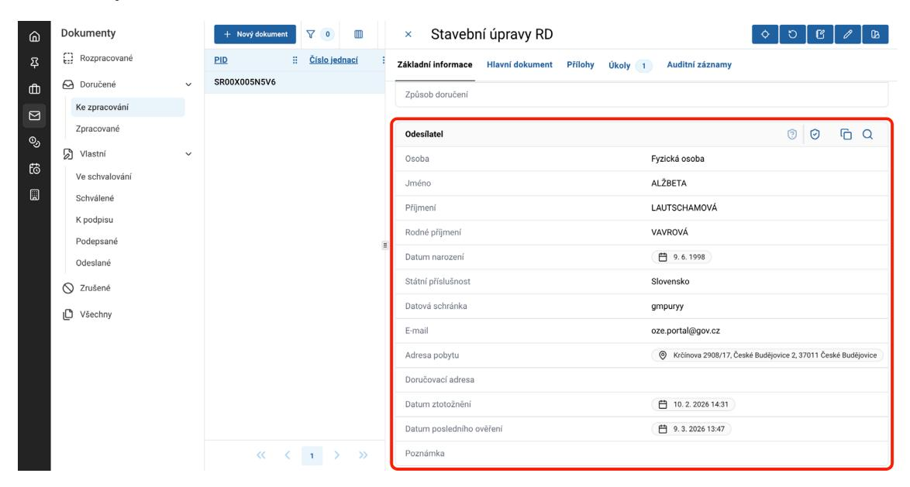](_page_3_Figure_9.jpeg)

Informace o ztotožnění je uvedena v auditním záznamu.

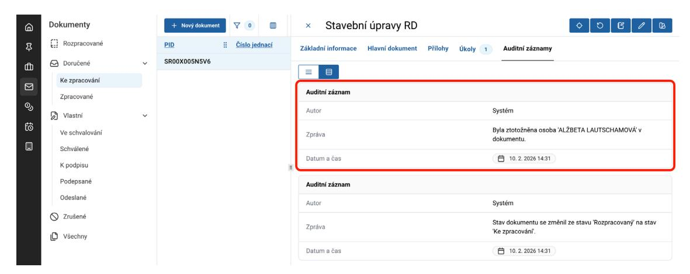

Po založení řízení či vložení žádosti do řízení je ztotožněná osoba odesílatele automaticky vložena do řízení.

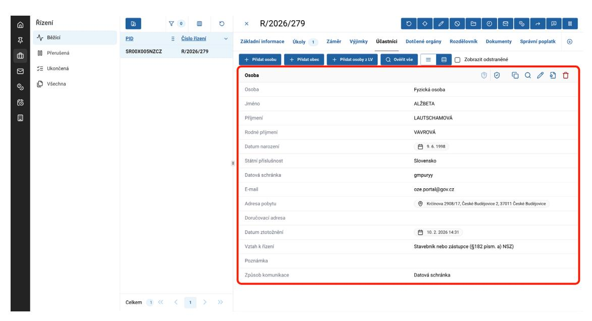

::: warning ODSTRANĚNÍ ODESÍLATELE
Pokud není odesílatel žádosti účastníkem řízení, **je nutné tuto osobu z řízení odstranit**. I po odstranění bude mít osoba viditelné řízení na Portálu stavebníka jakožto odesílatel.
:::

Při vytvoření doručeného dokumentu v ISSŘ je nutné odesílatele ověřit před založením řízení, jinak řízení na Portálu stavebníka neuvidí. Pokud je ověřený v žádosti před založením řízení, ověření se automaticky přenese do řízení.

Pro přidání dalších účastníků v daném řízení, ve kterém vypravujete dokument, vyberte kartu `Účastníci`.

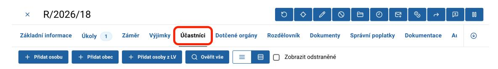

## 1.1 Přidání osoby do řízení

Vyberte tlačítko `+ Přidat osobu`.

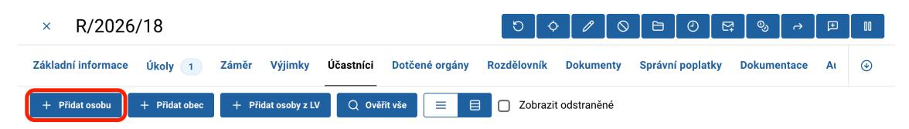

Zde vyplňte požadované údaje o druhu osoby (stavebník nebo zástupce, vlastník/oprávněný k pozemku nebo stavbě, soused, jiný). Dále vyberte, o jakou osobu se jedná (fyzická, právnická, fyzická osoba podnikající) a potvrďte.

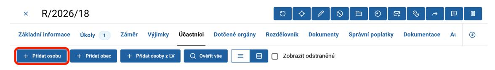

### Fyzická osoba a fyzická osoba podnikající

Po výběru osoby Fyzická osoba či Fyzická osoba podnikající se vám zobrazí další karty po vyplnění údajů.

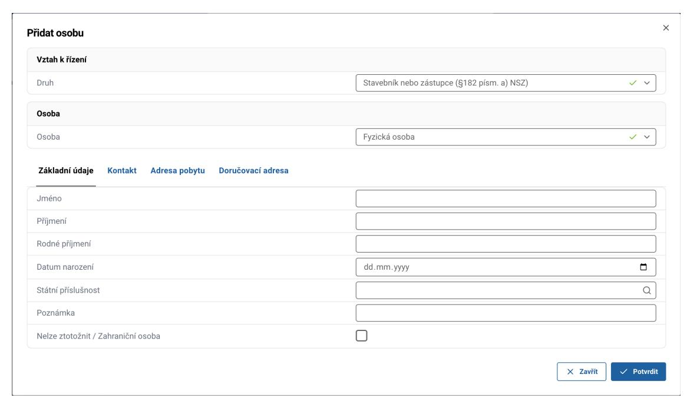

Vyplňte kartu `Základní údaje`. 

::: info ZAHRANIČNÍ OSOBA
V případě, že se jedná o zahraniční osobu či o osobu, kterou z jiného důvodu nelze ztotožnit, zaškrtněte příslušný checkbox `Nelze ztotožnit / Zahraniční osoba`. Tyto osoby nelze ztotožnit, jelikož ztotožnění probíhá vůči českým základním registrům.
:::

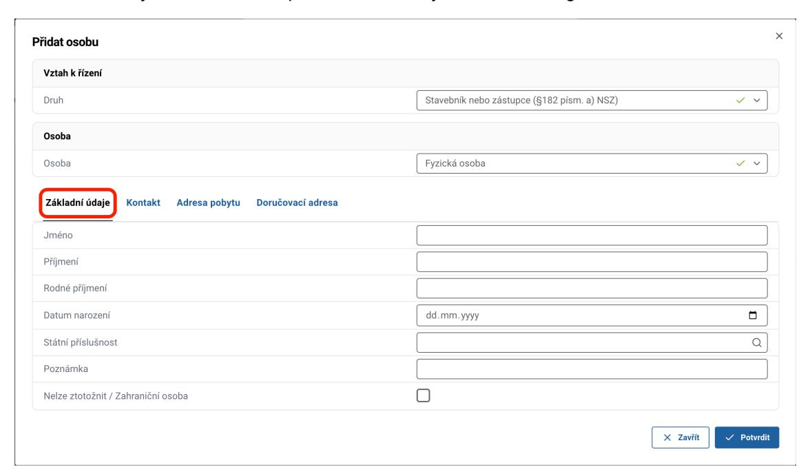

Dále vyplňte kartu `Adresa pobytu`. Zde zadejte adresu pobytu daného účastníka. V případě, že se jedná o zahraniční adresu, zaškrtněte checkbox `Zahraniční adresa` (následně se zobrazí další pole, která je nezbytné vyplnit pro úplnost zahraniční adresy a následné vypravení).

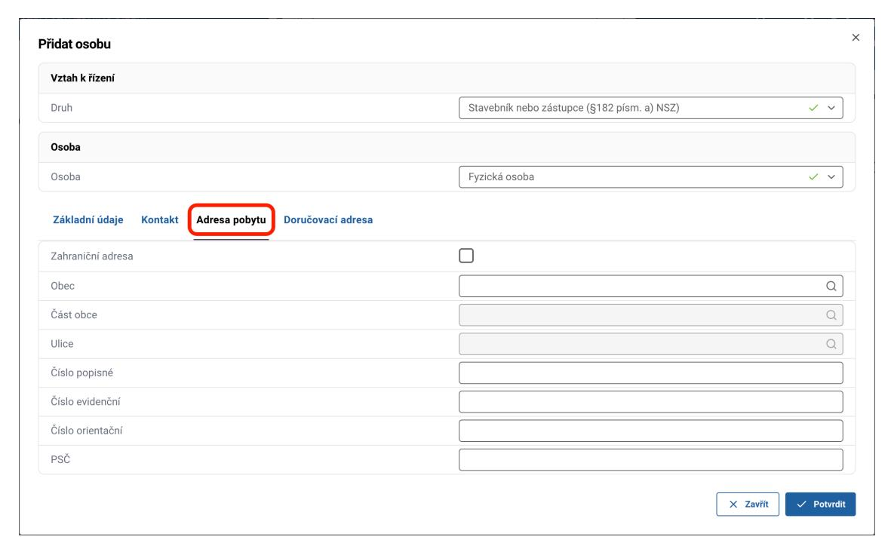

V případě, že byla sdělena doručovací adresa, vyplňte kartu `Doručovací adresa` (v tomto případě zkontrolujte, že máte v části **Způsob komunikace** vybránu možnost `Poštou na doručovací adresu`). I v tomto případě zaškrtněte checkbox `Zahraniční adresa` pro možnost zadání plné adresy, pakliže je doručovací adresa v zahraničí.

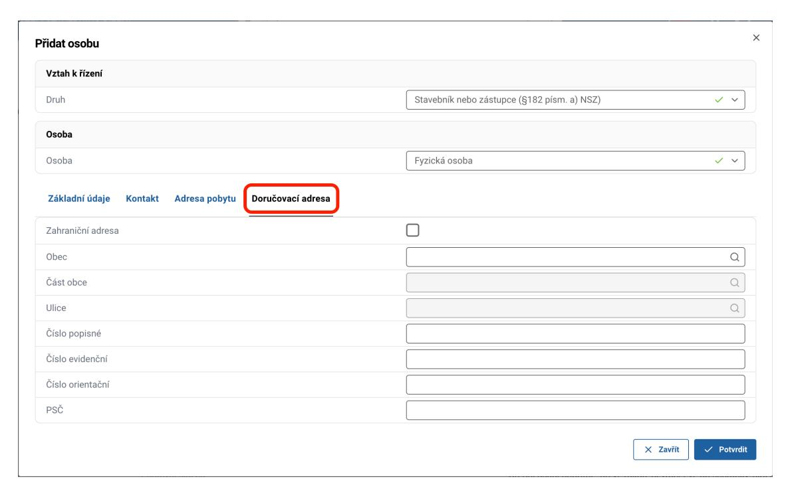

### Právnická osoba

Po výběru osoby Právnická osoba se Vám zobrazí další karty pro vyplnění údajů. Tyto karty jsou totožné jako v případě Fyzické osoby s následujícími dvěma rozdíly:

1. Na kartě `Základní údaje` je k dispozici řádek **K rukám**. Toto pole umožňuje specifikovat osobu, které má být zásilka předána. Jedná se o nepovinné pole, u kterého se vyplněný text následně přenese na obálku vypravených dokumentů (propíše se pouze vyplněný text, nikoli samotné spojení "K rukám").
2. Je viditelná karta `Oprávněná osoba`. V této kartě vyplňte údaje Oprávněné osoby (pokud ji právnická osoba má).

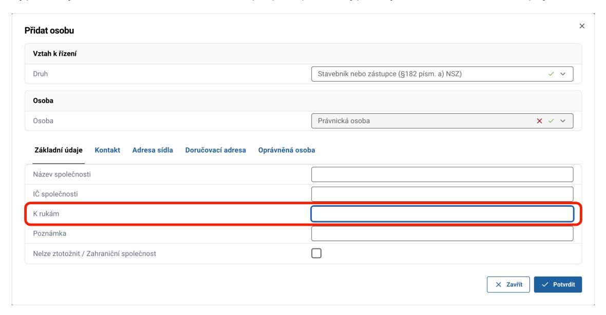
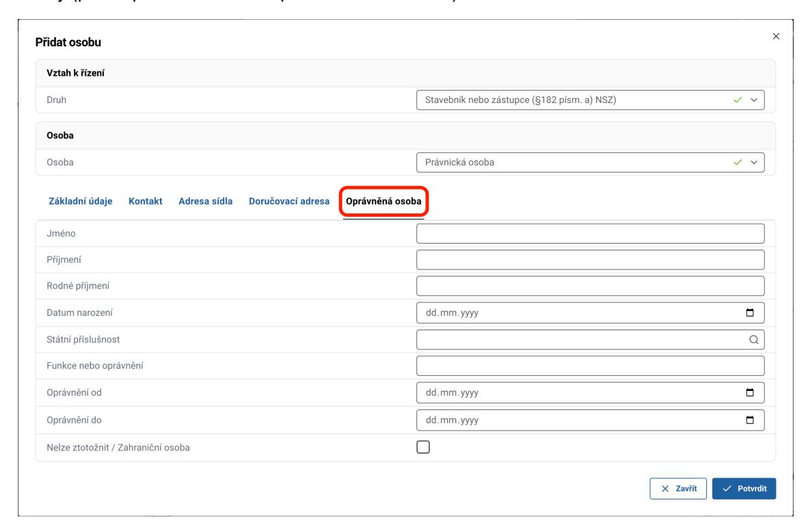

## 1.2 Přidání obce do řízení

Vyberte tlačítko `+ Přidat obec`.

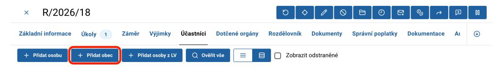

Vyberte příslušný obecní úřad. Po jeho výběru a potvrzení se úřad zobrazí na příslušné kartě. Dané obce a jejich úřady mají nastavena data a není potřeba je upravovat.

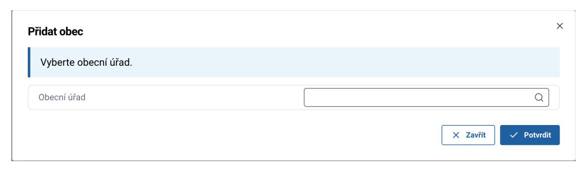
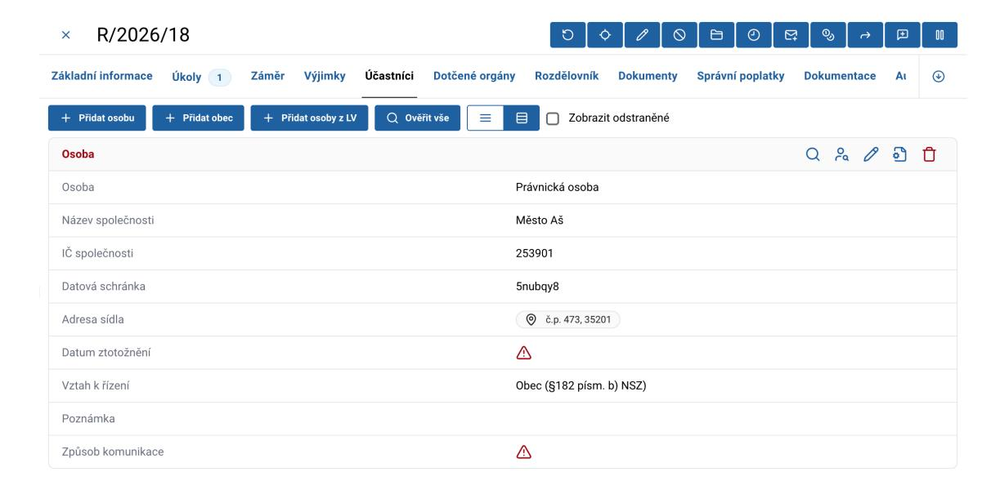
