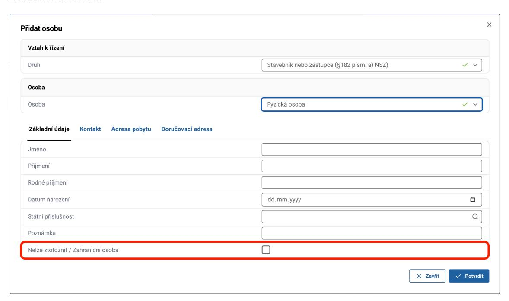
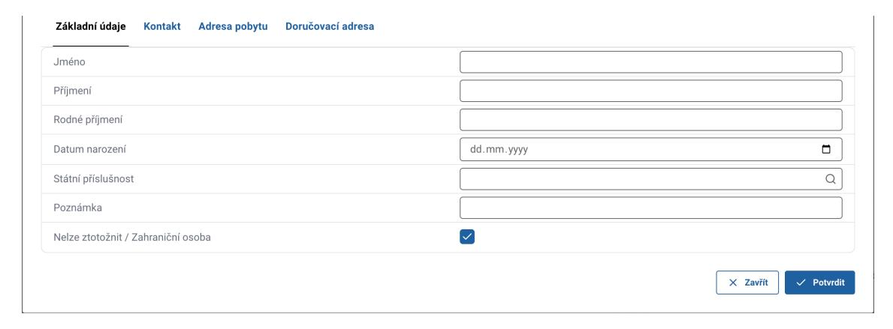
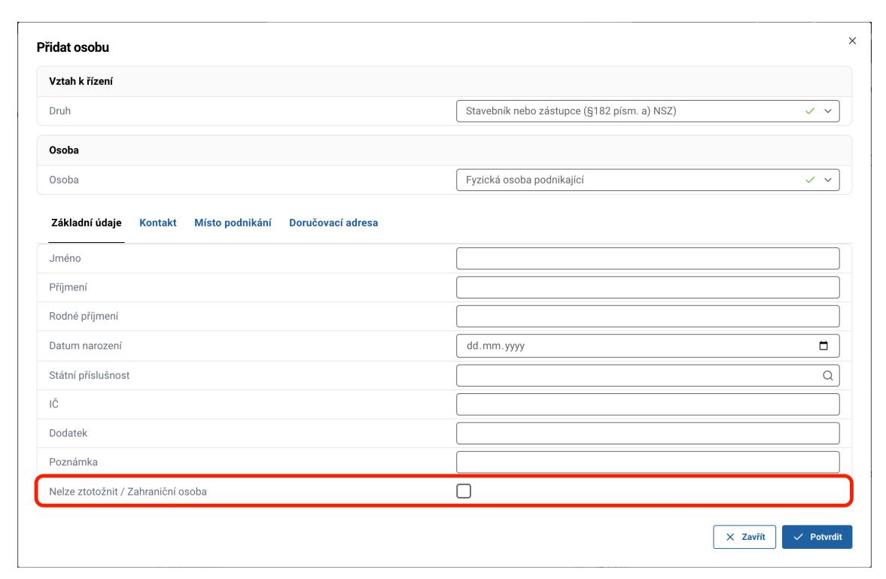
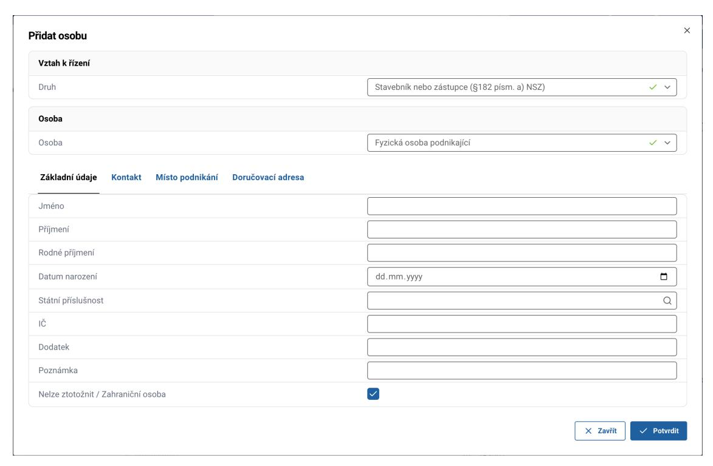
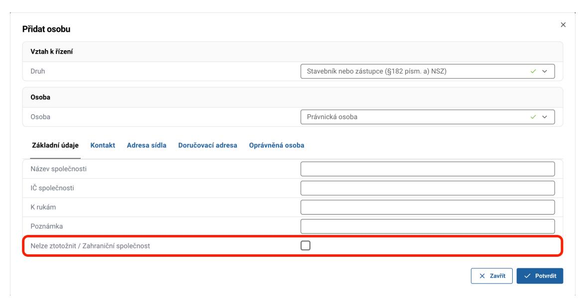
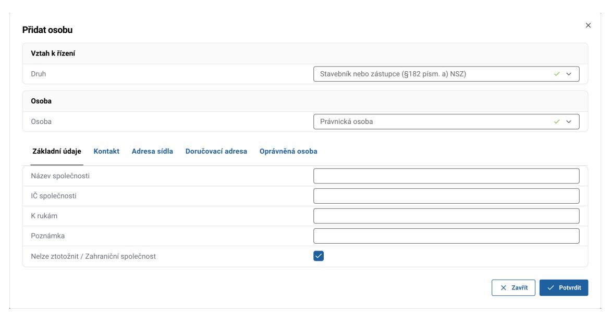
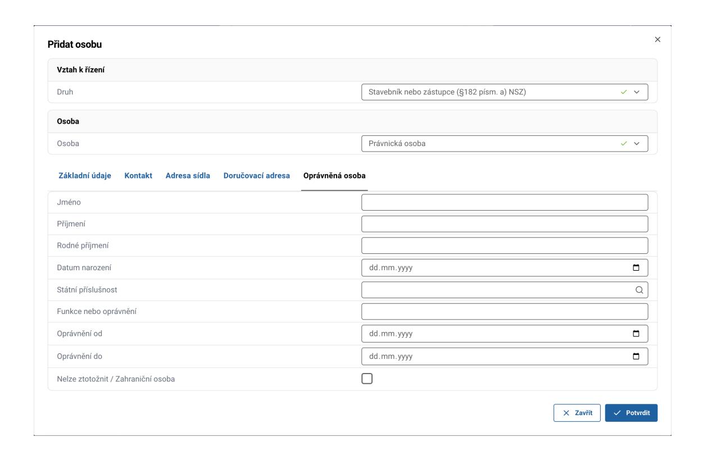
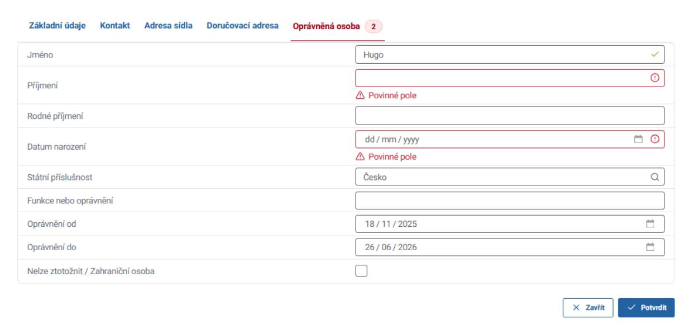
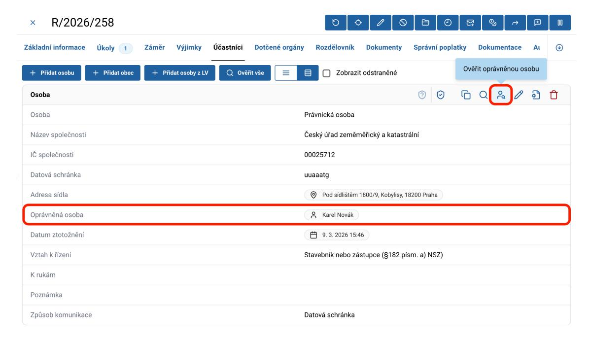

# 3. Zahraniční osoby

V této sekci jsou představeny náležitosti práce se zahraničními osobami v ISSŘ. Přidání nebo úprava zahraniční osoby se provádí stejným způsobem jako u českých osob.

::: warning ZVÝŠENÁ POZORNOST
Ověření zahraničních osob systémem není možné, jelikož systém je napojený pouze na české registry. **Věnujte proto, prosíme, zvýšenou pozornost při vyplňování nebo úpravě zahraničních osob.** Po přidání osoby a jejím označení jako zahraniční je tato osoba v systému označená zeleně jako "ověřená", aby bylo možné této osobě vypravit dokument.
:::

Určení osoby nebo adresy jako zahraniční se týká vždy pouze dané položky. Je tedy možné tvořit a spravovat i české osoby se zahraničními adresami a zahraniční osoby s českými adresami.

## 3.1 Fyzická osoba

Označení FO jako zahraniční provedete zaškrtnutím checkboxu `Nelze ztotožnit / Zahraniční osoba`.

U zahraniční fyzické osoby je nutné vyplnit pole: **Jméno, Příjmení a Datum narození**. Další položky vyplňujete dle uvážení.

## 3.2 Fyzická osoba podnikající

Označení FOP jako zahraniční provedete zaškrtnutím stejného checkboxu.

U zahraniční FOP je nutné vyplnit pole: **Jméno, Příjmení a IČ**. Další položky vyplňujete dle uvážení.

## 3.3 Právnická osoba

Označení PO jako zahraniční provedete zaškrtnutím checkboxu `Nelze ztotožnit / Zahraniční společnost`.

U zahraniční PO je nutné vyplnit pole: **Název společnosti a IČ**. Další položky vyplňujete dle uvážení.

## 3.4 Oprávněná osoba právnické osoby

Některé právnické osoby mají určenou oprávněnou osobu, která jménem těchto právnických osob jedná. Přidává se v záložce `Oprávněná osoba`.

Při přidání nebo úpravě oprávněné osoby k PO byla doplněna validace povinných údajů. Systém vyžaduje:
- jméno
- příjmení
- datum narození

::: danger POVINNÉ ÚDAJE OPRÁVNĚNÉ OSOBY
Pokud je vyplněn alespoň jeden z těchto údajů, systém nedovolí potvrdit formulář, dokud nebudou doplněny všechny tři povinné údaje. Pokud není vyplněn žádný z údajů, formulář lze uložit – znamená to, že oprávněná osoba není zadána.
:::

Oprávněnou osobu je také možné následně ověřit pomocí tlačítka `Ověřit oprávněnou osobu` nebo označit jako osobu zahraniční pomocí checkboxu `Nelze ztotožnit/Zahraniční osoba`.

