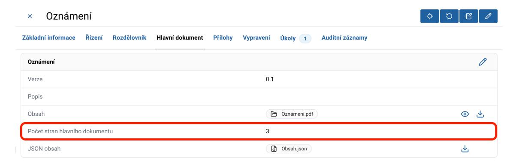
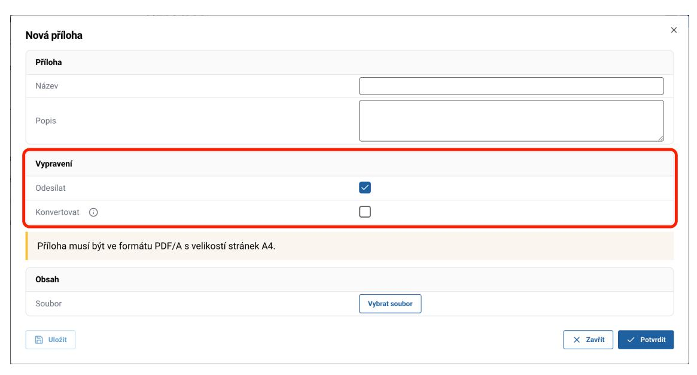
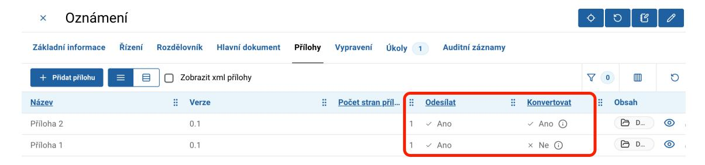
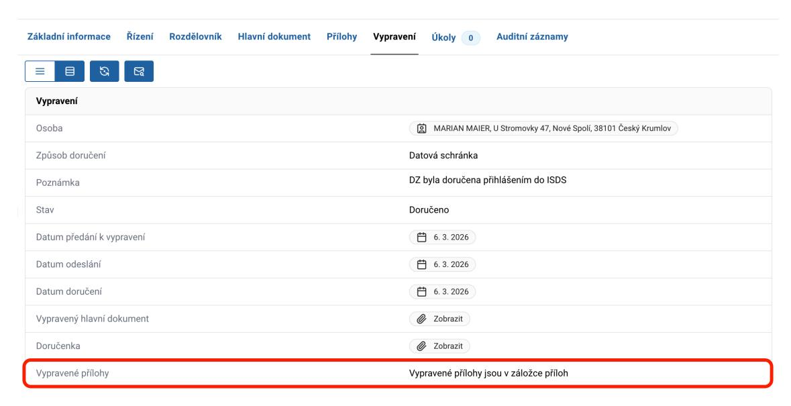
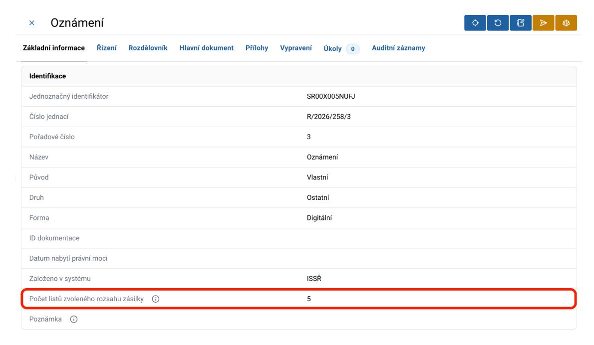
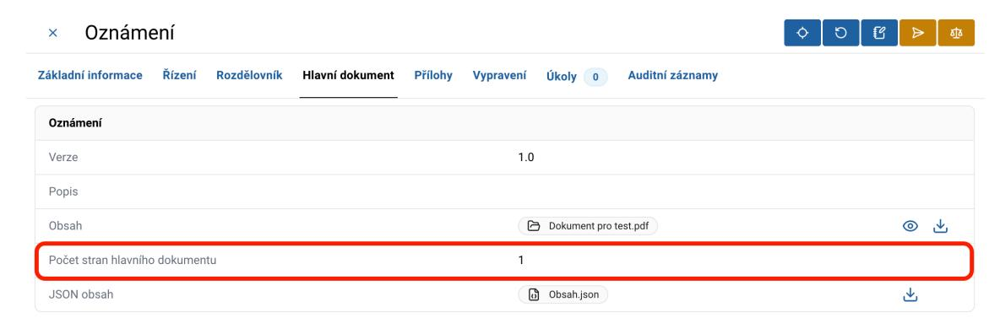
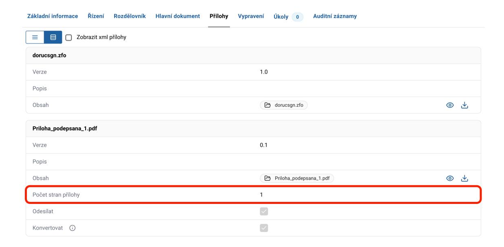

# 6. Obsah vypravení

## 6.1 Vypravení hlavního dokumentu

U hlavního dokumentu je automaticky nastaven atribut Odesílat a atribut Konvertovat. To znamená, že je hlavní dokument vždy vypraven a konvertován. Výchozí nastavení nejsou zobrazené a nelze je měnit.

Počet stran hlavního dokumentu se zobrazuje na záložce Hlavní dokument pod řádkem Obsah v poli Počet stran hlavního dokumentu.

## 6.2 Vypravení příloh

V ISSŘ je k dispozici možnost odesílat přílohy společně s hlavním dokumentem při vypravení vlastních dokumentů přes HKP i dalšími způsoby komunikace. Autorizovaná konverze vyžaduje soubor podepsaný kvalifikovaným elektronickým podpisem. Nepodepsané přílohy nebude možné přes HKP vypravit. Podpis je nutné provést mimo aplikaci.

U příloh je automaticky nastaven atribut Odesílat, ale vypnut atribut Konvertovat. To znamená, že bez změny nastavení budou přílohy vypraveny bez konverze. Výchozí nastavení lze změnit.

U přílohy lze nastavit:
- Atribut Odesílat = zda se má příloha odeslat
- Atribut Konvertovat = zda se má provést autorizovaná konverze, v tomto případě je třeba, aby byl soubor přílohy podepsaný

V záložce Přílohy se také zobrazují atributy "Odesílat" a "Konvertovat" u vlastních dokumentů, které v režimu tabulky lze běžným způsobem filtrovat, řadit a přesouvat.

U vypravených příloh se zobrazuje upozornění: "Vypravené přílohy jsou v záložce příloh".

Nastavení atributů Odesílat a Konvertovat se projeví ve všech vypraveních. Ve většině případů není nutné přílohy konvertovat. Konverze je nutná pouze v některých situacích, například při zaslání stejnopisu rozhodnutí.

Nelze nastavit Konvertovat = ANO, pokud je Odesílat = NE.

Pokud vypravení selže například z důvodu nevalidní přílohy nebo chyby konverze, zásilka se nevypraví a stav je evidován v ISSŘ jako Vrácená. Věnujte, prosím, zvýšenou opatrnost při nastavení konverze u příloh. Přílohy, které si přejete konvertovat, je nutné vložit do dokumentu již podepsané.

## 6.3 Počet listů pro vypravení

Počet listu je důležitý ukazatel pro vypravení HKP. V případě, že by byl tento limit překročen, dokument již nebude možné vypravit pomocí HKP, ale bude nutné použít ruční vypravení.

Protože tisk pro vypravení pomocí HKP probíhá oboustranně, je limit počtu listů pro vypravení pomocí HKP 99 listů pro zásilky v rámci ČR a EU nebo 8 listů pro zásilky mimo EU, přičemž 1 strana je vyhrazena pro konverzní doložku.

Poznámka k rozdílu mezi stranou a listem:
- Strana = jedna tištěná strana dokumentu (např. A4).
- List = fyzický papír, který může obsahovat 2 strany (přední a zadní).

Na záložce Základní informace u vlastních dokumentů je k dispozici pole "Počet listů zvoleného rozsahu zásilky", který uvádí celkový počet fyzických listů pro vypravení přes HKP.

Hodnota zahrnuje:
- počet listů hlavního dokumentu
- počet listů jednotlivých příloh
- jeden list navíc za každou konverzní doložku u příloh

Na záložce Hlavní dokument se zobrazuje Počet stran hlavního dokumentu.

Na záložce Přílohy je pro každou přílohu k dispozici řádek "Počet stran přílohy", který zobrazuje počet stran dané přílohy.

