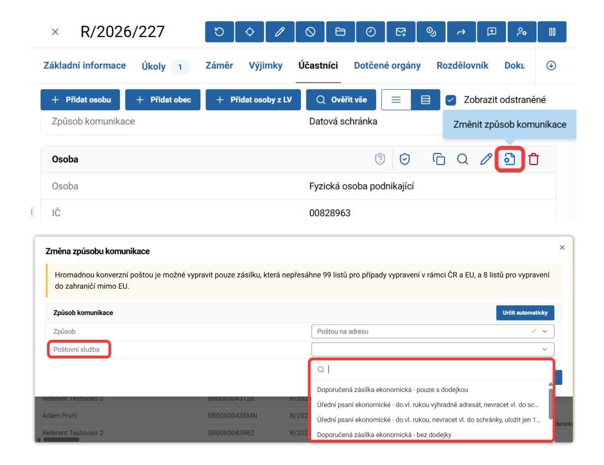

# 8. Vypravování službou HKP

Doručování prostřednictvím Hybridní konverzní pošty (HKP) bylo dříve hrazeno MMR. **Pokud chce úřad nadále tuto službu využívat, je třeba uzavřít s Českou poštou smlouvu na vlastní náklady.**

V případě, že úřad nemá smlouvu a je zvolen způsob poštou, systém přepne na **ruční vypravení**. Pokud již úřad smlouvu má, je třeba kontaktovat Českou poštu, která MMR předá ID pro zavedení do ISSŘ. 

## 8.1 Ekonomické varianty poštovních služeb

Z nabídky poštovních služeb jsou dostupné čtyři varianty ekonomického zasílání, které šetří náklady úřadu.

::: tip DOSTUPNÉ EKONOMICKÉ VARIANTY
* Doporučená zásilka ekonomická – pouze s dodejkou
* Doporučená zásilka ekonomická – bez dodejky
* Úřední psaní ekonomické – do vl. rukou, nevracet vl. do schránky, uložit jen 10 dnů
* Úřední psaní ekonomické – do vl. rukou výhradně adresát, nevracet, uložit jen 10 dnů
:::

Pokud není u osoby evidována datová schránka, systém automaticky jako výchozí nastaví ekonomickou variantu `Úřední psaní ekonomické – do vl. rukou, nevracet...`.

::: info EKONOMICKÝ VS. PRIORITNÍ REŽIM
Rozdíl je v ceně a v rychlosti doručení. Volba režimu **nemá vliv na právní účinky doručení**. Nové ekonomické varianty jsou dostupné pouze pro vypravení přes HKP (poštou na adresu).
:::
