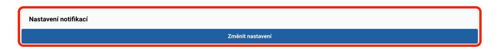
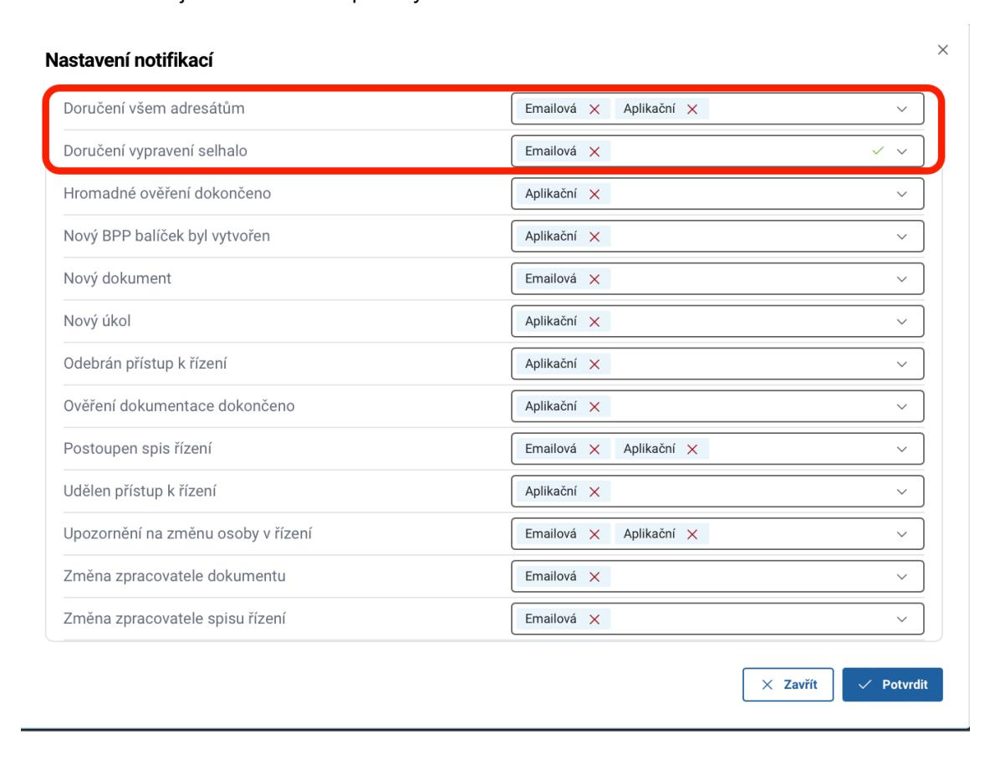

# 16. Notifikace

V ISSŘ lze nastavit notifikaci upozorňující na události při vypravení dokumentu. Každý uživatel si může zvolit způsob doručení notifikace v sekci Uživatelský účet – Nastavení notifikací:
- aplikační upozornění přímo v systému ISSŘ prostřednictvím centra notifikací,
- e-mailová upozornění zasláno na e-mail uživatele.

Je možné zvolit jeden nebo oba způsoby zároveň.

## 16.1 Notifikace o selhání vypravení

Pokud má spisová služba u dokumentu stav vypravení "vráceno – jiný důvod (neověřeno)", notifikace je automaticky odeslána jak zpracovateli dokumentu, tak i vedoucímu příslušného úřadu.

## 16.2 Notifikace o doručení všem adresátům

Je možné také nastavit notifikaci o doručení všem adresátům, která zpracovateli dokumentu oznámí okamžik, kdy jsou všechna vypravení u daného dokumentu doručena.
