# **Vypravování dokumentů**

**Informační systém stavebního řízení**

## Obsah

| 1. Přidání osoby do řízení a její nastavení       4         1.1 Přidání osoby do řízení       6         1.2 Přidání obce do řízení       9         2. Ověření       9         2. Ověření osoby       10         2.1 Ověření osoby se shodným jménem a datem narození       12         2.3 Ověření oprávněné osoby       14         2.4 Zobrazení informace o úmrtí osoby       14         2.5 Ověření obce       16         2.6 Hromadné ověření       16         2.7 Zlotožněná data       17         2.8 Upozomění na rozdílná data ze záměru vs. ztotožněná data       17         2.9 Data ze záměru vs. ztotožněná data – záložka dotčené orgány       19         3. Zahraniční osoby       19         3.1 Fyzická osoba podnikající       20         3.2 Fyzická osoba podnikající       21         3.3 Přávnická osoba       22         3.4 Oprávněná osoba právnické osoby       22         4. Způsob komunikace       24         5. Podmínky vypravení       29         6. Obsah vypravení přiloh       29         6. J Vypravení přiloh       29         6. J Vypravení ozahraničí       33         7. Vypravení ozahraničí       36         8. Vypravování ozakázaných zemí       36         | Úvod      |                                                             | 4  |  |  |  |
|--------------------------------------------------------------------------------------------------------------------------------------------------------------------------------------------------------------------------------------------------------------------------------------------------------------------------------------------------------------------------------------------------------------------------------------------------------------------------------------------------------------------------------------------------------------------------------------------------------------------------------------------------------------------------------------------------------------------------------------------------------------------------------------------------------------------------------------------------------------------------------------------------------------------------------------------------------------------------------------------------------------------------------------------------------------------------------------------------------------------------------------------------------------------------------------------------------|-----------|-------------------------------------------------------------|----|--|--|--|
| 1.2 Přidání obce do řízení       9         2. Ověření       10         2.1 Ověření osoby       10         2.2 Ověření osob se shodným jménem a datem narození       12         2.3 Ověření oprávněné osoby       14         2.4 Zobrazení informace o úmrtí osoby       14         2.5 Ověření obce       16         2.6 Hromadné ověření       16         2.7 Ztotožněná data       17         2.8 Upozornění na rozdílná data ze záměru vs. ztotožněná data       17         2.9 Data ze záměru vs. ztotožněná data – záložka dotčené orgány       19         3. Zahraniční osoby       19         3.1 Fyzická osoba       20         3.2 Fyzická osoba podnikající       21         3.3 Právnická osoba podnikající       21         3.3 Právnická osoba podnikající       22         4. Způsob komunikace       24         5. Podmínky vypravení       27         6. Obsah vypravení       29         6.1 Vypravení příloh       29         6.2 Vypravení do zahraničí       33         7.1 Způsob komunikace       33         7.2 Zahraniční adresy       34         7.3 Vypravování službou HKP       37         9. Ruční vypravení       38         10. Tisk adres na obálky<                   | 1. Přidár | ıí osoby do řízení a její nastavení                         | 4  |  |  |  |
| 2. Ověření soby.       10         2.1 Ověření osoby.       10         2.2 Ověření osob se shodným jménem a datem narození       12         2.3 Ověření oprávněné osoby.       14         2.4 Zobrazení informace o úmrtí osoby       14         2.5 Ověření obce.       16         2.6 Hromadné ověření       16         2.7 Ztotožněná data       17         2.8 Upozomění na rozdílná data ze záměru vs. ztotožněná data       17         2.9 Data ze záměru vs. ztotožněná data – záložka dotčené orgány       19         3.1 Fyzická osoba       20         3.2 Fyzická osoba –       20         3.2 Fyzická osoba –       22         3.3 Právnická osoba právnické osoby       22         4. Způsob komunikace       24         5. Podmínky vypravení       27         6. Obsah vypravení       29         6.1 Vypravení hlavního dokumentu       29         6.2 Vypravení příloh       29         6.3 Počet listů pro vypravení       31         7. Vypravení dozahraničí       33         7. Vypravování dozakázaných zemí       36         8. Vypravování službou HKP       37         9. Ruční vypravení       36         8. Vypravovní obálky       43         10. Tisk ad                   | 1.1       | Přidání osoby do řízení                                     | 6  |  |  |  |
| 2.1 Ověření osoby       10         2.2 Ověření osob se shodným jménem a datem narození       12         2.3 Ověření oprávněné osoby       14         2.4 Zobrazení informace o úmrtí osoby       14         2.5 Ověření obce       16         2.6 Hromadné ověření       16         2.7 Ztotožněná data       17         2.8 Upozornění na rozdílná data ze záměru vs. ztotožněná data       17         2.9 Data ze záměru vs. ztotožněná data – záložka dotčené orgány       19         3. Zahraniční osoby       19         3.1 Fyzická osoba       20         3.2 Fyzická osoba podnikající       21         3.3 Právnická osoba právnické osoby       22         4. Způsob komunikace       24         5. Podmínky vypravení       27         6. Obsah vypravení       27         6. Obsah vypravení hlavního dokumentu       29         6.2 Vypravení příloh       29         6.3 Počet listů pro vypravení       31         7. Způsob komunikace       33         7. Způsob komunikace       33         7. Způsob komunikace       34         7. Způsob komunikace       35         7. Způsob komunikace       36         8. Vypravení do zakázaných zemí       36         8.                    | 1.2       | Přidání obce do řízení                                      | 9  |  |  |  |
| 2.2 Ověření osob se shodným jměnem a datem narození.       12         2.3 Ověření oprávněné osoby.       14         2.4 Zobrazení informace o úmrtí osoby       14         2.5 Ověření obce.       16         2.6 Hromadné ověření       16         2.7 Ztotožněná data       17         2.8 Upozornění na rozdílná data ze záměru vs. ztotožněná data       17         2.9 Data ze záměru vs. ztotožněná data – záložka dotčené orgány       19         3.1 Fyzická osoba       20         3.2 Fyzická osoba podnikající.       21         3.3 Právnická osoba právnické osoby       22         4 Způsob komuníkace       24         5. Podmínky vypravení       27         6. Obsah vypravení hlavního dokumentu       29         6.2 Vypravení příloh       29         6.3 Počet listů pro vypravení       31         7. Vypravení do zahraničí       33         7.1 Způsob komunikace       33         7.2 Zahraniční adresy       34         7.3 Vypravování službou HKP       37         9. Ruční vypravení       36         8. Vypravování službou HKP       37         9. Ruční vypravení       38         10. Tisk adres na obálky       43         11. Vypravení ophavení obkumentu       49 | 2. Ověře  | ní                                                          | 10 |  |  |  |
| 2.3       Ověření oprávněné osoby       14         2.4       Zobrazení informace o úmrtí osoby       14         2.5       Ověření obce       16         2.6       Hromadné ověření       16         2.7       Zlotožněná data       17         2.8       Upozornění na rozdílná data ze záměru vs. ztotožněná data       17         2.9       Data ze záměru vs. ztotožněná data – záložka dotčené orgány       19         3. Zahraniční osoby       19         3.1       Fyzická osoba       20         3.2       Fyzická osoba podnikající       21         3.3       Právnická osoba       22         3.4       Oprávněná osoba právnické osoby       22         4. Způsob komunikace       24         5. Podmínky vypravení       27         6. Obsah vypravení příloh       29         6.2       Vypravení příloh       29         6.3       Počet listů pro vypravení       31         7. Vypravení do zahraničí       33         7.1       Způsob komunikace       33         7.2       Zahraniční adresy       34         7.3       Vypravování službou HKP       37         9. Ruční vypravení       98         10. Tísk adres na ob                                                          | 2.1       | Ověření osoby                                               | 10 |  |  |  |
| 2.4       Zobrazení informace o úmrtí osoby       14         2.5       Ověření obce       16         2.6       Hromadné ověření       16         2.7       Ztotožněná data       17         2.8       Upozornění na rozdílná data ze záměru vs. ztotožněná data       17         2.9       Data ze záměru vs. ztotožněná data – záložka dotčené orgány       19         3. Zahraniční osoby       19         3.1       Fyzická osoba       20         3.2       Fyzická osoba podnikající       21         3.3       Právnická osoba právnické osoby       22         4. Způsob komunikace       24         5. Podmínky vypravení       27         6. Obsah vypravení       29         6.1       Vypravení hlavního dokumentu       29         6.2       Vypravení příloh       29         6.3       Počet lištů pro vypravení       31         7. Vypravení do zahraničí       33         7.1       Způsob komunikace       33         7.2       Zahraniční adresy       34         7.3       Vypravování službou HKP       37         9. Ruční vypravení       38         10. Tísk adres na obálky       43         11. Vypravení – převzetí osobně<                                                 | 2.2       | Ověření osob se shodným jménem a datem narození             | 12 |  |  |  |
| 2.5       Ověření obce.       16         2.6       Hromadné ověření       16         2.7       Ztotožněná data       17         2.8       Upozornění na rozdílná data ze záměru vs. ztotožněná data       17         2.9       Data ze záměru vs. ztotožněná data – záložka dotčené orgány       19         3. Zahraniční osoby       19         3.1       Fyzická osoba       20         3.2       Fyzická osoba podnikající       21         3.3       Právnická osoba       22         3.4       Oprávněná osoba právnické osoby       22         4. Způsob komunikace       24         5. Podmínky vypravení       27         6. Obsah vypravení       29         6.1       Vypravení příloh       29         6.2       Vypravení příloh       29         6.3       Počet listů pro vypravení       31         7. Vypravení do zahraničí       33         7.1       Způsob komunikace       33         7.2       Zahraniční adresy       34         7.3       Vypravování službou HKP       37         9. Ruční vypravení       38         10. Tisk adres na obálky       43         11. Vypravení – převzetí osobně       44                                                                      | 2.3       | Ověření oprávněné osoby                                     | 14 |  |  |  |
| 2.6       Hromadné ověření       16         2.7       Ztotožněná data       17         2.8       Upozornění na rozdílná data ze záměru vs. ztotožněná data       17         2.9       Data ze záměru vs. ztotožněná data – záložka dotčené orgány       19         3. Zahraniční osoby       19         3.1       Fyzická osoba       20         3.2       Fyzická osoba podnikající       21         3.3       Právnická osoba       22         3.4       Oprávněná osoba právnické osoby       22         4. Způsob komunikace       24         5. Podmínky vypravení       27         6. Obsah vypravení hlavního dokumentu       29         6.1       Vypravení příloh       29         6.2       Vypravení příloh       29         6.3       Počet listů pro vypravení       31         7. Vypravení do zahraničí       33         7.1       Způsob komunikace       33         7.2       Zahraniční adresy       34         7.3       Vypravování do zakázaných zemí       36         8. Vypravování službou HKP       37         9. Ruční vypravení       98         10. Tisk adres na obálky       43         11. Vypravení vyhláškou       44                                                 | 2.4       | Zobrazení informace o úmrtí osoby                           | 14 |  |  |  |
| 2.7       Ztotožněná data       17         2.8       Upozornění na rozdílná data ze záměru vs. ztotožněná data       17         2.9       Data ze záměru vs. ztotožněná data – záložka dotčené orgány       19         3. Zahraniční osoby.       19         3.1       Fyzická osoba       20         3.2       Fyzická osoba podnikající       21         3.3       Právnická osoba       22         3.4       Oprávněná osoba právnícké osoby       22         4. Způsob komunikace       24         5. Podmínky vypravení       27         6. Obsah vypravení       29         6.1       Vypravení hlavního dokumentu       29         6.2       Vypravení příloh       29         6.3       Počet listů pro vypravení       31         7. Vypravení do zahraničí       33         7.1       Způsob komunikace       33         7.2       Zahraniční adresy       34         7.3       Vypravování do zakázaných zemí       36         8. Vypravování službou HKP       37         9. Ruční vypravení       38         10. Tisk adres na obálky       43         11. Vypravení – převzetí osobně       44         12. Vypravení vyhláškou       46                                                  | 2.5       | Ověření obce                                                | 16 |  |  |  |
| 2.8       Upozornění na rozdílná data ze záměru vs. ztotožněná data       17         2.9       Data ze záměru vs. ztotožněná data – záložka dotčené orgány       19         3. Zahraniční osoby.       19         3.1       Fyzická osoba       20         3.2       Fyzická osoba podnikající.       21         3.3       Právnická osoba.       22         3.4       Oprávněná osoba právnické osoby       22         4. Způsob komunikace.       24         5. Podmínky vypravení.       27         6. Obsah vypravení hlavního dokumentu       29         6.1       Vypravení příloh       29         6.3       Počet listů pro vypravení       31         7. Vypravení do zahraničí       33         7.1       Způsob komunikace       33         7.2       Zahraniční adresy       34         7.3       Vypravování do zakázaných zemí       36         8. Vypravování službou HKP       37         9. Ruční vypravení       43         10. Tisk adres na obálky       43         11. Vypravení – převzetí osobně       44         12. Vypravení vyhláškou       46         13. Opětovné vypravení dokumentu       49                                                                            | 2.6       | Hromadné ověření                                            | 16 |  |  |  |
| 2.9 Data ze záměru vs. ztotožněná data – záložka dotčené orgány       19         3. Zahraniční osoby       19         3.1 Fyzická osoba       20         3.2 Fyzická osoba podnikající       21         3.3 Právnická osoba       22         3.4 Oprávněná osoba právnické osoby       22         4. Způsob komunikace       24         5. Podmínky vypravení       27         6. Obsah vypravení       29         6.1 Vypravení příloh       29         6.2 Vypravení příloh       29         6.3 Počet listů pro vypravení       31         7. Vypravení do zahraničí       33         7.1 Způsob komunikace       33         7.2 Zahraniční adresy       34         7.3 Vypravování službou HKP       36         8. Vypravování službou HKP       37         9. Ruční vypravení       43         10. Tisk adres na obálky       43         11. Vypravení – převzetí osobně       44         12. Vypravení vyhláškou       46         13. Opětovné vypravení dokumentu       49                                                                                                                                                                                                                      | 2.7       | Ztotožněná data                                             | 17 |  |  |  |
| 3. Zahraniční osoby       19         3.1 Fyzická osoba       20         3.2 Fyzická osoba podnikající       21         3.3 Právnická osoba       22         3.4 Oprávněná osoba právnické osoby       22         4. Způsob komunikace       24         5. Podmínky vypravení       27         6. Obsah vypravení       29         6.1 Vypravení příloh       29         6.2 Vypravení příloh       29         6.3 Počet listů pro vypravení       31         7. Vypravení do zahraničí       33         7.1 Způsob komunikace       33         7.2 Zahraniční adresy       34         7.3 Vypravování do zakázaných zemí       36         8. Vypravování službou HKP       37         9. Ruční vypravení       38         10. Tisk adres na obálky       43         11. Vypravení – převzetí osobně       44         12. Vypravení vyhláškou       46         13. Opětovné vypravení dokumentu       49                                                                                                                                                                                                                                                                                                | 2.8       | Upozornění na rozdílná data ze záměru vs. ztotožněná data   | 17 |  |  |  |
| 3.1 Fyzická osoba       20         3.2 Fyzická osoba podnikající       21         3.3 Právnická osoba       22         3.4 Oprávněná osoba právnické osoby       22         4. Způsob komunikace       24         5. Podmínky vypravení       27         6. Obsah vypravení       29         6.1 Vypravení příloh       29         6.2 Vypravení příloh       29         6.3 Počet listů pro vypravení       31         7. Vypravení do zahraničí       33         7.1 Způsob komunikace       33         7.2 Zahraniční adresy       34         7.3 Vypravování do zakázaných zemí       36         8. Vypravování službou HKP       37         9. Ruční vypravení       38         10. Tisk adres na obálky       43         11. Vypravení – převzetí osobně       44         12. Vypravení vyhláškou       46         13. Opětovné vypravení dokumentu       49                                                                                                                                                                                                                                                                                                                                     | 2.9       | Data ze záměru vs. ztotožněná data – záložka dotčené orgány | 19 |  |  |  |
| 3.2 Fyzická osoba podnikající       21         3.3 Právnická osoba       22         3.4 Oprávněná osoba právnické osoby       22         4. Způsob komunikace       24         5. Podmínky vypravení       27         6. Obsah vypravení       29         6.1 Vypravení hlavního dokumentu       29         6.2 Vypravení příloh       29         6.3 Počet listů pro vypravení       31         7. Vypravení do zahraničí       33         7.1 Způsob komunikace       33         7.2 Zahraniční adresy       34         7.3 Vypravování do zakázaných zemí       36         8. Vypravování službou HKP       37         9. Ruční vypravení       38         10. Tisk adres na obálky       43         11. Vypravení – převzetí osobně       44         12. Vypravení vyhláškou       46         13. Opětovné vypravení dokumentu       49                                                                                                                                                                                                                                                                                                                                                            | 3. Zahrai | niční osoby                                                 | 19 |  |  |  |
| 3.3 Právnická osoba       22         3.4 Oprávněná osoba právnícké osoby       22         4. Způsob komunikace       24         5. Podmínky vypravení       27         6. Obsah vypravení       29         6.1 Vypravení příloh       29         6.2 Vypravení příloh       29         6.3 Počet listů pro vypravení       31         7. Vypravení do zahraničí       33         7.1 Způsob komunikace       33         7.2 Zahraniční adresy       34         7.3 Vypravování do zakázaných zemí       36         8. Vypravování službou HKP       37         9. Ruční vypravení       38         10. Tisk adres na obálky       43         11. Vypravení – převzetí osobně       44         12. Vypravení vyhláškou       46         13. Opětovné vypravení dokumentu       49                                                                                                                                                                                                                                                                                                                                                                                                                       | 3.1       | Fyzická osoba                                               | 20 |  |  |  |
| 3.4 Oprávněná osoba právnické osoby       22         4. Způsob komuníkace       24         5. Podmínky vypravení       27         6. Obsah vypravení       29         6.1 Vypravení hlavního dokumentu       29         6.2 Vypravení příloh       29         6.3 Počet listů pro vypravení       31         7. Vypravení do zahraničí       33         7.1 Způsob komunikace       33         7.2 Zahraniční adresy       34         7.3 Vypravování do zakázaných zemí       36         8. Vypravování službou HKP       37         9. Ruční vypravení       38         10. Tisk adres na obálky       43         11. Vypravení – převzetí osobně       44         12. Vypravení vyhláškou       46         13. Opětovné vypravení dokumentu       49                                                                                                                                                                                                                                                                                                                                                                                                                                                | 3.2       | Fyzická osoba podnikající                                   | 21 |  |  |  |
| 4. Způsob komunikace       24         5. Podmínky vypravení       27         6. Obsah vypravení       29         6.1 Vypravení příloh       29         6.2 Vypravení příloh       29         6.3 Počet listů pro vypravení       31         7. Vypravení do zahraničí       33         7.1 Způsob komunikace       33         7.2 Zahraniční adresy       34         7.3 Vypravování do zakázaných zemí       36         8. Vypravování službou HKP       37         9. Ruční vypravení       38         10. Tisk adres na obálky       43         11. Vypravení – převzetí osobně       44         12. Vypravení vyhláškou       46         13. Opětovné vypravení dokumentu       49                                                                                                                                                                                                                                                                                                                                                                                                                                                                                                                 | 3.3       | Právnická osoba                                             | 22 |  |  |  |
| 5. Podmínky vypravení       27         6. Obsah vypravení       29         6.1 Vypravení hlavního dokumentu       29         6.2 Vypravení příloh       29         6.3 Počet listů pro vypravení       31         7. Vypravení do zahraničí       33         7.1 Způsob komunikace       33         7.2 Zahraniční adresy       34         7.3 Vypravování do zakázaných zemí       36         8. Vypravování službou HKP       37         9. Ruční vypravení       38         10. Tisk adres na obálky       43         11. Vypravení – převzetí osobně       44         12. Vypravení vyhláškou       46         13. Opětovné vypravení dokumentu       49                                                                                                                                                                                                                                                                                                                                                                                                                                                                                                                                           | 3.4       | Oprávněná osoba právnické osoby                             | 22 |  |  |  |
| 6. Obsah vypravení       29         6.1 Vypravení hlavního dokumentu       29         6.2 Vypravení příloh       29         6.3 Počet listů pro vypravení       31         7. Vypravení do zahraničí       33         7.1 Způsob komunikace       33         7.2 Zahraniční adresy       34         7.3 Vypravování do zakázaných zemí       36         8. Vypravování službou HKP       37         9. Ruční vypravení       38         10. Tisk adres na obálky       43         11. Vypravení – převzetí osobně       44         12. Vypravení vyhláškou       46         13. Opětovné vypravení dokumentu       49                                                                                                                                                                                                                                                                                                                                                                                                                                                                                                                                                                                  | 4. Způso  | b komunikace                                                | 24 |  |  |  |
| 6.1       Vypravení hlavního dokumentu       29         6.2       Vypravení příloh       29         6.3       Počet listů pro vypravení       31         7. Vypravení do zahraničí       33         7.1       Způsob komunikace       33         7.2       Zahraniční adresy       34         7.3       Vypravování do zakázaných zemí       36         8. Vypravování službou HKP       37         9. Ruční vypravení       38         10. Tisk adres na obálky       43         11. Vypravení – převzetí osobně       44         12. Vypravení vyhláškou       46         13. Opětovné vypravení dokumentu       49                                                                                                                                                                                                                                                                                                                                                                                                                                                                                                                                                                                  | 5. Podmi  | ínky vypravení                                              | 27 |  |  |  |
| 6.2       Vypravení příloh       29         6.3       Počet listů pro vypravení       31         7. Vypravení do zahraničí       33         7.1       Způsob komunikace       33         7.2       Zahraniční adresy       34         7.3       Vypravování do zakázaných zemí       36         8. Vypravování službou HKP       37         9. Ruční vypravení       38         10. Tisk adres na obálky       43         11. Vypravení – převzetí osobně       44         12. Vypravení vyhláškou       46         13. Opětovné vypravení dokumentu       49                                                                                                                                                                                                                                                                                                                                                                                                                                                                                                                                                                                                                                          | 6. Obsah  | ı vypravení                                                 | 29 |  |  |  |
| 6.3 Počet listů pro vypravení       31         7. Vypravení do zahraničí       33         7.1 Způsob komunikace       33         7.2 Zahraniční adresy       34         7.3 Vypravování do zakázaných zemí       36         8. Vypravování službou HKP       37         9. Ruční vypravení       38         10. Tisk adres na obálky       43         11. Vypravení – převzetí osobně       44         12. Vypravení vyhláškou       46         13. Opětovné vypravení dokumentu       49                                                                                                                                                                                                                                                                                                                                                                                                                                                                                                                                                                                                                                                                                                              | 6.1       | Vypravení hlavního dokumentu                                | 29 |  |  |  |
| 7. Vypravení do zahraničí       33         7.1 Způsob komunikace       33         7.2 Zahraniční adresy       34         7.3 Vypravování do zakázaných zemí       36         8. Vypravování službou HKP       37         9. Ruční vypravení       38         10. Tisk adres na obálky       43         11. Vypravení – převzetí osobně       44         12. Vypravení vyhláškou       46         13. Opětovné vypravení dokumentu       49                                                                                                                                                                                                                                                                                                                                                                                                                                                                                                                                                                                                                                                                                                                                                             | 6.2       | Vypravení příloh                                            | 29 |  |  |  |
| 7.1 Způsob komunikace       33         7.2 Zahraniční adresy       34         7.3 Vypravování do zakázaných zemí       36         8. Vypravování službou HKP       37         9. Ruční vypravení       38         10. Tisk adres na obálky       43         11. Vypravení – převzetí osobně       44         12. Vypravení vyhláškou       46         13. Opětovné vypravení dokumentu       49                                                                                                                                                                                                                                                                                                                                                                                                                                                                                                                                                                                                                                                                                                                                                                                                        | 6.3       | Počet listů pro vypravení                                   | 31 |  |  |  |
| 7.2 Zahraniční adresy       34         7.3 Vypravování do zakázaných zemí       36         8. Vypravování službou HKP       37         9. Ruční vypravení       38         10. Tisk adres na obálky       43         11. Vypravení – převzetí osobně       44         12. Vypravení vyhláškou       46         13. Opětovné vypravení dokumentu       49                                                                                                                                                                                                                                                                                                                                                                                                                                                                                                                                                                                                                                                                                                                                                                                                                                               | 7. Vypra  | vení do zahraničí                                           | 33 |  |  |  |
| 7.3 Vypravování do zakázaných zemí       36         8. Vypravování službou HKP       37         9. Ruční vypravení       38         10. Tisk adres na obálky       43         11. Vypravení – převzetí osobně       44         12. Vypravení vyhláškou       46         13. Opětovné vypravení dokumentu       49                                                                                                                                                                                                                                                                                                                                                                                                                                                                                                                                                                                                                                                                                                                                                                                                                                                                                      | 7.1       | Způsob komunikace                                           | 33 |  |  |  |
| 8. Vypravování službou HKP       37         9. Ruční vypravení       38         10. Tisk adres na obálky       43         11. Vypravení – převzetí osobně       44         12. Vypravení vyhláškou       46         13. Opětovné vypravení dokumentu       49                                                                                                                                                                                                                                                                                                                                                                                                                                                                                                                                                                                                                                                                                                                                                                                                                                                                                                                                          | 7.2       | Zahraniční adresy                                           | 34 |  |  |  |
| 9. Ruční vypravení       38         10. Tisk adres na obálky       43         11. Vypravení – převzetí osobně       44         12. Vypravení vyhláškou       46         13. Opětovné vypravení dokumentu       49                                                                                                                                                                                                                                                                                                                                                                                                                                                                                                                                                                                                                                                                                                                                                                                                                                                                                                                                                                                      | 7.3       | Vypravování do zakázaných zemí                              | 36 |  |  |  |
| 10. Tisk adres na obálky                                                                                                                                                                                                                                                                                                                                                                                                                                                                                                                                                                                                                                                                                                                                                                                                                                                                                                                                                                                                                                                                                                                                                                               | 8. Vypra  | vování službou HKP                                          | 37 |  |  |  |
| 11. Vypravení – převzetí osobně 44  12. Vypravení vyhláškou 46  13. Opětovné vypravení dokumentu 49                                                                                                                                                                                                                                                                                                                                                                                                                                                                                                                                                                                                                                                                                                                                                                                                                                                                                                                                                                                                                                                                                                    | 9. Ruční  | vypravení                                                   | 38 |  |  |  |
| 12. Vypravení vyhláškou                                                                                                                                                                                                                                                                                                                                                                                                                                                                                                                                                                                                                                                                                                                                                                                                                                                                                                                                                                                                                                                                                                                                                                                | 10. Tisk  | adres na obálky                                             | 43 |  |  |  |
| 13. Opětovné vypravení dokumentu                                                                                                                                                                                                                                                                                                                                                                                                                                                                                                                                                                                                                                                                                                                                                                                                                                                                                                                                                                                                                                                                                                                                                                       | 11. Vypra | avení – převzetí osobně                                     | 44 |  |  |  |
|                                                                                                                                                                                                                                                                                                                                                                                                                                                                                                                                                                                                                                                                                                                                                                                                                                                                                                                                                                                                                                                                                                                                                                                                        |           |                                                             |    |  |  |  |
| 13.1 Původní vypravení selhalo50                                                                                                                                                                                                                                                                                                                                                                                                                                                                                                                                                                                                                                                                                                                                                                                                                                                                                                                                                                                                                                                                                                                                                                       | 13. Opět  |                                                             |    |  |  |  |
|                                                                                                                                                                                                                                                                                                                                                                                                                                                                                                                                                                                                                                                                                                                                                                                                                                                                                                                                                                                                                                                                                                                                                                                                        | 13.1      | 13.1 Původní vypravení selhalo5                             |    |  |  |  |
| 13.2 Vypravení dokumentu novému účastníkovi řízení51                                                                                                                                                                                                                                                                                                                                                                                                                                                                                                                                                                                                                                                                                                                                                                                                                                                                                                                                                                                                                                                                                                                                                   | 13.2      | 51                                                          |    |  |  |  |
| 14. Doručenky                                                                                                                                                                                                                                                                                                                                                                                                                                                                                                                                                                                                                                                                                                                                                                                                                                                                                                                                                                                                                                                                                                                                                                                          | 14. Doru  | 54                                                          |    |  |  |  |

| 14.2 Ruční vypravení 54 14.3 Datová schránka 54 14.4 Osobní doručení 54 14.5 Doručení vyhláškou 55 14.6 Interní vypravení 55 14.7 Okamžik doručení u HKP a ručního vypravení 55 15. Stav vypravení 57 15.1 Jednotlivé stavy vypravení 57 15.2 Tlačítko pro ruční synchronizaci stavu vypravení 58 15.3 Podací číslo 58 15.4 Řazení a filtrování v tabulkovém režimu vypravení 58 16. Notifikace 58 17. Konkrétní důvody nevypravení dokumentu 59 17.1 Chyba ve formě vypraveného dokumentu 59 17.2 Nedostatečně nebo chybně vyplněné údaje 61 18. Podpora 62 | 14.1 Hybridní pošta 54 |  |
|-----------------------------------------------------------------------------------------------------------------------------------------------------------------------------------------------------------------------------------------------------------------------------------------------------------------------------------------------------------------------------------------------------------------------------------------------------------------------------------------------------------------------------------------------------------------------------------------------------------|------------------------|--|
|                                                                                                                                                                                                                                                                                                                                                                                                                                                                                                                                                                                                           |                        |  |
|                                                                                                                                                                                                                                                                                                                                                                                                                                                                                                                                                                                                           |                        |  |
|                                                                                                                                                                                                                                                                                                                                                                                                                                                                                                                                                                                                           |                        |  |
|                                                                                                                                                                                                                                                                                                                                                                                                                                                                                                                                                                                                           |                        |  |
|                                                                                                                                                                                                                                                                                                                                                                                                                                                                                                                                                                                                           |                        |  |
|                                                                                                                                                                                                                                                                                                                                                                                                                                                                                                                                                                                                           |                        |  |
|                                                                                                                                                                                                                                                                                                                                                                                                                                                                                                                                                                                                           |                        |  |
|                                                                                                                                                                                                                                                                                                                                                                                                                                                                                                                                                                                                           |                        |  |
|                                                                                                                                                                                                                                                                                                                                                                                                                                                                                                                                                                                                           |                        |  |
|                                                                                                                                                                                                                                                                                                                                                                                                                                                                                                                                                                                                           |                        |  |
|                                                                                                                                                                                                                                                                                                                                                                                                                                                                                                                                                                                                           |                        |  |
|                                                                                                                                                                                                                                                                                                                                                                                                                                                                                                                                                                                                           |                        |  |
|                                                                                                                                                                                                                                                                                                                                                                                                                                                                                                                                                                                                           |                        |  |
|                                                                                                                                                                                                                                                                                                                                                                                                                                                                                                                                                                                                           |                        |  |
|                                                                                                                                                                                                                                                                                                                                                                                                                                                                                                                                                                                                           |                        |  |
|                                                                                                                                                                                                                                                                                                                                                                                                                                                                                                                                                                                                           |                        |  |

# Verze dokumentu

| Číslo verze | Datum       | Změny                                                                                                                                                                                                                                                             |
|-------------|-------------|-------------------------------------------------------------------------------------------------------------------------------------------------------------------------------------------------------------------------------------------------------------------|
| 1.0         | 3. 3. 2025  | První vydání                                                                                                                                                                                                                                                      |
| 1.1         | 27. 5. 2025 | Aktualizovaná verze s rozšířením                                                                                                                                                                                                                                  |
| 1.2         | 9. 9. 2025  | Přepracování manuálu                                                                                                                                                                                                                                              |
| 1.3         | 22. 4. 2026 | Doplněno ruční vypravení, vypravení příloh, oboustranný tisk, počet listů pro vypravení, tisk adres na obálky, okamžik doručení, hromadná evidence vyvěšení a sejmutí vyhlášky, notifikace o doručení všem adresátům, zobrazení informace o úmrtí osoby. |

# **Úvod**

Proces vypravení dokumentů zahrnuje několik částí, které je nezbytné zohlednit a nastavit tak, aby bylo možné dokumenty vypravit. V rámci procesu vypravení uživatel nastavuje jednotlivé účastníky řízení, následně vytváří dokument, který bude vypravován, a závěrem probíhá samotné vypravení daného dokumentu. V jednotlivých kapitolách této příručky jsou podrobně uvedeny náležitosti, které musí být splněny, pro správné vypravení dokumentů.

ISSŘ spravuje osoby/účastníky v záměrech, řízeních a dokumentech. Upozorňujeme uživatele, že aktualizace dat mezi těmito částmi není vždy automatická. Přidání nové osoby do záměru nevytvoří automaticky nového účastníka v řízení a přidání osoby do rozdělovníku v řízení nepřidá automaticky tuto osobu do rozdělovníků dokumentů připravovaných k odeslání.

Změna údajů účastníka v řízení se automaticky projeví i v rozdělovníku dokumentu, avšak tato změna se nepropíše automaticky do obsahu již vygenerovaného dokumentu, který je nutné v případě potřeby znovu vygenerovat.

Proto doporučujeme věnovat zvýšenou pozornost při provádění změn v údajích osob a účastníků, aby bylo zajištěno správné a úspěšné vypravení dokumentů.

# **1. Přidání osoby do řízení a její nastavení**

Prvním krokem pro bezchybné vypravení jsou aktuální skupiny v rozdělovníku řízení a dokumentu, obsahující všechny účastníky řízení s korektními údaji včetně způsobu komunikace.

V případě, že řízení bylo založeno na základě žádosti doručené z Portálu stavebníka, bude jako první účastník automaticky odesílatel žádosti. V systému ISSŘ je osoba odesílatele žádosti automaticky ztotožněna již při doručení dokumentu do systému ISSŘ.

Odesílatel je ověřen v detailu dokumentu, záložka základní informace.

Informace o ztotožnění je uvedena v auditním záznamu.

Po založení řízení či vložení žádosti do řízení, je ztotožněná osoba odesílatele automaticky vložena do řízení.

Pokud není odesílatel žádosti účastník řízení, je nutné tuto osobu z řízení odstranit. I po odstranění bude mít osoba viditelné řízení na Portálu stavebníka, jakožto odesílatel.

Při vytvoření doručeného dokumentu v ISSŘ je nutné odesílatele ověřit před založením řízení, jinak řízení na Portálu stavebníka neuvidí. Pokud je ověřený v žádosti před založením řízení, ověření se automaticky přenese do řízení.

Pro přidání dalších účastníků v daném řízení, ve kterém vypravujete dokument, vyberte kartu Účastníci.

### **1.1Přidání osoby do řízení**

Vyberte + Přidat osobu.

Zde vyplňte požadované údaje o druhu osoby (stavebník nebo zástupce, vlastník/oprávněný k pozemku nebo stavbě, soused, jiný). Dále vyberte, o jakou osobu se jedná (fyzická, právnická, fyzická osoba podnikající) a potvrďte.

**Fyzická osoba a fyzická osoba podnikající**

Po výběru osoby Fyzická osoba či Fyzická osoba podnikající se vám zobrazí další karty po vyplnění údajů.

Vyplňte kartu Základní údaje. V případě, že se jedná o zahraniční osobu či o osobu, kterou z jiného důvodu nelze ztotožnit, zaškrtněte příslušný checkbox Nelze ztotožnit / Zahraniční osoba. Tyto osoby nelze ztotožnit, jelikož ztotožnění probíhá vůči českým základním registrům.

Dále vyplňte kartu Adresa pobytu. Zde zadejte adresu pobytu daného účastníka. V případě, že se jedná o zahraniční adresu, zaškrtněte checkbox Zahraniční adresa (následně se zobrazí další pole, která je nezbytné vyplnit pro úplnost zahraniční adresy a následné vypravení).

V případě, že byla sdělena doručovací adresa, vyplňte kartu Doručovací adresa (v tomto případě zkontrolujte, že máte v části Způsob komunikace vybránu možnost Poštou na doručovací adresu). I v tomto případě zaškrtněte checkbox Zahraniční adresa pro možnost zadání plné adresy, pakliže je doručovací adresa v zahraničí.

#### **Právnická osoba**

Po výběru osoby Právnická osoba se Vám zobrazí další karty pro vyplnění údajů. Tyto karty jsou totožné jako v případě Fyzické osoby a Fyzické osoby podnikající s následujícími dvěma rozdíly.

Na kartě Základní údaje je k dispozici řádek K rukám. Toto pole umožňuje specifikovat osobu, které má být zásilka předána. Jedná se o nepovinné pole, u kterého se vyplněný text následně přenese na obálku vypravených dokumentů. Na obálku se propíše pouze vyplněný text, nikoli samotné spojení K rukám.

Dále je pro právnické osoby viditelná karta Oprávněná osoba. V této kartě vyplňte údaje Oprávněné osoby (pokud právnická osoba oprávněnou osobu má).

#### **1.2Přidání obce do řízení**

Vyberte + Přidat obec.

Vyberte příslušný obecní úřad. Po jeho výběru a potvrzení se úřad zobrazí na příslušné kartě. Dané obce a jejich úřady mají nastavena data a není potřeba je upravovat.

# **2. Ověření**

Po zadání účastníka řízení je potřeba jej ověřit. V případě, že se jedná o zahraniční osobu (ať již fyzickou či právnickou), tyto není možné ověřit. V takovém případě je potřeba zaškrtnout příslušný checkbox, že se jedná o zahraniční osobu (viz kapitola [Přidání osoby do řízení\)](#page-3-1). V takovém případě je osoba označena jako ověřena, aby nebyl blokován další proces řízení.

## **2.1Ověření osoby**

Jednotlivé osoby lze ověřit kliknutím na tlačítko Ověřit osobu v kartě nebo řádku dané osoby.

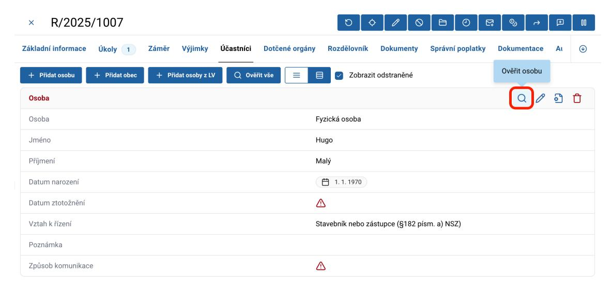

Akci následně potvrďte kliknutím na tlačítko Potvrdit.

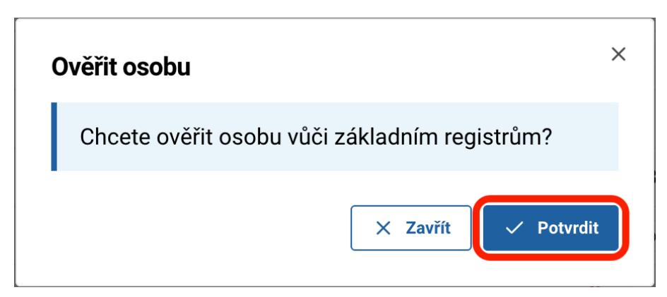

Po ověření osoby se zobrazí nové ikony: Zobrazit data ze záměru, Zobrazit ztotožněná data, Zkopírovat ověřená data do řízení.

Po ověření osob se primárně zobrazují data ze záměru, která jsou doplněna o upozornění. Data nejsou automaticky přepsána na data z registru – uživatel je může převzít kliknutím na tlačítko Zkopírovat ověřená data.

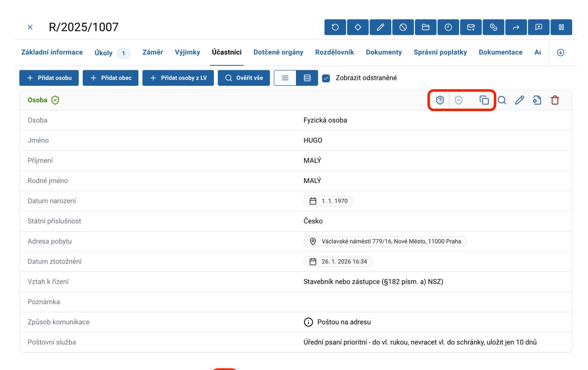

V sekci Zobrazit data ze záměru jsou uvedena data, která byla vámi zadána při přidávání osoby nebo nahrána z Portálu stavebníka. Vypravení probíhá dle těchto dat (tedy na zde uvedenou adresu, datovou schránku atd.)

V sekci Zobrazit ztotožněná data jsou uvedena data, která jsou pro danou osobu vedena v základních registrech.

Pakliže se chcete ujistit, že údaje účastníka odpovídají údajům ze základních registrů, zvolte ikonu

Zkopírovat ověřená data do řízení . Tímto dojde k přepsání dat ze záměru daty ze základních registrů (ztotožněná data). Tímto krokem dojde ke kompletnímu přepsání, tedy i údajů, které byly vámi zadány. Po kliknutí na ikonu Zkopírovat ověřená data do řízení zaškrtněte checkbox přepsat data a potvrďte.

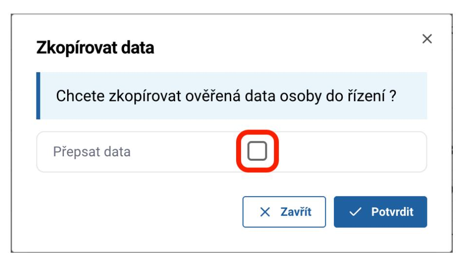

#### **Pozor! Vypravení probíhá dle údajů uvedených v Datech ze záměru**.

Doporučujeme tedy využít funkcionalitu Zkopírovat ověřená data do řízení, abyste předešli případným chybám ve vyplněných údajích. Údaje můžete později vždy znovu upravit prostřednictvím funkcionality Upravit osobu (upravují se pouze data ze záměru).

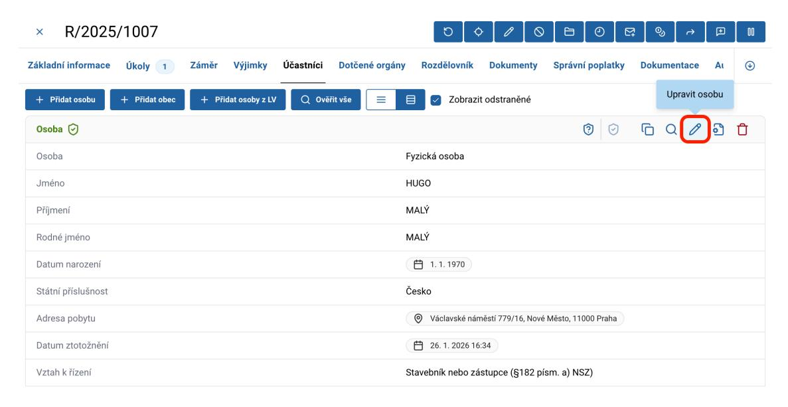

#### **2.2Ověření osob se shodným jménem a datem narození**

V případě, kdy **je v záměru nebo řízení více osob se shodným jménem a datem narození,** typicky Jan Novák, je potřeba nejprve ověřit adresu osoby a až poté ověřit osobu samotnou.

#### Nejprve klikněte na adresu pobytu

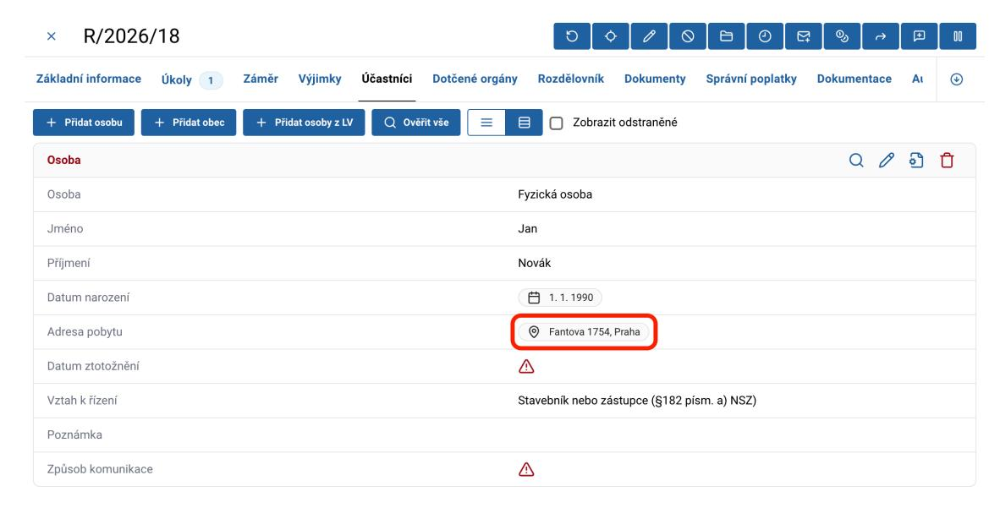

#### V novém okně klikněte na Ověřit adresu

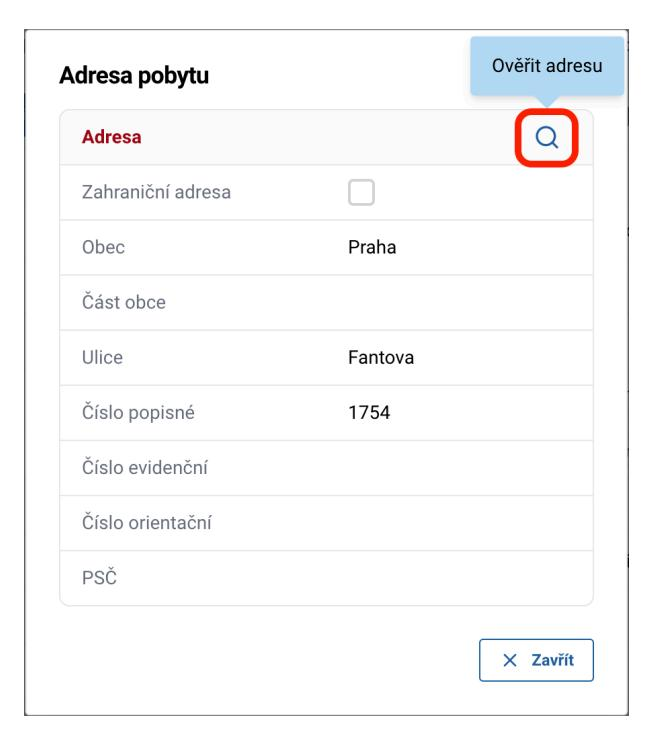

#### A potvrďte.

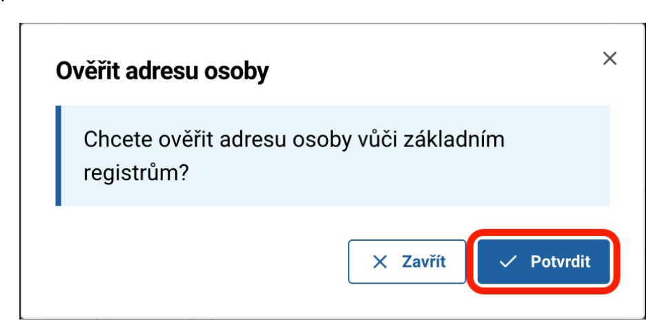

Po ověření adresy již systém určí, o kterou osobu se jedná. Pokračujte standartním způsobem ověření osoby, kliknutím na ikonu lupy.

#### **2.3Ověření oprávněné osoby**

V případě oprávněné osoby u právnických osob, je při ověřování jednotlivých osob vždy nutné ověřit oprávněnou osobu zvlášť kliknutím na tlačítko Ověřit oprávněnou osobu.

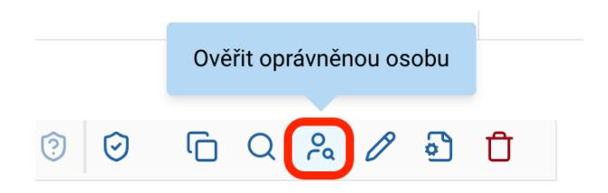

Při hromadném ověření osob v záměru/účastníků v řízení je oprávněná osoba právnické osoby také ověřena.

## **2.4Zobrazení informace o úmrtí osoby**

Do ISSŘ bylo doplněno zobrazení informace o evidenci úmrtí osoby přímo v základním náhledu dat ze záměru. Pokud je při ověření FO zjištěno, že je u osoby evidováno úmrtí, je tato skutečnost viditelná již v defaultním zobrazení osoby, nikoli pouze ve ztotožněných datech.

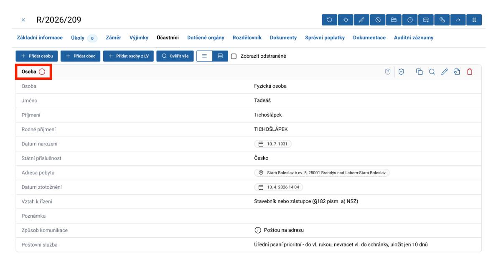

Informace je taktéž zobrazena při rozkliknutí oprávněné osoby PO.

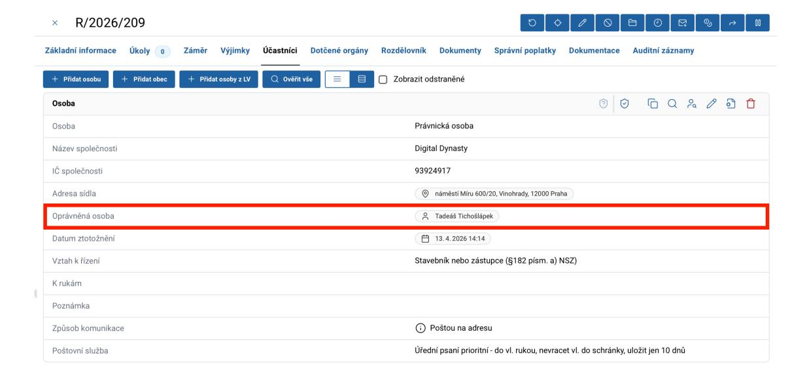

Po kliknutí na oprávněnou osobu se zobrazí dialog s náhledem oprávněné osoby včetně informace o evidenci úmrtí.

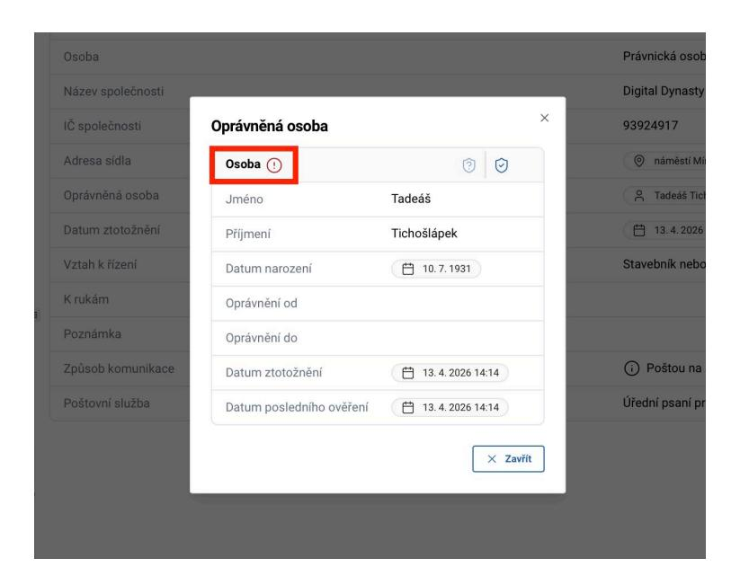

Zobrazení se uplatňuje v následujících místech systému:

- v záměru na záložce Osoby,
- v řízení na záložce Účastníci,
- v doručených dokumentech na záložce Základní informace v části Odesílatel,
- při náhledu oprávněné osoby PO.

## **2.5Ověření obce**

Ověření obce probíhá standardním způsobem, kliknutím na Ověřit osobu a chová se totožně jako ověření osoby viz [kapitola 3.1.](#page-19-0)

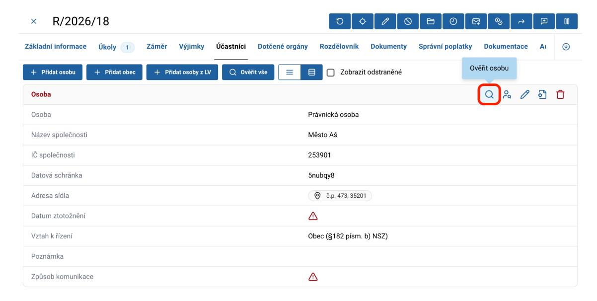

## **2.6Hromadné ověření**

V řízení je možné hromadně ověřit všechny účastníky kliknutím na tlačítko Ověřit vše.

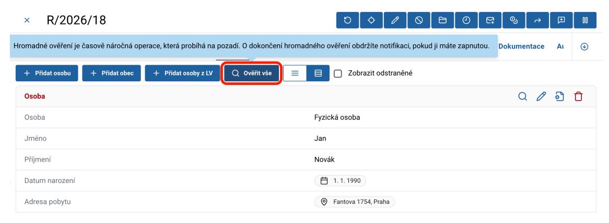

Akci potvrďte kliknutím na tlačítko Potvrdit.

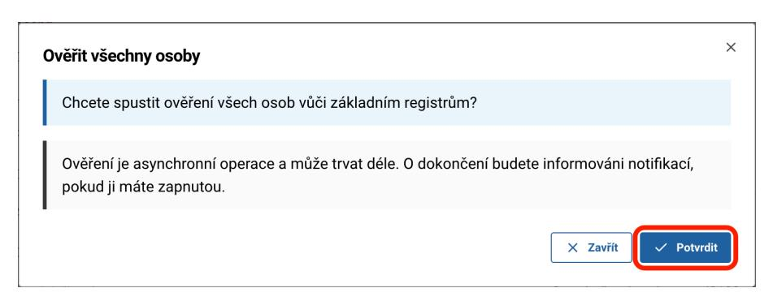

Hromadné ověření může dle počtu ověřovaných osob trvat déle. O jeho dokončení je uživatel informován notifikací v pravém horním rohu obrazovky, pokud má danou notifikaci aktivovanou (lze nastavit v nastavení účtu uživatele).

### **2.7Ztotožněná data**

Data, která systém získá ze základních registrů, jsou v systému pojmenována jako ztotožněná data. Tyto údaje jsou získány po ověření dané osoby vůči základním registrům. **Jméno a příjmení u osob a název společnosti jsou zobrazeny vždy velkými písmeny u dat z registru.**

Po ověření osoby je pro zobrazení těchto dat nutné kliknout na tlačítko Zobrazit ztotožněná data.

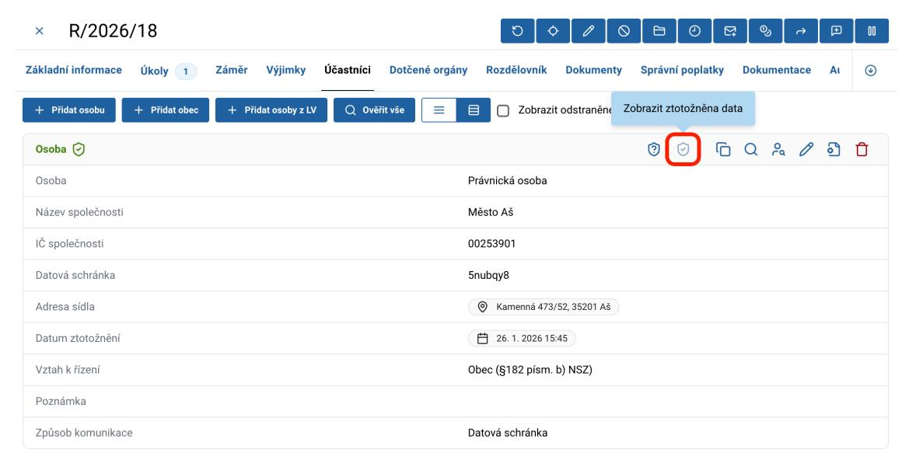

Ztotožněná data není možné editovat.

## **2.8Upozornění na rozdílná data ze záměru vs. ztotožněná data**

Systém disponuje funkcí upozornění na rozdíly mezi daty načtenými z registrů a daty doplněnými uživatelem nebo doručených z Portálu stavebníka. U položek, které se liší od dat z registrů, se zobrazí ikona vykřičníku. Rozdíl se nevyhodnocuje podle velikosti písmen ani přítomnosti diakritiky.

Kontrola se provádí pro údaje:

- druh osoby (FO/FOP/PO),
- jméno, příjmení, rodné příjmení, název, IČ, datum narození, státní příslušnost,
- adresa (obec, část obce, ulice, číslo popisné/evidenční/orientační, PSČ),
- datová schránka.

Funkcionalita je dostupná na těchto místech:

- záložka Osoby v detailu záměru,
- záložka Účastníci a Dotčené orgány v detailu řízení (včetně oprávněných osob PO),
- záložka Základní informace blok Odesílatel v detailu doručeného dokumentu.

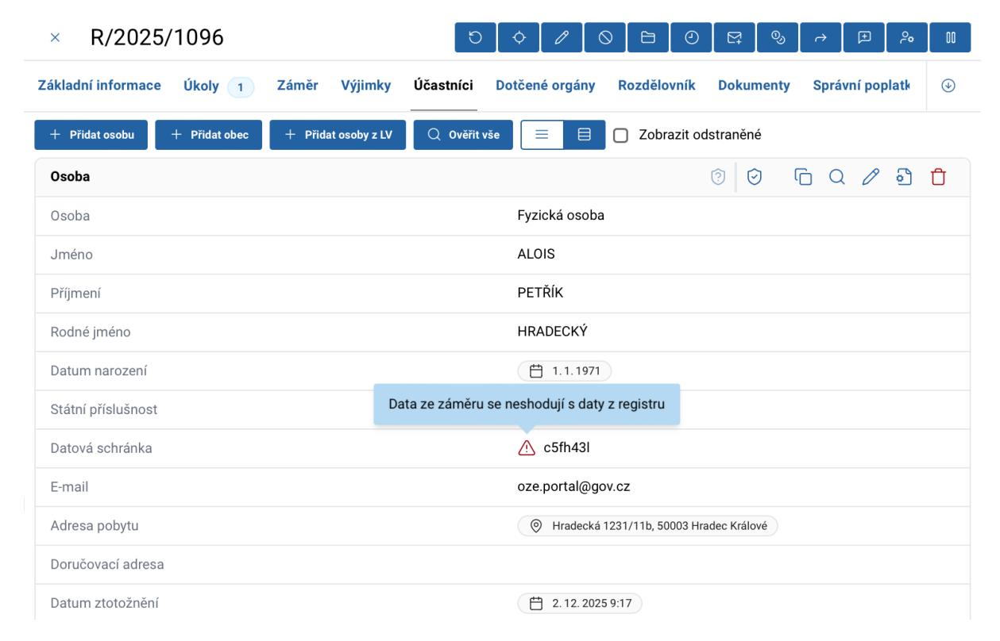

Při vytvoření osoby v záměru na základě podání žádosti v Portálu stavebníka vyplní u fyzických osob položku název. Tuto položku lze ale v ISSŘ vyplnit pouze u fyzických podnikajících a právnických osob. Jelikož fyzické osoby nemají tuto položku v registrech, systém upozorní uživatele na tento nesoulad v detailu záměru, záložce Osoby, v tabulkovém režimu. V současné době není možné tuto položku u fyzických osob v ISSŘ editovat, proto upozornění ignorujte.

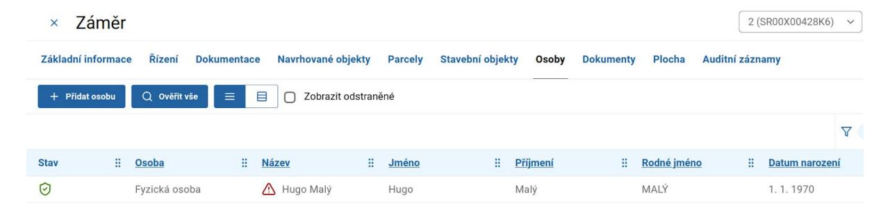

#### **2.9Data ze záměru vs. ztotožněná data – záložka dotčené orgány**

V případě dotčeného orgánu, například AOPK ČR – RP Jižní Čechy, viz. snímek níže zobrazena data ze záměru

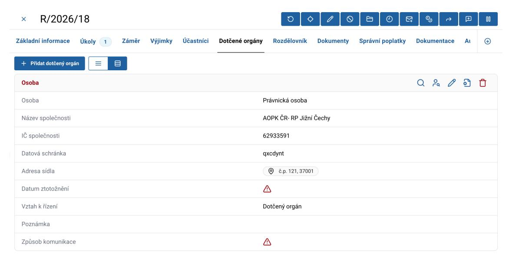

se data ověřují vůči nadřazenému orgánu, tedy Agentury ochrany přírody a krajiny České republiky. Z toho důvodu může být po ověření ikona vykřičníku v položce název nebo adresa. Tato ikona je pouze informativní a neupozorňuje na chybu. Je tedy možné tuto ikonu nebrat v potaz.

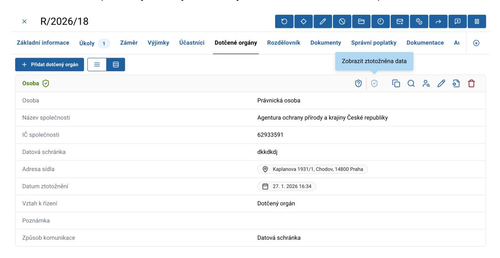

# **3. Zahraniční osoby**

V této sekci jsou představeny náležitosti práce se zahraničními osobami v ISSŘ.

Stejně jako u českých osob existují tři druhy zahraničních osob: fyzická osoba, fyzická osoba podnikající a právnická osoba. Právnické osoby mají také určenou svoji oprávněnou osobu.

Přidání nebo úprava zahraniční osoby se provádí stejným způsobem jako u českých osob, tedy při zpracování/tvorbě doručených dokumentů, v záložce Účastníci v detailu Řízení a v záložce Osoby v detailu Záměru. Role účastníků v řízení a vztah osoby k záměru jsou také identické.

Ověření zahraničních osob systémem není možné, jelikož systém je napojený pouze na české registry. **Věnujte proto, prosíme, zvýšenou pozornost při vyplňování nebo úpravě zahraničních osob.** Po přidání osoby a jejím označení jako zahraniční (nemožnost ověření) je tato osoba v dokumentu/řízení/záměru označená zeleně jako ověřená, aby bylo možné této osobě vypravit dokument.

Určení osoby nebo adresy jako zahraniční se týká vždy pouze dané položky. Je tedy možné tvořit a spravovat i české osoby se zahraničními adresami a zahraniční osoby s českými adresami.

#### **3.1Fyzická osoba**

Označení fyzické osoby jako zahraniční provedete zaškrtnutím checkboxu u položky Nelze ztotožnit / Zahraniční osoba.

Zaškrtnutí tohoto checkboxu v záložce Základní údaje u fyzické osoby nijak nemění zobrazené položky.

U zahraniční fyzické osoby je nutné vyplnit následující pole: Jméno, Příjmení a Datum narození. Další položky vyplňujete dle svého uvážení.

#### **3.2Fyzická osoba podnikající**

Označení fyzické osoby podnikající jako zahraniční provedete zaškrtnutím checkboxu u položky Nelze ztotožnit / Zahraniční osoba.

Zaškrtnutí tohoto checkboxu v záložce Základní údaje u fyzické osoby podnikající nijak nemění zobrazené položky.

U zahraniční fyzické osoby podnikající je nutné vyplnit následující pole: Jméno, Příjmení a IČ. Další položky vyplňujete dle svého uvážení.

## **3.3Právnická osoba**

Označení právnické osoby jako zahraniční provedete zaškrtnutím checkboxu u položky Nelze ztotožnit / Zahraniční společnost.

Zaškrtnutí tohoto checkboxu v záložce Základní údaje u právnické osoby nijak nemění zobrazené položky.

U zahraniční právnické osoby je nutné vyplnit následující pole: Název společnosti a IČ. Další položky vyplňujete dle svého uvážení.

#### **3.4Oprávněná osoba právnické osoby**

Některé právnické osoby mají určenou oprávněnou osobu, která jménem těchto právnických osob jednají. Oprávněnou osobu je možné přidat v záložce Oprávněná osoba.

Při přidání nebo úpravě oprávněné osoby k osobě typu právnická osoba (PO) byla doplněna validace povinných údajů na záložce Oprávněná osoba.

Systém nyní vyžaduje vyplnění následujících údajů:

- jméno
- příjmení
- datum narození

#### *Upozornění:*

Pokud je vyplněn alespoň jeden z těchto údajů, systém nedovolí potvrdit formulář, dokud nebudou doplněny všechny tři povinné údaje. Pokud není vyplněn žádný z údajů, formulář lze uložit – znamená to, že oprávněná osoba není zadána.

Změna platí pro všechny formuláře, kde lze osobu přidat nebo upravit:

- záložka Osoby v detailu záměru
- záložka Účastníci v detailu řízení

záložka Základní informace – blok Odesílatel v detailu doručeného dokumentu.

Oprávněnou osobu je také možné následně ověřit pomocí tlačítka Ověřit oprávněnou osobu nebo označit jako osobu zahraniční pomocí checkboxu Nelze ztotožnit/Zahraniční osoba.

# **4. Způsob komunikace**

Nastavit nebo upravit způsob komunikace u osoby lze přímo na kartě osoby tlačítkem Změnit způsob komunikace.

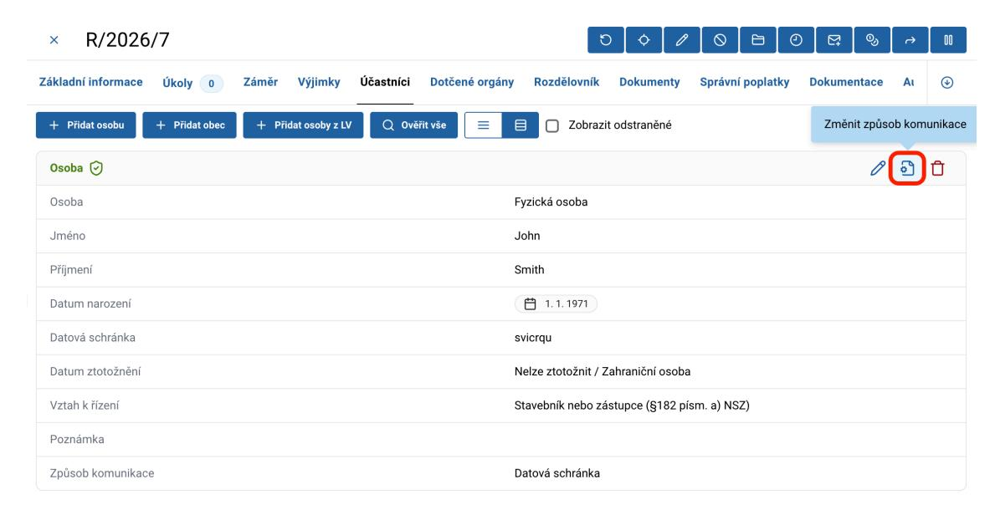

Při zvolení způsobu doručení Poštou na adresu systém použije pro vypravení údaje ze záložky Adresa pobytu/Místo podnikání/Adresa sídla podle typu osoby. Při zvolení způsobu doručení Poštou na doručovací adresu systém použije pro vypravení údaje ze záložky Doručovací adresa.

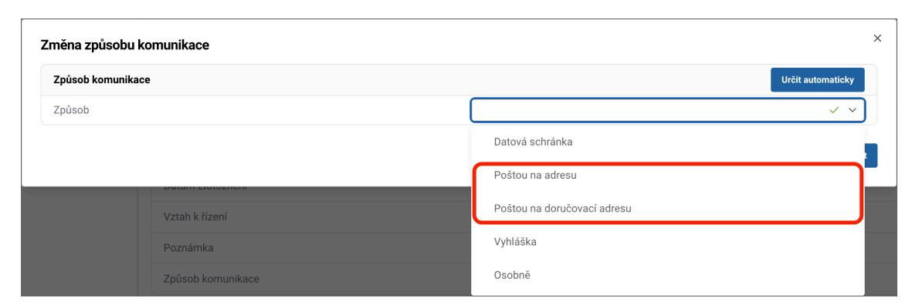

Po zvolení způsobu Poštou na adresu nebo Poštou na doručovací adresu je třeba vybrat poštovní službu.

Upozorňujeme, že systém nekontroluje, jestli je poštovní služba vybrána adekvátně vzhledem k vyplněné adrese. **Věnujte, prosíme, zvýšenou pozornost při výběru způsobu komunikace i poštovní služby při vypravování do zahraničí.** V případě chybného výběru služby (např. Vypravení do zahraničí s výběrem služby platné pouze pro tuzemské vypravení) dojde k odmítnutí vypravení zásilky.

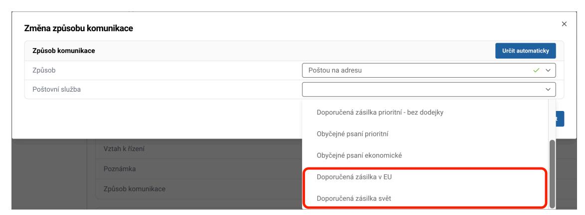

Způsob komunikace lze také nastavit automaticky, kdy systém sám určí nejvhodnější způsob komunikace pro danou osobu. Pro využití automatického určení způsobu komunikace musí být osoba již ověřena. Pro tuto možnost použijte v dialogovém okně Změna způsobu komunikace tlačítko Určit automaticky.

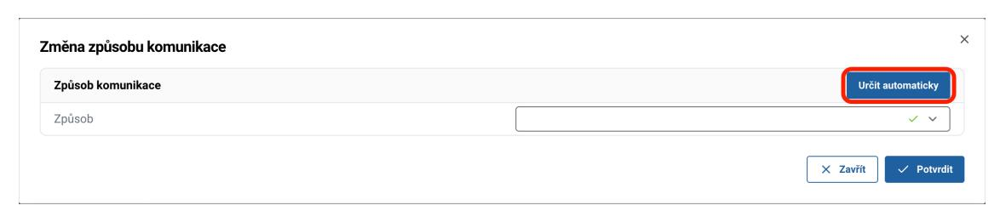

Systém určuje automaticky způsob komunikace dle následujících pravidel:

U tuzemských PO, FOP a FO s datovou schránkou se nastaví komunikace datovou schránkou.

- Pokud účastník nemá datovou schránku, ale je vyplněna doručovací adresa, nastaví se komunikace poštou na doručovací adresu.
- Pokud účastník nemá ani datovou schránku, ani doručovací adresu, nastaví se komunikace poštou na adresu.

Pravidla automatického nastavení jsou znázorněna na obrázku:

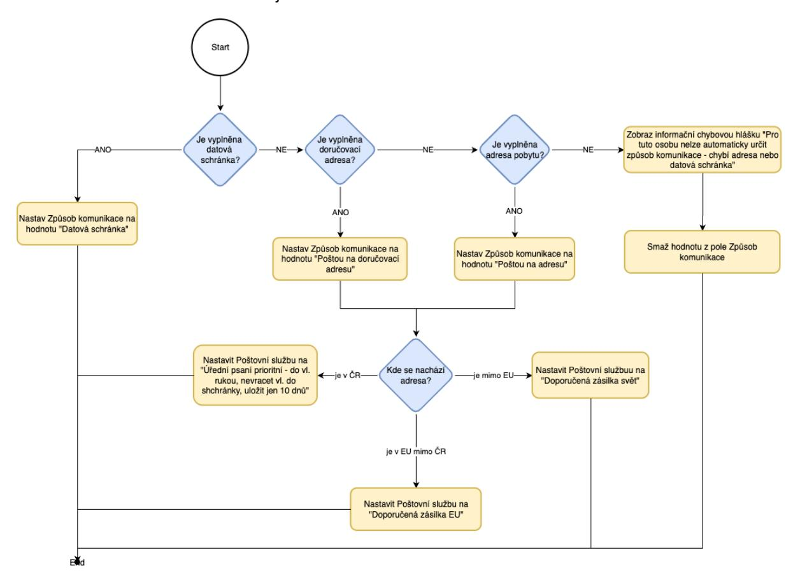

Pokud není vyplněna hodnota pro způsob komunikace nebo poštovní službu, zobrazí se upozornění pro uživatele.

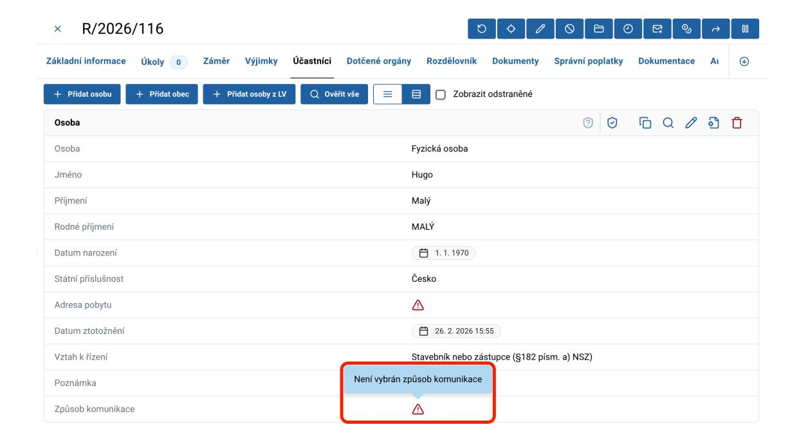

Vypravení Dotčeným orgánům je upraveno tak, že je vždy nastaveno automaticky systémem ISSŘ jako výchozí vypravení do datové schránky. Systém tedy nyní automaticky vypravuje dokumenty orgánům vybraným v řízení jako dotčený orgán do datové schránky a nikoli interně.

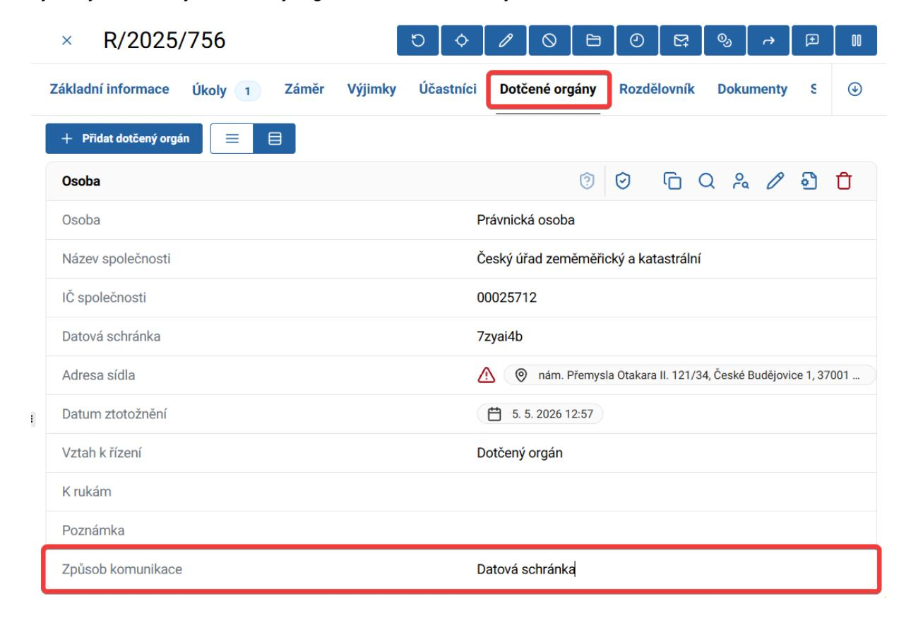

# **5. Podmínky vypravení**

Aby bylo možné dokument bez problémů vypravit, je potřeba splnit podmínky pro vypravení. Je nutné, aby osoba (adresát dokumentu) měla vyplněny následující údaje:

- FO: jméno, příjmení, datum narození, datová schránka/adresa dle způsobu komunikace,
- FOP: jméno, příjmení, datum narození, IČ, datová schránka/adresa dle způsobu komunikace,
- PO: název, IČ, datová schránka/adresa dle způsobu komunikace.

Stejná pravidla platí i pro zahraniční subjekty.

Pokud nejsou vyplněna všechna pole potřebná pro odeslání dokumentu, systém na tuto skutečnost upozorní: ikonou trojúhelníku s vykřičníkem v kartovém i tabulkovém přehledu osob,

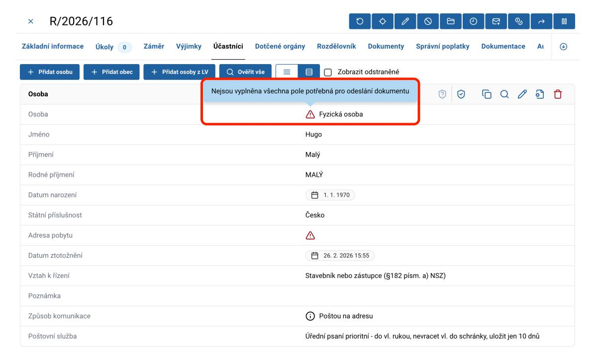

textovým upozorněním v editačním dialogu osoby

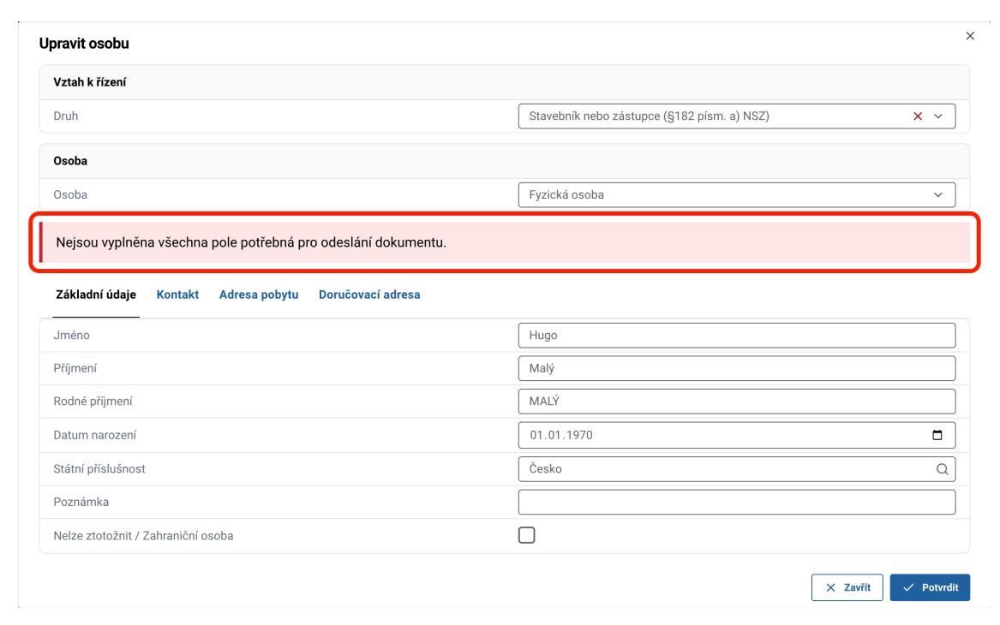

v úkolu "Ukončit tvorbu dokumentu", nebo úkolu "Odeslat ke schválení dokument" (pokud se jedná o starý proces zpracování vlastního dokumentu)

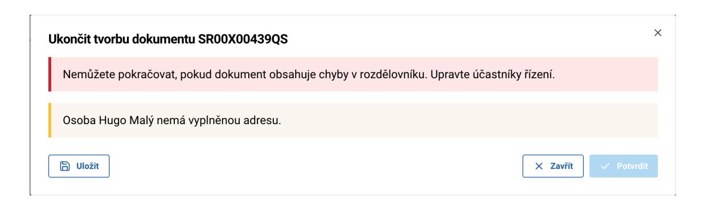

# **6. Obsah vypravení**

## **6.1Vypravení hlavního dokumentu**

U hlavního dokumentu je automaticky nastaven atribut Odesílat a atribut Konvertovat. To znamená, že je hlavní dokument vždy vypraven a konvertován. Výchozí nastavení nejsou zobrazené a nelze je měnit.

Počet stran hlavního dokumentu se zobrazuje na záložce Hlavní dokument pod řádkem Obsah v poli Počet stran hlavního dokumentu.

## **6.2Vypravení příloh**

V ISSŘ je k dispozici možnost odesílat přílohy společně s hlavním dokumentem při vypravení vlastních dokumentů přes HKP i dalšími způsoby komunikace. Autorizovaná konverze vyžaduje soubor podepsaný kvalifikovaným elektronickým podpisem. Nepodepsané přílohy nebude možné přes HKP vypravit. Podpis je nutné provést mimo aplikaci.

U příloh je automaticky nastaven atribut Odesílat, ale vypnut atribut Konvertovat. To znamená, že bez změny nastavení budou přílohy vypraveny bez konverze. Výchozí nastavení lze změnit.

U přílohy lze nastavit:

Atribut Odesílat = zda se má příloha odeslat

Atribut Konvertovat = zda se má provést autorizovaná konverze, v tomto případě je třeba, aby byl soubor přílohy podepsaný

V záložce Přílohy se také zobrazují atributy "Odesílat" a "Konvertovat" u vlastních dokumentů, které v režimu tabulky lze běžným způsobem filtrovat, řadit a přesouvat.

U vypravených příloh se zobrazuje upozornění: "Vypravené přílohy jsou v záložce příloh".

Nastavení atributů Odesílat a Konvertovat se projeví ve všech vypraveních. Ve většině případů není nutné přílohy konvertovat. Konverze je nutná pouze v některých situacích, například při zaslání stejnopisu rozhodnutí.

Nelze nastavit Konvertovat = ANO, pokud je Odesílat = NE.

Pokud vypravení selže například z důvodu nevalidní přílohy nebo chyby konverze, zásilka se nevypraví a stav je evidován v ISSŘ jako Vrácená. Věnujte, prosím, zvýšenou opatrnost při nastavení konverze u příloh. Přílohy, které si přejete konvertovat, je nutné vložit do dokumentu již podepsané.

## **6.3Počet listů pro vypravení**

Počet listu je důležitý ukazatel pro vypravení HKP. V případě, že by byl tento limit překročen, dokument již nebude možné vypravit pomocí HKP, ale bude nutné použít ruční vypravení.

Protože tisk pro vypravení pomocí HKP probíhá oboustranně, je limit počtu listů pro vypravení pomocí HKP 99 listů pro zásilky v rámci ČR a EU nebo 8 listů pro zásilky mimo EU, přičemž 1 strana je vyhrazena pro konverzní doložku.

Poznámka k rozdílu mezi stranou a listem:

Strana = jedna tištěná strana dokumentu (např. A4).

List = fyzický papír, který může obsahovat 2 strany (přední a zadní).

Na záložce Základní informace u vlastních dokumentů je k dispozici pole "Počet listů zvoleného rozsahu zásilky", který uvádí celkový počet fyzických listů pro vypravení přes HKP.

#### Hodnota zahrnuje:

- počet listů hlavního dokumentu
- počet listů jednotlivých příloh
- jeden list navíc za každou konverzní doložku u příloh

Na záložce Hlavní dokument se zobrazuje Počet stran hlavního dokumentu.

Na záložce Přílohy je pro každou přílohu k dispozici řádek "Počet stran přílohy", který zobrazuje počet stran dané přílohy.

## **7. Vypravení do zahraničí**

V této sekci jsou představeny náležitosti práce s možnostmi vypravení do zahraničí v ISSŘ.

## **7.1Způsob komunikace**

Nastavit nebo upravit způsob komunikace u osoby lze přímo na kartě osoby tlačítkem Změnit způsob komunikace.

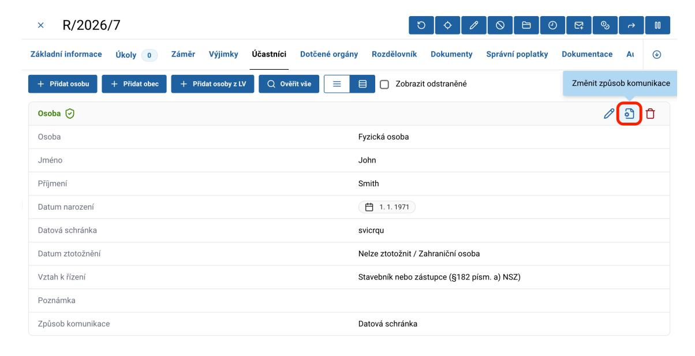

Při zvolení způsobu Poštou na adresu nebo Poštou na doručovací adresu je třeba vybrat správnou poštovní službu. Pro vypravení do zahraničí je možné volit pouze mezi službami Doporučená zásilka v EU a Doporučená zásilka svět.

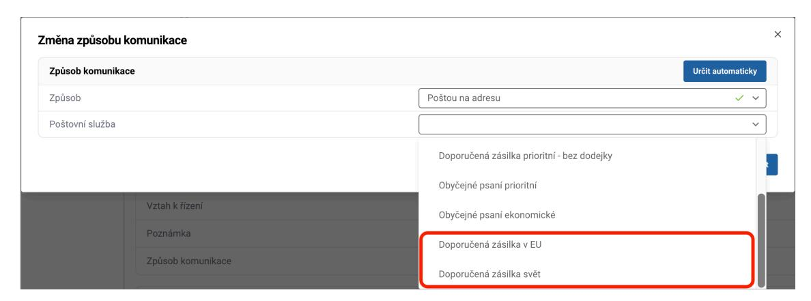

Upozorňujeme, že systém nekontroluje, jestli je poštovní služba vybrána adekvátně vzhledem k vyplněné zahraniční adrese. **Věnujte, prosíme, zvýšenou pozornost při výběru způsobu komunikace i poštovní služby při vypravování do zahraničí.** V případě chybného výběru služby (např. Vypravení do zahraničí s výběrem služby platné pouze pro tuzemské vypravení) dojde k odmítnutí vypravení zásilky.

Zároveň je vypravování do zahraničí limitováno počtem listů, které je možné vypravit. Pro zásilky v rámci EU 99 listů nebo 8 listů pro zásilky mimo EU, přičemž 1 strana je vyhrazena pro konverzní doložku. Více informací o limitaci počtu listů pro vypravení naleznete v kapitole [Počet listů pro vypravení.](#page-30-0)

### **7.2Zahraniční adresy**

V této sekci jsou představeny náležitosti práce se zahraničními adresami v ISSŘ.

Všechny zahraniční osoby mají v systému záložky pro dvě adresy, stejně jako ty české. Ověření zahraničních adres systémem není možné, jelikož systém je napojený pouze na české registry. Věnujte, proto prosíme zvýšenou pozornost při vyplňování nebo úpravě zahraničních adres.

Určení osoby nebo adresy jako zahraniční se týká vždy pouze dané položky. Je tedy možné tvořit a spravovat i české osoby se zahraničními adresami a zahraniční osoby s českými adresami.

**Adresa pobytu/Místo podnikání/Adresa sídla**

Zatímco doručovací adresa je pro všechny typy osob stejná, druhý typ adresy se liší podle zadaného typu osoby. Fyzické osoby mají adresu pobytu, fyzické osoby podnikající místo podnikání a právnické osoby adresu sídla. Funkce těchto položek jsou identické.

Určení adresy jako zahraniční provedete zaškrtnutím checkboxu u položky Zahraniční adresa.

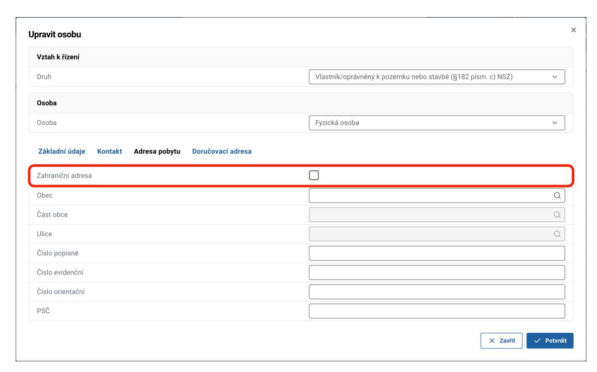

Zaškrtnutí checkboxu pozmění tuto záložku přidáním položky Stát.

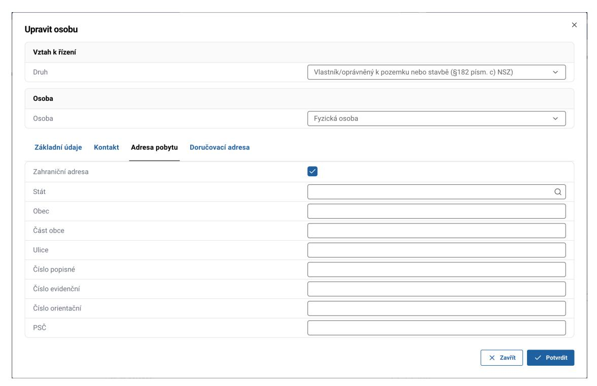

Zahraniční adresa v řízení, je-li vybrána jako adresa na kterou se bude vypravovat, má tyto povinné položky: Stát, Obec a PSČ. Další položky vyplňujete dle struktury adresy.

#### **Doručovací adresa**

Doručovací adresa je pro všechny typy osob označená stejně.

Určení adresy jako zahraniční provedete zaškrtnutím checkboxu u položky Zahraniční adresa.

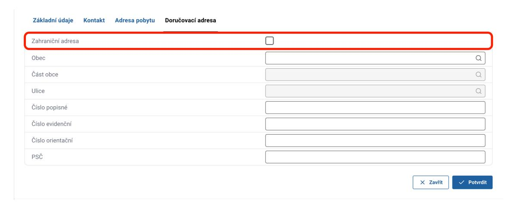

Zaškrtnutí checkboxu pozmění tuto záložku přidáním položky Stát.

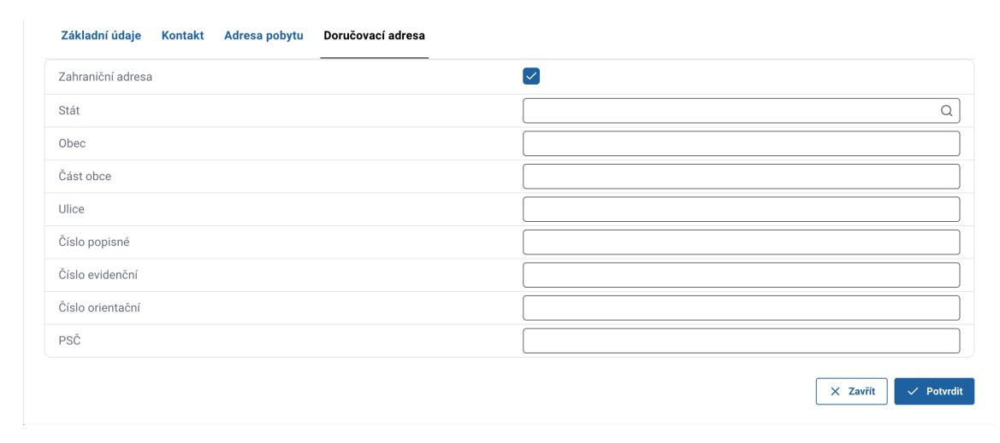

Zahraniční adresa v řízení, je-li vybrána jako adresa na kterou se bude vypravovat, má tyto povinné položky: Stát, Obec a PSČ. Další položky vyplňujete dle struktury adresy.

#### **7.3Vypravování do zakázaných zemí**

Systém ISSŘ kontroluje, zda je možné odeslat dokument prostřednictvím Hybridní konverzní pošty (HKP) do zadané země. Pokud má účastník řízení uvedenou adresu v zemi, kam Česká pošta nedoručuje, systém zobrazí upozornění "Do dané země není možné odesílat" a dokument se neodešle prostřednictvím HKP, ale vytvoří se ruční vypravení, které je nutné provést mimo systém – více informací o ručním vypravení je k dispozici v kapitole Ruční vypravení.

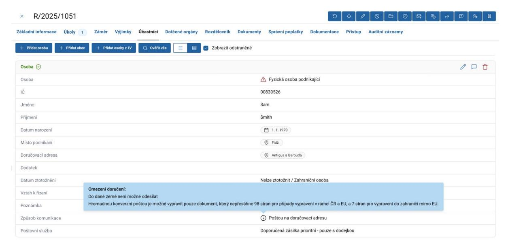

Seznam zakázaných zemí spravuje globální administrátor MMR.

# **8. Vypravování službou HKP**

Doručování prostřednictvím služby hromadné konverzní pošty od České pošty prostřednictvím ISSŘ bylo dříve hrazeno MMR. Pokud chce úřad nadále chtít tuto službu využívat, je třeba uzavřít s Českou poštou smlouvu na vlastní náklady.

V případě, že úřad nemá uzavřenou smlouvu s Českou poštou a u adresáta je zvolen Způsob komunikace – Poštou na adresu nebo Poštou na doručovací adresu, systém sám takový dokument nevypraví, ale upozorní uživatele, že musí vypravení provést vlastní cestou. Vypravení jinou formou ale ovlivněno není. K přepnutí na ruční vypravení dojde automaticky. Uživatel má možnost vyplnit údaje o odeslání dokumentu pomocí tlačítka Odeslat. Teprve po jejich vyplnění se zobrazí možnost Nahrát doručenku. Podrobnosti je možné najít v kapitole [Ruční vypravení](#page-37-0).

Pokud již úřad má stávající smlouvu s Českou poštou na HKP, je třeba kontaktovat Českou poštu, která následně MMR předá ID, které bude zadáno do ISSŘ. Následně bude možné vypravovat v ISSŘ službou HKP.

V případě potřeby podrobnějších informací ke smlouvám se neváhejte obrátit na [digitalizace@mmr.gov.cz.](mailto:digitalizace@mmr.gov.cz)

#### **8.1Ekonomické varianty poštovních služeb**

Z nabídky poštovních služeb v ISSŘ jsou dostupné také čtyři varianty ekonomického zasílání. Díky tomu mohou úředníci nově volit při vypravení dokumentů levnější ekonomické služby České pošty a ušetřit tak náklady úřadu.

#### **Nové možnosti v číselníku poštovní služby:**

- **Doporučená zásilka ekonomická – pouze s dodejkou**
- **Doporučená zásilka ekonomická – bez dodejky**
- **Úřední psaní ekonomické – do vl. rukou, nevracet vl. do schránky, uložit jen 10 dnů**
- **Úřední psaní ekonomické – do vl. rukou výhradně adresát, nevracet vl. do schránky, uložit jen 10 dnů**

Jsou dostupné v dialogovém okně **Změna způsobu komunikace** u účastníků řízení. V číselníku se zobrazují nejprve všechny ekonomické varianty a teprve za nimi varianty prioritní.

Pokud při ověření účastníka řízení není u dané osoby evidována datová schránka, systém automaticky nastaví poštovní službu na **Úřední psaní ekonomické – do vl. rukou, nevracet vl. do schránky, uložit jen 10 dnů**. Stejné výchozí nastavení platí i při použití tlačítka Určit automaticky v dialogu Změna způsobu komunikace.

Rozdíl mezi ekonomický a prioritním režimem doručování službou HKP je v ceně a v rychlosti doručení:

- **prioritní doručení je určeno pro rychlejší distribuci zásilek,**
- **ekonomické doručení je levnější, ale s delší dobou dodání.**

Volba režimu nemá vliv na právní účinky doručení, rozhodující je vždy zvolený způsob doručení.

*Poznámka:* Nové ekonomické varianty jsou dostupné pouze pro vypravení přes Hybridní konverzní poštu (poštou na adresu a poštou na doručovací adresu). Pro ostatní způsoby doručení (datová schránka, osobně, vyhláška, interně) se výběr poštovní služby nezobrazuje a chování systému se nemění.

# **9. Ruční vypravení**

Systém nabízí také možnost "Ruční vypravení", která se automaticky použije v případech, kdy nelze využít službu Hybridní konverzní pošty (HKP). Týká se následujících situací:

- **Úřad nemá uzavřenou smlouvu s Českou poštou (od 1. 2. 2026).**
- **Dokument překračuje limit počtu stran stanovený Českou poštou pro vypravení. Limity počtů stran dokumentů pro vypravení HKP jsou 99 listů pro zásilky v rámci ČR a EU nebo 8 listů pro zásilky mimo EU, přičemž 1 strana je vyhrazena pro konverzní doložku.**
- **Zásilka směřuje do země, kam Česká pošta nedoručuje.**

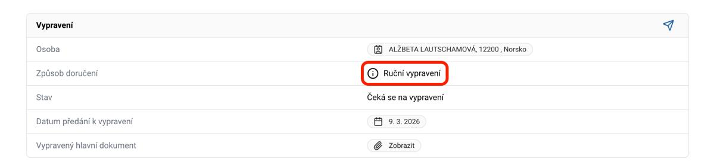

Na záložce "Vypravení" je pole "Způsob doručení" automaticky nastaveno na "Ruční vypravení" a stav vypravení je "Čeká se na vypravení". Uživatel má možnost vyplnit údaje o odeslání dokumentu pomocí tlačítka Odeslat.

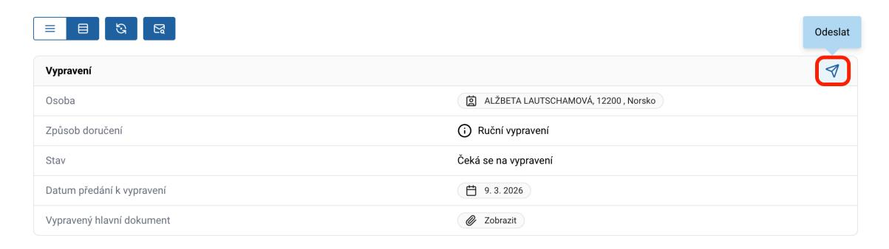

V dialogovém okně "Odeslat" lze zadat datum odeslání a podací číslo. Datum odeslání je povinný údaj a nesmí předcházet datumu předání k vypravení. Podací číslo není povinné a musí obsahovat 13 alfanumerických znaků.

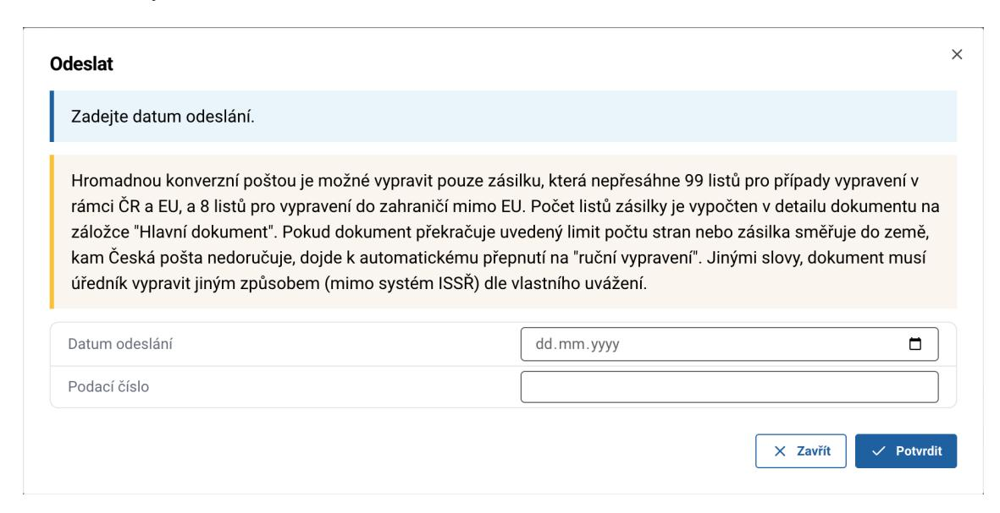

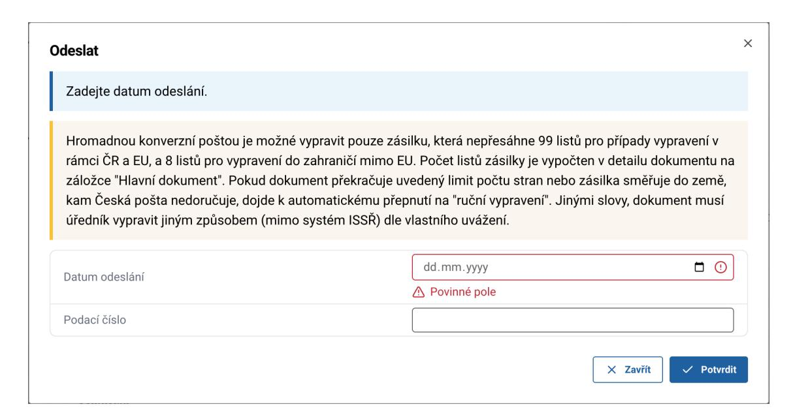

Po zadání data odeslání se stav vypravení automaticky změní na "Vypraveno" a uživatel má možnost vyplnit údaje o doručení dokumentu pomocí tlačítka Nahrát doručenku.

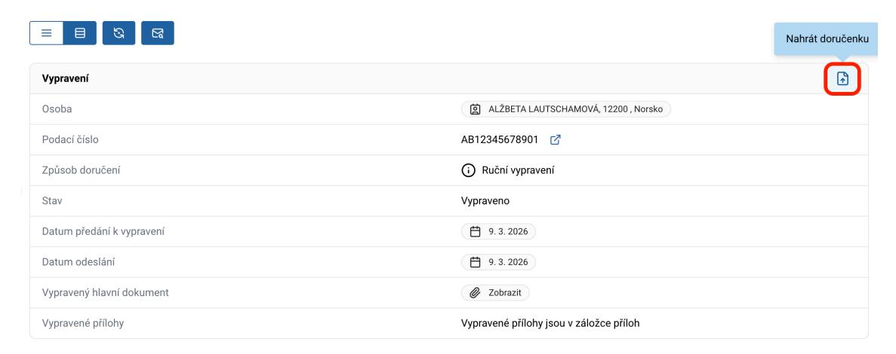

V dialogovém okně "Nahrát doručenku" lze zadat datum doručení a nahrát soubor doručenky.

Datum doručení je povinný údaj a nesmí předcházet datumu předání k vypravení.

Nahrání doručenky je povinné pole

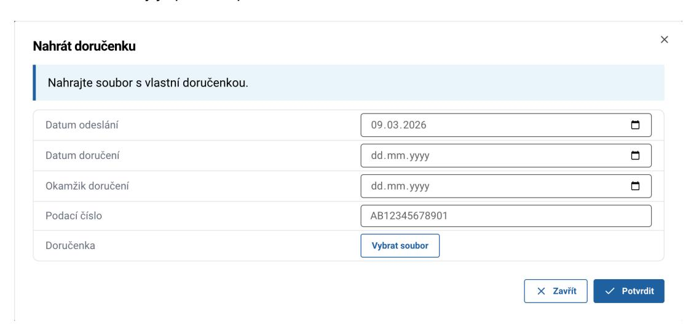

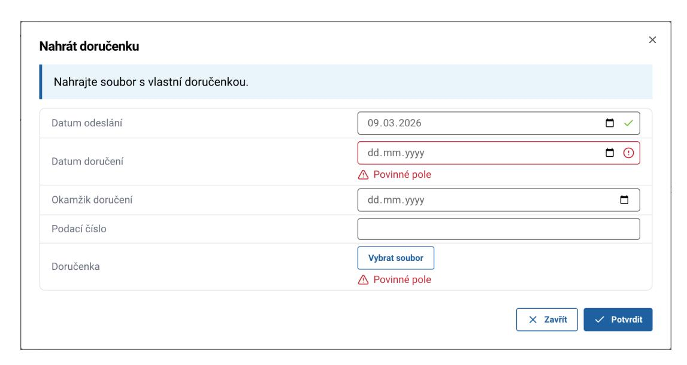

Po nahrání doručenky se stav vypravení automaticky změní na "Doručeno".

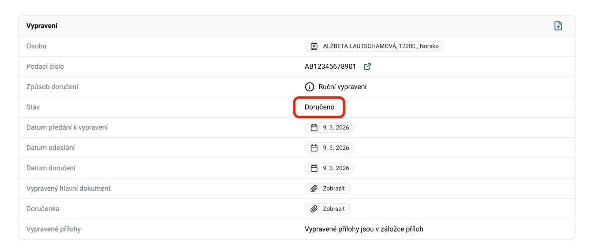

Uživatel má možnost zadaná data v případě potřeby opravit opětovným kliknutím na tlačítko Nahrát doručenku. Již nahranou doručenku však nelze smazat, pouze vyměnit za nový soubor. Tato funkcionalita umožňuje úředníkům evidovat ruční odeslání dokumentu přímo v ISSŘ, včetně všech potřebných údajů o jeho doručení.

Je důležité vědět, že způsobem Ruční vypravení systém nevypravuje dokument automaticky. Úředník musí dokument vypravit vlastním způsobem (dokument stáhnout, vložit a vypravit skrze systém, který je k tomuto účelu v rámci úřadu využíván, nebo dokument konvertovat do listinné podoby a vypravit fyzicky poštou).

Pro dokumenty vypravené pomocí ručního vypravení disponuje systém také funkcí Okamžik doručení. Tato funkce umožňuje úředníkovi zadat vlastní datum okamžiku doručení, které se může lišit od systémového data doručení uvedeného na doručence, například v případech fikce doručení dle právních předpisů. Více informací o této funkci naleznete v kapitole [Okamžik doručení](#page-54-2) u HKP a ručního [vypravení.](#page-54-2)

#### **9.1 Vypravení v případě překročení délky dokumentu**

Funkcionalita zajišťuje ruční vypravení dokumentů překračující maximální povolenou délku mimo systém.

Systém automaticky kontroluje počet stran dokumentu při odesílání prostřednictvím Hybridní konverzní pošty (HKP). Pokud dokument přesáhne povolený limit pro vypravení (tj. 99 stran pro zásilky v rámci ČR a EU nebo 8 stran pro zásilky mimo EU, přičemž 1 strana je vyhrazena pro konverzní doložku), systém změní způsob vypravení na "ruční vypravení".

Uživatel je na tuto skutečnost upozorněn:

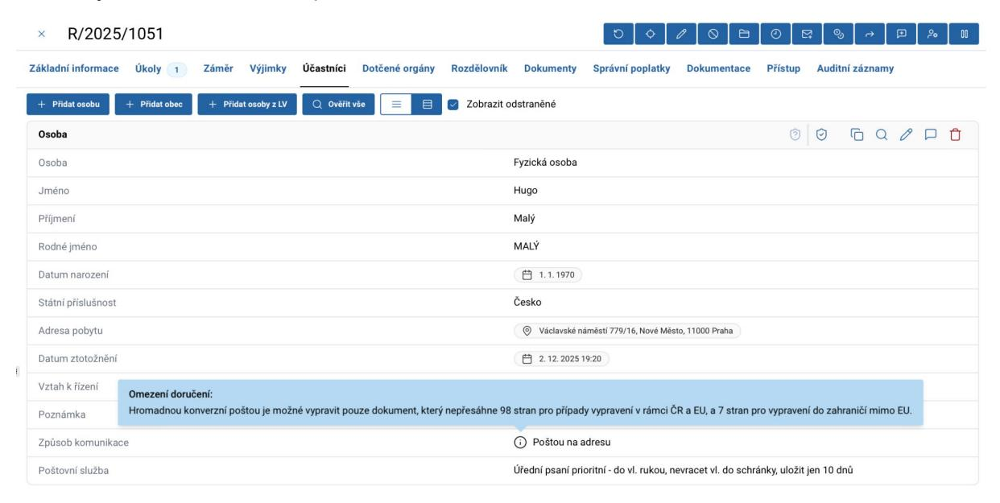

## **9.2 Vypravení do zakázané země**

Seznam zakázaných zemí spravuje globální administrátor MMR v samostatném administračním rozhraní.

Systém kontroluje, zda je možné odeslat dokument prostřednictvím Hybridní konverzní pošty (HKP) do zadané země. Pokud má účastník řízení uvedenou adresu v zemi, kam Česká pošta nedoručuje, systém zobrazí upozornění "Do dané země není možné odesílat" a dokument se neodešle prostřednictvím HKP, ale vytvoří se ruční vypravení, které je nutné provést mimo systém.

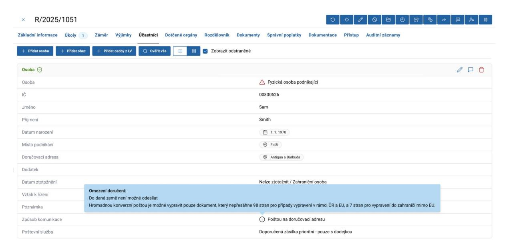

## **10. Tisk adres na obálky**

V detailu dokumentu v záložce Vypravení je možné zobrazit adresy osob, kterým má být zásilka vypravena fyzicky (způsoby doručení Poštou na adresu, Poštou na doručovací adresu), v podobě, kterou lze snadno zkopírovat za účelem tisku adres na obálky. Tlačítko je viditelné pouze, pokud je součástí vypravení alespoň jedno ruční vypravení.

Uživatel si může zobrazit adresy všech osob, jimž bude vypraveno fyzicky pomocí ikony "Adresní štítky" v horní části obrazovky.

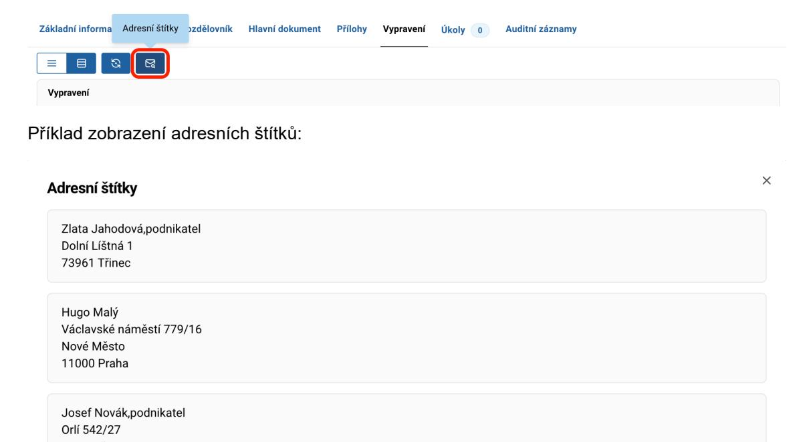

Adresu konkrétní osoby je možné zobrazit přímo v detailu osoby pomocí tlačítka "Adresní štítek".

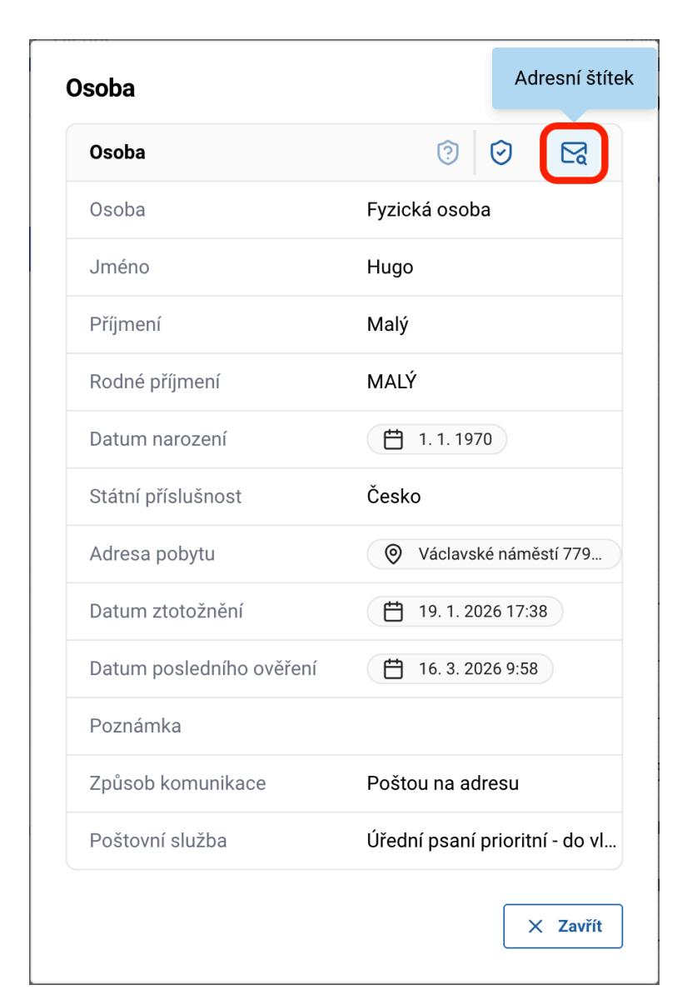

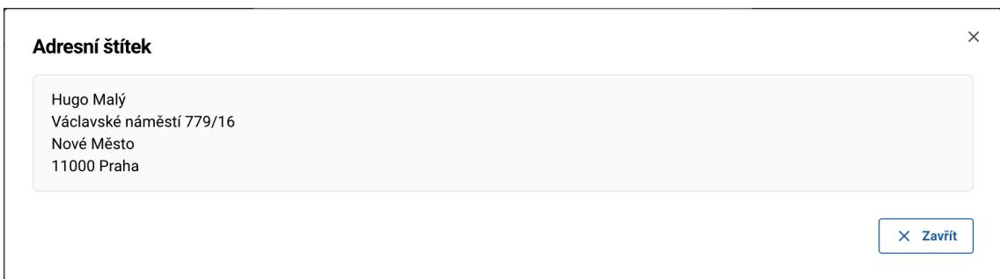

U každého účastníka řízení je zobrazena relevantní adresa (adresa pobytu či doručovací dle zvoleného způsobu komunikace). V případě potřeby je možné adresu jednoduše zkopírovat. To znamená pomocí CTRL+C, CTRL+V.

# **11. Vypravení – převzetí osobně**

Dokument vytvořený v ISSŘ lze doručit osobně, tedy předat fyzicky účastníkovi řízení. U daného účastníka je potřeba nastavit způsob komunikace Osobně.

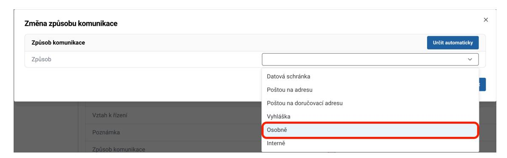

Při převzetí dokumentu účastníkem je vhodné vyhotovit protokol o převzetí či kopii podepsaného převzetí. Toto potvrzení o osobním převzetí následně můžete vložit jako potvrzení doručení. V sekci vypravení vyberte příslušného účastníka, kterému bylo doručováno osobně. Zvolte ikonu nahrát doručenku.

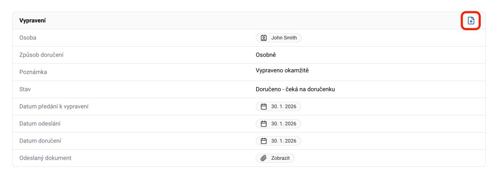

Poté vyplňte datum doručení a vložte příslušný dokument osvědčující osobní převzetí dokumentu. Jako výchozí datum doručení je vždy nastaveno datum vypravení – osobního předání dokumentu. Toto datum je možné následně změnit při nahrání doručenky. Datum doručení musí být vždy stejné nebo následující datu odeslání/vypravení. Vložení doručenky je povinné.

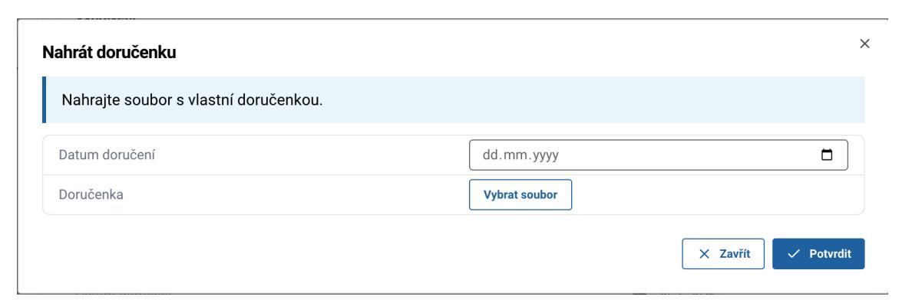

Stav dokumentu vypravovaného osobně se po doplnění doručenky změní ze stavu Doručeno – čeká na doručenku na stav Doručeno.

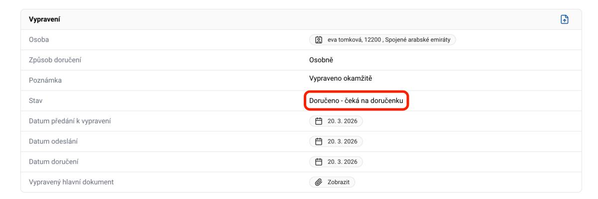

Na kartě vypravení je také doplněn řádek s doručenkou.

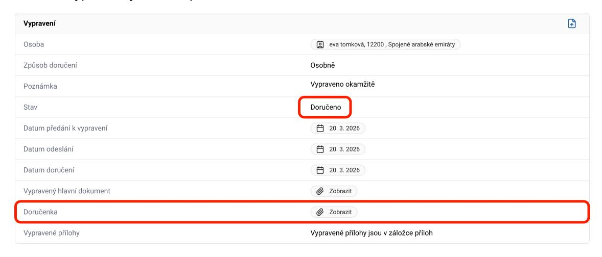

Jak datum doručení, tak doručenku je možné opakovaně upravovat/změnit pomocí tlačítka Nahrát doručenku.

# **12. Vypravení vyhláškou**

Dokument vytvořený v ISSŘ je také možné doručit účastníkům vyhláškou – tedy vyvěšením na úřední desce úřadu. Tento způsob doručení se používá zejména u záměrů s velkým počtem účastníků (více než 30) nebo u osob neznámého pobytu/sídla.

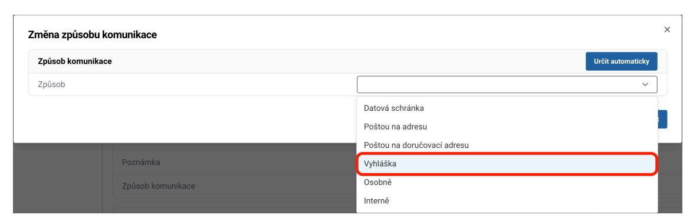

Pro nastavení data, kdy byl dokument vyvěšen na úřední desku využijte tlačítko "**Datum vyvěšení".** Tlačítko je dostupné pouze v případě, že dokument obsahuje alespoň jedno vypravení se způsobem doručení Vyhláška, které ještě nebylo vypraveno.

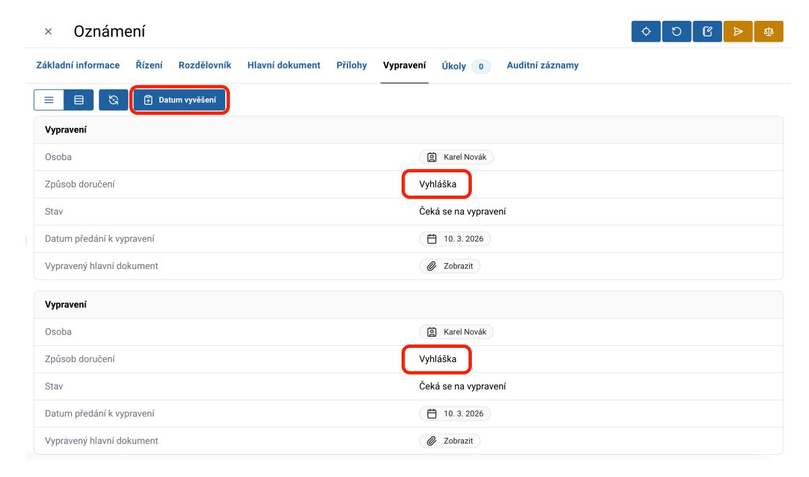

Akce "Datum vyvěšení" otevře dialog pro zadání data vyvěšení dokumentu na úřední desce.

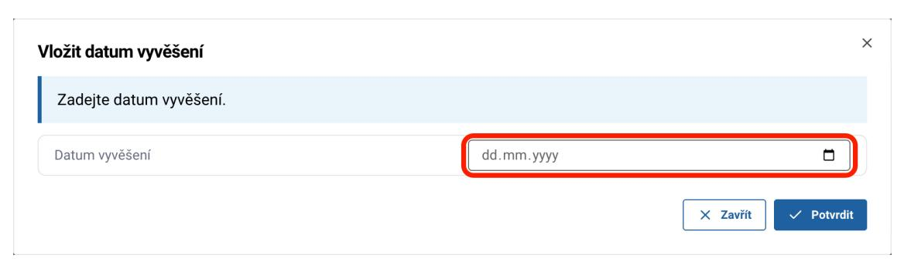

Po potvrzení se datum automaticky nastaví pro všechna vypravení doručovaná vyhláškou u daného dokumentu. Stav vypravení se změní na Vypraveno.

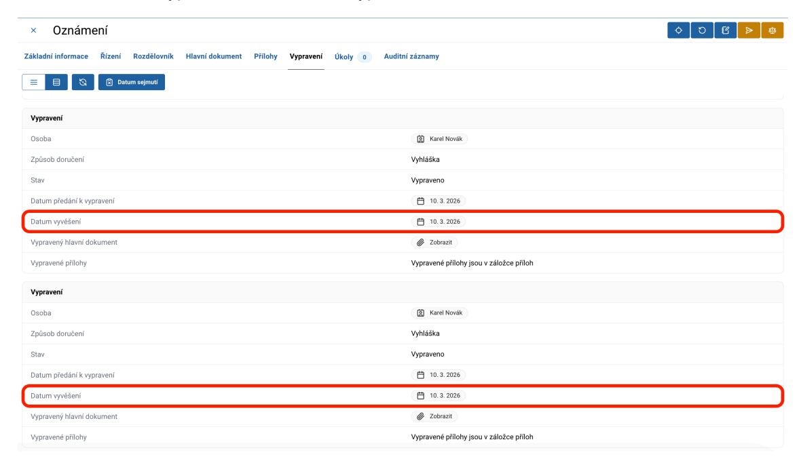

Po zadání data vyvěšení se tlačítko skryje a zpřístupní se akce "Datum sejmutí".

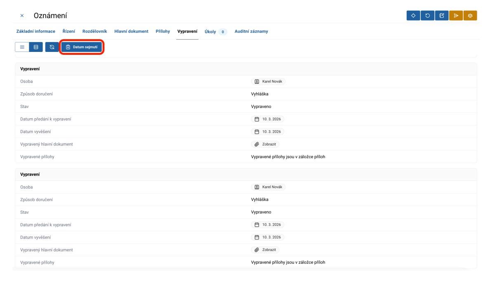

Po kliknutí na tlačítko "Datum sejmutí" se otevře dialog, ve kterém uživatel může:

Upravit datum vyvěšení – datum vyvěšení je povinný údaj, musí být vždy vyplněno, tuto položku není možné smazat. Datum vyvěšení je možné upravit na jiné datum, toto datum však musí předcházet datu sejmutí.

Vyplnit datum sejmutí dokumentu z úřední desky – datum sejmutí je povinný údaj, musí být vždy vyplněno. Datum sejmutí je možné upravit na jiné datum, toto datum však musí následovat po datu vyvěšení.

Nahrát doručenku (u veřejné vyhlášky se jedná o doručovaný dokument doplněný o datum vyvěšení a sejmutí). Vyplnění doručenky je povinný údaj. Dokument doručenky je možné upravit a vyměnit.

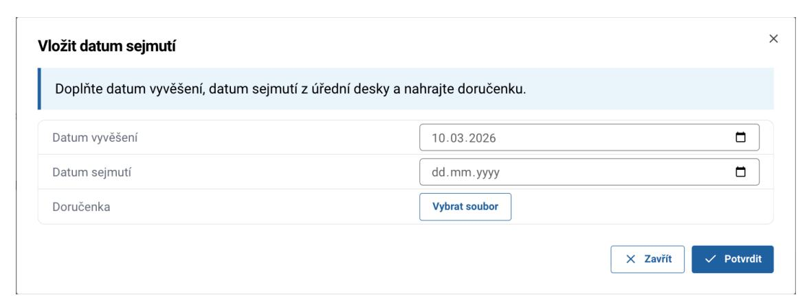

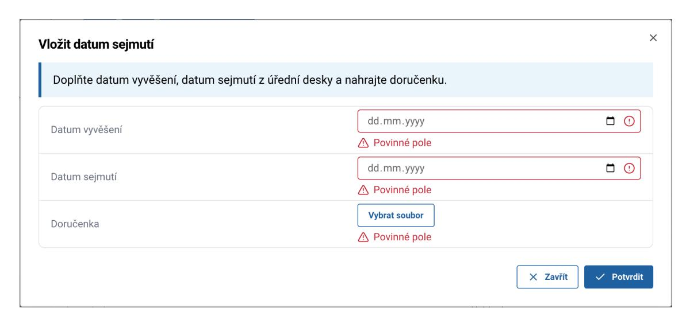

Po potvrzení se datum sejmutí i doručenka přiřadí ke všem vypravením doručovaným vyhláškou. Pro veřejnou vyhlášku je vždy použita stejná doručenka pro všechna dotčená vypravení. Stav vypravení se změní na Doručeno.

Pokud uživatel současně upraví i datum vyvěšení, tato změna se rovněž uloží a projeví u všech vypravení doručovaných veřejnou vyhláškou.

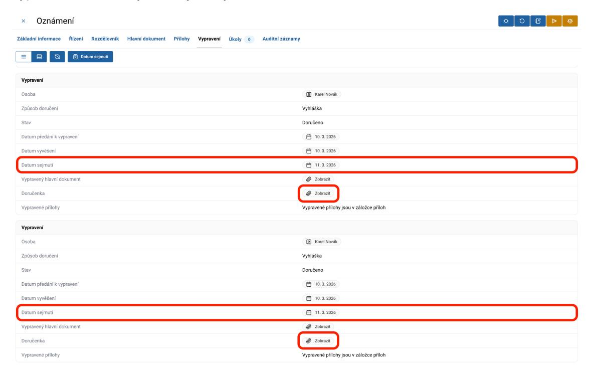

Datum vyvěšení, datum sejmutí i doručenku lze opakovaně upravovat pomoci tlačítka "Datum sejmutí". Změny jsou zaznamenávány v auditním záznamu.

Pokud na stejném dokumentu vznikne nové vypravení doručované veřejnou vyhláškou (například při použití funkce "Odeslat dokument jednotlivě"), tlačítko Datum vyvěšení se znovu zobrazí.

# **13. Opětovné vypravení dokumentu**

Opětovné vypravení dokumentu je možné použít v případě, když vypravení z nějakého důvodu selhalo, došlo ke změně způsobu komunikace jednoho z účastníků (například má účastník řízení nově datovou schránku), ke změně adresy jednoho z účastníků nebo potřebujete vypravit dokument novému účastníkovi.

### **13.1 Původní vypravení selhalo**

Možnost Odeslat dokument jednotlivě se nabízí pro dokumenty ve stavu Odeslané. Tuto funkci použijte v případě, že původní vypravení z nějakého důvodu selhalo.

Přejděte na pohled Dokumenty. Na záložce Odeslané vyberte potřebný dokument. V detailu dokumentu v pravém horním rohu klikněte na příslušné tlačítko.

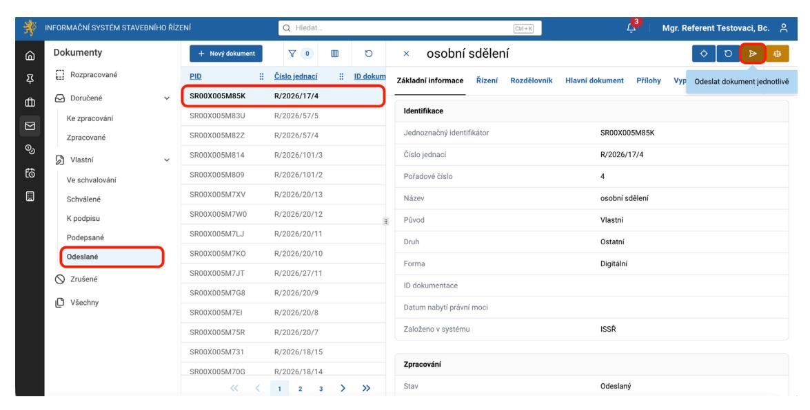

Na dialogu Odeslat dokument jednotlivě vyberte účastníka, kterému chcete dokument odeslat, a klikněte na příslušné tlačítko pro potvrzení.

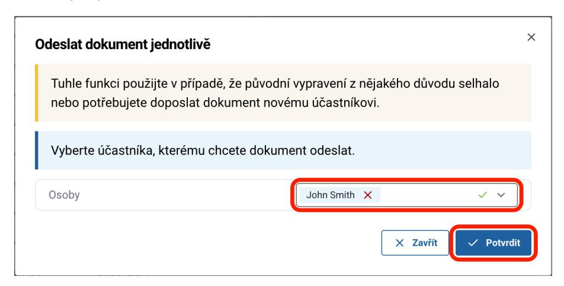

Po potvrzení se objeví upozornění, že dokument byl předán do výpravny.

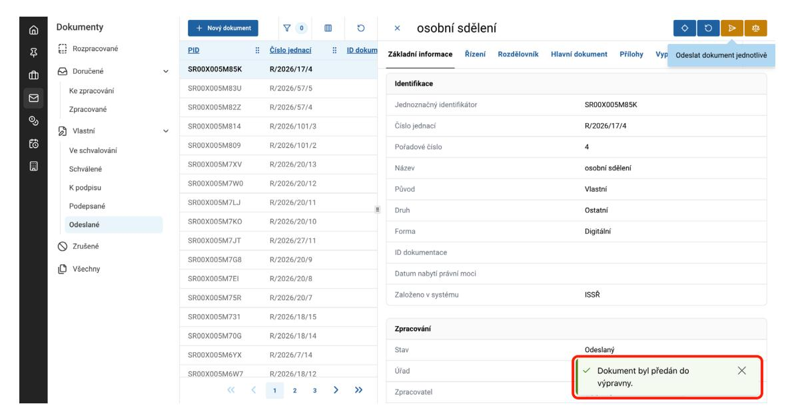

Na záložce Vypravení se objeví záznam o vypravení dokumentu s informací o stavu a způsobu doručení dokumentu.

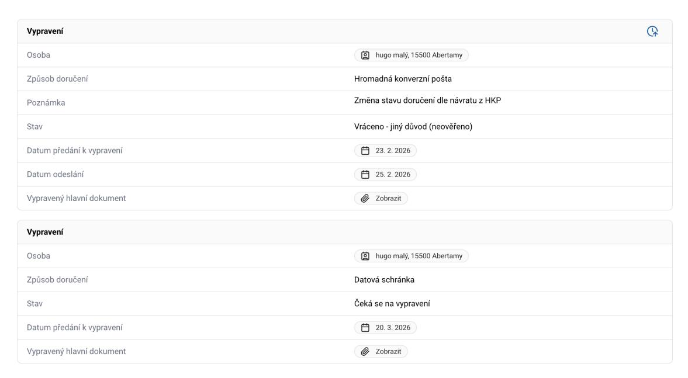

Pro případy, že dojde z jakéhokoliv důvodu k selhání vypravení, je možné nastavit notifikaci, která na tuto situaci upozorní. Bližší informace najdete **[v kapitole 17 Notifikace](#page-57-3).**

## **13.2 Vypravení dokumentu novému účastníkovi řízení**

Funkcionalitu Odeslat dokument jednotlivě lze použit i v případě, že potřebujete doposlat dokument novému účastníkovi řízení.

Přidejte nového účastníka k potřebnému řízení a klikněte na příslušné tlačítko pro potvrzení.

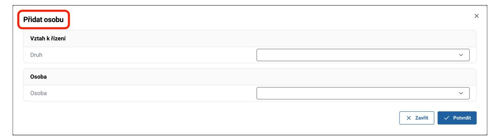

Po přidání nového účastníka řízení proveďte ověření osoby a nastavte způsob komunikace.

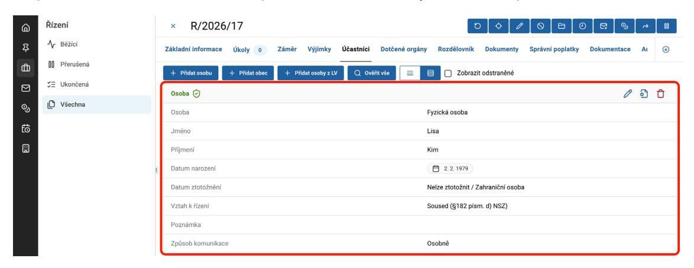

Po ověření přejděte na záložku Dokumenty. Vyberte potřebný, již odeslaný dokument a otevřete detail pomocí příslušného tlačítka.

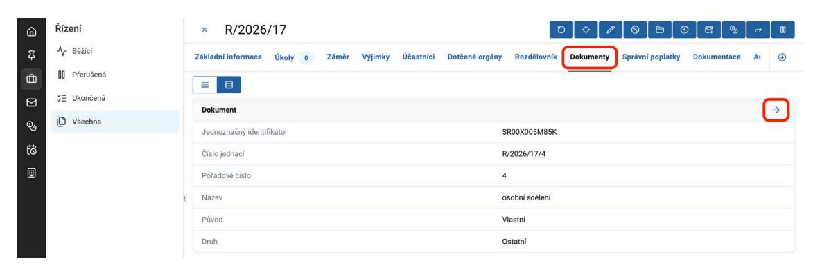

Nebo přejděte na pohled Dokumenty. Na záložce Odeslané vyberte potřebný dokument.

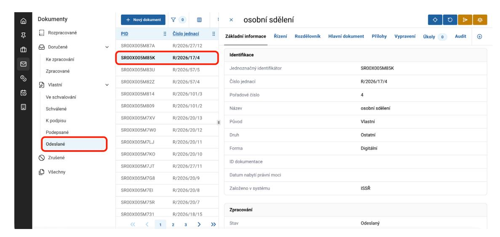

V detailu dokumentu v pravém horním rohu klikněte na příslušné tlačítko.

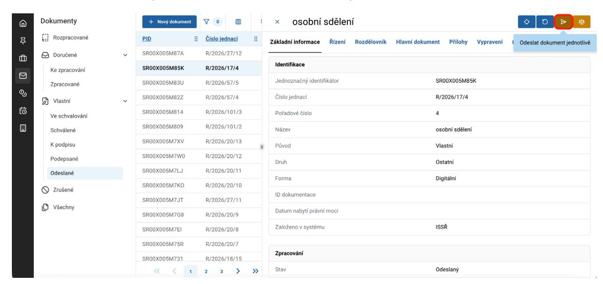

Na dialogu Odeslat dokument jednotlivě vyberte účastníka, kterému chcete dokument odeslat, a klikněte na příslušné tlačítko pro potvrzení.

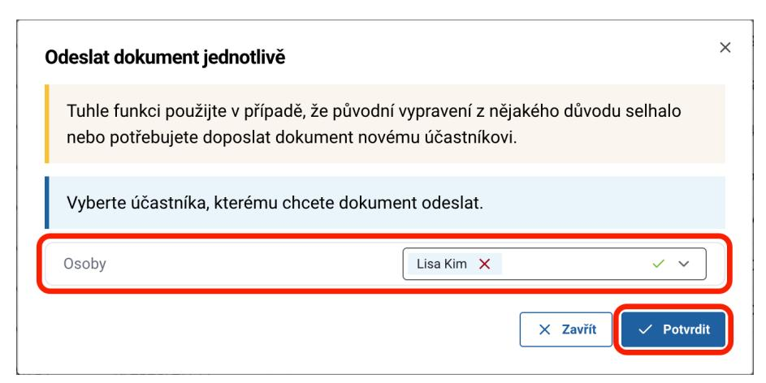

Po stisknutí Potvrdit se objeví upozornění, že dokument byl předán do výpravny.

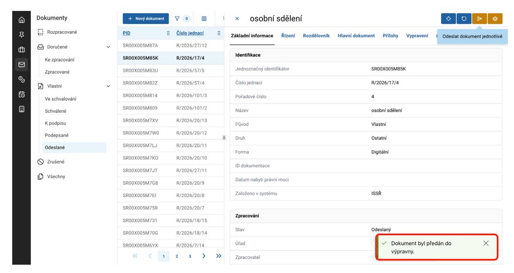

Na záložce Vypravení se objeví záznam o vypravení dokumentu s informací o stavu a způsobu doručení dokumentu.

# **14. Doručenky**

V ISSŘ se doručenky evidují odlišně podle způsobu vypravení zásilky. Níže jsou uvedeny jednotlivé typy a odpovídající způsob evidence.

#### **14.1 Hybridní pošta**

Doručenky jsou skenovány Českou poštou a následně předávány do elektronické spisové služby (eSSL). Odtud jsou automaticky nahrávány do ISSŘ. Doba zpřístupnění doručenky v ISSŘ závisí na rychlosti zpracování a předání dat ze strany České pošty. Zároveň je automaticky zaznamenáno skutečné datum doručení.

#### **14.2 Ruční vypravení**

V případě ručního vypravení se údaje o odeslání zadávají ručně pomocí tlačítka Odeslat. Po zadání data odeslání se zobrazí se tlačítko Nahrát doručenku. V tomto dialogu se zadávají údaje o doručení dokumentu a lze zde nahrát doručenku. Již nahranou doručenku nelze smazat, pouze vyměnit za nový soubor.

#### **14.3 Datová schránka**

Po doručení zprávy do datové schránky (buď přihlášením oprávněné osoby do datové schránky, nebo po uplynutí zákonné lhůty pro tzv. fikci doručení) je vygenerován soubor typu ZFO, který slouží jako doručenka a je automaticky načten do ISSŘ.

#### **14.4 Osobní doručení**

V případě osobního doručení je nutné, aby uživatel doručenku ručně nahrál do ISSŘ prostřednictvím funkce "Nahrát doručenku". Po stisknutí tlačítka se zobrazí dialog pro zadání data doručení a souboru doručenky. Akci může uživatel opakovat s tím, že se doručenka přepíše. Formu doručenky (například písemné potvrzení o převzetí listiny) si stanovuje úředník.

#### **14.5 Doručení vyhláškou**

V případě doručení veřejnou vyhláškou je po zadání data vyvěšení zpřístupněno tlačítko "Datum sejmutí". Prostřednictvím tohoto tlačítka uživatel zadá datum sejmutí a nahraje doručenku do ISSŘ. Pro veřejnou vyhlášku je vždy použita stejná doručenka pro všechna dotčená vypravení.

## **14.6 Interní vypravení**

V tomto případě se převzetí neeviduje ve formě doručenky, protože se jedná o interní předání bez potřeby formálního potvrzení.

## **14.7 Okamžik doručení u HKP a ručního vypravení**

Systém umožňuje možnost evidovat **okamžik doručení** u dokumentů doručovaných poštou prostřednictvím **ručního vypravení** a **hybridní konverzní pošty**. Pro ostatní způsoby vypravení se pole Okamžik doručení nezobrazuje.

U vypravení **přes HKP** se datum zadává pomocí ikony Okamžik doručení v přehledu vypravení.

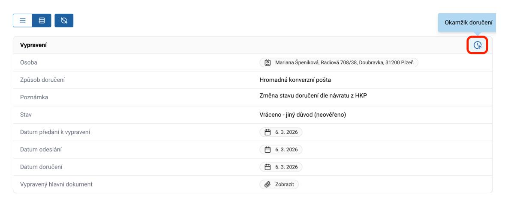

Toto pole umožňuje úředníkovi zadat vlastní datum okamžiku doručení, které se může lišit od systémového data doručení uvedeného na doručence, například v případech fikce doručení dle právních předpisů.

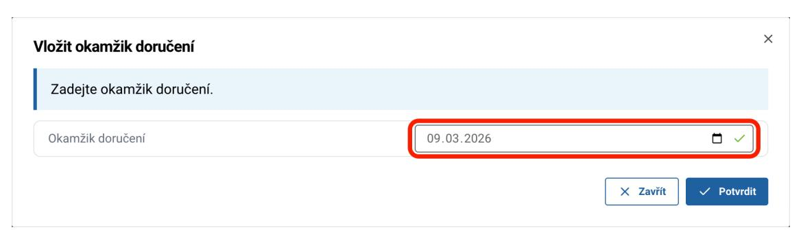

Po potvrzení se zadané datum zobrazí v poli Okamžik doručení. Stav vypravení se nemění.

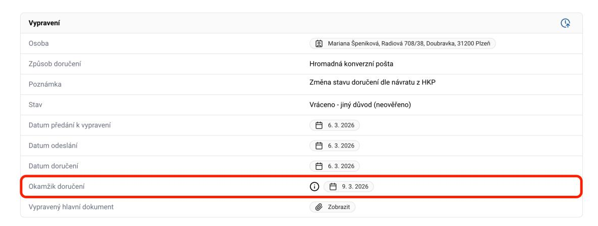

V případě **ručního vypravení** zadání nebo úprava okamžiku doručení probíhá v dialogu "Nahrát doručenku". Tlačítko "Nahrát doručenku" se u ručního vypravení zobrazí až po zadání data odeslání, tedy ve chvíli, kdy je vypravení ve stavu Vypraveno.

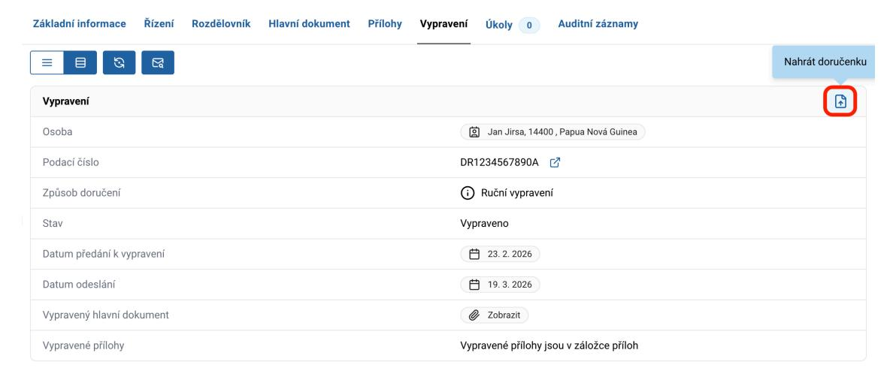

V dialogovém okně "Nahrát doručenku" lze nově kromě zadání data doručení a nahrání souboru doručenky také zadat datum okamžiku doručení.

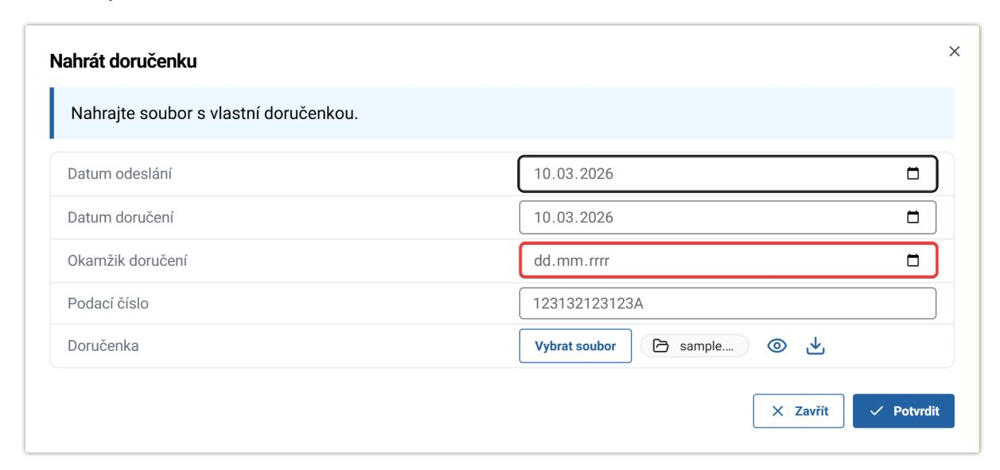

Po potvrzení se zadané datum zobrazí v poli Okamžik doručení.

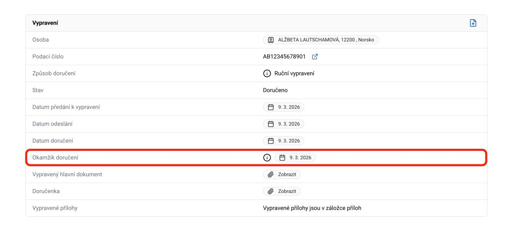

Zadané datum je čistě evidenční a nepřenáší se do žádných externích systémů. Datum okamžiku doručení lze zadat a opakovaně upravovat nezávisle na stavu dokumentu nebo řízení. Veškeré změny jsou zaznamenávány v auditním záznamu.

# 15. Stav vypravení

#### 15.1 Jednotlivé stavy vypravení

Každé vypravení může být v jednom z následujících stavů:

- Čeká na vypravení: jedná se o stav, kdy ještě nebyl dokument adresátovi vypraven, ale již je k vypravení připraven.
- Vypraveno: dokument již byl adresátovi vypraven, ale stále nebyl doručen.
- Doručeno čeká na doručenku: dokument byl úspěšně doručen, ale v systému zatím není doručenka evidována. Může se jednat například o dokumenty vypravené HKP, u kterých se doručenka nahraje do systému později.
- Doručeno: dokument byl adresátovi úspěšně doručen a v systému je již evidována doručenka nebo jiný záznam o doručení (protokol o osobním předání, záznam o svěšení z úřední desky atp.)
- **Nedoručeno zpracováno:** dokument nebyl z nějakého důvodu doručen a tato situace již byla zpracována/zaevidována, například: byla vrácena obálka a bylo vydáno rozhodnutí o opakovaném doručení.
- **Stornováno:** vypravení dokumentu bylo zastaveno/stornováno před samotným doručením. Stornování vypravení může být například z důvodu omylem založeného vypravení nebo rozhodnutím nahradit dokument jeho novou verzí, která bude následně vypravena místo stornovaného dokumentu.
- **Vráceno:** stav Vráceno se týká převážně zásilek vypravených pomocí HKP a ručního vypravení a je v systému ISSŘ evidován s několika dalšími dodatečnými stavy:
  - adresát neznámý: Obvykle se jedná o situaci, kdy taková osoba/adresát na dané adrese vůbec neexistuje, například nemá na adrese poštovní nebo jinou doručovací schránku.
  - adresát se odstěhoval bez udání adresy: Jedná se o případ, kdy osoba, které bylo vypravováno na adrese dříve pobývala, ale již zde nebydlí a neudala novou adresu. Zásilku tak není možné ani přeposlat.
  - o **nepřijato:** Adresát (nebo jeho oprávněná osoba) odmítl zásilku převzít.
  - nevyžádáno: Zásilka nebyla během prvotního pokusu o doručení doručena a následně byla uložena k vyzvednutí na poště. Adresát si ji ale v určené lhůtě nevyzvedl.

- o **adresa nedostatečná:** Adresa pro doručení je neúplná nebo nepřesná, takže doručení nebylo možné.
- o **jiný důvod (ověřeno):** Zásilka byla vrácena z jiného důvodu než z ostatních uvedených. Tento důvod byl ověřen – potvrzen. Mohlo se jednat například o chybu na straně doručovatele nebo specifickou situaci doloženou dokladem.
- o **jiný důvod (neověřeno):** Zásilka byla vrácena z jiného důvodu než z ostatních uvedených. Tento důvod ale nebyl spolehlivě ověřen – informace od doručovatele chybí, nebo jsou nejednoznačné či nejasné. Bližší informace k tomuto stavu naleznete [zde.](#page-58-0)

## **15.2 Tlačítko pro ruční synchronizaci stavu vypravení**

V záložce Vypravení každého dokumentu je dostupné tlačítko "Ruční synchronizace stavu vypravení". Tato funkcionalita umožňuje aktualizaci všech údajů v záložce vypravení u všech adresátů.

Po načtení synchronizace doporučujeme zavřít daný panel (pomocí tlačítka X) a znovu otevřít příslušné číslo jednací. Poté přejít do záložky "Vypravení", kde se již zobrazí aktuální stav.

## **15.3 Podací číslo**

V ISSŘ je u dokumentů vypravených prostřednictvím HKP dostupná informace o podacím čísle zásilky, včetně interaktivního odkazu na webové stránky České pošty pro sledování zásilky. Tento údaj naleznete u každého účastníka v záložce "Vypravení" v poli "Podací číslo".

Podací číslo je také možné zadat v rámci evidování doručenky v případě ručního vypravení.

# **15.4 Řazení a filtrování v tabulkovém režimu vypravení**

V tabulkovém zobrazení vypravení lze řadit jednotlivé položky vypravení vzestupně či sestupně a filtrovat, což usnadňuje kontrolu, u kterých účastníků řízení ještě nedošlo k doručení. Stejně jako v jiných případech, lze individuálně upravit zobrazení a pořadí sloupců dle Vašich potřeb.

Jedná se o položky Osoba, Doručenka, Vypravený hlavní dokument, Akce nelze logicky řadit. Prázdná pole se vždy zobrazují na konci seznamu.

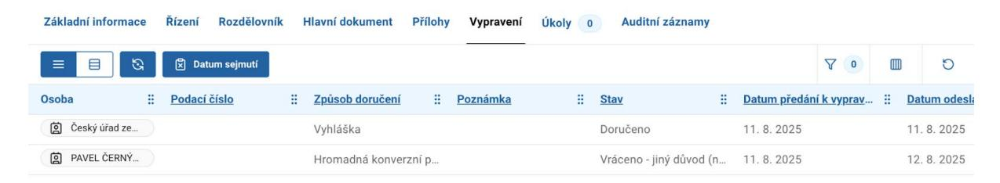

## **16. Notifikace**

V ISSŘ lze nastavit notifikaci upozorňující na události při vypravení dokumentu. Každý uživatel si může zvolit způsob doručení notifikace v sekci Uživatelský účet – Nastavení notifikací:

- aplikační upozornění přímo v systému ISSŘ prostřednictvím centra notifikací,
- e-mailová upozornění zasláno na e-mail uživatele.

Je možné zvolit jeden nebo oba způsoby zároveň.

## **16.1 Notifikace o selhání vypravení**

Pokud má spisová služba u dokumentu stav vypravení "vráceno – jiný důvod (neověřeno)", notifikace je automaticky odeslána jak zpracovateli dokumentu, tak i vedoucímu příslušného úřadu.

## **16.2 Notifikace o doručení všem adresátům**

Je možné také nastavit notifikaci o doručení všem adresátům, která zpracovateli dokumentu oznámí okamžik, kdy jsou všechna vypravení u daného dokumentu doručena.

# **17. Konkrétní důvody nevypravení dokumentu**

Následující sekce shrnuje hlavní důvody, proč nemusí dojít k úspěšnému vypravení dokumentu prostřednictvím ISSŘ, a poskytuje doporučení, jak těmto situacím předejít. Najdete zde informace o formálních požadavcích na dokumenty, správném vyplnění údajů o účastnících a o postupech, které zajistí bezproblémové odeslání zásilek jak fyzickou poštou, tak do datových schránek.

Při vypravení může dojít k několika situacím, kvůli kterým nedojde k odeslání fyzické zásilky prostřednictvím hromadné konverzní pošty (HKP). V některých případech může být ovlivněno i odeslání do datových schránek. Podrobnosti jsou uvedeny u jednotlivých typů nevypravení.

## **17.1 Chyba ve formě vypraveného dokumentu**

Při přípravě dokumentu pro vypravení prostřednictvím HKP doporučujeme zkontrolovat, zda splňuje níže uvedené parametry. Nesplnění některé z těchto podmínek způsobí, že zásilka nebude systémem úspěšně vypravena.

Pokud dokument obsahuje některou z níže uvedených chyb, v ISSŘ se u něj zobrazí stav vypravení ["vráceno jiný důvod \(neověřeno\)"](#page-56-1). Z důvodu dodržení národního standardu není možné zobrazit podrobnější informace o konkrétní chybě.

Pokud se domníváte, že dokument žádnou z níže uvedených chyb neobsahuje, prosíme, kontaktujte nás na adrese [digitalizace@mmr.gov.cz.](mailto:digitalizace@mmr.gov.cz) Uveďte prosíme vždy PID nebo číslo jednací předmětného dokumentu.

#### **Dokument není podepsán kvalifikovaným certifikátem**

Pro vypravení přes HKP musí být hlavní dokument podepsán kvalifikovaným certifikátem.

Tento požadavek se vztahuje také na přílohy, u nichž je zvolena možnost autorizované konverze (tj. atribut Konvertovat = Ano). Tyto přílohy musí být podepsány mimo aplikaci.

Formu podpisu ověříte pomocí funkce Verifikátor podpisů. Verifikátor podpisů je podpůrný nástroj, který slouží k technické kontrole elektronicky podepsaných dokumentů. Jeho cílem je usnadnit práci úředníků při ověřování, zda dokumenty splňují požadavky na elektronické podepisování podle platné legislativy.

Použití verifikátoru není povinné. Výsledky kontroly slouží jako podpůrná informace. Rozhodnutí o dalším postupu je vždy na posouzení pracovníka stavebního úřadu.

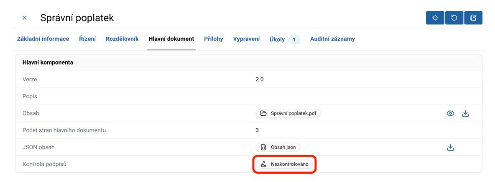

Přílohy je nutné vždy k dokumentu vložit již podepsané, k tomuto je možné využít jakoukoliv adekvátní aplikaci pro digitální podepisování dokumentů. Více informací o přílohách naleznete v [kapitole](#page-28-2) **7.2 [Vypravení příloh](#page-28-2)**.

Upozorňujeme, že nesprávně podepsaný dokument bude vypraven do datových schránek, jelikož tyto neobsahují mechanismus kontroly úrovně podpisu (proto se může zdát, že zde dochází k chybě při vypravení pouze fyzickou poštou, avšak dokument vypravený do datové schránky obsahuje stejnou chybu).

Pokud byl již dokument vypraven s chybným podpisem, je třeba dokument znovu vytvořit, protože není možné opravit pouze podpis, a poté ho podepsat kvalifikovaným certifikátem. Následně jej lze vypravit standardním způsobem.

#### **Dokument obsahuje strany v jiném než A4 formátu**

HKP akceptuje pouze dokumenty ve formátu A4. Pokud byl již dokument vypraven se stranou v jiném formátu, je třeba vytvořit nový dokument. Následně jej lze vypravit standardním způsobem.

#### **Nevhodný formát PDF souboru**

Dokument musí být ve formátu PDF/A-1. Formáty PDF/A-2 a vyšší nejsou HKP podporovány.

#### **Překročení velikosti souboru**

Maximální povolená velikost dokumentu (včetně odesílaných příloh) pro vypravení HKP je 15 MB. Maximální povolená velikost dokumentu (včetně odesílaných příloh) pro vypravení datovou schránkou je 100 MB.

#### **Překročení limitu počtu listů**

Pro každou zásilku vypravenou prostřednictvím Hybridní konverzní pošty je stanoven limit počtu listů. Tento limit je stanoven Českou poštou z důvodu překročení hmotnostního limitu 50 g, kdy by zásilka vyžadovala přiložení celního prohlášení.

Aktuální limity jsou 99 listů pro vypravení v rámci ČR a EU a 8 listů pro vypravení do zahraničí mimo EU.

Při překročení maximálního povoleného počtu listů dojde k automatické změně způsobu vypravení na ruční – více informací o ručním vypravení naleznete **[v kapitole 10 Ruční vypravení](#page-37-0)**.

#### **Vypravování do zakázaných zemí**

Pokud má účastník řízení uvedenou adresu v zemi, kam Česká pošta nedoručuje, systém zobrazí upozornění a dokument se neodešle prostřednictvím HKP, ale vytvoří se ruční vypravení. Více informací naleznete v kapitole 8.3 Vypravování do zakázaných zemí.

**Úřad nemá uzavřenou smlouvu s Českou poštou (od 1. 2. 2026)**

Pokud úřad nemá uzavřenou smlouvu s Českou poštou, nemá možnost využívat odesílání dokumentu pomocí HKP. V tomto případě se vždy nabízí pro listovní zásilky možnost ručního vypravení. Více informací naleznete **[v kapitole 10 Ruční vypravení](#page-37-0)**.

#### **17.2 Nedostatečně nebo chybně vyplněné údaje**

Pro úspěšné vypravení je třeba, aby u adresáta byly vyplněny správné a konzistentní údaje, zejména u adresy PSČ, způsob komunikace či ID datové schránky.

#### **Neúplná adresa**

Údaje osob, které byly vyplněny do žádosti a následně z žádosti přebrány systémem, označujeme jako data ze záměru. Tato data slouží k vypravení účastníkům řízení.

Po přidání osoby do řízení a před jejím ověřením vůči základním registrům jsou zobrazena pouze data ze záměru, například jméno a datum narození u fyzické osoby. Toto jsou minimální vstupní údaje k ověření osoby.

Po ověření osoby se automaticky doplní další údaje získané ze základních registrů, například adresa nebo ID datové schránky – pokud tyto informace v původních datech ze záměru chyběly (tedy po ověření osoby se doplní pouze ta pole, která byla prvotně prázdná). Upozorňujeme, že údaje, které již v záměru byly vyplněny, se automaticky nepřepisují. Například chybně uvedená adresa zůstane zachována, zatímco prázdné pole pro datovou schránku bude doplněno správnou hodnotou.

Zde vzniká častá chyba, a to je neúplnost či chybovost adresy, kdy následně není možné doručit.

Doporučujeme využít funkcionalitu zkopírovat data ze záměru (viz další bod).

Vždy zkontrolujte správnost a úplnost dat ze záměru.

#### **Nesprávné ID datové schránky**

Dokumenty jsou vypravovány na data ze záměru, které nemusí být vždy úplné či správné. Proto doporučujeme využít funkcionalitu "Zkopírovat ověřená data do řízení" v Řízení – Účastníci. V ověřených datech jsou datové schránky uvedeny správně a touto funkcionalitou se překopírují do dat ze záměru a na ně budou po vypravení odeslány.

Může také nastat případ, kdy je datová schránka daného subjektu neaktivní.

**Nesprávná kombinace druhu zásilky a poštovní služby**

Tato chyba nastává v případě, že u zahraničního adresáta není v Řízení – Účastníci správně zvolen Způsob komunikace – Poštovní služba. U zahraničních adres je nutné vybrat buď Doporučená zásilka EU, nebo Doporučená zásilka svět.

Po úpravě údajů u adresáta je možné dokument znovu vypravit pomocí funkce "Odeslat dokument jednotlivě" dostupné v detailu dokumentu.

Viz také [Způsob komunikace.](#page-32-1)

# **18. Podpora**

#### **Absence doručenek**

V případě, že u doručeného dokumentu není do 10 dnů k dispozici doručenka, obraťte se na podporu [digitalizace@mmr.gov.cz](mailto:digitalizace@mmr.gov.cz) s žádostí o reklamaci nedodání doručenky u České pošty. Uveďte prosíme vždy PID nebo číslo jednací předmětného dokumentu a adresáta, u kterého doručenka chybí.

#### **FAQ**

Další informace je možné nalézt v sekci [FAQ na stránkách MMR](https://mmr.gov.cz/cs/caste-dotazy/digitalizace-stavebniho-rizeni-issr/odesilani-dokumentu).